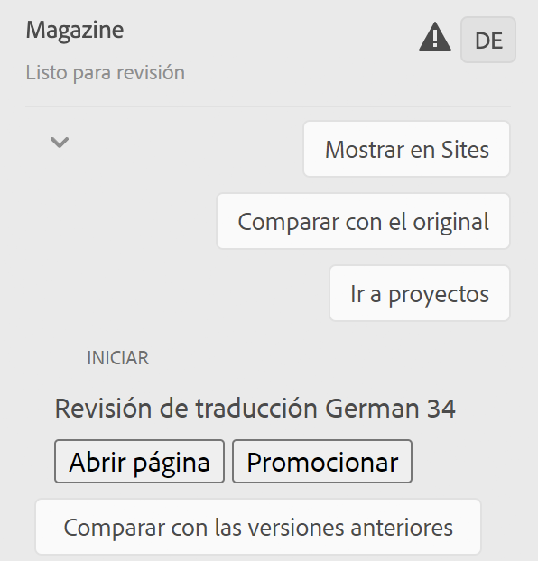

# Administración de proyectos de traducción {#managing-translation-projects}

Los proyectos de traducción permiten administrar la traducción de AEM contenido. Un proyecto de traducción es un tipo de AEM [proyecto](/help/sites-cloud/authoring/projects/overview.md) que contiene recursos que se deben traducir a otros idiomas. Estos recursos son las páginas y los recursos de las [copias de idioma](preparation.md) que se crean a partir del maestro de idioma.

>[!TIP]
>
>Si es nuevo en traducir contenido, consulte nuestro [Recorrido de traducción de sitios,](/help/journey-sites/translation/overview.md) que es la ruta guiada a través de la traducción del contenido de AEM Sites mediante las poderosas herramientas de traducción de AEM, ideal para aquellos que no tengan experiencia de traducción o AEM.

Cuando se añaden recursos a un proyecto de traducción, se crea un trabajo de traducción para ellos. Los trabajos proporcionan comandos e información de estado que se utilizan para administrar los flujos de trabajo de traducción humana y traducción automática que se ejecutan en los recursos.

Los proyectos de traducción son temas de larga duración, definidos por el idioma y el método/proveedor de traducción para alinearse con la gobernanza organizativa para la globalización. Deben iniciarse una vez, ya sea durante la traducción inicial o manualmente, y permanecer en vigor durante todas las actividades de actualización de contenido y traducción.

Los proyectos y trabajos de traducción se crean con los flujos de trabajo de preparación de la traducción. Estos flujos de trabajo tienen tres opciones, tanto para la traducción inicial (Crear y traducir) como para las actualizaciones (Actualizar traducción):

1. [Crear nuevo proyecto](#creating-translation-projects-using-the-references-panel)
1. [Agregar a un proyecto existente](#adding-pages-to-a-translation-project)
1. [Solo estructura de contenido](#creating-the-structure-of-a-language-copy)

AEM detecta si se está creando un proyecto de traducción para la traducción inicial del contenido o para actualizar las copias de idioma ya traducidas. Cuando crea un proyecto de traducción para una página e indica los textos de idiomas para los que está traduciendo, AEM detecta si la página de origen ya existe en los textos de idiomas de destino:

* **La copia de idioma no incluye la página:** AEM trata esta situación como la traducción inicial. La página se copia inmediatamente en la copia de idioma y se incluye en el proyecto. Cuando la página traducida se importa a AEM, AEM la copia directamente en el idioma.
* **La copia de idioma ya incluye la página:** AEM trata esta situación como una traducción actualizada. Se crea un lanzamiento, se agrega una copia de la página al lanzamiento y se incluye en el proyecto. Los lanzamientos permiten revisar las traducciones actualizadas antes de enviarlas a la copia de idioma:

   * Cuando la página traducida se importa a AEM, sobrescribe la página en el lanzamiento.
   * La página traducida sobrescribe la copia de idioma solo cuando se promociona el lanzamiento.

Por ejemplo, la raíz del idioma `/content/wknd/fr` se crea para la traducción al francés del idioma maestro `/content/wknd/en`. No hay otras páginas en francés.

* Se crea un proyecto de traducción para la página `/content/wknd/en/products` y todas las páginas secundarias, con el objetivo de la copia en francés. Como la copia de idioma no incluye la página `/content/wknd/fr/products`, AEM copia inmediatamente la página `/content/wknd/en/products` y todas las páginas secundarias a la copia en francés. Las copias también se incluyen en el proyecto de traducción.
* Se crea un proyecto de traducción para la página `/content/wknd/en` y todas las páginas secundarias, con el objetivo de la copia en francés. Como la copia de idioma incluye la página que corresponde a la página `/content/wknd/en` (la raíz del idioma), AEM copia la página `/content/wknd/en` y todas las páginas secundarias y las agrega a un lanzamiento. Las copias también se incluyen en el proyecto de traducción.

## Traducción desde la consola Sitios {#performing-initial-translations-and-updating-existing-translations}

Los proyectos de traducción se pueden crear o actualizar directamente desde la consola Sitios.

### Creación de proyectos de traducción mediante el panel Referencias {#creating-translation-projects-using-the-references-panel}

Cree proyectos de traducción para poder ejecutar y administrar el flujo de trabajo de traducción de los recursos del maestro de idioma. Cuando cree proyectos, especifique la página en el idioma maestro que está traduciendo y las copias de idioma para las que está realizando la traducción:

* La configuración de nube del marco de integración de traducción asociado a la página seleccionada determina muchas propiedades de los proyectos de traducción, como el flujo de trabajo de traducción que se va a utilizar.
* Se crea un proyecto para cada copia de idioma seleccionada.
* Se crea una copia de la página seleccionada y los recursos asociados, que se añaden a cada proyecto. Estas copias se envían posteriormente al proveedor de traducción para su traducción.

Puede especificar que las páginas secundarias de la página seleccionada también estén seleccionadas. En este caso, también se agregan copias de las páginas secundarias a cada proyecto para que se traduzcan. Cuando alguna página secundaria está asociada con diferentes configuraciones del marco de integración de traducción, AEM crea proyectos adicionales.

También puede [crear manualmente proyectos de traducción](#creating-a-translation-project-using-the-projects-console).

>[!NOTE]
>
>Para crear un proyecto, la cuenta debe ser miembro del grupo `project-administrators` .

### Traducciones iniciales y actualización de traducciones {#initial-and-updating}

El panel Referencias indica si está actualizando las copias de idioma existentes o creando la primera versión de las copias de idioma. Cuando existe una copia de idioma para la página seleccionada, aparece la ficha Actualizar copias de idioma para proporcionar acceso a los comandos relacionados con el proyecto.

Después de traducir, puede [revisar la traducción](#reviewing-and-promoting-updated-content) antes de sobrescribir la copia de idioma con ella. Cuando no existe ninguna copia de idioma para la página seleccionada, aparece la pestaña Crear y traducir para proporcionar acceso a los comandos relacionados con el proyecto.

### Creación de proyectos de traducción para una copia de idioma nueva {#create-translation-projects-for-a-new-language-copy}

1. Utilice la consola Sitios para seleccionar la página que está agregando a los proyectos de traducción.

1. Con la barra de herramientas, abra el carril **References**.

   

1. Seleccione **Language Copies** y, a continuación, seleccione los idiomas para los que traduce las páginas de origen.
1. Pulse o haga clic en **Crear y traducir** y, a continuación, configure el trabajo de traducción:

   * Utilice la lista desplegable **Languages** para seleccionar una copia de idioma para la que desee traducir. Seleccione otros idiomas según sea necesario. Los idiomas que aparecen en la lista corresponden a las [raíces de idioma que ha creado](preparation.md#creating-a-language-root).
      * Al seleccionar varios idiomas, se crea un proyecto con un trabajo de traducción para cada idioma.
   * Para traducir la página seleccionada y todas las páginas secundarias, seleccione **Seleccionar todas las páginas secundarias**. Para traducir solo la página seleccionada que ha seleccionado, desactive la opción .
   * Para **Proyecto**, seleccione **Crear proyecto de traducción**.
   * De forma opcional, para **Project Master**, seleccione un proyecto del que heredar funciones de usuario y permisos.
   * En **Título** escriba un nombre para el proyecto.

   

1. Haga clic o pulse **Crear**.

### Creación de proyectos de traducción para una copia de idioma existente {#create-translation-projects-for-an-existing-language-copy}

1. Utilice la consola Sitios para seleccionar la página que está agregando a los proyectos de traducción.

1. Con la barra de herramientas, abra el carril **References**.

   

1. Seleccione **Language Copies** y, a continuación, seleccione los idiomas para los que traduce las páginas de origen.
1. Pulse o haga clic en **Actualizar copias de idioma** y, a continuación, configure el trabajo de traducción:

   * Para traducir la página seleccionada y todas las páginas secundarias, seleccione **Seleccionar todas las páginas secundarias**. Para traducir solo la página seleccionada que ha seleccionado, desactive la opción .
   * Para **Proyecto**, seleccione **Crear proyecto de traducción**.
   * De forma opcional, para **Project Master**, seleccione un proyecto del que heredar funciones de usuario y permisos.
   * En **Título** escriba un nombre para el proyecto.

   

1. Haga clic o pulse **Crear**.

### Adición de páginas a un proyecto de traducción {#adding-pages-to-a-translation-project}

Después de crear un proyecto de traducción, puede utilizar el carril **Resources** para agregar páginas al proyecto. Agregar páginas resulta útil cuando se incluyen páginas de distintas ramas en el mismo proyecto.

Al agregar páginas a un proyecto de traducción, estas se incluyen en un nuevo trabajo de traducción. También puede [agregar páginas a un trabajo existente](#adding-pages-assets-to-a-translation-job).

Al igual que al crear un nuevo proyecto, al agregar páginas, se añaden copias de las páginas a un lanzamiento cuando es necesario para evitar sobrescribir las copias de idioma existentes. (Consulte [Creación de proyectos de traducción para copias de idioma existentes](#performing-initial-translations-and-updating-existing-translations)).

1. Utilice la consola Sitios para seleccionar la página que está agregando al proyecto de traducción.

1. Con la barra de herramientas, abra el carril **References**.

   

1. Seleccione **Language Copies** y, a continuación, seleccione los idiomas para los que traduce las páginas de origen.

   

1. Toque o haga clic en **Actualizar copias de idioma** y, a continuación, configure las propiedades:

   * Para traducir la página seleccionada y todas las páginas secundarias, seleccione **Seleccionar todas las páginas secundarias**. Para traducir solo la página seleccionada que ha seleccionado, desactive la opción .
   * Para **Proyecto**, seleccione **Agregar a proyecto de traducción existente**.
   * Seleccione el proyecto en **Proyecto de traducción existente**.

   >[!NOTE]
   >
   >El idioma de destino definido en el proyecto de traducción debe coincidir con la ruta de la copia de idioma, como se muestra en el carril de referencias.

1. Toque o haga clic en **Actualizar**.

### Creación de la estructura de una copia de idioma {#creating-the-structure-of-a-language-copy}

Es posible crear únicamente la estructura de la copia de idioma, lo que le permite copiar el contenido y los cambios estructurales en el maestro de idioma en copias de idioma (no traducidas). Esto no está relacionado con un trabajo o proyecto de traducción. Puede usar esto para mantener a los maestros de idiomas sincronizados, incluso sin traducción.

Rellene la copia de idioma para que contenga contenido del idioma maestro que está traduciendo. Antes de rellenar la copia de idioma, debe haber [creado la raíz del idioma](preparation.md#creating-a-language-root) de la copia de idioma.

1. Utilice la consola Sitios para seleccionar la raíz de idioma del idioma maestro que está utilizando como origen.
1. Abra el carril de referencias tocando o haciendo clic en **Referencias** en la barra de herramientas.

   

1. Seleccione **Textos en idiomas** y, a continuación, seleccione los textos en idiomas que desea rellenar.

   

1. Toque o haga clic en **Actualizar copias de idioma** para mostrar las herramientas de traducción y configurar las propiedades:

   * Seleccione la opción **Select all sub-pages**.
   * Para **Proyecto**, seleccione **Crear estructura solamente**.

   

1. Toque o haga clic en **Actualizar**.

### Actualización de la memoria de traducción {#updating-translation-memory}

Las ediciones manuales del contenido traducido se pueden sincronizar de nuevo con el Sistema de Gestión de Traducciones (TMS) para entrenar su Memoria de Traducción.

1. Desde la consola Sitios, después de actualizar el contenido de texto en una página traducida, seleccione **Actualizar memoria de traducción**.
1. Una vista de lista muestra una comparación en paralelo de la fuente y la traducción de cada componente de texto que se editó. Seleccione qué actualizaciones de traducción deben sincronizarse con la memoria de traducción y seleccione **Actualizar memoria**.

AEM enviará las cadenas seleccionadas de nuevo al sistema de administración de traducción.

### Comprobación del estado de traducción de una página {#check-translation-status}

Se puede seleccionar una propiedad en la vista de lista de la consola Sitios que muestre si una página se ha traducido, si está traducida o si aún no se ha traducido.

1. En la consola del sitio, cambie a [vista de lista.](/help/sites-cloud/authoring/getting-started/basic-handling.md#viewing-and-selecting-resources)
1. Toque o haga clic en **Ver configuración** en la lista desplegable de vista.
1. En el cuadro de diálogo, marque la propiedad **Translated** y pulse o haga clic en **Update**.

La consola Sitios ahora muestra la columna **Translated** mostrando el estado de traducción de las páginas enumeradas.

## Administración de proyectos de traducción desde la consola Proyecto

Se puede acceder a muchas tareas de traducción y a muchas opciones avanzadas en la consola de proyectos.

### Explicación de la consola Proyectos

Los proyectos de traducción de AEM utilizan la consola de proyectos estándar [AEM.](/help/sites-cloud/authoring/projects/overview.md) Si no está familiarizado con AEM proyectos, revise esa documentación.

Como cualquier otro proyecto Un proyecto de traducción está compuesto por mosaicos que presentan una visión general de las tareas del proyecto.

* **Resumen** : Información general sobre el proyecto
* **Tareas** : una o más tareas de traducción
* **Equipo** : usuarios que colaboran en el proyecto de traducción
* **Tareas** : elementos que deben completarse como parte del esfuerzo de traducción

Utilice los botones comandos y elipsis de la parte superior e inferior de los mosaicos (respectivamente) para acceder a los controles y las opciones de los distintos mosaicos.

### Creación de un proyecto de traducción mediante la consola Proyectos {#creating-a-translation-project-using-the-projects-console}

Puede crear manualmente un proyecto de traducción si prefiere usar la consola de proyectos en lugar de la consola Sitios .

>[!NOTE]
>
>Para crear un proyecto, la cuenta debe ser miembro del grupo `project-administrators` .

Cuando cree manualmente un proyecto de traducción, debe proporcionar valores para las siguientes propiedades relacionadas con la traducción, además de las [propiedades básicas](/help/sites-cloud/authoring/projects/managing.md#creating-a-project):

* **Nombre:** Nombre del proyecto
* **Idioma de origen:** el idioma del contenido de origen.
* **Idioma de destino:** el idioma o los idiomas a los que se traduce el contenido.
   * Si se seleccionan varios idiomas, se crea un trabajo para cada idioma dentro del proyecto.
* **Método de traducción:** seleccione  **Traducción** humana para indicar que la traducción se debe realizar manualmente.

1. En la barra de herramientas de la consola de proyectos, toque o haga clic en **Crear**.
1. Seleccione la plantilla **Translation Project** y, a continuación, toque o haga clic en **Next**.
1. Introduzca valores para la pestaña **Basic** properties .
1. Toque o haga clic en **Avanzado** y proporcione los valores para las propiedades relacionadas con la traducción.
1. Haga clic o pulse **Crear**. En el cuadro de confirmación, toque o haga clic en **Listo** para volver a la consola de proyectos o haga clic o pulse **Abrir proyecto** para abrir y comenzar a administrar el proyecto.

### Adición de páginas y recursos a un trabajo de traducción {#adding-pages-assets-to-a-translation-job}

Puede agregar páginas, recursos o etiquetas al trabajo de traducción de su proyecto de traducción. Para agregar páginas o recursos:

1. En la parte inferior del mosaico del trabajo de traducción del proyecto de traducción, toque o haga clic en los puntos suspensivos.

   

1. En la siguiente ventana, toque o haga clic en el botón **Add** de la barra de herramientas y, a continuación, seleccione **Assets/Pages**.

   

1. En la ventana modal, seleccione el elemento superior de la rama que desea agregar y, a continuación, toque o haga clic en el icono de marca de verificación. La selección múltiple está habilitada en esta ventana.

   

1. También puede seleccionar el icono de búsqueda para buscar fácilmente páginas o recursos que desee agregar a su trabajo de traducción.

   

1. Una vez seleccionado, toque o haga clic en **Seleccionar**. Sus páginas o recursos se añaden al trabajo de traducción.

>[!TIP]
>
>Este método agrega páginas/recursos y sus elementos secundarios al proyecto. Seleccione **Asset/Page (sin elementos secundarios)** si solo desea agregar los elementos principales.

### Adición de etiquetas a un trabajo de traducción {#adding-tags-to-a-translation-job}

Puede agregar etiquetas a un proyecto de traducción de forma similar a [cómo se agregan recursos y páginas a un proyecto.](#adding-pages-assets-to-a-translation-job) Simplemente seleccione  **** Etiquetas en el  **** menú Agregar y siga los mismos pasos.

### Ver detalles del proyecto de traducción {#seeing-translation-project-details}

Se puede acceder a las propiedades del proyecto de traducción mediante el botón de elipsis del mosaico resumen del proyecto. Además de la [información genérica del proyecto](/help/sites-cloud/authoring/projects/overview.md#project-info), las propiedades del proyecto de traducción contienen características específicas de la traducción.

En el proyecto de traducción, toque o haga clic en los puntos suspensivos en la parte inferior del mosaico Resumen de traducción . La mayoría de las propiedades específicas del proyecto se encuentran en la pestaña **Avanzado**.

* **Idioma de origen:** el idioma de las páginas que se están traduciendo.
* **Idioma de destino:** el idioma o los idiomas a los que se traducen las páginas
* **Configuración de nube:** la configuración de nube para el conector del servicio de traducción que se utiliza para el proyecto.
* **Método de traducción:** el flujo de trabajo de traducción, ya sea  **Traducción** humana o  **Traducción automática**
* **Proveedor de traducción:** el proveedor de servicios de traducción que está realizando la traducción.
* **Categoría de contenido:** (traducción automática) la categoría de contenido que se utiliza para la traducción
* **Credencial del proveedor de traducción:**  las credenciales para iniciar sesión en el proveedor
* **Promocionar automáticamente lanzamientos de traducción:** después de recibir contenido traducido, los lanzamientos de traducción se promocionan automáticamente
   * **Eliminar lanzamiento después de la promoción:** si los lanzamientos de traducción se promocionan automáticamente, elimine el lanzamiento después de la promoción
* **Aprobar traducciones automáticamente:** después de recibir contenido traducido, los trabajos de traducción se aprueban automáticamente
* **Repetir traducción:** configure la ejecución recurrente de un proyecto de traducción seleccionando la frecuencia con la que el proyecto creará y ejecutará automáticamente los trabajos de traducción

Cuando se crea un proyecto utilizando el carril de referencias de una página, estas propiedades se configuran automáticamente en función de las propiedades de la página de origen.

### Supervisión del estado de un trabajo de traducción {#monitoring-the-status-of-a-translation-job}

El mosaico de trabajo de traducción de un proyecto de traducción proporciona el estado de un trabajo de traducción, así como el número de páginas y recursos del trabajo.

En la tabla siguiente se describe cada estado que puede tener un trabajo o un elemento del trabajo:

| Estado | Descripción |
|---|---|
| **Borrador** | El trabajo de traducción no se ha iniciado. Los trabajos de traducción están en estado **Borrador**** cuando se crean. |
| **Enviado** | Los archivos del trabajo de traducción tienen este estado cuando se han enviado correctamente al servicio de traducción. Este estado se puede producir después de que se emita el comando **Request Scope** o el comando **Start**. |
| **Previsión solicitada** | Para el flujo de trabajo de traducción humana, los archivos del trabajo se han enviado al proveedor de traducción para que los examine. Este estado aparece después de que se ejecute el comando **Request Scope**. |
| **Previsión finalizada** | El proveedor ha creado un ámbito para el trabajo de traducción. |
| **Comprometido para traducción** | El propietario del proyecto ha aceptado el alcance. Este estado indica que el proveedor de traducción debe empezar a traducir los archivos del trabajo. |
| **Traducción En Curso** | Para un trabajo, la traducción de uno o más archivos del trabajo aún no está completa. Para un elemento del trabajo, el artículo se está traduciendo. |
| **Traducido** | Para un trabajo, se ha completado la traducción de todos los archivos del trabajo. Para un artículo del trabajo, el artículo se traduce. |
| **Listo para revisión** | El elemento del trabajo se traduce y el archivo se ha importado a AEM. |
| **Completar** | El propietario del proyecto ha indicado que el contrato de traducción ha concluido. |
| **Cancelar** | Indica que el proveedor de traducción debe dejar de trabajar en un trabajo de traducción. |
| **Actualización de error** | Se ha producido un error al transferir archivos entre AEM y el servicio de traducción. |
| **Estado desconocido** | Se ha producido un error desconocido. |

Para ver el estado de cada archivo en el trabajo, toque o haga clic en los puntos suspensivos en la parte inferior del mosaico.

### Configuración de la fecha de vencimiento de los trabajos de traducción {#setting-the-due-date-of-translation-jobs}

Especifique la fecha antes de la cual el proveedor de traducción debe devolver los archivos traducidos. La configuración de la fecha de vencimiento funciona correctamente solo cuando el proveedor de traducción que está utilizando admite esta función.

1. Toque o haga clic en los puntos suspensivos en la parte inferior del mosaico de resumen de la traducción.

   

1. En la pestaña **Basic**, utilice el selector de fechas de la propiedad **Due Date** para seleccionar la fecha de vencimiento.

   

1. Toque o haga clic en **Guardar y cerrar**.

### Creación de ámbitos para un trabajo de traducción {#scoping-a-translation-job}

Alcance un trabajo de traducción para obtener una estimación del coste de traducción de su proveedor de servicios de traducción. Cuando se define un trabajo, los archivos de origen se envían al proveedor de traducción que compara el texto con su grupo de traducciones almacenadas (memoria de traducción). Normalmente, el ámbito es el número de palabras que se deben traducir.

Para obtener más información sobre los resultados de alcance, póngase en contacto con el proveedor de traducción.

>[!NOTE]
>
>El ámbito es opcional y solo se aplica a la traducción humana. Puede iniciar un trabajo de traducción sin ámbitos.

Cuando se define un trabajo de traducción, el estado del trabajo es **Scope Requested**. Cuando el proveedor de traducción devuelve el ámbito, el estado cambia a **Scope Completed**. Cuando finalice el alcance, puede utilizar el comando **Mostrar ámbito** para revisar los resultados del alcance.

El ámbito funciona correctamente solo cuando el proveedor de traducción que está utilizando admite esta función.

1. En la consola de proyectos, abra el proyecto de traducción.
1. En el título del trabajo de traducción, pulse o haga clic en el menú de comandos y, a continuación, pulse o haga clic en **Solicitar ámbito**.
1. Cuando el estado del trabajo cambie a **Ámbito completado**, toque o haga clic en el menú de comandos y, a continuación, pulse o haga clic en **Mostrar ámbito**.

### Inicio de trabajos de traducción {#starting-translation-jobs}

Inicie un trabajo de traducción para traducir las páginas de origen al idioma de destino. La traducción se realiza según los valores de propiedad del mosaico resumen de la traducción.

Puede iniciar un trabajo individual desde el proyecto.

1. En la consola de proyectos, abra el proyecto de traducción.
1. En el mosaico del trabajo de traducción, toque o haga clic en el menú de comandos y, a continuación, toque o haga clic en **Inicio**.
1. En el cuadro de diálogo de acción que confirma el inicio de la traducción, toque o haga clic en **Cerrar**.

Después de iniciar el trabajo de traducción, el mosaico del trabajo de traducción muestra la traducción en estado **In Progress**.

También puede iniciar todos los trabajos de traducción de un proyecto.

1. En la consola del proyecto, seleccione el proyecto de traducción.
1. En la barra de herramientas, toque o haga clic en **Iniciar trabajo de traducción**.
1. En el cuadro de diálogo, revise la lista de trabajos que se iniciarán y, a continuación, confirme con **Inicio** o anule con **Cancelar**.

### Cancelación de un trabajo de traducción {#canceling-a-translation-job}

Cancelar un trabajo de traducción para detener el proceso de traducción e impedir que el proveedor de traducción realice más traducciones. Puede cancelar un trabajo cuando el trabajo tenga el estado **Committed for Translation** o **Translation In Progress**.

1. En la consola de proyectos, abra el proyecto de traducción.
1. En el mosaico del trabajo de traducción, toque o haga clic en el menú de comandos y, a continuación, toque o haga clic en **Cancelar**.
1. En el cuadro de diálogo de acción que confirma la cancelación de la traducción, pulse o haga clic en **Aceptar**.

### Aceptar y rechazar flujo de trabajo {#accept-reject-workflow}

Cuando el contenido regresa después de la traducción y está en estado **Listo para revisión**, puede ir al trabajo de traducción y aceptar/rechazar el contenido.

Si selecciona **Rechazar traducción**, tiene la opción de agregar un comentario.

El rechazo de contenido lo devuelve al proveedor de traducción, donde podrá ver el comentario.

### Finalización y archivado de trabajos de traducción {#completing-and-archiving-translation-jobs}

Complete un trabajo de traducción después de haber revisado los archivos traducidos del proveedor.

1. En la consola de proyectos, abra el proyecto de traducción.
1. En el mosaico del trabajo de traducción, toque o haga clic en el menú de comandos y, a continuación, toque o haga clic en **Completar**.
1. El trabajo ahora tiene el estado **Complete**.

Para los flujos de trabajo de traducción humana, completar una traducción indica al proveedor que el contrato de traducción se ha cumplido y que debe guardar la traducción en su memoria de traducción.

Archive un trabajo de traducción una vez completado y ya no necesita ver los detalles del estado del trabajo.

1. En la consola de proyectos, abra el proyecto de traducción.
1. En el mosaico del trabajo de traducción, toque o haga clic en el menú de comandos y, a continuación, toque o haga clic en **Archivar**.

Al archivar el trabajo, el mosaico del trabajo de traducción se elimina del proyecto.

## Revisión y uso del contenido traducido {#reviewing-and-promoting-updated-content}

Puede utilizar la consola Sitios para revisar contenido, comparar copias de idiomas y activar el contenido.

### Promocionar contenido actualizado {#promoting-updated-content}

Cuando el contenido se traduce para una copia de idioma existente, revise las traducciones, realice cambios si es necesario y, a continuación, promueva las traducciones para moverlo a la copia de idioma. Puede revisar los archivos traducidos cuando el trabajo de traducción muestre el estado **Listo para revisión**.

1. Seleccione la página en el idioma maestro, pulse o haga clic en **Referencias** y, a continuación, pulse o haga clic en **Textos en idiomas**.
1. Toque o haga clic en la copia de idioma para revisarla.

   

1. Toque o haga clic en **Launch** para mostrar los comandos relacionados con el lanzamiento.

   

1. Para abrir la copia de lanzamiento de la página para revisar y editar el contenido, haga clic en **Abrir página**.
1. Después de revisar el contenido y realizar los cambios necesarios, para promocionar la copia de lanzamiento haga clic en **Promocionar**.
1. En la página **Promocionar lanzamiento**, especifique qué páginas se promocionarán y, a continuación, toque o haga clic en **Promocionar**.

### Comparación de copias de idioma {#comparing-language-copies}

Para comparar las copias de idioma con el maestro de idioma:

1. En la consola Sitios, vaya a la copia de idioma que desee comparar.
1. Abra el carril [Referencias.](/help/sites-cloud/authoring/getting-started/basic-handling.md#references)
1. En el encabezado **Copies** seleccione **Textos en idiomas.**
1. Seleccione la copia de idioma específica y, a continuación, puede hacer clic en **Comparar con maestro** o **Comparar con anterior** si corresponde.

   

1. Las dos páginas (lanzamiento y origen) se abrirán en paralelo.
   * Para obtener información completa sobre el uso de esta característica, consulte la [diferencia de la página](/help/sites-cloud/authoring/features/page-diff.md).

## Importación y exportación de trabajos de traducción {#import-export}

Aunque AEM ofrece varias soluciones de traducción e interfaces, también es posible importar y exportar manualmente la información del trabajo de traducción.

### Exportación de un trabajo de traducción {#exporting-a-translation-job}

Puede descargar el contenido de un trabajo de traducción, por ejemplo, para enviarlo a un proveedor de traducción que no esté integrado con AEM a través de un conector o para revisar el contenido.

1. En el menú desplegable del mosaico del trabajo de traducción, pulse o haga clic en **Exportar**.
1. En el cuadro de diálogo, pulse o haga clic en **Descargar archivo exportado** y, si es necesario, utilice el cuadro de diálogo del explorador web para guardar el archivo.
1. En el cuadro de diálogo, pulse o haga clic en **Cerrar**.

### Importación de un trabajo de traducción {#importing-a-translation-job}

Puede importar contenido traducido a AEM, por ejemplo, cuando el proveedor de traducción se lo envía porque no están integrados con AEM a través de un conector.

1. En el menú desplegable del mosaico del trabajo de traducción, pulse o haga clic en **Importar**.
1. Utilice el cuadro de diálogo del explorador web para seleccionar el archivo que desea importar.
1. En el cuadro de diálogo, pulse o haga clic en **Cerrar**.
