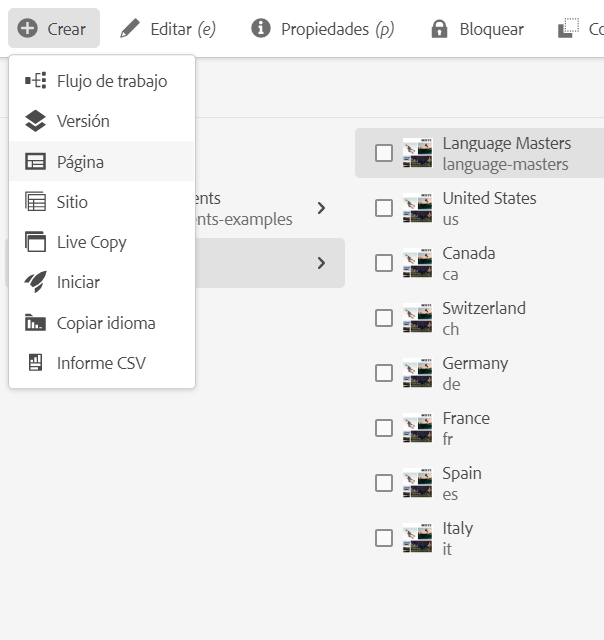
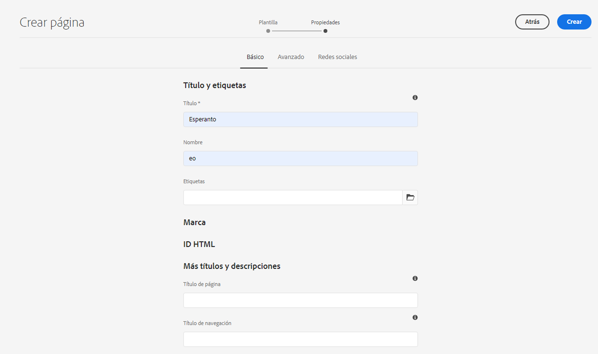
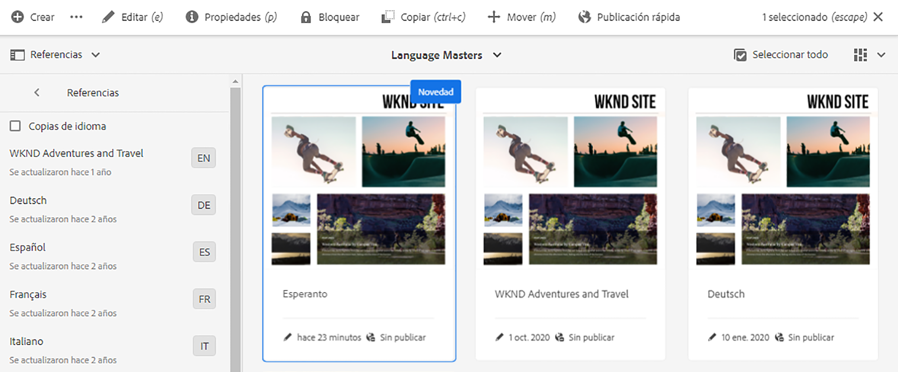
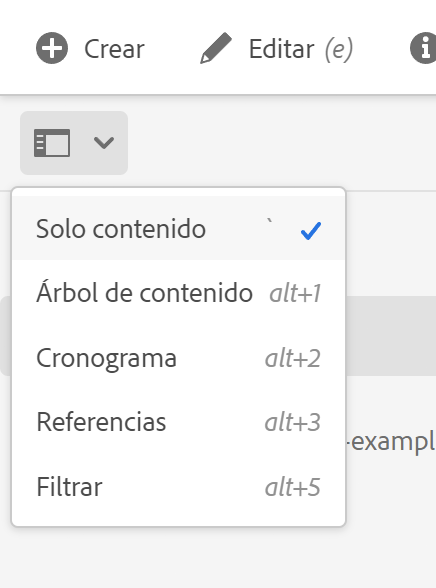

# Preparación del contenido para su traducción {#preparing-content-for-translation}

Por lo general, los sitios web multilingües ofrecen contenido en varios idiomas. El sitio es creado en un idioma y luego traducido a otros idiomas. Por lo general, los sitios multilingües constan de ramas de páginas, donde cada rama contiene las páginas del sitio en un idioma diferente.

>[!TIP]
>
>Si es nuevo en traducir contenido, consulte nuestro [Recorrido de traducción de sitios,](/help/journey-sites/translation/overview.md) que es la ruta guiada a través de la traducción del contenido de AEM Sites mediante las poderosas herramientas de traducción de AEM, ideal para aquellos que no tengan experiencia de traducción o AEM.

El [sitio del tutorial WKND](/help/implementing/developing/introduction/develop-wknd-tutorial.md) incluye varias ramas de idioma y utiliza la siguiente estructura:

```text
/content
    |- wknd
        |- language-masters
            |- en
            |- de
            |- es
            |- fr
            |- it
        |- us
            |- en
            |- es
        |- ca
            |- en
            |- fr
        |- ch
            |- de
            |- fr
            |- it
        |- de
            |- de
        |- fr
            |- fr
        |- es
            |- es
        |- it
            |- it
```

La copia de idioma para la que creó originalmente el contenido del sitio es el maestro de idioma. El maestro de idiomas es la fuente que se traduce a otros idiomas.

Cada rama de idioma de un sitio se denomina copia de idioma. La página raíz de una copia de idioma, conocida como raíz de idioma, identifica el idioma del contenido en la copia de idioma. Por ejemplo, `/content/wknd/fr` es la raíz del idioma para la copia en francés. Las copias de idioma deben utilizar una [raíz de idioma configurada correctamente](preparation.md#creating-a-language-root) para que se oriente al idioma correcto cuando se realicen las traducciones de un sitio de origen.

Siga estos pasos para preparar su sitio para la traducción:

1. Cree la raíz de idioma del maestro de idioma. Por ejemplo, la raíz de idioma del sitio de demostración de WKND en inglés es `/content/wknd/language-masters/en`. Asegúrese de que la raíz del idioma esté configurada correctamente según la información de [Creación de una raíz del idioma](preparation.md#creating-a-language-root).
1. Cree el contenido del maestro de idioma.
1. Cree la raíz de idioma de cada copia de idioma para su sitio. Por ejemplo, la copia en francés del sitio de muestra de WKND es `/content/wknd/language-masters/fr`.

Después de preparar el contenido para la traducción, puede crear automáticamente las páginas que faltan en las copias de idioma y en los proyectos de traducción asociados. (Consulte [Creación de un proyecto de traducción](managing-projects.md)). Para obtener una descripción general del proceso de traducción de contenido en AEM, consulte [Traducción de contenido para sitios web multilingües](overview.md).

## Creación de una raíz de idioma {#creating-a-language-root}

Cree una raíz de idioma como la página raíz de una copia de idioma que identifique el idioma del contenido. Después de crear la raíz del idioma, puede crear proyectos de traducción que incluyan la copia del idioma.

Para crear la raíz del idioma, cree una página y utilice un código de idioma ISO como valor de la propiedad **Name**. El código de idioma debe tener uno de los siguientes formatos:

* `<language-code>` - El código de idioma admitido es un código de dos letras, tal como se define en la norma ISO-639-1, por ejemplo  `en`.
* `<language-code>_<country-code>` o  `<language-code>-<country-code>` : el código de país admitido es un código de dos letras en minúscula o en mayúsculas, tal como se define en la norma ISO 3166, por ejemplo  `en_US`,  `en_us`,  `en_GB`,  `en-gb`.

Puede utilizar cualquiera de los dos formatos, según la estructura que haya elegido para el sitio global.  Por ejemplo, la página raíz de la copia en francés del sitio WKND tiene `fr` como propiedad **Name**. Tenga en cuenta que la propiedad **Name** se utiliza como nombre del nodo de página en el repositorio y, por lo tanto, determina la ruta de la página (`http://<host>:<4502>/content/wknd/language-masters/fr.html`).

1. Vaya a sitios.
1. Toque o haga clic en el sitio para el que desea crear una copia de idioma.
1. Toque o haga clic en **Crear** y, a continuación, toque o haga clic en **Página**.

   

1. Seleccione la plantilla de página y, a continuación, toque o haga clic en **Siguiente**.
1. En el campo **Name** escriba el código de país con el formato `<language-code>` o `<language-code>_<country-code>`, por ejemplo `en`, `en_US`, `en_us`, `en_GB`, `en_gb`. Escriba un título para la página.

   

1. Haga clic o pulse **Crear**. En el cuadro de diálogo de confirmación, pulse o haga clic en **Listo** para volver a la consola Sitios o en **Abrir** para abrir la copia de idioma.

## Ver el estado de las raíces de los idiomas {#seeing-the-status-of-language-roots}

AEM proporciona un carril **References** que muestra una lista de las raíces de idioma que se han creado.



Utilice el siguiente procedimiento para ver las copias de idioma de una página mediante el selector de [raíl.](/help/sites-cloud/authoring/getting-started/basic-handling.md#rail-selector)

1. En la consola Sitios, seleccione una página del sitio y, a continuación, toque o haga clic en **Referencias**.

   

1. En el carril de referencias, pulse o haga clic en **Textos en idiomas**. El carril muestra las copias de idioma del sitio web.

## Copias de idioma en varios niveles {#multiple-levels}

Las raíces de los idiomas también se pueden agrupar en nodos, por ejemplo por región, aunque se siguen reconociendo como raíces de las copias de idiomas.

```text
/content
    |- wknd
        |- language-masters
            |- europe
                |- de
                |- fr
                |- it
                |- es
                ]- pt
            |- americas
                |- en
                |- es
                |- fr
                |- pt
            |- asia
                |- ...
            |- africa
                |- ...
            |- oceania
                |- ...
        |- europe
        |- americas
        |- asia
        |- africa
        |- oceania            
```

>[!NOTE]
>
>Solo se permite un nivel. Por ejemplo, lo siguiente no permite que la página `es` se resuelva en una copia de idioma:
>
>* `/content/wknd/language-masters/en`
>* `/content/wknd/language-masters/americas/central-america/es`

>
> Esta `es` copia de idioma no se detectará porque está a 2 niveles (`americas/central-america`) fuera del nodo `en`.

>[!TIP]
>
>En esta configuración, las raíces de idioma pueden tener cualquier nombre de página, en lugar de solo el código ISO del idioma. AEM siempre comprobará primero la ruta y el nombre, pero si el nombre de la página no identifica ningún idioma, AEM comprobará la propiedad `cq:language` de la página para la identificación del idioma.
