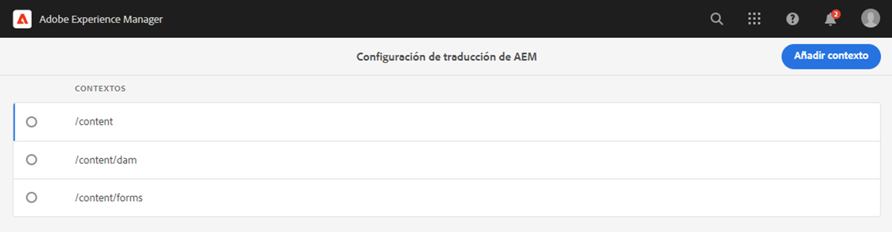
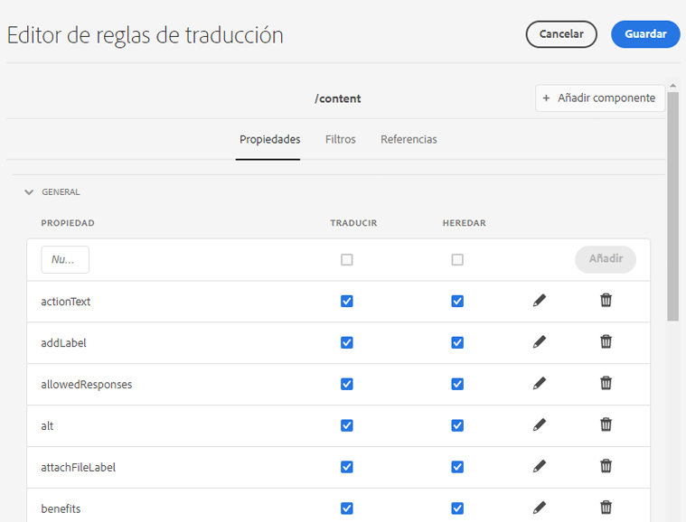
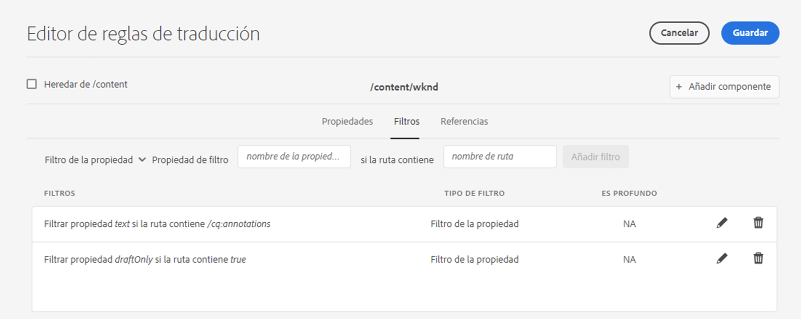
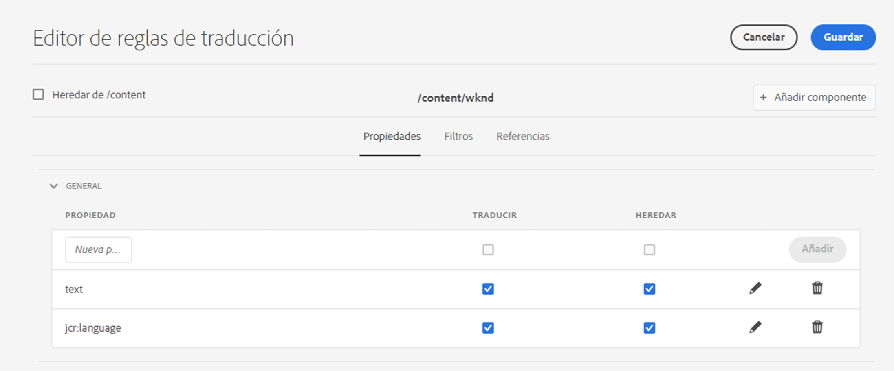

# Identificación del contenido a traducir {#identifying-content-to-translate}

Las reglas de traducción identifican el contenido que se debe traducir para páginas, componentes y recursos que se incluyen en proyectos de traducción o que se excluyen de ellos. Cuando se traduce una página o un recurso, AEM extrae ese contenido para que se pueda enviar al servicio de traducción.

>[!TIP]
>
>Si acaba de empezar a traducir contenido, consulte el [Recorrido de traducción de Sites,](/help/journey-sites/translation/overview.md) que es una ruta guiada a través de la traducción del contenido de AEM Sites mediante las poderosas herramientas de traducción de AEM, ideal para aquellos que no tengan experiencia con la traducción o con AEM.

## Fragmentos de contenido y reglas de traducción {#content-fragments}

Las reglas de traducción descritas en este documento solo se aplican a los fragmentos de contenido si la opción **Habilitar campos de modelo de contenido para la traducción** no se ha activado en el [nivel de configuración del marco trabajo de integración de traducción.](integration-framework.md#assets-configuration-properties)

Si la opción **Habilitar campos de modelo de contenido para la traducción** está activa, AEM usará el campo **Traducible** en [Modelos de fragmentos de contenido](/help/sites-cloud/administering/content-fragments/content-fragment-models.md#properties) para determinar si el campo se va a traducir y crea automáticamente reglas de traducción según corresponda. Esta opción reemplaza las reglas de traducción que haya creado y no requiere intervención ni pasos adicionales.

Si desea utilizar reglas de traducción para traducir los fragmentos de contenido, la variable **Habilitar los campos de modelo de contenido para la traducción** La opción de configuración del marco de trabajo de integración de traducciones debe estar desactivada y debe seguir los pasos descritos a continuación para crear las reglas.

## Información general {#overview}

Las páginas y los recursos se representan como nodos en el repositorio JCR. El contenido extraído es uno o más valores de propiedad de los nodos. Las reglas de traducción identifican las propiedades que contienen el contenido que se va a extraer.

Las reglas de traducción se expresan en formato XML y se almacenan en estas posibles ubicaciones:

* `/libs/settings/translation/rules/translation_rules.xml`
* `/apps/settings/translation/rules/translation_rules.xml`
* `/conf/global/settings/translation/rules/translation_rules.xml`

El archivo se aplica a todos los proyectos de traducción.

Las reglas incluyen la siguiente información:

* La ruta del nodo al que se aplica la regla
   * La regla también se aplica a los descendientes del nodo.
* Nombres de las propiedades del nodo que contienen el contenido que se va a traducir
   * La propiedad puede ser específica para un tipo de recurso específico o para todos los tipos de recurso.

Por ejemplo, puede crear una regla que traduzca el contenido que los autores añaden a todos los componentes de texto de las páginas. La regla puede identificar el nodo `/content` y la propiedad `text` para el componente `core/wcm/components/text/v2/text`.

Hay una [consola](#translation-rules-ui) que se ha añadido para configurar reglas de traducción. Las definiciones de la IU rellenarán el archivo por usted.

Para obtener información general sobre las funciones de traducción de contenido de AEM, consulte [Traducción de contenido para sitios multilingües](overview.md).

>[!NOTE]
>
>AEM admite la asignación individual entre tipos de recursos y atributos de referencia para la traducción del contenido referenciado en una página.

## Sintaxis de reglas para páginas, componentes y recursos {#rule-syntax-for-pages-components-and-assets}

Una regla es un `node` elemento con uno o más elementos `property` secundarios y cero o más elementos `node` secundarios:

```xml
<node path="content path">
          <property name="property name" [translate="false"]/>
          <node resourceType="component path" >
               <property name="property name" [translate="false"]/>
          </node>
</node>
```

Cada uno de estos elementos `node` tiene las siguientes características:

* El atributo `path` contiene la ruta al nodo raíz de la rama a la que se aplican las reglas.
* Los elementos secundarios `property` identifican las propiedades del nodo que se deben traducir para todos los tipos de recursos:
   * El atributo `name` contiene el nombre de la propiedad.
   * El atributo opcional `translate` es igual a `false` si la propiedad no está traducida. El valor predeterminado es `true`. Este atributo es útil cuando se anulan reglas anteriores.
* Los elementos secundarios `node` identifican las propiedades del nodo que se deben traducir para tipos de recursos específicos:
   * El atributo `resourceType` contiene la ruta que se resuelve en el componente que implementa el tipo de recurso.
   * Los elementos secundarios `property` identifican la propiedad del nodo que se debe traducir. Utilice este nodo del mismo modo que los elementos secundarios `property` para reglas de nodo.

La siguiente regla de ejemplo hace que el contenido de todas las propiedades `text` se traduzca para todas las páginas debajo del nodo `/content`. La regla es efectiva para cualquier componente que almacene contenido en una propiedad `text`, como el componente de texto.

```xml
<node path="/content">
          <property name="text"/>
</node>
```

El siguiente ejemplo traduce el contenido de todas las propiedades `text` y traduce también otras propiedades del componente de imagen. Si otros componentes tienen propiedades con el mismo nombre, la regla no se les aplica.

```xml
<node path="/content">
      <property name="text"/>
      <node resourceType="core/wcm/components/image/v2/image">
         <property name="image/alt"/>
         <property name="image/jcr:description"/>
         <property name="image/jcr:title"/>
      </node>
</node>
```

## Sintaxis de reglas para extraer recursos de páginas  {#rule-syntax-for-extracting-assets-from-pages}

Utilice la siguiente sintaxis de regla para incluir recursos incrustados o referenciados en componentes:

```xml
<assetNode resourceType="path to component" assetReferenceAttribute="property that stores asset"/>
```

Cada elemento `assetNode` tiene las siguientes características:

* Un atributo `resourceType` igual a la ruta que se resuelve en el componente
* Un atributo `assetReferenceAttribute` igual al nombre de la propiedad que almacena el binario de recursos (para recursos incrustados) o la ruta al recurso referenciado

El siguiente ejemplo extrae imágenes del componente de imagen:

```xml
<assetNode resourceType="core/wcm/components/image/v2/image" assetReferenceAttribute="fileReference"/>
```

## Reglas de anulación {#overriding-rules}

El archivo `translation_rules.xml` consta de un elemento `nodelist` con varios elementos secundarios `node`. AEM lee la lista de nodos de arriba a abajo. Cuando varias reglas se dirigen al mismo nodo, se utiliza la regla que se encuentra más abajo en el archivo. Por ejemplo, las siguientes reglas hacen que todo el contenido de `text` propiedades se traduzca excepto para la `/content/mysite/en` rama de páginas:

```xml
<nodelist>
     <node path="/content">
           <property name="text" />
     </node>
     <node path="/content/mysite/en">
          <property name="text" translate="false" />
     </node>
<nodelist>
```

## Filtrado de propiedades {#filtering-properties}

Puede filtrar nodos que tengan una propiedad específica utilizando un `filter` elemento.

Por ejemplo, las siguientes reglas hacen que todo el contenido en `text` propiedades se traduzca a excepción de los nodos que tienen la propiedad `draft` configurada como `true`.

```xml
<nodelist>
    <node path="/content">
     <filter>
   <node containsProperty="draft" propertyValue="true" />
     </filter>
        <property name="text" />
    </node>
<nodelist>
```

## Reglas de traducción de la IU {#translation-rules-ui}

También hay una consola disponible para configurar las reglas de traducción.

Para acceder a ella:

1. Vaya a **Herramientas** y luego a **General**.

1. Seleccione **Configuración de traducción**.

En la IU de las reglas de traducción puede:

1. **Agregar contexto**, lo que le permite agregar una ruta.

   

1. Utilice el navegador de rutas para seleccionar el contexto necesario y seleccione **Confirmar** botón para guardar.

   

1. A continuación, debe seleccionar el contexto y hacer clic en **Editar**. Se abrirá el Editor de reglas de traducción.

   

Hay cuatro atributos que puede cambiar mediante la IU:

* `isDeep`
* `inherit`
* `translate`
* `updateDestinationLanguage`

### isDeep {#isdeep}

**`isDeep`** es aplicable en los filtros de nodo y es true de forma predeterminada. Comprueba si el nodo (o sus antecesores) contiene esa propiedad con el valor de propiedad especificado en el filtro. Si es false, solo lo comprueba en el nodo actual.

Por ejemplo, los nodos secundarios se agregan a un trabajo de traducción incluso cuando el nodo principal tiene la propiedad `draftOnly` establecida en true para marcar el contenido de borrador. Aquí `isDeep` entra en juego y comprueba si los nodos principales tienen la propiedad `draftOnly` como true y excluye esos nodos secundarios.

En el editor, puede marcar o desmarcar **isDeep** en la pestaña **Filtros**.



Este es un ejemplo del XML resultante cuando **isDeep** está desmarcado en la IU:

```xml
 <filter>
    <node containsProperty="draftOnly" isDeep="false" propertyValue="true"/>
</filter>
```

### heredar {#inherit}

**`inherit`** es aplicable a las propiedades. De forma predeterminada, todas las propiedades se heredan, pero si desea que el nodo secundario no herede alguna propiedad, puede marcar esta propiedad como falsa para que se aplique únicamente a ese nodo específico.

En la IU, puede marcar o desmarcar **Heredar** en la pestaña **Propiedades**.

### traducir {#translate}

**`translate`** se utiliza simplemente para especificar si se desea traducir o no una propiedad.

En la IU, puede marcar o desmarcar **Traducir** en la pestaña **Propiedades**.

### updateDestinationLanguage {#updatedestinationlanguage}

**`updateDestinationLanguage`** se utiliza para propiedades que no tienen texto, sino códigos de idioma, por ejemplo, `jcr:language`. El usuario no traduce texto sino la configuración regional del idioma de origen a destino. Estas propiedades no se envían para su traducción.

En la IU, puede marcar o desmarcar **Traducir** en la pestaña **Propiedades** para modificar este valor, pero para las propiedades específicas que tienen códigos de idioma como valor.

Para aclarar la diferencia entre `updateDestinationLanguage` y `translate`, aquí hay un ejemplo sencillo de contexto con solo dos reglas:



El resultado en el xml tendrá este aspecto:

```xml
<property inherit="true" name="text" translate="true" updateDestinationLanguage="false"/>
<property inherit="true" name="jcr:language" translate="false" updateDestinationLanguage="true"/>
```

## Edición manual del archivo de reglas {#editing-the-rules-file-manually}

El archivo `translation_rules.xml` que se instala con AEM contiene un conjunto predeterminado de reglas de traducción. Puede editar el archivo para satisfacer los requisitos de sus proyectos de traducción. Por ejemplo, puede agregar reglas para que se traduzca el contenido de los componentes personalizados.

Si edita el archivo `translation_rules.xml`, mantenga una copia de seguridad en un paquete de contenido. La reinstalación de ciertos paquetes de AEM puede reemplazar al archivo `translation_rules.xml` actual con el original. Para restaurar las reglas en esta situación, puede instalar el paquete que contiene la copia de seguridad.

>[!NOTE]
>
>Después de crear el paquete de contenido, vuelva a compilar el paquete cada vez que edite el archivo.

## Ejemplo de archivo de reglas de traducción {#example-translation-rules-file}

```xml
<?xml version="1.0" encoding="UTF-8"?><nodelist>
  <node path="/content">
    <property name="addLabel"/>
    <property name="allowedResponses"/>
    <property name="alt"/>
    <property name="attachFileLabel"/>
    <property name="benefits"/>
    <property name="buttonLabel"/>
    <property name="chartAlt"/>
    <property name="confirmationMessageToggle"/>
    <property name="confirmationMessageUntoggle"/>
    <property name="constraintMessage"/>
    <property name="contentLabel"/>
    <property name="denyText"/>
    <property name="detailDescription"/>
    <property name="emptyText"/>
    <property name="helpMessage"/>
    <property name="image/alt"/>
    <property name="image/jcr:description"/>
    <property name="image/jcr:title"/>
    <property name="jcr:description"/>
    <property name="jcr:title"/>
    <property name="heading"/>
    <property name="label"/>
    <property name="main"/>
    <property name="listLabel"/>
    <property name="moreText"/>
    <property name="pageTitle"/>
    <property name="placeholder"/>
    <property name="requiredMessage"/>
    <property name="resetTitle"/>
    <property name="subjectLabel"/>
    <property name="subtitle"/>
    <property name="tableData"/>
    <property name="text"/>
    <property name="title"/>
    <property name="navTitle"/>
    <property name="titleDivContent"/>
    <property name="toggleLabel"/>
    <property name="transitionLabel"/>
    <property name="untoggleLabel"/>
    <property name="name"/>
    <property name="occupations"/>
    <property name="greetingLabel"/>
    <property name="signInLabel"/>
    <property name="signOutLabel"/>
    <property name="pretitle"/>
    <property name="cq:panelTitle"/>
    <property name="actionText"/>
    <property name="cq:language" updateDestinationLanguage="true"/>
    <node pathContains="/cq:annotations">
      <property name="text" translate="false"/>
    </node>
    <node path="/content/wknd"/>
  </node>
  <node path="/content/forms">
    <property name="text" translate="false"/>
  </node>
  <node path="/content/dam">
    <property name="dc:description"/>
    <property name="dc:rights"/>
    <property name="dc:subject"/>
    <property name="dc:title"/>
    <property name="defaultContent"/>
    <property name="jcr:description"/>
    <property name="jcr:title"/>
    <property name="pdf:Title"/>
    <property name="xmpRights:UsageTerms"/>
    <property name="main"/>
    <property name="adventureActivity"/>
    <property name="adventureDescription"/>
    <property name="adventureDifficulty"/>
    <property name="adventureGearList"/>
    <property name="adventureGroupSize"/>
    <property name="adventureItinerary"/>
    <property name="adventurePrice"/>
    <property name="adventureTitle"/>
    <property name="adventureTripLength"/>
    <property name="adventureType"/>
    <node pathContains="/jcr:content/metadata/predictedTags">
      <property name="name"/>
    </node>
  </node>
  <assetNode assetReferenceAttribute="fragmentPath" resourceType="cq/experience-fragments/editor/components/experiencefragment"/>
  <assetNode assetReferenceAttribute="fragmentVariationPath" resourceType="core/wcm/components/experiencefragment/v1/experiencefragment"/>
  <assetNode assetReferenceAttribute="fileReference" resourceType="dam/cfm/components/contentfragment"/>
  <assetNode resourceType="docs/components/download"/>
  <assetNode resourceType="docs/components/image"/>
  <assetNode assetReferenceAttribute="fileReference" resourceType="foundation/components/image"/>
  <assetNode assetReferenceAttribute="asset" resourceType="foundation/components/video"/>
  <assetNode assetReferenceAttribute="fileReference" resourceType="foundation/components/download"/>
  <assetNode assetReferenceAttribute="fileReference" resourceType="core/wcm/components/download/v1/download"/>
  <assetNode assetReferenceAttribute="fileReference" resourceType="wcm/foundation/components/image"/>
  <assetNode assetReferenceAttribute="fragmentPath" resourceType="core/wcm/components/contentfragment/v1/contentfragment"/>
  <assetNode assetReferenceAttribute="fileReference" resourceType="core/wcm/components/image/v2/image"/>
</nodelist>
```
