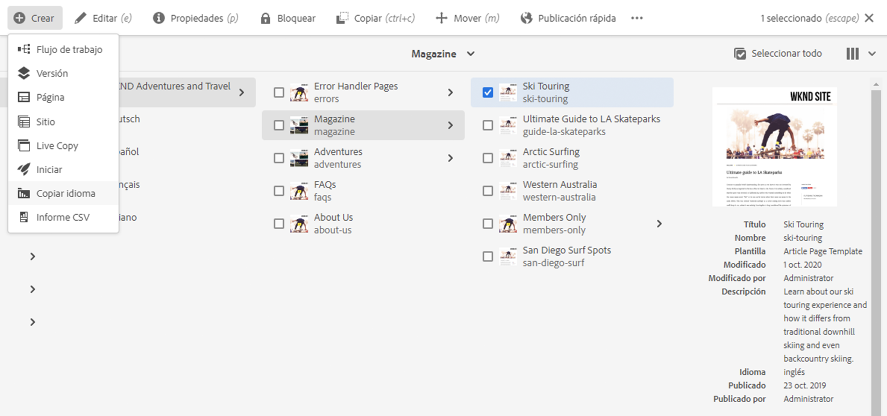
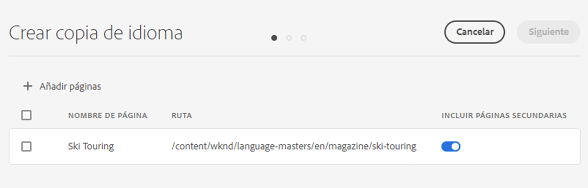
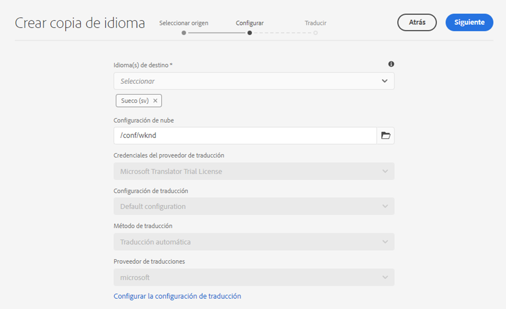
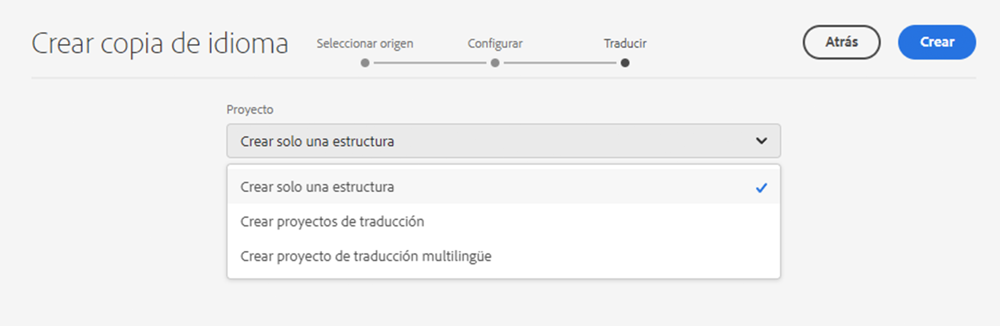
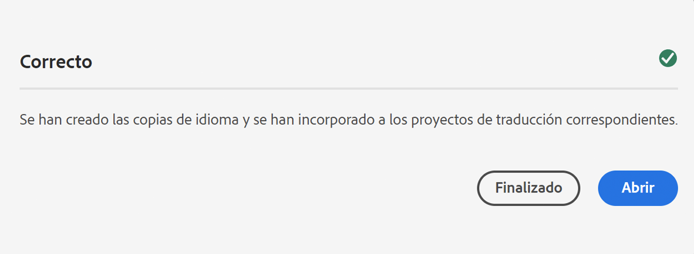

# Asistente para copia de idioma {#language-copy-wizard}

El Asistente para copia de idioma es una experiencia guiada para crear e instrumentar la estructura de contenido multilingüe. El asistente simplifica y acelera la creación de una copia de idioma.

>[!TIP]
>
>Si no tiene experiencia en la traducción de contenido, consulte el [Recorrido de traducción de sitios](/help/journey-sites/translation/overview.md), que es una ruta guiada a través de la traducción del contenido de AEM Sites AEM AEM mediante herramientas de traducción potentes que se utilizan para traducir contenido. Es ideal para aquellos que no tienen experiencia en traducción o en traducción de sitios.

>[!NOTE]
>
>El usuario debe ser miembro del grupo `project-administrators` para crear una copia de idioma de un sitio.

Para acceder al asistente:

1. En la consola Sitios, seleccione una página, seleccione **Crear** y seleccione **Copia de idioma**.

   

1. El asistente se abre para el paso **Seleccionar Source** que le permite agregar o quitar páginas. También tiene la opción de incluir o excluir las subpáginas. Seleccione las páginas que desee incluir y seleccione **Siguiente**.

   

1. El paso **Configurar** del asistente le permite agregar o quitar idiomas y seleccionar el método de traducción. Seleccione **Siguiente**.

   

   >[!NOTE]
   >
   >De forma predeterminada, solo hay una configuración de traducción. Para poder seleccionar otra configuración, primero debe configurar las configuraciones de nube. Consulte [Configuración del marco de trabajo de integración de traducción](integration-framework.md)

1. En el paso **Traducir** del asistente puede elegir entre crear solo la estructura, crear un proyecto de traducción o agregar a un proyecto de traducción existente.

   >[!NOTE]
   >
   >Si ha seleccionado varios idiomas en el paso anterior, se crean varios proyectos de traducción.

   

1. El botón **Crear** finaliza el asistente. Seleccione **Listo** para cerrar el asistente o **Abrir** para ver el proyecto de traducción resultante.

   
