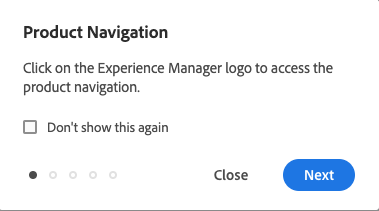

# Gestión básica {#basic-handling}

Este documento se ha diseñado para ofrecer una descripción general de la gestión básica cuando se utiliza el entorno de creación de AEM.

>[!TIP]
>
>Los métodos abreviados del teclado están disponibles mediante AEM. En particular cuando [usa la consola de sitios](/help/sites-cloud/authoring/sites-console/keyboard-shortcuts.md) y [el editor de páginas](/help/sites-cloud/authoring/page-editor/keyboard-shortcuts.md).

## Una interfaz con capacidad táctil {#a-touch-enabled-ui}

La interfaz de usuario de AEM tiene capacidad táctil. Una interfaz táctil le permite utilizar el tacto para interactuar con el software mediante gestos como pulsar, pulsar y mantener o deslizar el dedo. Como la interfaz de usuario de AEM es táctil, puede utilizar los gestos táctiles en dispositivos táctiles como el teléfono móvil o la tablet. Sin embargo, también están disponibles las acciones del ratón en un dispositivo de escritorio tradicional, lo que le proporciona flexibilidad en la forma en que elige crear el contenido.

## Primeros pasos {#first-steps}

Inmediatamente después de iniciar sesión, llegará al [Panel de navegación](#navigation-panel). Al seleccionar una de las opciones, se abre la consola correspondiente.

Para comprender bien el uso básico de AEM, este documento se basa en la consola **Sitios**. Seleccione **Sitios** para comenzar.

## Navegación de productos    {#product-navigation}

Cada vez que se accede por primera vez a una consola, se inicia un tutorial de navegación por los productos. Dedique un minuto a seleccionar hasta el final para obtener una buena descripción general de la gestión básica de AEM.

Seleccione **Siguiente** para avanzar a la siguiente página de la descripción general. Seleccione **Cerrar** o seleccione fuera del cuadro de diálogo de la descripción general para cerrar.

La descripción general se reiniciará la próxima vez que acceda a una consola, a menos que vea todas las diapositivas o marque la opción **No volver a mostrar esto**.

## Navegación global {#global-navigation}

Puede navegar entre las consolas con el panel de navegación global. Esto se activa como una lista desplegable de pantalla completa al seleccionar el vínculo **Adobe Experience Manager** en la parte superior izquierda de la pantalla.

Para volver a la ubicación anterior, puede cerrar el panel de navegación global tocando o haciendo clic en **Cerrar**.

La navegación global dispone de dos paneles, representados por iconos en el lado izquierdo de la pantalla:

* **[Navegación](#navigation-panel)**: representada por una brújula y el panel predeterminado al iniciar sesión en AEM
* **[Herramientas](#tools-panel)**: se representan con un martillo

A continuación, se describen las opciones disponibles en estos paneles.

### Panel de navegación    {#navigation-panel}

El panel **Navegación**:

El título de la pestaña del navegador se actualizará para reflejar su ubicación a medida que navegue por las consolas y el contenido.

En Navegación, las consolas disponibles son:

| Consola | Función |
|---|---|
| Proyectos | La consola Proyectos le proporciona acceso directo a sus proyectos. [Los proyectos son paneles virtuales](/help/sites-cloud/authoring/projects/overview.md) que se pueden utilizar para crear un equipo. A continuación, puede proporcionar a ese equipo acceso a recursos, flujos de trabajo y tareas, lo que permite a las personas colaborar para lograr un objetivo común. |
| Sitios | [La consola Sitios](/help/sites-cloud/authoring/sites-console/introduction.md) le permite crear, ver y administrar sitios web que se ejecuten en su instancia de AEM. Mediante esta consola puede crear, editar, copiar, mover y eliminar páginas, iniciar flujos de trabajo y publicar páginas. |
| Fragmentos de experiencias | Un [fragmento de experiencia](/help/sites-cloud/authoring/fragments/content-fragments.md) es una experiencia independiente que puede reutilizarse en diversos canales y tener variaciones, de manera que se evita el problema de copiar y pegar repetidas veces experiencias o partes de experiencias. |
| Assets | La consola Recursos le permite importar y administrar [recursos digitales, como imágenes, vídeos, documentos y archivos de audio](/help/assets/overview.md). Estos recursos se pueden utilizar en cualquier sitio web que ejecute la misma instancia de AEM. También puede crear y administrar [Fragmentos de contenido](/help/assets/content-fragments/content-fragments.md) desde la consola Recursos. |
| Personalización | [Esta consola ofrece un marco de herramientas para crear contenido dirigido y presentar experiencias personalizadas](/help/sites-cloud/authoring/personalization/overview.md). |
| Fragmentos de contenido | [Los fragmentos de contenido](/help/sites-cloud/administering/content-fragments/overview.md) permiten diseñar, crear, depurar y publicar contenido independiente de cualquier página. Permiten preparar contenido estructurado listo para su uso en varias ubicaciones/en varios canales, y es ideal tanto para la creación de páginas como para la entrega sin encabezado. |
| Generar variaciones | [Generar variaciones](/help/generative-ai/generate-variations.md) utiliza inteligencia artificial generativa (IA) para crear variaciones de contenido basadas en mensajes; estos mensajes los proporciona Adobe o los crean y administran los usuarios. |

## Panel de herramientas {#tools-panel}

El panel **Herramientas** tiene un panel lateral que contiene un rango de categorías, que agrupan consolas similares. Las consolas **Herramientas** proporcionan acceso a varias consolas y herramientas especializadas que le ayudan a administrar sus sitios web, recursos digitales y otros aspectos de su repositorio de contenido.

## Encabezado {#the-header}

El encabezado de siempre está presente en la parte superior de la pantalla. Aunque la mayoría de las opciones del encabezado no varían en todo el sistema, algunas dependen del contexto.

* [Navegación global](#global-navigation): seleccione el vínculo **Adobe Experience Manager** para navegar entre consolas.

  

* Comentarios

  

* Su organización IMS: seleccione para cambiar si es necesario.

* [Soluciones](https://www.adobe.com/es/experience-cloud.html): Seleccione esta opción para acceder a las demás soluciones de Adobe.

  

* [Buscar](/help/sites-cloud/authoring/search.md) - También puede usar la [tecla de método abreviado](/help/sites-cloud/authoring/sites-console/keyboard-shortcuts.md) `/` (barra diagonal) para invocar la búsqueda desde cualquier consola.

  

* [Ayuda](#accessing-help)

  

* [Notificaciones](/help/sites-cloud/authoring/inbox.md) -   Este icono se señala con el número de notificaciones incompletas asignadas actualmente.

  

* [Propiedades de usuario](/help/sites-cloud/authoring/account-environment.md) - Seleccione esta opción para cambiar la configuración de usuario.

  

## Acceso a la Ayuda   {#accessing-help}

Hay una serie de recursos de ayuda disponibles y algunas formas de acceder a ellos.

* **Barra de herramientas** - Según su ubicación, el icono **Ayuda** abre los recursos apropiados:

  

* **Consola**: la primera vez que navegues por el sistema, [se mostrará una serie de diapositivas sobre la navegación con AEM](#product-navigation).

  

* **Editor de páginas**: la primera vez que edite una página, se mostrará una serie de diapositivas con el editor de páginas.

  

   * Desplácese por esta descripción general como haría en la [descripción general de navegación de producto](#product-navigation) al acceder por primera vez a una consola.
   * En el menú [**Información de página** puede seleccionar **Ayuda**](#accessing-help) para que se vuelva a mostrar esto en cualquier momento.

* **Consola de herramientas**: desde la consola de **Herramientas** también puede obtener acceso a los **recursos externos**:

   * **Documentación**: ver la documentación de Web Experience Management.
   * **Recursos de desarrollador**: recursos y descargas para desarrolladores.

>[!TIP]
>
>Puede acceder a una descripción general de las teclas de método abreviado disponibles en cualquier momento mediante la tecla de marcación rápida `?` (signo de interrogación) en una consola.
>
>Para obtener información general de todos los métodos abreviados de teclado, consulte la siguiente documentación:
>
>* [Métodos abreviados del teclado para editar páginas](/help/sites-cloud/authoring/page-editor/keyboard-shortcuts.md)
>* [Métodos abreviados del teclado para las consolas](/help/sites-cloud/authoring/sites-console/keyboard-shortcuts.md)
