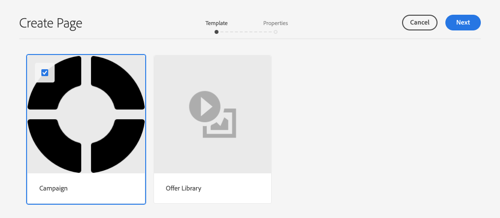
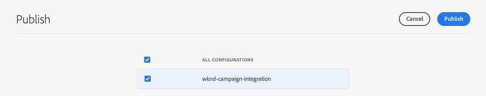
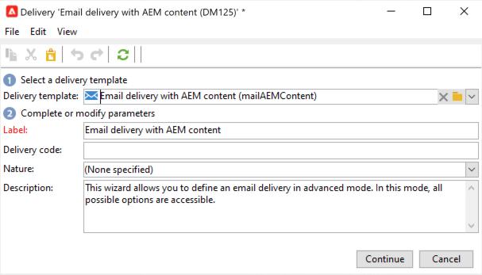

# Creación de boletines de campaña con AEM {#creating-newsletters}

En este documento aprenderá a utilizar AEM as a Cloud Service para crear boletines que se puedan enviar con Adobe Campaign Classic.

Aprovechando la integración entre AEM as a Cloud Service y Adobe Campaign Classic, puede crear sus boletines con AEM potentes herramientas de creación. A continuación, cuando esté listo para enviar el boletín, puede utilizar las funciones de distribución y administración de destinatarios de Campaign para enviarlo.

## Requisitos previos {#prerequisites}

Antes de crear una newsletter con AEM y enviarla con Campaign, primero debe [integre Adobe Campaign Classic y AEM as a Cloud Service.](/help/sites-cloud/integrating/integrating-campaign-classic.md)

## Creación de la estructura del boletín {#create-structure}

El contenido de las newsletters se administra en AEM de la misma forma que lo haría con el contenido del sitio. Comience creando un &quot;sitio&quot; para albergar su contenido. Dentro de este &quot;sitio&quot; puede recopilar sus boletines por marca.

1. Inicie sesión en la instancia de autor de AEM.

1. En la página de navegación principal, abra la **Sitios** consola.

1. En una instalación estándar de AEM, habrá una **Campaign** carpeta. Selecciónelo y haga clic en el botón **Crear** botón y luego **Página**.

   

1. Select **Marca** como plantilla del sitio y haga clic en **Siguiente**.

   

1. Escriba un **Título** y haga clic en **Crear** y luego **Listo**.

   

Ahora tiene una estructura de contenido básica para crear sus campañas.

## Creación de una campaña {#create-campaign}

Ahora que tiene una estructura de contenido básica para la campaña, puede crear la propia campaña. La campaña se utilizará para organizar posiblemente varios boletines informativos.

1. Uso [vista de columna](/help/sites-cloud/authoring/getting-started/basic-handling.md#viewing-and-selecting-resources) en la consola Sitios, seleccione la marca que creó anteriormente (en este caso, **WKND escapa**) y, a continuación, seleccione **Área maestra**, que se creó automáticamente y, a continuación, haga clic en el botón **Crear** botón y luego **Página**.

   

1. Select **Campaign** como plantilla, haga clic en **Siguiente** y **Listo**.

   

1. Escriba un **Título** para la campaña y luego haga clic en **Crear** y **Listo**.

   

Ahora tiene una campaña en la que puede crear los boletines informativos.

## Selección de la configuración de la campaña {#campaign-configuration}

AEM admite varias configuraciones de integración. Para la nueva campaña, debe definir qué configuraciones utilizar para enviar el contenido de la newsletter.

1. Uso [vista de columna](/help/sites-cloud/authoring/getting-started/basic-handling.md#viewing-and-selecting-resources) en la consola Sitios , busque la campaña que creó anteriormente (en este caso, **Campaña de verano de WKND para escapar**) y, a continuación, selecciónela con la casilla de verificación y haga clic en el botón **Propiedades** en la barra de herramientas.

   

1. En el **Propiedades** , seleccione **Cloud Service** para definir la integración que se utilizará con esta campaña.

   * Select **Adobe Campaign** de la variable **Configuraciones del Cloud Service** lista desplegable.
   * Seleccione la configuración de integración de Adobe Campaign que desee en el **Adobe Campaign** lista desplegable.
   * Haga clic en **Guardar y cerrar**.

   

La campaña está ahora vinculada a su integración con Adobe Campaign. Está listo para crear una newsletter en AEM y enviarla con Adobe Campaign.

## Crear un boletín {#create-newsletter}

Los boletines se crean y administran bajo la estructura de contenido de campaña que ya ha creado y configurado.

1. Uso [vista de columna](/help/sites-cloud/authoring/getting-started/basic-handling.md#viewing-and-selecting-resources) en la consola Sitios , busque la campaña que configuró anteriormente (en este caso, **Campaña de verano de WKND para escapar**), selecciónela y haga clic en el botón **Crear** botón y luego **Página**.

   

1. En el asistente para crear página, seleccione la opción **Correo electrónico de Adobe Campaign (AC 6.1)** plantilla y haga clic en **Siguiente**.

   

1. Para la variable **Propiedades** del asistente, introduzca el **Título** para la newsletter, haga clic en **Crear** y **Apertura**.

   

1. Edite la página del boletín como lo haría con cualquier otra página de contenido de AEM para satisfacer sus necesidades.

Ahora tiene un boletín listo para enviarlo con Adobe Campaign.

## Publicación del boletín {#publishing-newsletter}

Debe publicar la newsletter para que esté disponible para que Adobe Campaign la envíe.

1. Uso [vista de columna](/help/sites-cloud/authoring/getting-started/basic-handling.md#viewing-and-selecting-resources) en la consola Sitios , busque el boletín que creó anteriormente (en este caso, **Primer boletín informativo para la campaña de verano WKND escape**), selecciónela y haga clic en el botón **Información de la página** en la parte superior izquierda y haga clic en **Publicar página**.

1. Seleccione las configuraciones para las que debe publicarse la página y haga clic en **Publicación**.

   

La página del boletín ahora se publica en la instancia de publicación de AEM y es visible en Adobe Campaign Classic. Para poder seleccionarlo dentro de Adobe Campaign, debe aprobarse.

1. Haga clic en el **Información de la página** para la newsletter una vez más y seleccione **Iniciar flujo de trabajo**.

1. Select **Aprobar para Adobe Campaign** como modelo de flujo de trabajo (si lo desea, proporcione una descripción) y haga clic en el botón **Iniciar flujo de trabajo** botón.

   

1. Aparece un banner en la parte superior del editor de páginas del boletín que proporciona los pasos siguientes en el proceso de aprobación. Haga clic en **Completar**.

   

1. En el **Completar elemento de trabajo** cuadro de diálogo, seleccione **Revisión del boletín (Administrador)** en el **Paso siguiente** y haga clic en la **OK** botón.

   

1. En el banner que aparece en la parte superior del editor de la página del boletín, haga clic de nuevo en **Completar**.

1. En el **Completar elemento de trabajo** cuadro de diálogo, seleccione **Aprobación del boletín** en el **Paso siguiente** y haga clic en la **OK** botón.

   

1. Cuando se cierra el cuadro de diálogo, el banner que aparece en la parte superior del editor de páginas del boletín informativo desaparece porque se ha completado el flujo de trabajo de aprobación.

El boletín se publica ahora en AEM y se aprueba para su uso en Adobe Campaign.

>[!TIP]
>
>Los pasos del flujo de trabajo descritos se simplifican aquí para ilustrar el proceso. En un flujo de trabajo normal, la creación de la newsletter y su aprobación funcionan normalmente como roles diferentes
>
>Consulte el documento [Uso de flujos de trabajo](/help/sites-cloud/authoring/workflows/overview.md) para obtener más información sobre el uso de flujos de trabajo.

## Creación de destinatarios {#creating-recipient}

Para poder enviar la newsletter creada en AEM, primero debe definir los destinatarios en Adobe Campaign Classic.

1. Inicie sesión en Adobe Campaign Classic mediante la consola del cliente.

1. Select **Herramientas** -> **Explorer** en la barra de menús.

1. En el explorador, vaya a la **Profiles &amp; Targets** -> **Destinatarios** nodo .

   

1. Haga clic en **Nuevo** en la barra de herramientas y proporcione los detalles del destinatario.

   * Nombre
   * Apellidos
   * Dirección de correo electrónico

1. Haga clic en **Guardar**.

Ahora tiene un destinatario al que puede enviar la newsletter mediante Adobe Campaign Classic.

## Creación de una entrega de correo electrónico {#create-delivery}

El paso final es enviar la newsletter que ha creado en AEM al destinatario que ha añadido en Adobe Campaign Classic.

1. Inicie sesión en Adobe Campaign Classic mediante la consola del cliente.

1. Select **Herramientas** -> **Explorer** en la barra de menús.

1. En el explorador, vaya a la **Campaign Management** -> **Entregas** nodo y haga clic en **Nuevo**.

   

1. En el **Entrega** cuadro de diálogo, seleccione **Envío de correo electrónico con contenido AEM** como el **Plantilla de envío** en la lista desplegable y haga clic en **Continuar**.

   

1. En el **Parámetros de correo electrónico** , haga clic en el botón **De** , introduzca la información del remitente y haga clic en **OK**.

   * Dirección del remitente
   * Del campo

   

1. En el **Parámetros de correo electrónico** , haga clic en el botón **Hasta** para abrir el **Seleccionar Target** y haga clic en **Agregar**.

   

1. En el **Seleccionar elemento de destino** cuadro de diálogo, seleccione **Un destinatario** y haga clic en **Siguiente**.

   

1. Con los filtros, seleccione el destinatario que desee [creado anteriormente](#creating-recipient) y haga clic en **Finalizar**.

   

1. Atrás en el **Seleccionar Target** cuadro de diálogo, haga clic en **OK**.

1. En la ventana de envío, haga clic en **Sincronizar**.

   

1. En el **Sincronizar con contenido AEM** , seleccione la newsletter creada anteriormente en la lista, haga clic en **OK**.

1. El contenido del correo electrónico de Adobe Campaign se sincroniza con el contenido de la newsletter que ha creado en AEM.

   * Haga clic en **Actualizar contenido** si el contenido no se carga automáticamente.

1. Haga clic en **Enviar** para enviar el correo electrónico.

1. En el **Enviar al objetivo de envío principal** cuadro de diálogo, seleccione **Enviar lo antes posible** y haga clic en **Analizar**.

   

1. El paso de análisis crea la entrega, combinando el contenido con los destinatarios. Ahora que se ha creado la entrega, haga clic en **Confirmar entrega** para enviar el correo electrónico. Haga clic en **Sí** para confirmar.

1. Se ha iniciado la entrega. Haga clic en **Cerrar**.

   

1. Haga clic en **Guardar** para guardar la entrega.

¡Se ha enviado el boletín!

>[!TIP]
>
>Este ejemplo mostraba una entrega simplificada de la entrega de una newsletter a un único destinatario. Por supuesto, una entrega normal contendría muchos destinatarios diferentes, lo que Adobe Campaign hace simple de administrar. Consulte la [Documentación de Adobe Campaign Classic](https://experienceleague.adobe.com/docs/campaign-classic.html) para obtener más información sobre la administración de envíos y destinatarios.
