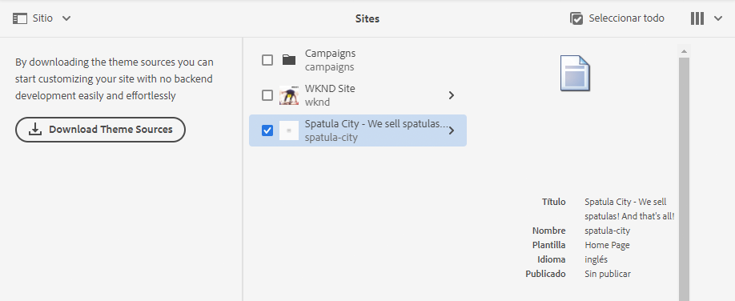

# Gestión básica {#basic-handling}

Este documento se ha diseñado para ofrecer una descripción general de la gestión básica cuando se utiliza el entorno de creación AEM. Utiliza la consola **Sitios** como base. 

>[!NOTE]
>
>* Algunas funcionalidades no están disponibles en todas las consolas y es posible que otras adicionales estén disponibles en algunas consolas. En otras páginas se ofrece información específica sobre las consolas individuales y su funcionalidad relacionada.
>* Los métodos abreviados del teclado están disponibles mediante AEM, sobre todo al [utilizar las consolas](/help/sites-cloud/authoring/getting-started/keyboard-shortcuts.md) y [al editar páginas](/help/sites-cloud/authoring/fundamentals/keyboard-shortcuts.md).

{{edge-delivery-authoring}}

## Una interfaz con capacidad táctil {#a-touch-enabled-ui}

La interfaz de usuario de AEM tiene capacidad táctil. Una interfaz táctil le permite utilizar el tacto para interactuar con el software mediante gestos como pulsar, pulsar y mantener o deslizar el dedo. Como la interfaz de usuario de AEM es táctil, puede utilizar los gestos táctiles en dispositivos táctiles como el teléfono móvil o la tablet. Sin embargo, también están disponibles las acciones del ratón en un dispositivo de escritorio tradicional, lo que le proporciona flexibilidad en la forma en que elige crear el contenido.

## Primeros pasos {#first-steps}

Inmediatamente después de iniciar sesión, llegará al [Panel de navegación](#navigation-panel). Al seleccionar una de las opciones, se abre la consola correspondiente.

Para comprender bien el uso básico de AEM, este documento se basa en la consola **Sitios**. Pulse o haga clic en **Sitios** para comenzar.

## Navegación de productos    {#product-navigation}

Cada vez que se accede por primera vez a una consola, se inicia un tutorial de navegación por los productos. Tómese un minuto y haga clic o pulse para obtener una buena descripción general del funcionamiento básico de AEM.

Toque o haga clic en **Siguiente** para avanzar a la siguiente página de la descripción general. Para cerrar, pulse o haga clic en **Cerrar**, o pulse o haga clic fuera del cuadro de diálogo de la descripción general.

La descripción general se reiniciará la próxima vez que acceda a una consola, a menos que vea todas las diapositivas o marque la opción **No volver a mostrar esto**.

## Navegación global {#global-navigation}

Puede navegar entre las consolas con el panel de navegación global. Se activa como un menú desplegable a pantalla completa cuando pulse o haga clic en el vínculo de Adobe Experience Manager en la parte superior izquierda de la pantalla.

Para volver a la ubicación anterior, puede cerrar el panel de navegación global tocando o haciendo clic en **Cerrar**.

La navegación global dispone de dos paneles, representados por iconos en el lado izquierdo de la pantalla:

* **[Navegación](#navigation-panel)**: se representa mediante una brújula    y el panel predeterminado al iniciar sesión en AEM.
* **[Herramientas](#tools-panel)**: se representan con un martillo

A continuación, se describen las opciones disponibles en estos paneles.

### Panel de navegación    {#navigation-panel}

El panel Navegación:

El título de la pestaña del navegador se actualizará para reflejar su ubicación a medida que navegue por las consolas y el contenido.

En Navegación, las consolas disponibles son:

| Consola | Función |
|---|---|
| Proyectos | La consola Proyectos le proporciona acceso directo a sus proyectos. [Los proyectos son paneles virtuales](/help/sites-cloud/authoring/projects/overview.md) que se pueden utilizar para crear un equipo. A continuación, puede proporcionar a ese equipo acceso a recursos, flujos de trabajo y tareas, lo que permite a las personas colaborar para lograr un objetivo común. |
| Sitios | La consola Sitios le permite [crear, ver y administrar sitios web](/help/sites-cloud/authoring/fundamentals/organizing-pages.md) que se ejecuten en su instancia de AEM. Mediante esta consola puede crear, editar, copiar, mover y eliminar páginas, iniciar flujos de trabajo y publicar páginas. |
| Fragmentos de experiencias | Un [fragmento de experiencia](/help/sites-cloud/authoring/fundamentals/experience-fragments.md) es una experiencia independiente que puede reutilizarse en diversos canales y tener variaciones, de manera que se evita el problema de copiar y pegar repetidas veces experiencias o partes de experiencias. |
| Assets | La consola Recursos le permite importar y administrar [recursos digitales, como imágenes, vídeos, documentos y archivos de audio](/help/assets/overview.md). Estos recursos se pueden utilizar en cualquier sitio web que ejecute la misma instancia de AEM. También puede crear y administrar [Fragmentos de contenido](/help/assets/content-fragments/content-fragments.md) desde la consola Recursos. |
| Personalización | [Esta consola ofrece un marco de herramientas para crear contenido dirigido y presentar experiencias personalizadas](/help/sites-cloud/authoring/personalization/overview.md). |
| Fragmentos de contenido | [Los fragmentos de contenido](/help/sites-cloud/administering/content-fragments/overview.md) permiten diseñar, crear, depurar y publicar contenido independiente de cualquier página. Permiten preparar contenido estructurado listo para su uso en varias ubicaciones/en varios canales, y es ideal tanto para la creación de páginas como para la entrega sin encabezado. |

## Panel de herramientas {#tools-panel}

En el panel Herramientas hay un panel lateral que contiene una serie de categorías, que agrupan consolas de herramientas similares. Las consolas Herramientas permiten acceder a toda una serie de consolas y herramientas personalizadas que le ayudan a administrar sus sitios web, recursos digitales y otros aspectos de su repositorio de contenido. <!--The [Tools consoles](/help/sites-administering/tools-consoles.md) provide access to a number of specialized tools and consoles that help you administer your websites, digital assets, and other aspects of your content repository.-->

## Encabezado {#the-header}

El encabezado de siempre está presente en la parte superior de la pantalla. Aunque la mayoría de las opciones del encabezado no varían en todo el sistema, algunas dependen del contexto.

* [Navegación global](#global-navigation)

  Seleccione el vínculo **Adobe Experience Manager** para navegar entre consolas.

  

* [Búsqueda](/help/sites-cloud/authoring/getting-started/search.md)

  

  También puede utilizar la [tecla de método abreviado](/help/sites-cloud/authoring/getting-started/keyboard-shortcuts.md) `/` (barra inclinada) para iniciar una búsqueda desde cualquier consola.

* [Soluciones](https://www.adobe.com/es/experience-cloud.html)

  

* [Ayuda](#accessing-help)

  

* [Notificaciones](/help/sites-cloud/authoring/getting-started/inbox.md)

  

  Este icono se muestra con la cantidad de notificaciones incompletas asignadas actualmente.

* [Propiedades del usuario](/help/sites-cloud/authoring/getting-started/account-environment.md)

  

* [Selector de raíl](#rail-selector)

  

  Las opciones presentadas dependen de la consola actual. Por ejemplo, en **Sitios** puede seleccionar contenido solamente (el valor predeterminado), la cronología, las referencias o el panel lateral de filtro.

  

* Rutas de exploración

  

  Las rutas de exploración, que se encuentran en el centro del raíl y siempre muestran la descripción del elemento seleccionado, le permiten desplazarse dentro de una consola específica. Desde la consola **Sitios** puede desplazarse por los niveles de su sitio web.

  Simplemente haga clic en el texto de la ruta de exploración para ver una lista desplegable con los niveles de la jerarquía del elemento seleccionado actualmente. Haga clic en una entrada para ir a esa ubicación.

  

* Botón **Crear**

  

  Una vez que se ha hecho clic, las opciones que se muestran son apropiadas para la consola o el contexto.

* [Vistas](#viewing-and-selecting-resources)

  El icono de vista se encuentra en el extremo derecho de la barra de herramientas de AEM. Como indica también la vista actual, cambia. Por ejemplo, en la vista predeterminada, la **vista de columna** muestra lo siguiente:

  

  Puede cambiar entre la vista de columna, la vista de tarjeta y la vista de lista. Tenga en cuenta que en la vista de lista también se muestra la configuración de la vista.

  

  >[!NOTE]
  >
  >La opción **Ver configuración** solo está disponible en el modo **Vista de lista**.

* Navegación por teclado

  Puede navegar por un sitio web utilizando solo el teclado. Utiliza la funcionalidad estándar del navegador de la tecla **TAB** (u **OPT+TAB**) para desplazarlo entre los elementos de la página que se pueden enfocar.

  En la consola **Sites** hay una opción agregada para **Omitir al contenido principal**. Esto se vuelve visible a medida que se desplaza con el tabulador a través de las opciones de encabezado y acelera la navegación permitiéndole omitir los elementos estándar en la barra de herramientas (producto), y lo lleva directamente al contenido principal.

  

## Acceso a la Ayuda   {#accessing-help}

Hay varios medios de ayuda disponibles:

* **Barra de herramientas de la consola**

  Según su ubicación, el icono **Ayuda** abrirá los recursos adecuados:

  

* **Navegación**

  La primera vez que navega por el sistema, se muestra [una serie de diapositivas en que se presenta la navegación por AEM](#product-navigation).

  

* **Editor de página**

  La primera vez que se edita una página, se muestra una serie de diapositivas de presentación del editor de páginas.

  

  Desplácese por esta descripción general como haría en la [descripción general de navegación de producto](#product-navigation) al acceder por primera vez a una consola.

  En el menú [**Información de página** puede seleccionar **Ayuda**](/help/sites-cloud/authoring/fundamentals/environment-tools.md#accessing-help) para que se vuelva a mostrar esto en cualquier momento.

* **Consola Herramientas**

  Desde la consola **Herramientas** también puede acceder a los **recursos externos**:

   * **Documentación**: ver la documentación de Web Experience Management.
   * **Recursos de desarrollador**: recursos y descargas para desarrolladores.

  >[!NOTE]
  >
  >Puede acceder a una descripción general de las teclas de método abreviado disponibles en cualquier momento mediante la tecla de marcación rápida `?` (signo de interrogación) en una consola.
  >
  >Para obtener información general de todos los métodos abreviados de teclado, consulte la siguiente documentación:
  >
  >* [Métodos abreviados del teclado para editar páginas](/help/sites-cloud/authoring/fundamentals/keyboard-shortcuts.md)
  >* [Métodos abreviados del teclado para las consolas](/help/sites-cloud/authoring/getting-started/keyboard-shortcuts.md)

## Barra de herramientas Acciones {#actions-toolbar}

Siempre que se selecciona un recurso (por ejemplo, una página o un recurso), varias acciones aparecen indicadas en la barra de herramientas mediante iconos acompañados por un texto explicativo. Estas acciones dependen de lo siguiente:

* La consola actual
* El contexto actual
* Si se encuentra en el [modo de selección](#viewing-and-selecting-resources)

La acción disponible en la barra de herramientas cambia para reflejar las acciones que se pueden llevar a cabo en los elementos específicos seleccionados.

El modo de [seleccionar un recurso](#viewing-and-selecting-resources) depende de la vista.

Debido a las restricciones de espacio en algunas ventanas, es posible que la barra de herramientas supere rápidamente la longitud disponible. Cuando esto ocurre, aparecen opciones adicionales. Al pulsar o hacer clic en los puntos suspensivos (**...**) se abre un selector desplegable que contiene todas las acciones restantes. Por ejemplo, después de seleccionar una página en la consola **Sitios**: 

>[!NOTE]
>
>Los iconos individuales disponibles se documentan de acuerdo con la consola, la función o el escenario en cuestión.

## Acciones rápidas    {#quick-actions}

En la [Vista de tarjeta](#card-view) algunas acciones están disponibles como iconos de acción rápida y se encuentran en la barra de herramientas. Los iconos de acción rápida están disponibles para un único elemento a la vez, con lo que no es necesario preseleccionarlos.

Las acciones rápidas se pueden ver al pasar el ratón (dispositivo de escritorio) por encima de una tarjeta de recurso. Las acciones rápidas disponibles pueden depender de la consola y del contexto. Por ejemplo, estas son las acciones rápidas para una página de la consola **Sitios**:

## Visualización y selección de los recursos {#viewing-and-selecting-resources}

Conceptualmente, la visualización, la navegación y la selección son iguales en todas las vistas, pero existen pequeñas variaciones en el manejo, dependiendo de la vista utilizada.

Puede visualizar, navegar y seleccionar sus recursos (para efectuar una acción posterior) con cualquiera de las vistas disponibles, que se seleccionan mediante el icono en la parte superior derecha:

* [Vista de columna](#column-view)
* [Vista de tarjeta](#card-view)
* [Vista de lista   ](#list-view)

>[!NOTE]
>
>De forma predeterminada, AEM Assets no muestra las representaciones originales de los recursos de la IU como miniaturas en ninguna de las vistas. Si es administrador, puede utilizar superposiciones para configurar AEM Assets de modo que muestren las representaciones originales como miniaturas.

### Selección de recursos    {#selecting-resources}

La selección de un recurso específico depende de la vista y el dispositivo combinados:

| Ver | Seleccionar opción táctil | Seleccionar escritorio | Anular la selección táctil | Anular la selección de escritorio |
|---|---|---|---|---|
| Columna | Pulsar la miniatura | Hacer clic en la miniatura | Pulsar la miniatura | Hacer clic en la miniatura |
| Tarjeta | Pulsar y mantener la tarjeta | Pasar el ratón y, a continuación, utilizar la marca de verificación de acción rápida | Pulsar la tarjeta | Hacer clic en la tarjeta |
| Lista | Pulsar la miniatura | Hacer clic en la miniatura | Pulsar la miniatura | Hacer clic en la miniatura |

#### Seleccionar todo {#select-all}

Puede seleccionar todos los elementos de cualquier vista haciendo clic en la opción **Seleccionar todo** situada en el ángulo superior derecho de la consola.

* En la **Vista de tarjeta** se seleccionan todas las tarjetas.
* En **Vista de lista**, se seleccionan todos los elementos de la lista.
* En **Vista de columna**, se seleccionan todos los elementos de la columna situada más a la izquierda.

#### Anulación de selección de todo {#deselecting-all}

En todos los casos, el número de elementos que tiene seleccionados se muestra en la parte superior derecha de la barra de herramientas.

Para anular la selección de todos los elementos y salir del modo de selección:

* Pulse o haga clic en la **X** situada junto al recuento.
* Uso de la **tecla escape**

En todas las vistas, es posible anular la selección de todos los elementos presionando ESC en el teclado si utiliza un equipo de escritorio.

#### Ejemplo de selección {#selecting-example}

1. Por ejemplo, en la vista de tarjeta:

   

1. Una vez que haya seleccionado un recurso, el encabezado superior se cubre con [acciones de la barra de herramientas](#actions-toolbar) para proporcionar acceso a las acciones aplicables actualmente al recurso seleccionado.

   Para salir del modo de selección, pulse o haga clic en la **X** situada en la parte superior derecha o use la tecla **Esc**.

### Vista de columna {#column-view}

La vista de columna permite una navegación visual de un árbol de contenido a través de una serie de columnas en cascada. Esta vista le permite visualizar y recorrer la estructura de árbol del sitio web.

Si se selecciona un recurso en la columna situada más a la izquierda, se muestran los recursos secundarios en una columna situada a la derecha. Si se selecciona un recurso en la columna derecha, se muestran los recursos secundarios en otra columna a la derecha, etc.

* Puede desplazarse hacia arriba y hacia abajo en el árbol, tocando o haciendo clic en el nombre del recurso o en las comillas angulares a la derecha del nombre del recurso.

   * El nombre del recurso y las comillas angulares se resaltan al pulsar o hacer clic en él.
   * Los elementos secundarios del recurso en el que se hizo clic o pulsó se muestran en la columna a la derecha del recurso en el que se hizo clic o pulsó.
   * Si pulsa o hace clic en un nombre de recurso que no tiene tareas secundarias, sus detalles se muestran en la última columna.

* Al tocar o hacer clic en la miniatura, se selecciona el recurso.

   * Cuando se selecciona una miniatura, sobre ella se superpone una casilla de verificación y el nombre del recurso se muestra resaltado también.
   * Los detalles del recurso seleccionado se mostrarán en la última columna.
   * La barra de herramientas de acciones está disponible.

  Cuando se selecciona una página en la vista de columna, la página seleccionada se muestra en la última columna junto con los siguientes detalles:

   * Título de la página
   * Nombre de la página (parte de la dirección URL de la página)
   * Plantilla en la que se basa la página
   * Detalles de modificación
   * Idioma de la página
   * Detalles de publicación y previsualización

### Vista de tarjeta {#card-view}

* La vista de tarjeta muestra tarjetas de información para cada elemento del nivel actual. Proporcionan información como la siguiente:

   * Una representación visual del contenido de la página
   * El título de la página
   * Fechas importantes (como la de la última modificación o la última publicación)
   * Si la página está bloqueada u oculta, o si es parte de una Live Copy
   * Si procede, cuando tenga que realizar una acción como parte de un flujo de trabajo
      * Los marcadores que indican las acciones requeridas pueden estar relacionados con las entradas de su [Bandeja de entrada](/help/sites-cloud/authoring/getting-started/inbox.md).

* Las [acciones rápidas](#quick-actions) también están disponibles en esta vista, como la selección y acciones comunes como la edición.

  

* Se puede navegar hacia abajo en el árbol tocando o haciendo clic en las tarjetas (con cuidado de evitar las acciones rápidas), o hacia arriba de nuevo mediante las [rutas de exploración del encabezado](#the-header).

### Vista de lista    {#list-view}

* La vista de lista muestra información sobre cada recurso en el nivel actual.
* Puede navegar hacia abajo en el árbol tocando o haciendo clic en el nombre del recurso, y hacia arriba utilizando las [rutas de exploración en el encabezado](#the-header).
* Para seleccionar fácilmente todos los elementos de la lista, utilice la casilla de verificación que hay en la parte superior izquierda de la misma.

  

   * Cuando se seleccionan todos los elementos de la lista, esta casilla de verificación aparece activada.

      * Toque o haga clic en la casilla de verificación para anular toda la selección.

   * Cuando solo se seleccionan algunos elementos, aparece con un signo menos.

      * Toque o haga clic en la casilla de verificación para seleccionar todo.
      * Vuelva a tocar o hacer clic en la casilla de verificación para anular toda la selección.

* Seleccione las columnas a mostrar mediante la opción **Ajustes de visualización**, que se encuentra debajo del botón Vistas. Las siguientes columnas están disponibles para su visualización:

   * **Nombre**: nombre de la página, que puede resultar útil en un entorno de creación multilingüe, ya que forma parte de la dirección URL de la página y no cambia, independientemente del idioma
   * **Modificado**: fecha de la última modificación y de la última modificación del usuario
   * **Publicado**: estado de publicación
   * **Vista previa**: estado de la vista previa
   * **Plantilla**: plantilla en la que se basa la página
   * **Flujo de trabajo**: flujo de trabajo aplicado actualmente a la página. Tiene más información disponible al pasar el ratón o abrir la línea de tiempo.
   * **Análisis de la página**
   * **Visitantes únicos**
   * **Tiempo empleado en la página**

     

  De forma predeterminada se muestra la columna **Nombre**, que es parte de la dirección URL de la página. En algunos casos, el autor puede tener que acceder a páginas en un idioma distinto, y ver el nombre de las mismas (que no suele variar) puede suponer una gran ayuda si se desconoce el idioma de la página.

* Cambie el orden de los elementos mediante la barra vertical de puntos en la parte más a la derecha de cada elemento en la lista.

  >[!NOTE]
  >
  >Solo es posible cambiar el orden en una carpeta ordenada que tiene el valor `jcr:primaryType` establecido como `sling:OrderedFolder`.

  

  Toque o haga clic en la barra de selección vertical y arrastre el elemento hasta una nueva posición en la lista.

  

## Selector de carril {#rail-selector}

El **Selector de carril** está disponible en la parte superior izquierda de la ventana y las opciones que muestra dependen de tus consolas actuales.

Por ejemplo, en la consola **Sitios** puede seleccionar solo contenido (el valor predeterminado), árboles de contenido, la cronología, referencias o el panel lateral de filtro.

Si se selecciona contenido solamente, después solo aparece el icono de raíl. Cuando se selecciona cualquier otra opción, el nombre de la opción aparece al lado del icono de raíl.

>[!NOTE]
>
>[Los métodos abreviados del teclado](/help/sites-cloud/authoring/getting-started/keyboard-shortcuts.md) están disponibles para cambiar rápidamente entre las opciones de visualización de raíl.

### Árbol de contenido {#content-tree}

El árbol de contenido se puede utilizar para navegar rápidamente por la jerarquía del sitio dentro del panel lateral y ver mucha información sobre las páginas de la carpeta actual.

Si se utiliza el panel lateral del árbol de contenido junto con una vista de lista o una vista de tarjetas, se puede ver fácilmente la estructura jerárquica del proyecto, navegar fácilmente por la estructura de contenido con el panel lateral del árbol de contenido y ver información detallada de la página en la vista de lista.

>[!NOTE]
>
>Una vez seleccionada una entrada en la vista de jerarquía, las teclas de flecha sirven para desplazarse rápidamente por la jerarquía.
>
>Consulte los [métodos abreviados del teclado](/help/sites-cloud/authoring/getting-started/keyboard-shortcuts.md) para obtener más información.

### Escala de cronología {#timeline}

La cronología puede utilizarse para ver o iniciar eventos que se hayan producido en el recurso seleccionado. Para abrir la columna de cronología, utilice el selector del raíl:

La columna de cronología le permite:

* Ver varios eventos relacionados con el elemento seleccionado.

   * Los tipos de eventos se pueden seleccionar desde la lista desplegable:

      * Comentarios
      * [Anotaciones](/help/sites-cloud/authoring/fundamentals/annotations.md)
      * [Actividades](/help/sites-cloud/authoring/personalization/activities.md)
      * [Lanzamientos](/help/sites-cloud/authoring/launches/overview.md)
      * [Versiones](/help/sites-cloud/authoring/features/page-versions.md)
      * [Flujos de trabajo](/help/sites-cloud/authoring/workflows/overview.md)
         * Con la excepción de los flujos de trabajo transitorios, ya que para estos no se guarda información de historial <!--With the exception of [transient workflows](/help/sites-developing/workflows.md#transient-workflows) as no history information is saved for these-->
      * Mostrar todos

* Agregar o ver comentarios sobre el elemento seleccionado. El cuadro **Comentario** se muestra en la parte inferior de la lista de eventos. Si se escribe un comentario y se presiona Retorno, el comentario se registra. Se mostrará cuando seleccione **Comentarios** o **Mostrar todo**.

* Determinadas consolas tienen funciones adicionales. Por ejemplo, en la consola Sitios puede:

   * [Guardar una versión](/help/sites-cloud/authoring/features/page-versions.md)
   * [Iniciar un flujo de trabajo](/help/sites-cloud/authoring/workflows/applying.md)

Estas opciones están disponibles mediante las comillas angulares que hay junto al campo **Comentario**.

### Referencias {#references}

Las **referencias** muestran las conexiones con el recurso seleccionado. Por ejemplo, en la consola **Sitios**, [Referencias](/help/sites-cloud/authoring/fundamentals/environment-tools.md#references) muestra lo siguiente para páginas:

* [Lanzamientos](/help/sites-cloud/authoring/launches/overview.md#launches-in-references-sites-console)
* [Live Copies](/help/sites-cloud/administering/msm/overview.md#openingthelivecopyoverviewfromreferences)
* [Copias de idioma](/help/sites-cloud/administering/translation/preparation.md#seeing-the-status-of-language-roots)
* Referencias de contenido:

   * Vínculos de otras páginas a la página seleccionada.
   * Contenido que el componente de referencia extrae de la página seleccionada o que entrega en la misma.

### Sitio {#site}

**Sitio** muestra detalles de los sitios [creados mediante una plantilla de sitio](/help/sites-cloud/administering/site-creation/create-site.md).

Consulte el documento [Uso del carril del sitio para administrar el tema del sitio](/help/sites-cloud/administering/site-creation/site-rail.md) para obtener más información sobre cómo puede utilizar el carril para administrar el [tema del sitio](/help/sites-cloud/administering/site-creation/site-themes.md).

>[!TIP]
>
>Puede encontrar una descripción completa del proceso de creación de un nuevo sitio a partir de una plantilla y personalizar su tema en el [Recorrido de creación rápida de sitios](/help/journey-sites/quick-site/overview.md).

### Filtro {#filter}

Se abrirá un panel similar al de [Buscar](/help/sites-cloud/authoring/getting-started/search.md) con filtros de ubicación apropiados ya establecidos, lo que le permite filtrar aún más el contenido que desea ver.

