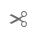

# Edición del contenido de la página con el editor de páginas de AEM {#edit-content}

El editor de páginas de AEM es una potente herramienta para crear el contenido de una página. Aprenda a utilizarlo para arrastrar y soltar contenido y editar contenido in situ.

## Información general {#overview}

Hay tres acciones básicas que puede realizar en el editor de páginas para editar el contenido:

1. [Agregando nuevos componentes](#adding-components) arrastrándolos y soltándolos en la página.
1. [Agregando nuevos recursos](#adding-asset) arrastrándolos y soltándolos en la página.
1. [Editando componentes in situ](#edit-in-place) que ya existen en la página.

El editor de páginas de AEM proporciona una interfaz de usuario intuitiva para realizar estas tareas, además de dar acceso a funciones más avanzadas.

Además, el editor le permite organizar el contenido existente en su página permitiéndole lo siguiente

* [Mover componentes](#moving-components)
* [Editar diseño del componente](#editing-component-layout)
* [Editar herencia del componente](#inherited-components)

>[!NOTE]
>
>El equipo del proyecto puede personalizar el editor si es necesario. Consulte [Personalización de la creación de páginas](/help/implementing/developing/extending/page-authoring.md) para obtener más información.

## Agregando componentes {#adding-components}

Puede arrastrar y soltar nuevos componentes en su página seleccionándolos en el [explorador de componentes del panel lateral](/help/sites-cloud/authoring/page-editor/editor-side-panel.md#components-browser) y soltándolos en un marcador de posición de componente.

### Marcador de posición de componente {#component-placeholder}

El marcador de posición de componente es un indicador que muestra dónde se colocará un componente cuando lo suelte. Tiene dos apariencias.

* Al añadir un componente nuevo a la página (arrastrando desde el explorador de componentes), aparecerá como un cuadro gris con detalles del componente que está colocando.

  

* Al [mover un componente existente](#movging-components), aparecerá como un cuadrado azul.

  

En ambos casos, el destino seleccionado aparecerá como un contorno azul debajo del componente que está arrastrando. El destino si el componente se va a colocar en el momento de su lanzamiento.

### Añadir un componente desde el navegador de componentes {#adding-a-component-from-the-components-browser}

Puede seleccionar un componente nuevo mediante el [navegador de componentes](/help/sites-cloud/authoring/page-editor/editor-side-panel.md#components-browser). El [marcador de posición de componente](#component-placeholder) le muestra dónde está colocando el componente.

1. Asegúrese de que el editor de páginas está en [**Editar** modo](/help/sites-cloud/authoring/page-editor/introduction.md#mode-selector).
1. Abra el [navegador de componentes](/help/sites-cloud/authoring/page-editor/editor-side-panel.md#components-browser).
1. Arrastre el componente requerido a la [posición requerida](#component-placeholder) y suéltelo.
1. [Editar](#edit-content) el componente recién colocado.

>[!NOTE]
>
>En un dispositivo móvil, el explorador de componentes llenará toda la pantalla. Cuando comience a arrastrar un componente, el explorador se cerrará para volver a mostrar la página, de modo que pueda colocarlo.

### Adición de un componente desde el sistema de párrafos {#adding-a-component-from-the-paragraph-system}

Puede agregar un componente nuevo mediante el marcador de posición **Arrastrar componentes aquí** del sistema de párrafos:

1. Asegúrese de que el editor de páginas está en [**Editar** modo](/help/sites-cloud/authoring/page-editor/introduction.md#mode-selector).
1. Existen dos formas de seleccionar y añadir un componente nuevo desde el sistema de párrafos:

   * Seleccione la opción **Insertar componente** (+) de la barra de herramientas de un componente existente o del cuadro **Arrastrar componentes aquí**.

     

   * Si está en un dispositivo de escritorio, puede hacer doble clic en el cuadro **Arrastrar componentes aquí**.

1. Se abre el cuadro de diálogo **Insertar nuevo componente** para que pueda seleccionar el componente requerido. Toque o haga clic en el componente que desee añadir.

   * Utilice los filtros de búsqueda para encontrar el componente.
   * Utilice el icono de información situado junto a los nombres de los componentes para obtener más información sobre el componente.

   

1. El componente seleccionado se añade al destino seleccionado. [Edite](#edit-content) el componente como sea necesario.

## Agregar un recurso {#adding-asset}

También puede añadir un componente nuevo a la página arrastrando un recurso desde el [explorador de recursos](/help/sites-cloud/authoring/page-editor/editor-side-panel.md#assets-browser). Esto crea automáticamente un componente del tipo adecuado (y que contiene el recurso).

Puede configurar este comportamiento en su instalación. Consulte el documento [Guía de referencia de componentes](/help/implementing/developing/components/reference.md#component-placeholders) para obtener más información.

Para crear un componente arrastrando uno de los tipos de activo anteriores:

1. Asegúrese de que la página se encuentra en el modo de [**edición**.](/help/sites-cloud/authoring/page-editor/introduction.md#mode-selector)
1. Abra el [explorador de recursos](/help/sites-cloud/authoring/page-editor/editor-side-panel.md#assets-browser).
1. Arrastre el recurso en cuestión hasta la posición deseada. El [marcador de posición de componente](#component-placeholder) le muestra dónde está colocado el componente y un destino mostrará dónde se insertará.
1. Libere el recurso en el destino. Se crea un componente, adecuado para el tipo de recurso, en la ubicación requerida que contiene el recurso seleccionado.
1. [Editar](#edit-content) el componente si es necesario.

>[!NOTE]
>
>En un dispositivo móvil, el navegador de recursos ocupará toda la pantalla. Una vez que comience a arrastrar un recurso, el explorador se cerrará para volver a mostrar la página y poder colocarlo.

Si al examinar los recursos descubre que necesita realizar alguna modificación rápida en alguno de ellos, puede iniciar el [editor de recursos](/help/assets/manage-digital-assets.md) directamente desde el explorador haciendo clic en el icono de edición que hay junto al nombre del recurso.

## Edición de componentes in situ {#edit-in-place}

Al seleccionar un componente, se abre la barra de herramientas de componentes. Esto proporciona acceso a varias acciones que se pueden realizar en el componente.

Las acciones disponibles en la barra de herramientas de componentes son apropiadas para el componente seleccionado. Puede ver más o menos en función del componente seleccionado y pueden describirse o no aquí.

* **Editar** le permite modificar el contenido del componente, a menudo in situ. Su comportamiento depende del componente.

  Botón 

* **Configurar** le permite cambiar algunos parámetros del componente que no están directamente relacionados con su contenido, normalmente en un cuadro de diálogo. Su comportamiento depende del componente.

  

* **Copiar** copia el componente en el portapapeles para pegarlo en otro lugar. El componente original permanece sin cambios.

  

* **Cortar** copia el componente en el portapapeles. Se quitará el componente original.

  

* **Eliminar** elimina el componente de la página con su confirmación.

  

* **Insertar componente** abre el cuadro de diálogo para [agregar un componente nuevo](#adding-a-component-from-the-paragraph-system).

  

* **Pegar** pega el componente del portapapeles en la página. Si el original permanece, depende de si usó **Copiar** o **Cortar**.

   * Puede pegar componentes en la misma página o en otra distinta.
   * Si pega contenido en otra página que ya estaba abierta antes de la operación de cortar/pegar, debe actualizar la página para ver el contenido que se pegó.
   * El elemento se pegará sobre el elemento en el que seleccione la acción de pegar.
   * La acción Pegar se muestra únicamente si hay contenido en el portapapeles.

  

* **Grupo** le permite seleccionar varios componentes a la vez. En un dispositivo de escritorio puede conseguir lo mismo haciendo **Control + clic** o **Comando + clic**.

  

* **Principal** selecciona el componente principal del componente seleccionado.

  

* **Diseño** le permite modificar el [diseño](#editing-component-layout) del componente seleccionado.

   * Esta opción se aplica únicamente al componente seleccionado y no activa el [modo de diseño](/help/sites-cloud/authoring/page-editor/introduction.md#mode-selector) para toda la página.

  

* **Convertir en una variación de fragmento de experiencia** le permite crear un [fragmento de experiencia](/help/sites-cloud/authoring/fragments/content-fragments.md) a partir del componente seleccionado o agregarlo a un fragmento de experiencia existente.

  

### Cuadro de diálogo de edición de contenido   {#component-edit-dialog}

Algunos componentes ofrecen opciones de edición adicionales más allá de lo que está disponible in situ. Puede abrir el cuadro de diálogo de edición de un componente mediante el icono [Editar (lápiz) de la barra de herramientas del componente](#component-toolbar) para acceder a opciones de configuración adicionales.

Las opciones de edición exactas dependerán del componente. Para algunos componentes [algunas acciones solo estarán disponibles en el modo de pantalla completa](#edit-content-full-screen-mode). Por ejemplo:

* Componente de texto

  

* Componente de imagen

  

### Editar componentes en modo de pantalla completa {#edit-content-full-screen-mode}

Muchos componentes ofrecen un modo de pantalla completa para la edición al que se puede acceder con este botón.

La edición de pantalla completa permite mostrar más opciones de edición que el editor local, como para el componente de imagen.

Use el botón **Minimizar** para salir del modo de pantalla completa.

## Mover componentes {#moving-components}

Para mover un componente:

1. Seleccione el componente que desea mover pulsando y manteniendo pulsado o pulsando y manteniendo pulsado.
1. Arrastre el componente a la nueva ubicación.

   * El editor de páginas indica la posición del componente con un [marcador de posición](#component-placeholder) y dónde se puede colocar el párrafo con un destino.

   

1. Colóquelo en la ubicación deseada.

>[!TIP]
>
>También puede utilizar [Cortar y pegar](#component-toolbar) para mover un componente.

## Edición del diseño del componente {#editing-component-layout}

En vez de pasar repetidamente de la edición al [modo de diseño](/help/sites-cloud/authoring/page-editor/responsive-layout.md) para ajustar un componente, puede seleccionar la acción **Diseño** del mismo. Podrá cambiar su diseño sin tener que abandonar el modo de edición, por lo que ahorrará tiempo.

1. En el modo **Editar** de la consola Sites, seleccione un componente para mostrar la barra de herramientas del componente.

1. Seleccione la acción **Diseño** para ajustar el diseño del componente.

   

1. Una vez seleccionada la acción Diseño, puede modificar el diseño del componente como lo haría en [modo de diseño](/help/sites-cloud/authoring/page-editor/responsive-layout.md#defining-layouts-layout-mode).

   * Se muestran los controles de cambio de tamaño del componente.
   * La barra de herramientas del emulador aparece en la parte superior de la pantalla.
   * En la barra de herramientas del componente se muestran las acciones de diseño en vez de las acciones de edición normales.

   

1. Después de realizar los cambios de diseño necesarios, toque o haga clic en el botón **Cerrar** del menú de acción del componente para detener la modificación del diseño y la barra de herramientas del componente vuelve a su estado de edición normal.

   

>[!TIP]
>
>El ámbito de la acción Diseño se reduce al componente seleccionado. Por ejemplo, si está editando el diseño de un componente y hace clic en otro componente, se muestra la barra de herramientas de edición estándar del componente recién seleccionado (no la barra de herramientas de diseño) y desaparecen los controladores de cambio de tamaño y la barra de herramientas del emulador.
>
>Si necesita editar el diseño general de la página y modificar múltiples componentes, cambie al [modo de diseño](/help/sites-cloud/authoring/page-editor/responsive-layout.md).

## Edición de herencia de componentes {#inherited-components}

La herencia es el mecanismo por el que el contenido se puede vincular de modo que, al cambiar uno, se cambia automáticamente el otro. Los componentes heredados pueden ser el producto de distintos escenarios, como por ejemplo:

* [Administración de varios sitios](/help/sites-cloud/administering/msm/overview.md)
* [Lanzamientos](/help/sites-cloud/authoring/launches/overview.md)

Puede cancelar y volver a habilitar la herencia. Según el componente, estas opciones están disponibles en la barra de herramientas del componente, si el componente forma parte de una Live Copy o Launch.

* **Cancelar herencia**

  

* **Volver a habilitar la herencia** si la herencia ya se ha cancelado

  

* **El despliegue** también está disponible en el modelo o en el origen de Live Copy

  
