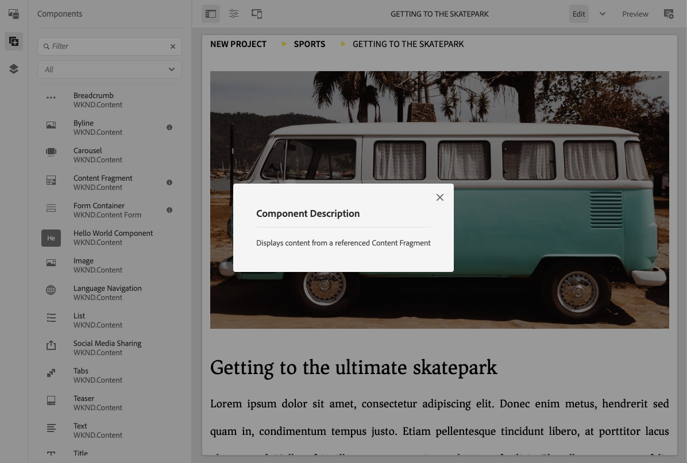

# Panel lateral del editor de páginas {#side-panel}

AEM Aprenda a utilizar el panel lateral en el editor de sitios de para agregar componentes y recursos a la página.

## Modos del panel lateral {#modes}

Siempre se puede acceder al panel lateral en el editor de páginas tocando o haciendo clic en el icono **Alternar panel lateral** en la barra de herramientas del editor de páginas.

Cuando abra el panel lateral, se deslizará para abrirse de izquierda a derecha y podrá seleccionar entre tres pestañas importantes:

* [Explorador de componentes](#components-browser) para agregar contenido nuevo a su página
* [Explorador de recursos](#assets-browser) para agregar nuevos recursos a su página
* [El árbol de contenido](#content-tree) para examinar la estructura de su página

## Navegador de componentes   {#components-browser}

AEM [Componentes](/help/implementing/developing/components/overview.md) son los componentes básicos que se usan para crear contenido con el editor de páginas de la página de la. Puede colocar varios componentes en una página y configurar sus opciones para crear la página de contenido.

El navegador de componentes muestra todos los componentes que se pueden utilizar en la página actual. Se pueden arrastrar a la ubicación adecuada y editarse para añadir contenido.

Pulse o haga clic en la ficha **Componentes** del panel lateral para acceder al explorador **Componentes**.

El aspecto y el control dependerán del tipo de dispositivo que esté utilizando.

### Dispositivo móvil {#mobile-device-components-browser}

Al abrir el navegador de componentes en un dispositivo móvil, cubre completamente la página que se está editando.

Para añadir un componente a su página, seleccione y arrastre el componente y muévalo hacia la derecha. El navegador de componentes se cerrará para mostrar de nuevo la página, donde puede colocar el componente.

>[!NOTE]
>
>Se detectará un dispositivo móvil cuando la anchura sea inferior a 1024 píxeles.

### Dispositivo de escritorio {#desktop-device-components-browser}

Al abrir el explorador de componentes en un dispositivo de escritorio, aparece en la parte izquierda de la ventana.

Para añadir un componente a la página, haga clic en el componente requerido y arrástrelo a la ubicación requerida.

### Uso del navegador de componentes {#using-component-browser}

Los componentes del explorador **Components** están representados por:

* Nombre del componente
* Grupo de componentes (en gris)
* Icono o abreviatura
   * Los iconos de los componentes estándar son monocromos.
   * Las abreviaturas siempre están formadas por los dos primeros caracteres del nombre del componente.

Desde la barra de herramientas superior del explorador de **componentes**, puede realizar las siguientes acciones:

* Filtrar componentes por su nombre.
* Restringir la visualización a un grupo específico mediante la selección desplegable.

Para obtener una descripción más detallada del componente, puede seleccionar el icono de información junto al componente en el explorador **Componentes** (si está disponible). Por ejemplo, para el **fragmento de contenido**:

Para obtener información más detallada acerca de los componentes disponibles, consulte la [Consola de componentes.](/help/sites-cloud/authoring/components-console.md)

## Navegador de recursos {#assets-browser}

El explorador **Assets** muestra todos los [recursos](/help/assets/overview.md) que se pueden usar en la página actual.

Toque o haga clic en la ficha **Assets** del panel lateral para examinar los recursos.

El desplazamiento infinito se utiliza para expandir la lista de recursos según sea necesario mientras se desplaza.

El aspecto y el control dependerán del tipo de dispositivo que esté utilizando:

### Dispositivo móvil {#mobile-device-assets-browser}

Al abrir el explorador de recursos en un dispositivo móvil, cubre completamente la página que se está editando.

Para añadir un recurso a su página, seleccione y arrastre el recurso necesario y, a continuación, muévalo hacia la derecha. El explorador de recursos se cerrará para mostrar de nuevo la página, donde puede agregar el recurso al componente requerido.

>[!NOTE]
>
>Se detectará un dispositivo móvil cuando la anchura sea inferior a 1024 píxeles.

### Dispositivo de escritorio {#desktop-device-assets-browser}

Al abrir el explorador de recursos en un dispositivo de escritorio, se abre en la parte izquierda de la ventana.

Para añadir un recurso a la página, seleccione el recurso necesario y arrástrelo a la ubicación o al componente necesarios.

### Uso del explorador Assets {#using-assets-browser}

Para añadir un recurso a la página, selecciónelo y arrástrelo a la ubicación deseada. Esto puede ser lo siguiente:

* Un componente existente del tipo adecuado.
   * Por ejemplo, puede arrastrar un recurso de tipo imagen hacia un componente de imagen.
* Un [marcador de posición](/help/sites-cloud/authoring/page-editor/edit-content.md#component-placeholder) en el sistema de párrafos para crear un componente del tipo apropiado.
   * Por ejemplo, puede arrastrar un recurso de tipo imagen al sistema de párrafos para crear un componente de imagen.

>[!NOTE]
>
>El proceso de arrastrar y soltar recursos está disponible para recursos y tipos de componentes específicos. Consulte [Inserción de un componente con el explorador de recursos](/help/sites-cloud/authoring/page-editor/edit-content.md#adding-a-component-from) para obtener más información.

Desde la barra de herramientas superior del explorador de recursos, puede filtrar los recursos por lo siguiente:

* Nombre
* Ruta
* Tipos de recursos como imágenes, vídeos, documentos, párrafos, fragmentos de contenido y fragmentos de experiencias.
* Características del recurso como orientación y estilo.
   * Disponible solo para determinados tipos de recursos

Si necesita realizar rápidamente un cambio en un recurso, puede iniciar el [editor de recursos](/help/assets/manage-digital-assets.md) directamente desde el explorador de recursos haciendo clic en el icono de edición que se muestra al lado del nombre del recurso.

## Árbol de contenido {#content-tree}

El **Árbol de contenido** proporciona una descripción general de todos los componentes de la página en una jerarquía para que pueda ver de un vistazo cómo está compuesta la página.

>[!NOTE]
>
>Si edita una página en un dispositivo móvil, el árbol de contenido no está disponible (si el valor de la anchura del explorador es inferior a 1024 píxeles).

Pulse o haga clic en la ficha **Árbol de contenido** para acceder al árbol de contenido.

Cuando se abre, puede ver una representación en forma de árbol de la página o plantilla, de modo que sea más fácil comprender cómo se estructura jerárquicamente su contenido. Además, en una página compleja, resulta más fácil saltar entre los componentes de la página.

Una página puede estar compuesta fácilmente por muchos componentes del mismo tipo, por lo que el árbol de contenido muestra un texto descriptivo (en gris) después del nombre del tipo de componente (en negro). El texto descriptivo viene de las propiedades comunes del componente, como el título o el texto.

Los tipos de componente se muestran en el idioma del usuario, mientras que el texto de descripción del componente proviene del idioma de la página.

Si hace clic en las comillas angulares que aparecen junto a un componente, se contraerá o expandirá ese nivel.

Al hacer clic en el componente, se resaltará el componente en el editor de páginas. Las acciones disponibles dependerán del estado de la página. Por ejemplo:

## Una página básica {#basic-page}

Los componentes de una página básica tienen las opciones habituales.

Si el componente en el que hace clic en el árbol se puede editar, aparecerá un icono de llave inglesa a la derecha del nombre. Al hacer clic en este icono, se inicia el cuadro de diálogo de edición del componente.

### Una Live Copy {#live-copy}

Una página que forma parte de [livecopy](/help/sites-cloud/administering/msm/overview.md), donde los componentes se heredan de otra página, tendrá opciones diferentes.

## Explorador de contenido asociado {#associated-content-browser}

Si su página contiene fragmentos de contenido, también tiene acceso al [explorador de contenido asociado.](/help/sites-cloud/authoring/fragments/content-fragments.md#using-associated-content)
