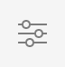

# Editor de página de AEM {#editing-page-content}

Una vez creada la página en la consola [**Sites**](/help/sites-cloud/authoring/sites-console/introduction.md), podrá editar el contenido de la página con el editor de páginas de AEM, una potente herramienta para crear contenido.

>[!NOTE]
>
>Al editar una página en la consola [**Sites**](/help/sites-cloud/authoring/sites-console/introduction.md), la consola abrirá el editor apropiado para la [plantilla](/help/sites-cloud/authoring/page-editor/templates.md) de la página, ya sea el editor de páginas descrito en este documento o el [Editor universal](/help/sites-cloud/authoring/universal-editor/authoring.md).

>[!NOTE]
>
>Su cuenta necesita los derechos de acceso y permisos adecuados para editar páginas. Póngase en contacto con el administrador del sistema si no tiene permisos.

{{traditional-aem}}

## Orientación {#orientation}

El editor de páginas de AEM está compuesto principalmente por tres secciones:

1. [Barra de herramientas](#toolbar): La barra de herramientas le permite cambiar rápidamente el modo de página y obtener acceso a la configuración de página adicional.
1. [Panel lateral](#side-panel): el panel lateral le proporciona acceso a los componentes y recursos de la página, así como a otras herramientas de creación.
1. [Editor](#editor): el editor es el lugar donde se realizan los cambios en el contenido y se obtiene la vista previa.

El contenido se añade empleando los [componentes](/help/sites-cloud/authoring/components-console.md) (según el tipo de contenido) que pueden arrastrarse a la página. Después estos se pueden editar local, mover o eliminar.

### Barra de herramientas {#page-toolbar}

La barra de herramientas de la página ofrece acceso a la funcionalidad adecuada al contexto, en función de la configuración de la página.

#### Panel lateral {#side-panel-button}

Esto abre o cierra el [panel lateral](/help/sites-cloud/authoring/page-editor/editor-side-panel.md), que contiene el Explorador de recursos, el Explorador de componentes y el Árbol de contenido.

#### Información de la página {#page-information}

Esto proporciona acceso a información detallada de la página, incluidos detalles de página y acciones que se pueden realizar en la página, como ver y editar información de página, ver propiedades de página y publicar/cancelar la publicación de la página.

**Información de página** abre un menú desplegable que proporciona detalles sobre la última edición y la última publicación de la página seleccionada. Hay acciones adicionales disponibles según las características de la página, su sitio y la instancia.

* [Abrir propiedades](/help/sites-cloud/authoring/sites-console/page-properties.md)
* [Desplegar página](/help/sites-cloud/administering/msm/overview.md#msm-from-the-ui)
* [Iniciar flujo de trabajo](/help/sites-cloud/authoring/workflows/applying.md#starting-a-workflow-from-the-page-editor)
* [Bloquear página](/help/sites-cloud/authoring/page-editor/introduction.md#locking-unlocking)
* [Publicar página](/help/sites-cloud/authoring/sites-console/publishing-pages.md#publishing-pages-1)
* [Cancelar la publicación de la página](/help/sites-cloud/authoring/sites-console/publishing-pages.md#unpublishing-pages)
* [Editar plantilla](/help/sites-cloud/authoring/page-editor/templates.md)
* [Ver como aparece publicado](/help/sites-cloud/authoring/page-editor/introduction.md#view-as-published)
* [Ver en administración](/help/sites-cloud/authoring/basic-handling.md#viewing-and-selecting-resources)
* [Ayuda](/help/sites-cloud/authoring/basic-handling.md#accessing-help)
* [Promocionar lanzamiento](/help/sites-cloud/authoring/launches/promoting.md) (solo si la página es nueva)

Además, **Información de página** puede proporcionar acceso a análisis y recomendaciones, cuando proceda.

#### Emulador {#emulator}

Esto activa o desactiva la barra de herramientas del emulador [1&rbrace;, que se usa para emular el aspecto de la página en otro dispositivo. ](/help/sites-cloud/authoring/page-editor/responsive-layout.md#selecting-a-device-to-emulate) Esto se activa automáticamente en el modo de diseño.

#### ContextHub {#context-hub}

Se abrirá [ContextHub](/help/sites-cloud/authoring/personalization/contexthub.md). Solo está disponible en el modo **Vista previa**.

#### Título de página {#page-title}

Este es el título de la página, en mayúsculas como información.

#### Selector de modo {#mode-selector}

El selector de modo muestra el [modo](/help/sites-cloud/authoring/page-editor/introduction.md#mode-selector) actual y le permite seleccionar otro modo, como edición, diseño, deformación de tiempo o segmentación.

Al editar una página existen varios modos que permiten realizar diferentes acciones:

* [Editar](/help/sites-cloud/authoring/page-editor/edit-content.md): modo que se utilizará al editar el contenido de la página
* [Diseño](/help/sites-cloud/authoring/page-editor/responsive-layout.md): le permite crear y editar su diseño interactivo en función del dispositivo (si la página está basada en un contenedor de diseños)
* [Segmentación](/help/sites-cloud/authoring/personalization/targeted-content.md): mejora la relevancia del contenido mediante la segmentación y efectuando mediciones en todos los canales
* [Deformación de tiempo](/help/sites-cloud/authoring/sites-console/page-versions.md#timewarp): ver el estado de una página en un momento determinado
* [Estado de Live Copy](/help/sites-cloud/authoring/page-editor/introduction.md#live-copy-status): permite obtener una descripción general rápida del estado de Live Copy y de los componentes que se heredan o no
* [Modo de desarrollador](/help/implementing/developing/tools/developer-mode.md)
* [Vista previa](/help/sites-cloud/authoring/page-editor/introduction.md#previewing-pages): vea la página tal como se muestra en el entorno de publicación; o para navegar mediante vínculos en el contenido
* [Anotar](/help/sites-cloud/authoring/page-editor/annotations.md) - Agregar o ver anotaciones en la página

>[!NOTE]
>
>* Según las características de la página, es posible que algunos modos no estén disponibles.
>* El acceso a algunos modos requiere los permisos o privilegios adecuados.
>* El modo de desarrollador no está disponible en dispositivos móviles debido a las restricciones de espacio.
>* Hay un [método abreviado de teclado](/help/sites-cloud/authoring/sites-console/keyboard-shortcuts.md) (`Ctrl-Shift-M`) para alternar entre **Vista previa** y el modo seleccionado actualmente (por ejemplo, **Editar**, **Diseño**, etc.).

#### Vista previa {#preview}

El botón **Vista previa** habilita el [modo de vista previa](#preview-mode), y muestra la página tal como aparecerá cuando se publique.

#### Anotar {#annotate}

El modo **Anotar** le permite agregar [anotaciones](/help/sites-cloud/authoring/page-editor/annotations.md) a la página al revisar una página. Después de la primera anotación, el icono cambia a un número que indica el número de anotaciones que tiene la página.

### Panel lateral {#side-panel}

El panel lateral proporciona acceso a tres pestañas diferentes.

* El navegador de componentes para añadir contenido nuevo a su página.
* Explorador de recursos para agregar nuevos recursos a la página
* El árbol de contenido para examinar la estructura de la página

Consulte el documento [Panel lateral del editor de páginas](/help/sites-cloud/authoring/page-editor/editor-side-panel.md) para obtener más información.

### Editor {#editor}

En el editor es donde se realizan los cambios directamente en el contenido de la página. La página se procesa como lo vería y puede arrastrar y soltar contenido nuevo mediante los exploradores de recursos o componentes del panel lateral, así como editar contenido in situ.

## Edición de contenido {#editing-content}

Ahora que comprende el editor de páginas, está listo para editar su contenido.

Consulte el documento [Edición de contenido con el editor de páginas de AEM](/help/sites-cloud/authoring/page-editor/edit-content.md) para obtener más información.

## Notificación de estado {#status-notification}

Si una página forma parte de [flujo de trabajo](/help/sites-cloud/authoring/workflows/overview.md) o de varios flujos de trabajo, esta información se muestra en una barra de notificación debajo de la barra de herramientas al editar la página.

>[!NOTE]
>
>La barra de estado solo se puede ver para las cuentas de usuario con los privilegios adecuados.

La notificación enumera el flujo de trabajo que se ejecuta en la página. Si el usuario participa en el paso del flujo de trabajo actual, también dispondrá de opciones que [tengan efecto sobre el estado del flujo de trabajo](/help/sites-cloud/authoring/workflows/participating.md) y podrá obtener más información sobre el flujo de trabajo, como la siguiente:

* **Completar**: abre el cuadro de diálogo **Completar elemento de trabajo**.
* **Delegar**: abre el cuadro de diálogo **Completar elemento de trabajo**.
* **Ver detalles**: abre la ventana **Detalles** del flujo de trabajo.

Completar y delegar los pasos del flujo de trabajo mediante la barra de notificaciones funciona igual que al [participar en flujos de trabajo](/help/sites-cloud/authoring/workflows/participating.md) desde la bandeja de entrada de notificaciones.

Si la página está sujeta a varios flujos de trabajo, el número de los mismos se muestra en el extremo derecho de la notificación, junto a dos botones de flecha que permiten desplazarse por los flujos de trabajo.

## Estado de Live Copy   {#live-copy-status}

El modo de página **Estado de Live Copy** le proporciona una visión general rápida del estado de Live Copy y de los componentes que se heredan o no:

* Borde verde: heredado
* Borde rosa: se ha cancelado la herencia

Por ejemplo:

## Previsualizar páginas {#previewing-pages}

Existen dos métodos para visualizar la vista previa de una página:

* [Modo de vista previa](#preview-mode): una vista previa rápida in situ
* [Ver como publicado](#view-as-published): vista previa completa que abre la página en una nueva pestaña

>[!TIP]
>
>* Los vínculos del contenido son visibles, pero no se puede obtener acceso a ellos desde el modo **Editar**.
>* Utilice cualquiera de las opciones de vista previa si desea navegar mediante sus vínculos.
>* Utilice el [atajo de teclado](/help/sites-cloud/authoring/sites-console/keyboard-shortcuts.md) `Ctrl-Shift-M` para cambiar entre la vista previa y el último modo seleccionado.

>[!NOTE]
>
>La cookie del modo WCM está establecida para las dos opciones.

### Modo de vista previa {#preview-mode}

Al editar contenido, puede obtener una vista previa de la página mediante el modo de vista previa. Este modo:

* Oculta los distintos mecanismos de edición para ofrecerle una vista rápida del aspecto que tendrá la página cuando se publique.
* Permite utilizar vínculos para desplazarse.
* **No** actualiza el contenido de la página.

Durante la creación, el modo de vista previa está disponible mediante el icono situado en la parte superior derecha del editor de páginas:

### Ver como aparece publicado {#view-as-published}

La opción **Ver tal y como aparece publicado** está disponible en el menú [información de la página](#page-information). Esta opción abre la página en una nueva pestaña, actualiza el contenido y muestra la página exactamente como aparecerá en el entorno de publicación.

## Bloquear y desbloquear una página {#locking-unlocking}

AEM permite bloquear páginas para que nadie más pueda editar su contenido. El bloqueo es útil cuando realiza numerosas ediciones en una página específica o cuando necesita congelar una página durante un corto tiempo.

1. Seleccione el icono **Información de la página** para abrir el menú.
1. Seleccione la opción **bloquear página**.

Una vez bloqueado, se muestra un símbolo de bloqueo en la barra de herramientas del editor de páginas.

Desbloquear una página es muy similar a [bloquear la página](#locking-a-page). Una vez bloqueada la página, las opciones de bloqueo se sustituyen por las acciones de desbloqueo.

>[!CAUTION]
>
>* El bloqueo de páginas se puede realizar al suplantar a un usuario. Sin embargo, una página bloqueada de este modo solo se puede desbloquear (por clientes) utilizando el usuario que se ha suplantado.
>* Las páginas no se pueden desbloquear al suplantar al usuario que ha bloqueado la página.
>* Si el usuario que ha bloqueado la página no está disponible para desbloquearla, póngase en contacto con Asistencia al cliente para evaluar las opciones para quitar el bloqueo.

## Deshacer y rehacer modificaciones de páginas {#undoing-and-redoing-page-edits}

Los iconos siguientes le permiten deshacer o rehacer una acción. Se muestran en la barra de herramientas cuando corresponde:

>[!TIP]
>
>* También dispone del [atajo de teclado](/help/sites-cloud/authoring/sites-console/keyboard-shortcuts.md) `Ctrl-Z` para deshacer las acciones de edición de página.
>* También dispone del atajo de teclado `Ctrl-Y` para rehacer las acciones de edición de página.

>[!NOTE]
>
>Consulte el documento [Limitaciones de deshacer y rehacer](/help/sites-cloud/authoring/page-editor/undo-redo.md) para obtener todos los detalles de las posibilidades de deshacer y rehacer ediciones de página.
