# Configuración de la segmentación con ContextHub{#configuring-segmentation-with-contexthub}

La segmentación es una consideración clave al crear una campaña. Consulte [Información acerca de la segmentación](segmentation.md) para obtener información sobre cómo funciona la segmentación y los términos clave.

En función de la información que ya haya recopilado acerca de los visitantes del sitio y los objetivos que desee lograr, defina los segmentos y las estrategias necesarios para el contenido de destino.

Estos segmentos se utilizan para proporcionar a un visitante contenido dirigido específicamente. Las [Actividades](activities.md) definidas aquí se pueden incluir en cualquier página y definir para qué segmento de visitante se aplica el contenido especializado.

AEM Le permite personalizar fácilmente las experiencias de los usuarios. También le permite verificar los resultados de las definiciones de segmentos.

## Acceso a segmentos {#accessing-segments}

La consola [Audiencies](audiences.md) se utiliza para administrar segmentos para ContextHub, así como públicos para su cuenta de Adobe Target. Esta documentación cubre la administración de segmentos para ContextHub.

Para acceder a sus segmentos en la navegación global, seleccione **Navegación > Personalización > Audiencias**. Seleccione la configuración (por ejemplo, WKND Site) para ver los segmentos:


## Editor de segmentos {#segment-editor}

<!--The **Segment Editor** lets you easily modify a segment. To edit a segment, select a segment in the [list of segments](/help/sites-administering/segmentation.md#accessing-segments) and click the **Edit** button.-->
El **Editor de segmentos** le permite modificar fácilmente un segmento. Para editar un segmento, seleccione uno en la lista de segmentos y haga clic en el botón **Editar**.

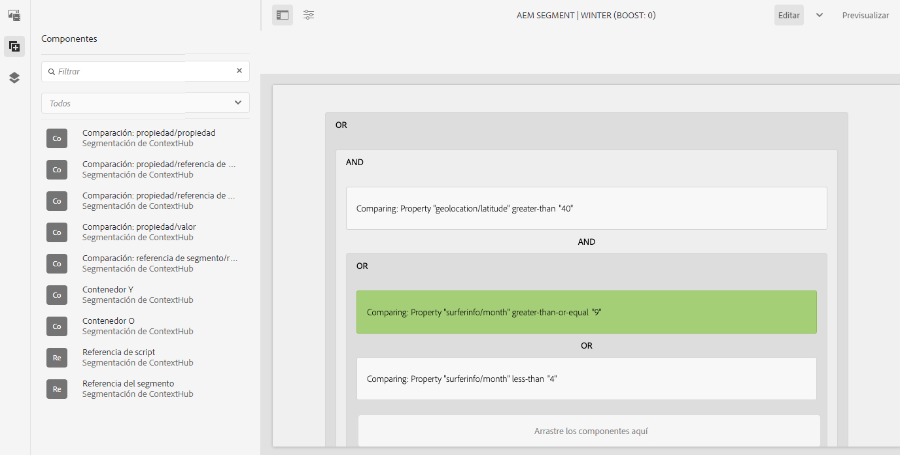

Con el explorador de componentes, puede añadir contenedores **AND** y **OR** para definir la lógica del segmento. A continuación, agregue componentes adicionales para comparar propiedades y valores o secuencias de comandos de referencia y otros segmentos para definir los criterios de selección (consulte [Creación de un nuevo segmento](#creating-a-new-segment)) y el escenario exacto para seleccionar el segmento.

Cuando toda la instrucción se evalúa como verdadera, el segmento se ha resuelto. En caso de que se apliquen varios segmentos, el factor **Aumento** también se utiliza. Consulte [Creación de un nuevo segmento](#creating-a-new-segment) para obtener más información sobre el factor de ampliación.

>[!CAUTION]
>
>El editor de segmentos no comprueba la existencia de referencias circulares. Por ejemplo, el segmento A hace referencia a otro segmento B, que a su vez hace referencia al A. Debe asegurarse de que los segmentos no contengan ninguna referencia circular.

### Contenedores {#containers}

Los siguientes contenedores están disponibles de forma predeterminada y le permiten agrupar comparaciones y referencias para llevar a cabo una evaluación boolean. Se pueden arrastrar desde el explorador de componentes al editor. Consulte la siguiente sección, [Uso de contenedores AND y OR](#using-and-and-or-containers), para obtener más información.

|  |  |
|---|---|
| Contenedor AND | El operador boolean AND |
| Contenedor OR | El operador boolean OR |

### Comparaciones {#comparisons}

Las siguientes comparaciones de segmentos están disponibles y listas para usarse para evaluar las propiedades de los segmentos. Se pueden arrastrar desde el explorador de componentes al editor.

|  |  |
|---|---|
| Propiedad-Valor | Compara una propiedad de un almacén con un valor definido |
| Propiedad-Propiedad | Compara una propiedad de un almacén con otra propiedad |
| Propiedad-Referencia de segmento | Compara una propiedad de un almacén con otro segmento al que se hace referencia |
| Propiedad-Referencia de script | Compara una propiedad de un almacén con los resultados de un script |
| Referencia de script-Referencia de script | Compara un segmento al que se hace referencia con los resultados de un script |

>[!NOTE]
>
>Al comparar valores, si no se establece el tipo de datos de la comparación (es decir, se configura para la detección automática), el motor de segmentación de ContextHub simplemente comparará los valores como lo haría JavaScript. No transmite valores a sus tipos esperados, lo que puede llevar a resultados engañosos. Por ejemplo:
>
>`null < 30 // will return true`
>
>Por lo tanto, cuando [cree segmentos](#creating-a-new-segment), debe seleccionar un **tipo de datos** siempre que se conozcan los tipos de valores comparados. Por ejemplo:
>
>Al comparar la propiedad `profile/age`, ya sabe que el tipo comparado es un **número**, por lo que incluso si `profile/age` no está establecido, una comparación `profile/age` menor que 30 se devuelve **false**, como cabría esperar.

### Referencias {#references}

Las siguientes referencias están disponibles listas para usarse y para vincularse directamente a un script u otro segmento. Se pueden arrastrar desde el explorador de componentes al editor.

|  |  |
|---|---|
| Referencia del segmento | Evaluación del segmento al que se hace referencia |
| Referencia de script | Evalúe el script al que se hace referencia. Consulte la siguiente sección, [Uso de referencias de script](#using-script-references), para obtener más información. |

## Creación de un nuevo segmento {#creating-a-new-segment}

Para definir el nuevo segmento:

1. Después de [acceder a los segmentos](#accessing-segments), [vaya a la carpeta](#organizing-segments) donde desea crear el segmento.

1. Seleccione el botón **Crear** y seleccione **Crear segmento de ContextHub**.

   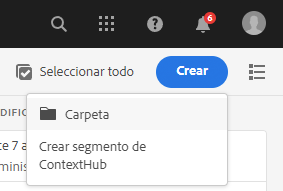

1. En el **Nuevo segmento de ContextHub**, escribe un título para el segmento y un valor de ampliación si es necesario y, a continuación, selecciona **Crear**.

   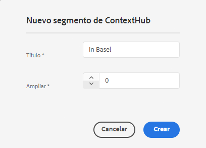

   Cada segmento tiene un parámetro de ampliación que se utiliza como factor de ponderación. Un número mayor indica que el segmento se selecciona con preferencia sobre un segmento con un número menor en las instancias en las que varios segmentos son válidos.

   * Valor mínimo: `0`
   * Valor máximo: `1000000`

1. Desde la consola de segmentos, edite el segmento creado para abrirlo en el editor de segmentos.
1. Arrastre una comparación o referencia al editor de segmentos que aparecerá en el contenedor AND predeterminado.
1. Seleccione dos veces la opción de configuración de la nueva referencia o segmento para editar los parámetros específicos. En este ejemplo, estamos probando personas en Basilea.

   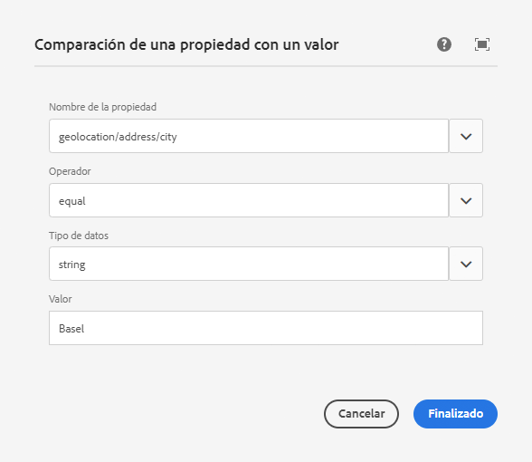

   Establezca siempre un **Tipo de datos** si es posible, para garantizar que las comparaciones se evalúen correctamente. Consulte [Comparaciones](#comparisons) para obtener más información.

1. Haga clic en **Listo** para guardar los cambios:
1. Agregue más componentes según sea necesario. Puede formular expresiones boolean utilizando los componentes de contenedor para las comparaciones AND y OR (consulte [Uso de los contenedores AND y OR](#using-and-and-or-containers) más abajo). Con el editor de segmentos puede eliminar componentes que ya no se necesitan o arrastrarlos a nuevas posiciones dentro de la instrucción.

### Uso de contenedores AND y OR {#using-and-and-or-containers}

Con los componentes de contenedor AND y OR, puede construir segmentos complejos en AEM. Al hacer esto, es práctico tener en cuenta algunos puntos básicos:

* El nivel superior de la definición es siempre el contenedor AND que se crea inicialmente. Esto no se puede cambiar, pero no afecta al resto de la definición del segmento.
* Asegúrese de que tenga sentido anidar el contenedor. Los contenedores pueden verse como los corchetes de su expresión boolean.

El siguiente ejemplo se utiliza para seleccionar visitantes que se consideran en nuestro grupo destinatario suizo:

```text
 People in Basel

 OR

 People in Zürich
```

Para empezar, coloque un componente contenedor OR dentro del contenedor AND predeterminado. Dentro del contenedor OR puede añadir la propiedad o los componentes de referencia.

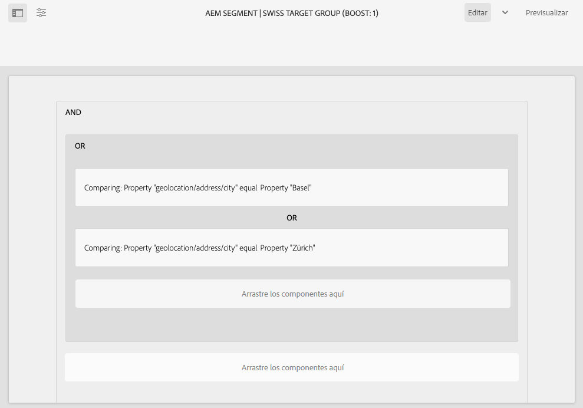

Puede anidar varios operadores AND y OR según sea necesario.

### Uso de referencias de secuencia de comandos {#using-script-references}

Mediante el componente Referencia de secuencia de comandos, la evaluación de una propiedad de segmento se puede delegar a una secuencia de comandos externa. Una vez que la secuencia de comandos está configurada correctamente, puede utilizarse como cualquier otro componente de una condición de segmento.

#### Definición de una secuencia de comandos para referencia {#defining-a-script-to-reference}

1. Agregar archivo a `contexthub.segment-engine.scripts` clientlib.
1. Implemente una función que devuelva un valor. Por ejemplo:

   ```javascript
   ContextHub.console.log(ContextHub.Shared.timestamp(), '[loading] contexthub.segment-engine.scripts - script.profile-info.js');
   
   (function() {
       'use strict';
   
       /**
        * Sample script returning profile information. Returns user info if data is available, false otherwise.
        *
        * @returns {Boolean}
        */
       var getProfileInfo = function() {
           /* let the SegmentEngine know when script should be re-run */
           this.dependOn(ContextHub.SegmentEngine.Property('profile/age'));
           this.dependOn(ContextHub.SegmentEngine.Property('profile/givenName'));
   
           /* variables */
           var name = ContextHub.get('profile/givenName');
           var age = ContextHub.get('profile/age');
   
           return name === 'Joe' && age === 123;
       };
   
       /* register function */
       ContextHub.SegmentEngine.ScriptManager.register('getProfileInfo', getProfileInfo);
   
   })();
   ```

1. Registre la secuencia de comandos con `ContextHub.SegmentEngine.ScriptManager.register`.

Si la secuencia de comandos depende de propiedades adicionales, la secuencia de comandos debería llamar a `this.dependOn()`. Por ejemplo, si la secuencia de comandos depende de `profile/age`:

```javascript
this.dependOn(ContextHub.SegmentEngine.Property('profile/age'));
```

#### Referencia a una secuencia de comandos {#referencing-a-script}

1. Crear segmento de ContextHub.
1. Agregar el componente **Referencia de secuencia de comandos** en el lugar deseado del segmento.
1. Abra el cuadro de diálogo de edición del componente **Referencia de secuencia de comandos**. Si está [configurado correctamente](#defining-a-script-to-reference), la secuencia de comandos debe estar disponible en la lista desplegable **Nombre de la secuencia de comandos**.

## Organización de segmentos {#organizing-segments}

Si tiene muchos segmentos, puede que sea difícil administrarlos como una lista plana. En estos casos, puede resultar útil crear carpetas para administrar los segmentos.

### Cree una nueva carpeta {#create-folder}

1. Después de [acceder a los segmentos](#accessing-segments), selecciona el botón **Crear** y selecciona **Carpeta**.

   

1. Proporcione un **Título** y **Nombre** para su carpeta.
   * El **Título** debe ser descriptivo.
   * El **nombre** se convierte en el nombre de nodo del repositorio.
      * Se genera automáticamente en función del título y se ajusta según las [convenciones de nomenclatura de AEM](/help/implementing/developing/introduction/naming-conventions.md).
      * Se puede modificar si es necesario.

   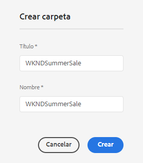

1. Seleccione **Crear**.

   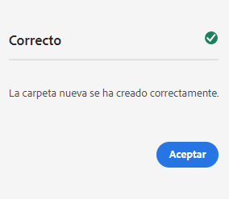

1. La carpeta aparece en la lista de segmentos.
   * La forma en que ordene las columnas afectará a dónde aparece la nueva carpeta en la lista.
   * Puede seleccionar los encabezados de columna para ajustar la ordenación.

     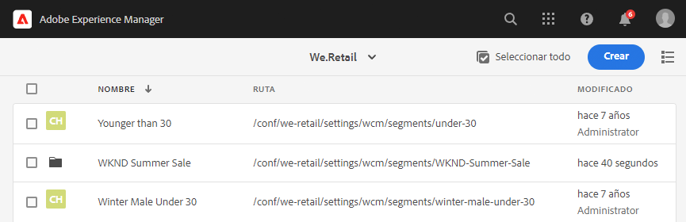

### Modificar carpetas existentes {#modify-folders}

1. Después de [acceder a los segmentos](#accessing-segments), seleccione la carpeta que desee modificar para seleccionarla.

   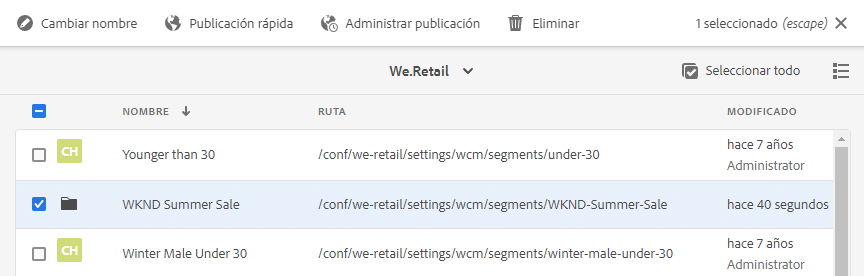

1. Seleccione **Rename** en la barra de herramientas para cambiar el nombre de la carpeta.

1. Proporcione un nuevo **Título de carpeta** y seleccione **Guardar**.

   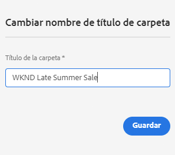

>[!NOTE]
>
>Al cambiar el nombre de las carpetas, solo se puede cambiar el título. No se puede cambiar el nombre.

### Eliminar una carpeta

1. Después de [acceder a los segmentos](#accessing-segments), seleccione la carpeta que desee modificar para seleccionarla.

   

1. Seleccione **Eliminar** en la barra de herramientas para eliminar la carpeta.

1. Un cuadro de diálogo presenta una lista de carpetas seleccionadas para su eliminación.

   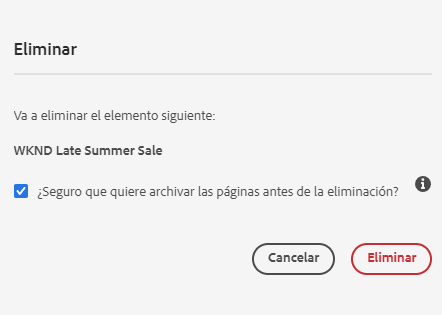

   * Seleccione **Eliminar** para confirmar.
   * Seleccione **Cancelar** para anular la operación.

1. Si alguna de las carpetas seleccionadas contiene subcarpetas o segmentos, su eliminación debe confirmarse.

   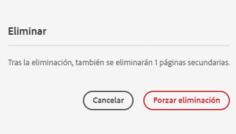

   * Seleccione **Forzar eliminación** para confirmar.
   * Seleccione **Cancelar** para anular la operación.

>[!NOTE]
>
> No es posible mover un segmento de una carpeta a otra.

## Prueba de la aplicación de un segmento {#testing-the-application-of-a-segment}

Una vez definido el segmento, se pueden probar los resultados potenciales con la ayuda de la variable **[ContextHub](contexthub.md).**

1. Previsualización de una página
1. Haga clic en el icono de ContextHub para mostrar la barra de herramientas de ContextHub
1. Seleccione un perfil que coincida con el segmento que ha creado
1. ContextHub resolverá los segmentos aplicables para el personaje seleccionado

Por ejemplo, nuestra definición de segmento simple para identificar a los usuarios en Basilea se basa en la ubicación del usuario. Al cargar un perfil específico que coincida con esos criterios, se muestra si el segmento se ha resuelto correctamente:

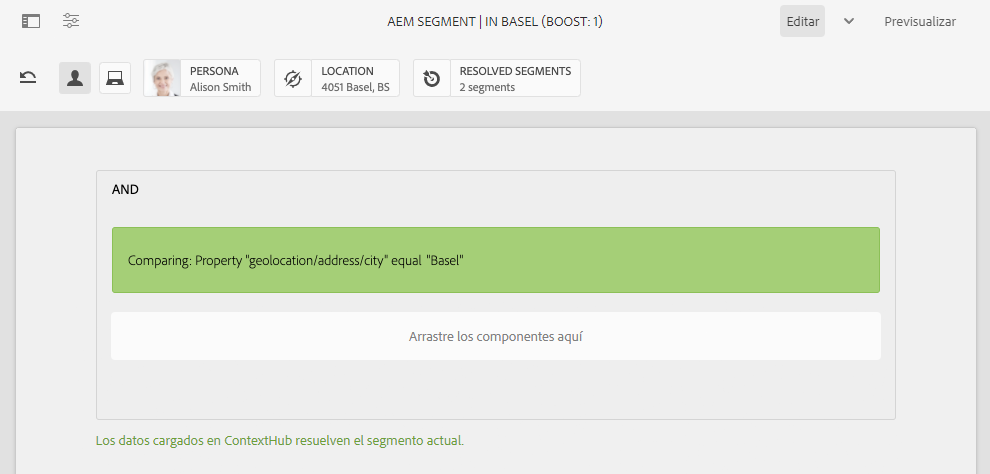

O si no se resuelve:

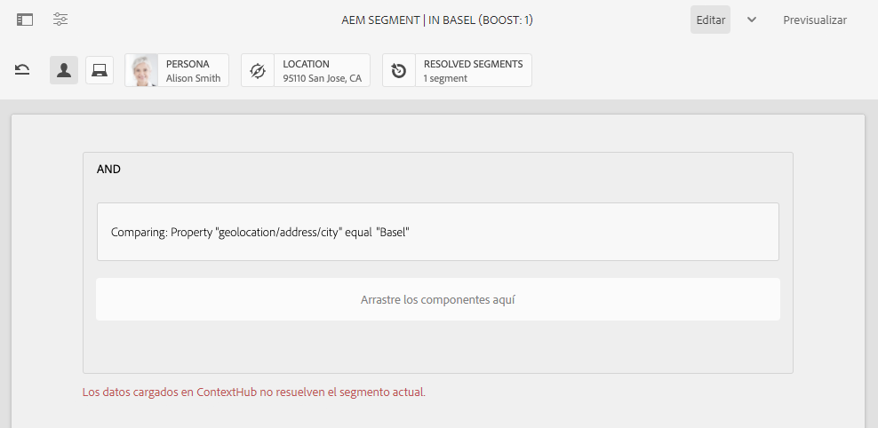

>[!NOTE]
>
>Todos los rasgos se resuelven inmediatamente, aunque la mayoría solo cambia al volver a cargar la página.

Estas pruebas también se pueden realizar en páginas de contenido y en combinación con contenido de destino y **Actividades** y **Experiencias** relacionadas.

Si ha configurado una actividad y experiencia, puede probar fácilmente el segmento con la actividad. Para obtener más información sobre la configuración de una actividad, consulte la [documentación sobre la creación de contenido de destino](targeted-content.md).

1. En el modo de edición de una página en la que ha configurado contenido de destino, puede ver que el contenido se orienta mediante un icono de flecha en el contenido.
1. Cambie al modo de previsualización y, con el Context Hub, cambie a un perfil que no coincida con la segmentación configurada para la experiencia.
1. Cambie a un perfil que no coincida con la segmentación configurada para la experiencia y compruebe que la experiencia cambia en consecuencia.

## Uso del segmento {#using-your-segment}

Los segmentos se utilizan para controlar el contenido real que ven determinadas audiencias de destino. Consulte [Administración de audiencias](audiences.md) para obtener más información sobre audiencias y segmentos, y [Creación de contenido de destino](targeted-content.md) acerca del uso de audiencias y segmentos para segmentar contenido.
