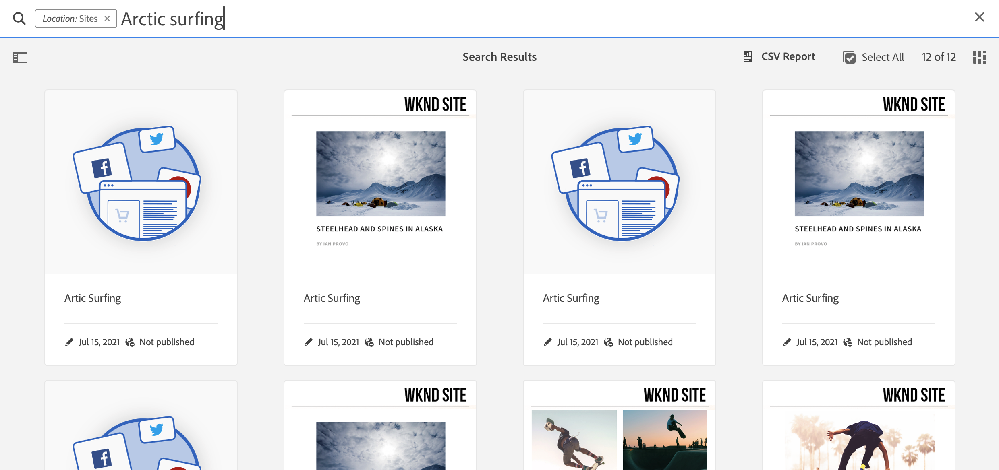
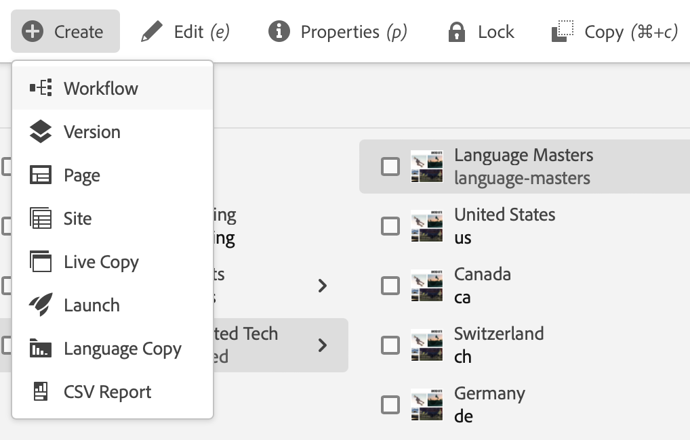
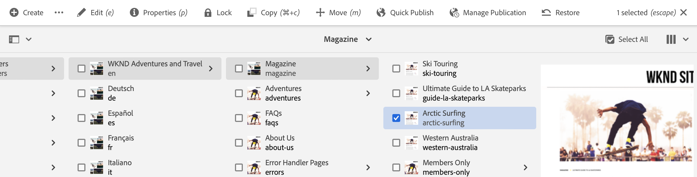

# Guía rápida de introducción para la creación {#quick-guide-to-authoring}

Comience aquí para obtener una guía rápida y de alto nivel para empezar a crear contenido con el **Sites** consola.

>[!TIP]
>
>Esta guía de inicio rápido se centra en la creación de sitios, aunque la mayoría de los conceptos son aplicables en gran medida a otras consolas.

## Todo comienza en la consola Sitios. {#sites-console}

Tanto si desea crear contenido nuevo como si desea ver y administrar el contenido existente, la descripción general central es la siguiente **Sites** consola.

AEM Cuando inicie sesión por primera vez en el servicio de asistencia de, llegará a la pantalla de navegación global de. Simplemente toque o haga clic en **Sites** para abrir **Sites** consola.

AEM Para acceder a la navegación global desde cualquier otra ubicación de la red de distribución, pulse o haga clic en el botón **Adobe Experience Manager** AEM en la parte superior izquierda de cualquier pantalla de la pantalla del sistema de navegación, lo que abre una superposición desplegable de la pantalla de navegación global.

Una vez en el **Sites** , el contenido es fácil de navegar y se presenta en una vista de columna de forma predeterminada.

## Vistas {#views}

De forma predeterminada, la variable **Sites** La consola de se abre en **Columna** vista. Cada nivel de jerarquía se muestra como una columna, que se presta bien para contenido organizado jerárquicamente basado en la web.

Toque o haga clic en una entrada de una columna para seleccionarla o abrir el siguiente nivel hacia abajo en la jerarquía. Un elemento seleccionado se indica con una marca de verificación.

Hay dos vistas adicionales disponibles:

* **Vista de tarjeta** : Esta vista presenta cada entrada como una tarjeta fácilmente manipulable, lo que facilita el acceso a opciones adicionales.
* **Vista de lista** : Presenta un solo nivel de una jerarquía como una lista única, que proporciona más detalles sobre los elementos individuales.

Utilice el conmutador de vistas de la parte superior izquierda de la pantalla para cambiar entre vistas. Este documento utiliza la vista de columnas predeterminada.

## Navegación por contenido {#navigating}

**Vista de columna** presenta el contenido como una serie de columnas en cascada. Al seleccionar un elemento en la columna actual, se muestran los detalles en la siguiente columna a la derecha, si se trata de un documento, o el contenido del siguiente nivel de jerarquía, si se trata de una carpeta.

De este modo, puede recorrer la estructura de contenido hacia arriba y hacia abajo.

Para saltar rápidamente entre niveles, puede utilizar las rutas de exploración en la parte superior de la página.

En cualquier momento también puede utilizar el icono de búsqueda en la parte superior derecha de la pantalla para localizar contenido determinado.

La búsqueda aparece como una superposición desplegable sobre toda la consola. Escriba los términos de búsqueda para encontrar el contenido.

## Creación de contenido {#creating}

Para crear una página nueva, simplemente vaya a donde desee que esté en la jerarquía de contenido y, a continuación, toque o haga clic en **Crear** en la barra de herramientas.

Las opciones disponibles dependen del contexto. Si está en la raíz de la estructura de contenido, tiene la capacidad de crear un sitio completamente nuevo. De lo contrario, puede crear páginas nuevas u otro contenido relacionado con la página.

Según lo que seleccione para crear, el asistente adecuado comenzará a guiarle a través del proceso de creación.

## Editar contenido {#editing}

Para editar una página, toque o haga clic para seleccionarla en la **Sites** consola. A continuación, en la barra de herramientas que aparece, toque o haga clic en **Editar** icono.

Se abrirá la página en el editor correspondiente al contenido.

Si simplemente desea actualizar las propiedades de una página, como las etiquetas o su nombre, puede tocar o hacer clic en **Propiedades** en la barra de herramientas.

## Organización del contenido {#organizing}

Para mover o copiar una página, selecciónela en la consola y, en la barra de herramientas, toque o haga clic en **Mover** o **Copiar**. Esto inicia un asistente para guiarle a través de los pasos para mover o copiar, definiendo el nombre y la ubicación de la página resultante.

## Publicación de contenido {#publishing}

Cuando haya terminado de realizar los cambios deseados en el contenido utilizando **Sites** , puede publicar el contenido. Seleccione el contenido que desea publicar y toque o haga clic en **Publicación rápida** en la barra de herramientas.

Confirme la publicación con otro toque o haga clic en **Publish** en el cuadro de diálogo.

## Recursos adicionales {#additional-resources}

Esta es solo una breve introducción al poder de crear contenido de Sites y, como tal, no cubre todos los temas o todas las opciones.

A continuación, se muestran algunos recursos más que analizan en detalle todas las funciones de la consola, así como temas relacionados con la creación de contenido en general.

* [Gestión básica](/help/sites-cloud/authoring/basic-handling.md)
* [Conceptos de creación](/help/sites-cloud/authoring/author-publish.md)
* [Consola Sites](/help/sites-cloud/authoring/sites-console/introduction.md)
* [Editor de página](/help/sites-cloud/authoring/page-editor/introduction.md)
* [Publicar páginas](/help/sites-cloud/authoring/sites-console/publishing-pages.md)
