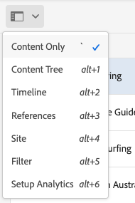
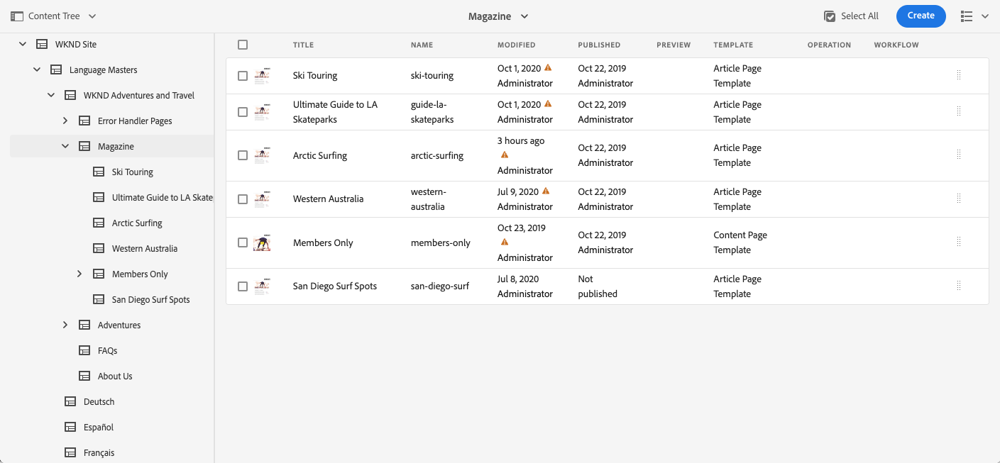
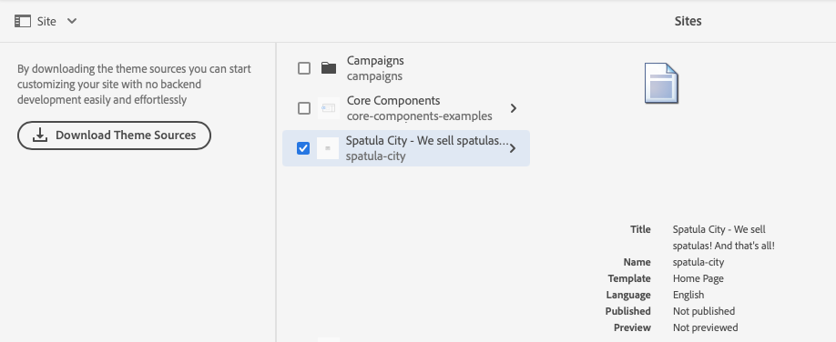

# Panel lateral de la consola Sites {#side-panel}

Aprenda a utilizar el panel lateral de la consola de AEM **Sites** para comprender mejor su contenido y navegar por él.

## Orientación {#orientation}

El panel lateral se cierra de forma predeterminada al entrar en la consola **Sitios**. De este modo, la pantalla está dedicada completamente a su contenido.

Toque o haga clic en el icono **Panel lateral** en la barra de herramientas de la consola **Sitios** para activar el panel lateral y elegir su vista del contenido.

* [Solo contenido](#content-only)
* [Árbol de contenido](#content-tree)
* [Escala de cronología](#timeline)
* [Referencias](#references)
* [Sitio](#site)
* [Filter](#filter)
* [Análisis de configuración](#setup-analytics)

La vista actual seleccionada se indica con una marca de verificación azul en la lista desplegable y el icono del panel lateral de la barra de herramientas se actualiza con el nombre de la vista seleccionada.

## Solo contenido {#content-only}

Esta vista del panel lateral está desactivándola efectivamente, es decir, solo muestra el contenido del sitio.

>[!TIP]
>
>Utilice el método abreviado de teclado acento grave/acento grave `´` para cambiar a la vista de solo contenido del panel lateral.

## Árbol de contenido {#content-tree}

Esta vista del panel lateral muestra el contenido en una jerarquía de árbol. El árbol de contenido se puede utilizar para navegar rápidamente por la jerarquía del sitio dentro del panel lateral y ver mucha información sobre las páginas de la carpeta actual.

Un corchete que señala hacia la derecha junto a un elemento del árbol indica un nodo que se puede expandir para mostrar sus elementos secundarios. Pulse o haga clic en las comillas angulares para mostrar los elementos secundarios.

La consola muestra el contenido del elemento seleccionado actualmente en el árbol de contenido.

Con el panel lateral del árbol de contenido junto con una vista de lista o una vista de tarjetas, puede ver fácilmente la estructura jerárquica del proyecto y navegar fácilmente por la estructura de contenido con el panel lateral del árbol de contenido y ver información detallada de la página en la vista de lista.

>[!TIP]
>
>* Utilice el método abreviado de teclado `Alt+1` para cambiar a la vista de árbol de contenido del panel lateral.
>* Una vez seleccionada una entrada en la vista de jerarquía, las teclas de flecha sirven para desplazarse rápidamente por la jerarquía.
>* Consulte los [métodos abreviados del teclado](/help/sites-cloud/authoring/sites-console/keyboard-shortcuts.md) para obtener más información.

## Escala de cronología {#timeline}

La cronología puede utilizarse para ver eventos que hayan afectado al recurso seleccionado. También puede utilizarlo para iniciar ciertos eventos, como flujos de trabajo o versiones.

El panel lateral **Línea de tiempo** le permite ver varios eventos relacionados con un elemento seleccionado seleccionable como tipos de una lista desplegable:

* Comentarios
* [Anotaciones](/help/sites-cloud/authoring/page-editor/annotations.md)
* [Actividades](/help/sites-cloud/authoring/personalization/activities.md)
* [Lanzamientos](/help/sites-cloud/authoring/launches/overview.md)
* [Versiones](/help/sites-cloud/authoring/sites-console/page-versions.md)
* [Flujos de trabajo](/help/sites-cloud/authoring/workflows/overview.md)
   * Tenga en cuenta que no se mostrará ninguna información para flujos de trabajo transitorios, ya que no se guarda ninguna información de historial para estos.<!--With the exception of [transient workflows](/help/sites-developing/workflows.md#transient-workflows) as no history information is saved for these-->
* Mostrar todos

Además, puede agregar o ver comentarios sobre el elemento seleccionado mediante el cuadro **Comentario** que aparece en la parte inferior de la lista de eventos. Si se escribe un comentario seguido de `Return`, se registrará el comentario. Se muestra cuando se selecciona **Comentarios** o **Mostrar todo**.

En la consola **Sites** también puedes acceder a funciones adicionales a través del botón de los tres puntos situado junto al campo **Comment**.

* [Guardar una versión](/help/sites-cloud/authoring/sites-console/page-versions.md)
* [Iniciar un flujo de trabajo](/help/sites-cloud/authoring/workflows/applying.md)

>[!TIP]
>
>* Utilice el método abreviado de teclado `Alt+2` para cambiar a la vista de cronología del panel lateral.
>* Consulte los [métodos abreviados del teclado](/help/sites-cloud/authoring/sites-console/keyboard-shortcuts.md) para obtener más información.

## Referencias {#references}

La vista **Referencias** muestra una lista de tipos de referencias hacia o desde el recurso seleccionado en la consola.

Seleccione el tipo de referencia adecuado para obtener más información. En determinadas situaciones, hay disponibles acciones adicionales al seleccionar una referencia específica, como las siguientes:

* **Vínculos entrantes**, proporciona una lista de páginas que hacen referencia directamente a la página seleccionada, junto con acceso directo a **Editar** una de esas páginas cuando selecciona un vínculo específico.
   * Esto solo muestra vínculos estáticos, no vínculos generados dinámicamente como del componente Lista.
* [Lanzamientos](/help/sites-cloud/authoring/launches/overview.md), que proporciona acceso a lanzamientos relacionados.
* [Live Copies](/help/sites-cloud/administering/msm/overview.md) muestra las rutas de todas las Live Copies que se basan en el recurso seleccionado.
* [Modelo](/help/sites-cloud/administering/msm/best-practices.md), proporciona detalles y diversas acciones
* [Copias de idiomas](/help/sites-cloud/administering/translation/managing-projects.md#creating-translation-projects-using-the-references-panel), proporciona detalles y diversas acciones

## Sitio {#site}

La vista **Sitio** del panel lateral muestra detalles de los sitios [creados con una plantilla de sitio](/help/sites-cloud/administering/site-creation/create-site.md).

Consulte el documento [Uso del panel del sitio para administrar el tema del sitio](/help/sites-cloud/administering/site-creation/site-rail.md) para obtener más información sobre cómo puede usar el panel para administrar el [tema del sitio](/help/sites-cloud/administering/site-creation/site-themes.md).

Si todavía no ha configurado la canalización front-end para habilitar la creación de sitios basados en temas, el panel lateral ofrecerá esa opción.

>[!TIP]
>
>Puede encontrar una descripción completa del proceso de crear un sitio a partir de una plantilla y personalizar su tema en el [Recorrido de creación rápida de sitios](/help/journey-sites/quick-site/overview.md).

## Filter {#filter}

El panel **Filter** es similar a la [función de búsqueda](/help/sites-cloud/authoring/search.md) con los filtros de ubicación apropiados ya establecidos, lo que le permite filtrar aún más el contenido que desea ver.

A diferencia de otras vistas del panel lateral, para cambiar a otra vista, toque o haga clic en `X` en el campo de búsqueda.

## Análisis de configuración {#setup-analytics}

Esta vista le permite configurar rápidamente Adobe Analytics para un sitio seleccionado.

