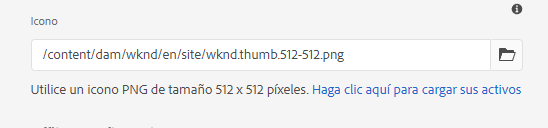

# Activación de las funciones progresivas de la aplicación web {#enabling-pwa}

A través de una configuración sencilla, un autor de contenido ahora puede habilitar las funciones de aplicación web progresiva (PWA) para las experiencias creadas en AEM Sites.

>[!CAUTION]
>
>Se trata de una característica avanzada que requiere lo siguiente:
>
>* Conocimiento de PWA
>* Conocimiento del sitio y estructura de contenido
>* Comprensión de las estrategias de almacenamiento en caché
>* Asistencia de su equipo de desarrollo
>
>Antes de utilizar esta función, Adobe recomienda hablar con su equipo de desarrollo para definir la mejor manera de utilizarla en su proyecto.

{{pwa-deprecation}}

## Introducción {#introduction}

Las [Aplicaciones web progresivas (PWA)](https://developer.mozilla.org/es-ES/docs/Web/Progressive_web_apps) habilitan experiencias de aplicación inmersivas para AEM Sites, lo que les permite almacenarse localmente en el equipo de un usuario y estar accesibles sin conexión. Un usuario podría navegar por un sitio mientras está fuera de casa, incluso si pierde la conexión a Internet. Los PWA permiten una experiencia perfecta incluso si la red se pierde o es inestable.

En lugar de requerir la grabación del sitio, un autor de contenido puede configurar las propiedades de PWA como una ficha adicional en las [propiedades de página](/help/sites-cloud/authoring/sites-console/page-properties.md) de un sitio.

* Cuando se guarda o publica, esta configuración almacena en déclencheur un controlador de eventos que escribe los [archivos de manifiesto](https://developer.mozilla.org/es-ES/docs/Web/Manifest) y un [trabajador de servicio](https://developer.mozilla.org/es-ES/docs/Web/API/Service_Worker_API) que habilitan las características de PWA en el sitio.
* Las asignaciones de Sling también se mantienen para garantizar que el trabajador de servicio se proporciona desde la raíz de la aplicación y habilita el contenido de proxy que permite las funciones sin conexión dentro de la aplicación.

Con la PWA, el usuario tiene una copia local del sitio, lo que ofrece una experiencia similar a la de una aplicación incluso sin conexión a Internet.

>[!NOTE]
>
>Las aplicaciones web progresivas son una tecnología en evolución y son compatibles con la instalación de aplicaciones locales y otras características [según el explorador que utilice](https://developer.mozilla.org/en-US/docs/Web/Progressive_web_apps/Tutorials/js13kGames/Installable_PWAs#summary).

## Requisitos previos {#prerequisites}

Para poder utilizar las funciones de PWA del sitio, existen dos requisitos para el entorno del proyecto:

1. [Usar componentes principales](#adjust-components) para aprovechar esta función
1. [Ajuste sus reglas de Dispatcher](#adjust-dispatcher) para exponer los archivos necesarios

Estos son pasos técnicos que el autor debe coordinar con el equipo de desarrollo. Estos pasos solo son necesarios una vez por sitio.

### Usar componentes principales {#adjust-components}

La versión 2.15.0 y posteriores de los componentes principales admiten completamente las funciones de PWA de AEM Sites. Dado que AEMaaCS siempre incluye la versión más reciente de los componentes principales, puede aprovechar las funciones de PWA listas para usarse. El proyecto AEMaaCS cumple automáticamente este requisito.

>[!NOTE]
>
>Adobe no recomienda usar las características de PWA en componentes personalizados o no [extendidos desde los componentes principales](https://experienceleague.adobe.com/docs/experience-manager-core-components/using/developing/customizing.html?lang=es).
<!--
Your components need to include the [manifest files](https://developer.mozilla.org/en-US/docs/Web/Manifest) and [service worker](https://developer.mozilla.org/en-US/docs/Web/API/Service_Worker_API), which supports the PWA features.

 To do this, the developer adds the following link to the `customheaderlibs.html` file of your page component.

```xml
<link rel="manifest" href="/content/<projectName>/manifest.webmanifest" crossorigin="use-credentials"/>
```

The developer also adds the following link to the `customfooterlibs.html` file of your page component.

```xml
<script>
        // Check that service workers are supported
        if ('serviceWorker' in navigator) {
            // Use the window load event to make sure the page load performs well
            window.addEventListener('load', () => {
                let serviceWorker = '/<projectName>sw.js';
                navigator.serviceWorker.register(serviceWorker);
            });
        }
</script>
```
-->

### Ajuste de Dispatcher {#adjust-dispatcher}

La función de PWA genera y utiliza archivos `/content/<sitename>/manifest.webmanifest`. De manera predeterminada, [Dispatcher](/help/implementing/dispatcher/overview.md) no expone esos archivos. Para exponerlos, el desarrollador debe añadir la siguiente configuración al proyecto del sitio.

```text
File location: [project directory]/dispatcher/src/conf.dispatcher.d/filters/filters.any >

# Allow webmanifest files
/0102 { /type "allow" /extension "webmanifest" /path "/content/*/manifest" }
```

Según el proyecto, es posible que desee incluir diferentes tipos de extensiones en las reglas de reescritura. Puede resultar útil incluir la extensión `webmanifest` en las condiciones de reescritura al introducir una regla que oculte y redirija las solicitudes a `/content/<projectName>`.

```text
RewriteCond %{REQUEST_URI} (.html|.jpe?g|.png|.svg|.webmanifest)$
```

## Activación de la PWA para el sitio {#enabling-pwa-for-your-site}

Con [cumplidos los requisitos previos](#prerequisites), es fácil para un autor de contenido habilitar las características de PWA en un sitio. A continuación se muestra una descripción básica de cómo hacerlo. Las opciones individuales se detallan en la sección [Opciones detalladas](#detailed-options).

1. Inicie sesión en AEM.
1. En el menú principal, seleccione **Navegación** > **Sitios**.
1. Seleccione el proyecto del sitio y seleccione [**Propiedades**](/help/sites-cloud/authoring/sites-console/page-properties.md) o use la tecla de acceso directo `p`.
1. Seleccione la pestaña **Aplicación web progresiva** y configure las propiedades aplicables. Como mínimo, desea:
   1. Seleccionar la opción **Habilitar PWA**.
   1. Definir la **URL de inicio**.

      

   1. Cargue un icono png de 512 x 512 en el DAM y haga referencia a él como icono de la aplicación.

      

   1. Configure las rutas que desea que el service worker desconecte. Las rutas habituales son:
      * `/content/<sitename>`
      * `/content/experiencefragements/<sitename>`
      * `/content/dam/<sitename>`
      * Cualquier referencia de fuente de terceros
      * `/etc/clientlibs/<sitename>`

      

1. Seleccione **Guardar y cerrar**.

El sitio está configurado y puede [instalarlo como una aplicación local](#using-pwa-enabled-site).

## Uso del sitio habilitado para el PWA {#using-pwa-enabled-site}

Ahora que ha [configurado su sitio para admitir PWA](#enabling-pwa-for-your-site), puede experimentarlo usted mismo.

1. Acceda al sitio en un [navegador compatible](https://developer.mozilla.org/en-US/docs/Web/Progressive_web_apps/Tutorials/js13kGames/Installable_PWAs#summary).
1. Verá un nuevo icono en la barra de direcciones del explorador que indica que el sitio se puede instalar como aplicación local.
   * Según el explorador, el icono puede variar y el explorador también puede mostrar una notificación (como un titular o un cuadro de diálogo) que indique que es posible realizar la instalación como aplicación local.
1. Instale la aplicación.
1. La aplicación se instala en la pantalla de inicio del dispositivo.
1. Abra la aplicación, revísela por encima y verá que las páginas están disponibles sin conexión.

## Opciones detalladas {#detailed-options}

La siguiente sección proporciona más detalles sobre las opciones disponibles al [configurar el sitio para PWA](#enabling-pwa-for-your-site).

### Configuración de una experiencia instalable {#configure-installable-experience}

Esta configuración permite que el sitio se comporte como una aplicación nativa permitiendo instalarlo en la pantalla de inicio del visitante y haciendo que esté disponible sin conexión.

* **Habilitar PWA**: esta es la opción principal para habilitar PWA en el sitio.
* **URL de inicio**: esta es la [URL de inicio preferida](https://developer.mozilla.org/en-US/docs/Web/Manifest/start_url) que la aplicación abre cuando el usuario carga la aplicación instalada localmente.
   * Puede ser cualquier ruta en la estructura de contenido.
   * No tiene que ser la raíz, y a menudo se trata de una página de bienvenida dedicada para la aplicación.
   * Si esta URL es relativa, la URL de manifiesto se utiliza como URL base para resolverla.
   * Cuando se deja vacía, la función utiliza la dirección de la página web desde la que se instaló la aplicación.
   * Se recomienda configurar un valor.
* **Modo de visualización**: una aplicación habilitada para PWA sigue siendo un sitio de AEM entregado a través de un explorador. [Estas opciones de visualización](https://developer.mozilla.org/en-US/docs/Web/Manifest/display) definen cómo se debe ocultar o presentar el explorador al usuario desde el dispositivo local.
   * **Independiente**: el explorador está oculto para el usuario y parece una aplicación nativa. Este es el valor predeterminado.
      * Con esta opción, la navegación de la aplicación debe ser posible por completo a través del contenido mediante vínculos y componentes en las páginas del sitio, sin utilizar los controles de navegación del explorador.
   * **Explorador**: el explorador aparece como lo haría de normal al visitar el sitio.
   * **IU mínima**: el explorador está oculto, como una aplicación nativa, pero se exponen los controles básicos de navegación.
   * **Pantalla completa**: el explorador está oculto, como una aplicación nativa, pero se representa en modo de pantalla completa.
      * Con esta opción, la navegación de la aplicación debe ser posible por completo a través del contenido mediante vínculos y componentes en las páginas del sitio, sin utilizar los controles de navegación del explorador.
* **Orientación de la pantalla**: como aplicación local, PWA debe saber cómo gestionar las [orientaciones del dispositivo](https://developer.mozilla.org/en-US/docs/Web/Manifest/orientation).
   * **Cualquiera**: la aplicación se ajusta a la orientación del dispositivo del usuario. Este es el valor predeterminado.
   * **Vertical**: esto fuerza a la aplicación a abrirse en formato vertical independientemente de la orientación del dispositivo del usuario.
   * **Horizontal**: esto fuerza a la aplicación a abrirse en formato horizontal independientemente de la orientación del dispositivo del usuario.
* **Color del tema**: define el [color de la aplicación](https://developer.mozilla.org/en-US/docs/Web/Manifest/theme_color) que afecta a la forma en que el sistema operativo del usuario local muestra la barra de herramientas de la IU nativa y los controles de navegación. Según el explorador, puede afectar a otros elementos de presentación de la aplicación.
   * Utilice la ventana emergente con el círculo cromático adecuado para seleccionar un color.
   * El color también puede definirse con un valor hexadecimal o RGB.
* **Color de fondo**: define el [color de fondo de la aplicación,](https://developer.mozilla.org/en-US/docs/Web/Manifest/background_color) que se muestra a medida que se carga la aplicación.
   * Utilice la ventana emergente con el círculo cromático adecuado para seleccionar un color.
   * El color también puede definirse con un valor hexadecimal o RGB.
   * Determinados exploradores [crean una pantalla de inicio automáticamente](https://developer.mozilla.org/en-US/docs/Web/Manifest#Splash_screens) a partir del nombre de la aplicación, el color de fondo y el icono.
* **Icono**: define [el icono](https://developer.mozilla.org/en-US/docs/Web/Manifest/icons) que representa la aplicación en el dispositivo del usuario.
   * El icono debe ser un archivo PNG de tamaño 512 x 512 píxeles.
   * El icono debe [almacenarse en DAM](/help/assets/overview.md).

### Administración de caché (avanzada) {#offline-configuration}

Esta configuración hace que partes de este sitio estén disponibles sin conexión y de forma local en el dispositivo del visitante. Permite controlar la caché de la aplicación web para optimizar las solicitudes de red y admitir experiencias sin conexión.

* **Estrategia de almacenamiento en caché y frecuencia de actualización del contenido**: esta opción define el modelo de almacenamiento en caché para la PWA.
   * **Moderadamente**: [esta configuración](https://web.dev/stale-while-revalidate/) es el caso de la mayoría de los sitios y el valor predeterminado.
      * Con esta configuración, el contenido que se ve por primera vez se carga desde la caché y mientras se consume, el resto del contenido de la caché se vuelve a validar.
   * **Frecuentemente**: este es el caso de los sitios que necesitan actualizaciones para ser rápidos, como las casas de subastas.
      * Con esta configuración, la aplicación busca primero el contenido más reciente a través de la red y, si no está disponible, vuelve a la caché local.
   * **Raramente**: este es el caso de los sitios que son casi estáticos, como las páginas de referencia.
      * Con esta configuración, la aplicación busca primero el contenido en la caché y, si no está disponible, vuelve a la red para recuperarlo.
* **Almacenamiento previo de los archivos en la caché**: estos archivos alojados en AEM se guardan en la caché del explorador local cuando el trabajador de servicio se instale y antes de que se utilice. Esto garantiza que la aplicación web funcione completamente sin conexión.
* **Inclusiones de rutas**: las solicitudes de red para las rutas definidas se interceptan y el contenido almacenado en caché se devuelve de acuerdo con la **Estrategia de almacenamiento en caché y frecuencia de actualización del contenido** configuradas.
* **Exclusiones de caché**: estos archivos nunca se almacenan en caché, independientemente de la configuración de **Almacenamiento en caché previo de archivos** y **Inclusiones de rutas**.

>[!TIP]
>
>Es probable que el equipo de desarrolladores tenga datos valiosos sobre cómo se debe ajustar la configuración sin conexión.

## Limitaciones y recomendaciones {#limitations-recommendations}

No todas las funciones de PWA están disponibles para AEM Sites. Estas son algunas limitaciones importantes.

* Las páginas no se sincronizan ni actualizan automáticamente si el usuario no utiliza la aplicación.

Adobe también recomienda lo siguiente al implementar PWA.

### Reduzca al máximo el número de recursos que se van a prealmacenar en caché. {#minimize-precache}

Adobe recomienda limitar el número de páginas que se prealmacenarán en caché.

* Incruste bibliotecas para poder reducir el número de entradas que se van a administrar al prealmacenar en caché.
* Limite el número de variaciones de imagen que se van a prealmacenar en caché.

### Habilite PWA después de estabilizar los scripts de proyecto y las hojas de estilo. {#pwa-stabilized}

Las bibliotecas de cliente se entregan con la adición de un selector de caché que cumple el siguiente patrón `lc-<checksumHash>-lc`. Cada vez que cambia uno de los archivos (y dependencias) que componen una biblioteca, este selector también cambia. Si enumeró una biblioteca de cliente para que la prealmacene en caché el trabajador de servicio y desea hacer referencia a una nueva versión, recupere y actualice manualmente la entrada. Como resultado, Adobe recomienda configurar el sitio para que sea un PWA después de estabilizar los scripts de proyecto y las hojas de estilo.

### Minimice el número de variaciones de imagen. {#minimize-variations}

El componente de imagen de los componentes principales de AEM determina en el front-end la mejor representación que se debe recuperar. Este mecanismo también incluye una marca de tiempo que corresponde a la hora de la última modificación de ese recurso. Este mecanismo complica la configuración de la precaché de la PWA.

Al configurar la precaché, el usuario debe enumerar todas las variaciones de ruta que se pueden recuperar. Estas variaciones están compuestas de parámetros como calidad y anchura. Se recomienda reducir el número de estas variaciones a un máximo de tres: pequeñas, medianas y grandes. Puede hacerlo a través del cuadro de diálogo de la directiva de contenido de [Componente de imagen](https://experienceleague.adobe.com/docs/experience-manager-core-components/using/wcm-components/image.html?lang=es).

Si no se configura con cuidado, la memoria y el consumo de red pueden afectar gravemente al rendimiento de su PWA. Además, si tiene intención de prealmacenar en caché, por ejemplo, 50 imágenes y tiene tres anchos por imagen, el usuario que mantenga el sitio deberá mantener una lista de hasta 150 entradas en la sección de precaché de PWA de las propiedades de página.

Adobe también le recomienda configurar su sitio para que sea una PWA después de que el uso de imágenes en el proyecto se haya estabilizado.
