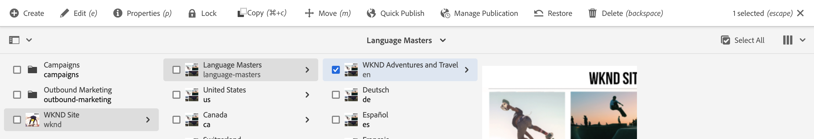
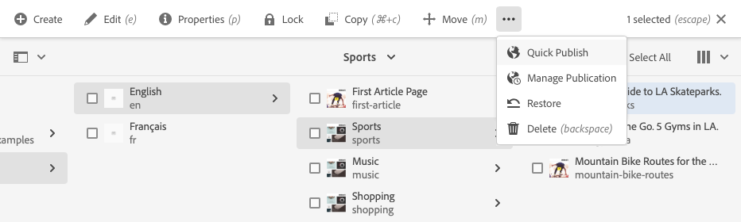

# La Consola Sites {#sites-console}

Aprenda a utilizar la consola **Sites** para administrar y organizar las páginas de AEM.

## Orientación {#orientation}

La consola **Sites** le permite ver la jerarquía de páginas.

Ofrece diferentes vistas y barras de herramientas para ayudarle a administrar y organizar las páginas.

* [La barra de herramientas de la consola](#toolbar) siempre está presente para ayudarle a navegar.
* [Tres vistas diferentes](#views) le permiten localizar y seleccionar fácilmente su página.
* [La barra de herramientas de acciones](#action-toolbar) aparece cuando ha seleccionado un elemento para realizar acciones en él.
* [El panel lateral](#side-panel) tiene varias opciones para mostrar información detallada en una página seleccionada.

## Barra de herramientas de consola {#console-toolbar}

La barra de herramientas de la consola siempre está presente en la consola y le ayuda a orientarse en el contenido y a desplazarse por él.

### Selector del panel lateral {#side-panel-selector}

El selector del panel lateral le permite mostrar información adicional sobre el elemento seleccionado en la consola.

Las opciones presentadas dependen de la consola actual. Por ejemplo, en **Sitios** puede seleccionar contenido solamente (el valor predeterminado), la cronología, las referencias o el panel lateral de filtro.

Para obtener más información sobre el panel lateral, consulte [Panel lateral de la consola Sites](/help/sites-cloud/authoring/sites-console/console-side-panel.md).

### Rutas de exploración {#breadcrumbs}

Las rutas de exploración, que se encuentran en el centro del carril y siempre muestran la descripción del elemento seleccionado, le permiten desplazarse por los niveles del sitio web.

Toque o haga clic en el texto de la ruta de exploración para mostrar una lista desplegable con los niveles de la jerarquía del elemento seleccionado actualmente. Toque o haga clic en una entrada para saltar a esa ubicación.

### Seleccionar todo {#select-all}

Al tocar o hacer clic en el botón **Seleccionar todo** se seleccionan todos los elementos de la vista actual de la consola.

Cuando haya seleccionado todos los elementos, el recuento de los elementos seleccionados se mostrará en la parte superior derecha de la barra de herramientas donde apareció el botón **Seleccionar todo**.

Para anular la selección de todos los elementos y salir del modo de selección:

* Tocando o haciendo clic en **X** junto al recuento.
* Usando la clave **escape**.

### Botón Crear {#create-button}

El botón **Crear** le permite agregar nuevas páginas a su sitio, así como crear objetos de sitios adicionales como Live Copies o Lanzamientos.

Una vez que se ha hecho clic, las opciones mostradas son apropiadas para la consola o el contexto. Los más comunes son:

* [Página](/help/sites-cloud/authoring/sites-console/creating-pages.md)
* [Sitio](/help/sites-cloud/administering/site-creation/create-site.md)
* [Live Copy](/help/sites-cloud/administering/msm/overview.md)
* [lanzamiento](/help/sites-cloud/authoring/launches/overview.md)
* [Copia de idioma](/help/sites-cloud/administering/translation/overview.md)
* [Informe CSV](/help/sites-cloud/authoring/sites-console/csv-export.md)

Consulte los vínculos a estas funciones para obtener más información sobre cómo funcionan.

## Vistas y selección de páginas {#views}

La consola **Sites** ofrece tres vistas diferentes de la jerarquía de contenido. Puede ver, navegar y seleccionar sus recursos (para realizar más acciones) con cualquiera de las vistas disponibles.

* [Vista de columna](#column-view)
* [Vista de tarjeta](#card-view)
* [Vista de lista   ](#list-view)

El icono **Ver** en el extremo derecho de la barra de herramientas de AEM indica la vista actual seleccionada.

Tocar o hacer clic en ella le permite seleccionar una vista diferente.

Puede cambiar entre la vista de columna, la vista de tarjeta y la vista de lista. Tenga en cuenta que en la vista de lista también se muestra la configuración de la vista.

>[!NOTE]
>
>La opción **Ver configuración** solo está disponible en el modo **Vista de lista**.

Conceptualmente, la visualización, la navegación y la selección son iguales en todas las vistas, pero existen pequeñas variaciones en el manejo, dependiendo de la vista utilizada.

>[!NOTE]
>
>De forma predeterminada, AEM Assets no muestra las representaciones originales de los recursos de la IU como miniaturas en ninguna de las vistas. Si es administrador, puede utilizar superposiciones para configurar AEM Assets de modo que muestren las representaciones originales como miniaturas.

### Selección de recursos    {#selecting-resources}

La selección de un recurso específico depende de la vista y el dispositivo combinados:

| Ver | Seleccionar opción táctil | Seleccionar escritorio | Anular la selección táctil | Anular la selección de escritorio |
|---|---|---|---|---|
| Columna | Seleccionar la miniatura | Hacer clic en la miniatura | Seleccionar la miniatura | Hacer clic en la miniatura |
| Tarjeta | Seleccione y mantenga pulsada la tarjeta | Pasar el ratón y, a continuación, utilizar la marca de verificación de acción rápida | Seleccione la tarjeta | Hacer clic en la tarjeta |
| Lista | Seleccionar la miniatura | Hacer clic en la miniatura | Seleccionar la miniatura | Hacer clic en la miniatura |

#### Ejemplo de selección {#selecting-example}

1. Por ejemplo, en la vista de tarjeta:

   

1. Una vez que haya seleccionado un recurso, el encabezado superior se cubre con [acciones de la barra de herramientas](#actions-toolbar) para proporcionar acceso a las acciones aplicables actualmente al recurso seleccionado.

1. Para salir del modo de selección, pulse o haga clic en la **X** situada en la parte superior derecha o use la tecla **Esc**.

### Vista de columna {#column-view}

La vista de columna permite la navegación visual de un árbol de contenido a través de una serie de columnas en cascada. Esta vista le permite visualizar y recorrer la estructura de árbol del sitio web.

Si se selecciona un recurso en la columna situada más a la izquierda, se muestran los recursos secundarios en una columna situada a la derecha. Si se selecciona un recurso en la columna derecha, se muestran los recursos secundarios en otra columna a la derecha, etc.

* Puede desplazarse hacia arriba y hacia abajo en el árbol, tocando o haciendo clic en el nombre del recurso o en las comillas angulares a la derecha del nombre del recurso.

   * El nombre del recurso y las comillas angulares se resaltan al pulsar o hacer clic en él.
   * Los elementos secundarios del recurso en el que se hizo clic o pulsó se muestran en la columna a la derecha del recurso en el que se hizo clic o pulsó.
   * Si selecciona un nombre de recurso que no tiene tareas secundarias, sus detalles se muestran en la última columna.

* Al tocar o hacer clic en la miniatura, se selecciona el recurso.

   * Cuando se selecciona una miniatura, sobre ella se superpone una casilla de verificación y el nombre del recurso se muestra resaltado también.
   * Los detalles del recurso seleccionado se mostrarán en la última columna.
   * La barra de herramientas de acciones está disponible.

* Cuando se selecciona una página en la vista de columna, la página seleccionada se muestra en la última columna junto con los siguientes detalles:

   * Título de la página
   * Nombre de la página (parte de la dirección URL de la página)
   * Plantilla en la que se basa la página
   * Detalles de modificación
   * Idioma de la página
   * Detalles de publicación y previsualización

### Vista de tarjeta {#card-view}

En la vista de tarjeta, cada elemento del nivel actual de la jerarquía se muestra como una tarjeta grande.

* Las tarjetas proporcionan información como:

   * Una representación visual del contenido de la página.
   * El título de la página.
   * Fechas importantes (como la de la última modificación o la última publicación).
   * Si la página está bloqueada u oculta, o si forma parte de una Live Copy.
   * Indicadores si debe actuar en el elemento como parte de un flujo de trabajo.

La vista de tarjeta también ofrece [acciones rápidas](#quick-actions) para elementos como la selección y acciones comunes como la edición.

Puede navegar hacia abajo en el árbol tocando o haciendo clic en las tarjetas (con cuidado de evitar tocar las acciones rápidas), o hacia arriba de nuevo utilizando las [rutas de exploración en el encabezado](#the-header).

### Vista de lista    {#list-view}

La vista de lista proporciona información para cada recurso del nivel actual de una lista.

* Puede navegar hacia abajo en el árbol tocando o haciendo clic en el nombre del recurso, y hacia arriba utilizando las [rutas de exploración en el encabezado](#the-header).
* Para seleccionar fácilmente todos los elementos de la lista, use la casilla de verificación [**Seleccionar todo** de la barra de herramientas](#select-all).

* Seleccione las columnas a mostrar mediante la opción **Ajustes de visualización**, que se encuentra debajo del botón Vistas. Las siguientes columnas están disponibles para su visualización:

   * **Nombre**: nombre de la página, que puede resultar útil en un entorno de creación multilingüe, ya que forma parte de la dirección URL de la página y no cambia, independientemente del idioma
   * **Modificado**: fecha de la última modificación y de la última modificación del usuario
   * **Publicado**: estado de publicación
   * **Vista previa**: estado de la vista previa
   * **Plantilla**: plantilla en la que se basa la página
   * **Operación**
   * **Flujo de trabajo**: flujo de trabajo aplicado actualmente a la página. Hay más información disponible cuando pasa el ratón sobre o abre Cronología.
   * **Traducido**
   * **Vistas de página**
   * **Visitantes únicos**
   * **Tiempo en la página**

De forma predeterminada se muestra la columna **Nombre**, que es parte de la dirección URL de la página. En algunos casos, el autor puede tener que acceder a páginas en un idioma distinto, y ver el nombre de las mismas (que no suele variar) puede suponer una gran ayuda si se desconoce el idioma de la página.

* Cambie el orden de los elementos mediante la barra vertical de puntos en la parte más a la derecha de cada elemento en la lista.

Seleccione la barra de selección vertical y arrastre el elemento a una nueva posición en la lista.

>[!NOTE]
>
>Solo es posible cambiar el orden en una carpeta ordenada que tiene el valor `jcr:primaryType` establecido como `sling:OrderedFolder`.

## Barra de herramientas Acciones {#actions-toolbar}

Siempre que se selecciona un recurso, se pueden realizar varias acciones en el elemento seleccionado. Estas acciones se muestran en la barra de herramientas de acciones.

La barra de herramientas de acciones solo aparece cuando se selecciona un recurso en la consola. La acción disponible en la barra de herramientas de acciones cambia para reflejar las acciones que puede realizar en los elementos específicos seleccionados. Las acciones más comunes son:

* [**Crear**](#create-action) - Crear nuevo contenido o acciones relacionadas con contenido
* **Editar**: según cómo se haya creado la página seleccionada, la acción **Editar** abrirá el editor correspondiente.
   * [Editor de páginas](/help/sites-cloud/authoring/page-editor/introduction.md) - Para páginas creadas con el Editor de páginas de AEM
   * [Editor universal](/help/sites-cloud/authoring/universal-editor/authoring.md) - Para páginas creadas con el Editor universal
* [**Propiedades**](/help/sites-cloud/authoring/sites-console/edit-page-properties.md): abre la ventana de propiedades de la página
* [**Bloquear**](/help/sites-cloud/authoring/sites-console/managing-pages.md#locking-a-page): bloquea una página para evitar que otros la cambien
* [**Copiar**](/help/sites-cloud/authoring/sites-console/managing-pages.md#copying-and-pasting-a-page) - Copiar una página
* [**Mover**](/help/sites-cloud/authoring/sites-console/managing-pages.md#moving-or-renaming-a-page): mover o cambiar el nombre de una página
* [**Publicación rápida**](/help/sites-cloud/authoring/sites-console/publishing-pages.md#quick-publish): publique una o varias páginas inmediatamente
* [**Administrar publicación**](/help/sites-cloud/authoring/sites-console/publishing-pages.md#manage-publication) - Programar una o varias páginas para su publicación
* [**Restaurar**](/help/sites-cloud/authoring/sites-console/page-versions.md#restore-version) - Restaurar una versión de una página o árbol de páginas
* [**Eliminar**](/help/sites-cloud/authoring/sites-console/managing-pages.md#deleting-a-page) - Eliminar una o varias páginas

Debido a las restricciones de espacio en algunas ventanas, es posible que la barra de herramientas supere rápidamente la longitud disponible. Cuando esto ocurre, aparecen opciones adicionales. Al tocar o hacer clic en los puntos suspensivos (los tres puntos o **...**), se abre un selector desplegable que contiene todas las acciones restantes.

### Crear acción {#create-action}

La acción Crear ofrece opciones similares al botón [**Crear** de la barra de herramientas](#create-button) para crear páginas nuevas y elementos similares.

Además, ofrece la capacidad de crear acciones relacionadas con la página.

* [**Flujo de trabajo**](/help/sites-cloud/authoring/workflows/overview.md) - Aplicar un flujo de trabajo a una página
* [**Versión**](/help/sites-cloud/authoring/sites-console/page-versions.md) - Crear una versión de una página

## Plantillas

Puede ver fácilmente en qué plantilla se basa la página al seleccionar la página en la vista [**Columna**](/help/sites-cloud/authoring/basic-handling.md#column-view) o en la [**vista Lista**](/help/sites-cloud/authoring/basic-handling.md#list-view).
