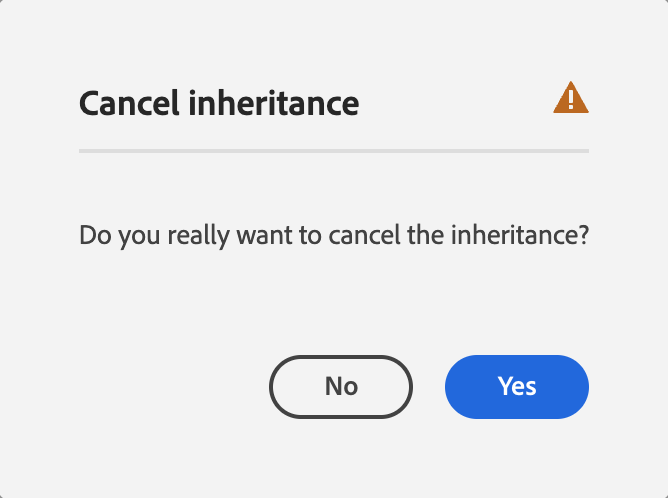

# Edición de las propiedades de página   {#editing-page-properties}

Puede definir las propiedades para una página. Estas pueden variar según la naturaleza de la página. Por ejemplo, algunas páginas pueden estar conectadas a una Live Copy, mientras que otras no lo están, y la información de la Live Copy estará disponible según corresponda.

## Propiedades de página {#page-properties}

Las propiedades se distribuyen entre varias pestañas.

### Básico {#basic}

* **Título y etiquetas**

   * **Título**: el título de la página se muestra en varias ubicaciones. Por ejemplo, la lista de la pestaña **Sitios web** y las vistas de lista o tarjeta **Sitios**.
      * Este es un campo obligatorio.
   * **Etiquetas**: aquí puede agregar o quitar etiquetas de la página al actualizar la lista en el cuadro de diálogo de selección.
      * Después de seleccionar una etiqueta, aparece debajo del cuadro de selección. Puede quitar una etiqueta de esta lista utilizando la x.
      * Se puede especificar una etiqueta completamente nueva si se escribe el nombre en un cuadro de selección vacío.
         * La etiqueta nueva se crea al pulsar Intro.
         * La nueva etiqueta se mostrará con una pequeña estrella a la derecha que indicará que es una etiqueta nueva.
      * Con la funcionalidad desplegable puede seleccionar etiquetas existentes.
      * Aparece una x cuando pasa el ratón sobre una entrada de etiqueta en el cuadro de selección, que se puede utilizar para quitar esa etiqueta para esa página.
      * Para obtener más información sobre las etiquetas, consulte [Uso de etiquetas](/help/sites-cloud/authoring/sites-console/tags.md).
   * **Ocultar en la navegación**: indica si se muestra o se oculta la página en la navegación de páginas del sitio resultante.

* **Marca**

  Aplique una identidad de marca uniforme en todas las páginas adjuntando un slug de marca al título de cada página. Esta funcionalidad requiere el uso del componente Página de la versión 2.14.0 o posterior de [Componentes principales](https://experienceleague.adobe.com/docs/experience-manager-core-components/using/introduction.html?lang=es).

   * **Anotaciones de marca**

      * **Sobrescribir**: marque para definir el slug de marca en esta página.
         * El valor lo hereda cualquier página secundaria a menos que también tenga valores establecidos de **Sobrescribir**.
      * **Sobrescribir valor**: el texto del slug de marca que se añadirá al título de la página.
         * El valor se anexa al título de la página después de un carácter de barra vertical como “Ciclismo en Toscana | Siempre listo para WKND”

* **ID de HTML**

   * **ID**: ID de HTML que se aplicará al componente.

* **Títulos y descripción de Más**

   * **Título de página**: un título que se usará en la página. Normalmente se utiliza en los componentes de título. Si está vacío, se utiliza **Título**.
   * **Título de navegación**: puede especificar un título independiente para utilizarlo en la navegación (por ejemplo, si desea algo más conciso). Si está vacío, se utiliza **Título**.
   * **Título** - Un subtítulo para usar en la página.
   * **Descripción**: la descripción de la página, su propósito o cualquier otro detalle que quiera añadir.

* **Tiempo de activación/desactivación**

  >[!NOTE]
  >
  > Consulte [Horas de activación y desactivación: configuración de activador](/help/operations/replication.md#on-and-off-times-trigger-configuration) para obtener detalles sobre cómo configurar la replicación automática relacionada.

  >[!NOTE]
  >Si el **Tiempo de activación** o el **Tiempo de desactivación** se sitúan en el pasado y se configura la replicación automática, la acción relevante se activa de inmediato.

   * **Tiempo de activación**: la fecha y hora a las que se hace visible (procesada) la página publicada en el entorno de publicación. La página debe publicarse, ya sea de forma manual o mediante replicación automática preconfigurada.

      * Si ya se ha [publicado (manualmente)](/help/sites-cloud/authoring/sites-console/publishing-pages.md), esta página se mantiene inactiva (oculta) hasta que se procese a la hora especificada.
      * Si no se publica y se configura para la replicación automática, la página se publica automáticamente y, a continuación, se procesa a la hora especificada.
      * Si no se publica y no está configurada para la replicación automática, la página no se publica automáticamente, por lo que aparece un error 404 cuando se intenta acceder a ella.

   * **Tiempo de desactivación**: similar a **Tiempo de activación** y usado a menudo en combinación, define el momento en el que la página publicada se oculta en el entorno de publicación.

   * Deje estos campos (**Tiempo de activación** y **Tiempo de desactivación**) vacíos para las páginas que desea publicar de inmediato y disponibles en el entorno de publicación hasta que se desactiven (el escenario normal).

* **URL mnemónica**

   * Permite introducir una URL de vanidad para esta página, lo que permite tener una URL más corta o expresiva.
   * Por ejemplo, si la URL de vanidad se establece como `welcome` en la página identificada por la ruta `/v1.0/startpage` del sitio web `http://example.com`, entonces `http://example.com/welcome` es la URL de vanidad de `http://example.com/content/v1.0/startpage`.

  >[!CAUTION]
  >
  >URL de vanidad:
  >
  >* Debe ser única, por lo que debe asegurarse de que ninguna otra página utilice ese valor.
  >* No admiten patrones regex.
  >* No debe configurarse en una página existente.

   * **Agregar**: seleccione esta opción para mostrar un campo con el que definir una URL de vanidad para la página.
      * Seleccione de nuevo para añadir varias.
      * Seleccione el icono **Quitar** para eliminar la URL de vanidad.
   * **Redirigir URL de vanidad**: indica si desea que la página use la URL de vanidad.

### Avanzado  {#advanced}

* **Configuración**

   * **Idioma**: el idioma de la página
   * **Raíz del idioma**: si la página es la raíz de una copia en un idioma, es necesario marcar esta opción
   * **Redireccionar**: indica la página a la que esta página debe redireccionarse automáticamente con un estado de HTML `302 Found`.
      * **Redirección permanente**: cuando se selecciona, la página redirige a la ruta de destino proporcionada junto con un estado HTML `301 Moved Permanently`.
   * **Diseño**: indica si se muestra o se oculta la página en la navegación de páginas del sitio resultante
   * **Alias**: especifica un alias que se usará con esta página
      * Por ejemplo, si define un alias de `private` para la página `/content/wknd/us/en/magazine/members-only`, se puede acceder a esta página también mediante `/content/wknd/us/en/magazine/private`
      * La creación de un alias establece la propiedad `sling:alias` en el nodo de página, lo que solo afecta al recurso, no a la ruta del repositorio.
      * No se pueden publicar páginas a las que se accede mediante alias en el editor. Las [Opciones de publicación](/help/sites-cloud/authoring/sites-console/publishing-pages.md) del editor solo están disponibles para las páginas a las que se accede a través de sus rutas reales.
      * Consulte [Nombres de páginas localizados en Procedimientos recomendados para la administración de direcciones URL y SEO](/help/overview/seo-and-url-management.md#localized-page-names).

* **Configuración**

   * **Heredado de &lt;path>**: habilitar/deshabilitar la herencia; alterna la disponibilidad de **Configuración de nube** para la selección

   * **Configuración de nube**: la ruta de la configuración seleccionada

* **Configuración de plantilla**

   * **Plantillas permitidas**: [define la lista de plantillas que están disponibles](/help/sites-cloud/authoring/page-editor/templates.md#enabling-and-allowing-a-template-template-author) dentro de esta rama secundaria
   * **Usar página como plantilla** - [Cree una nueva plantilla basada en la página actual.](/help/sites-cloud/authoring/universal-editor/templates.md)
      * Solo se aplica a las páginas creadas para utilizarlas con el editor universal que aprovecha Edge Delivery Services.

* **Requisito de autenticación**

   * **Habilitar**: habilite el uso de la autenticación para acceder a la página

     >[!NOTE]
     >
     >Los grupos de usuarios cerrados para la página se definen en la pestaña **[Permisos](#permissions)**.

   * **Página de inicio de sesión**: la página que se usará para iniciar sesión

* **Exportar**

   * **Configuración de exportación**: especifica una configuración de exportación

* **SEO**

   * **URL canónica**: se puede usar para sobrescribir la dirección URL canónica de la página; si se deja en blanco, la dirección URL de la página será su dirección URL canónica

   * **Etiquetas de robots**: seleccione las etiquetas de robots para controlar el comportamiento de los rastreadores de los motores de búsqueda.

     >[!NOTE]
     >
     >Algunas de las opciones entran en conflicto entre sí. En caso de conflicto, la opción más permisiva tiene prioridad.

   * **Generar mapa del sitio**: cuando se selecciona, se genera un archivo sitemap.xml para esta página y sus descendientes.

### Imágenes {#images}

* **Imagen destacada**

  Seleccione y configure la imagen que desea mostrar. Se utiliza en componentes que hacen referencia a la página; por ejemplo, teasers, listas de páginas, etc.

   * **Imagen**

     Puede **seleccionar** un recurso o buscar un archivo para cargarlo y después **editarlo** o **borrarlo**.

   * **Texto alternativo**: un texto utilizado para representar el significado o la función de la imagen; por ejemplo, para el uso de los lectores de pantalla.

   * **Heredar: valor tomado del recurso DAM**. Cuando se selecciona, se rellena el texto alternativo con el valor de los metadatos `dc:description` en DAM

* **Miniatura**

  Configuración de la miniatura de la página

   * **Generar previsualización**: genere una previsualización de la página para utilizarla como miniatura
   * **Cargar imagen**: cargue una imagen para utilizarla como miniatura
   * **Seleccionar imagen**: seleccione un recurso existente para utilizarlo como miniatura
   * **Revertir**: esta opción está disponible después de hacer un cambio en la miniatura Si no desea mantener el cambio, puede revertirlo antes de guardarlo.

### Cloud Services {#cloud-services}

* **Configuraciones de Cloud Service**: defina propiedades para servicios en la nube

### Personalización {#personalization}

* **Configuración de ContextHub**

   * **Heredado de &lt;path>**: habilitar/deshabilitar la herencia; alterna la disponibilidad de **Ruta de ContextHub** y **Ruta de segmentos** para la selección.

   * **Ruta de ContextHub**: defina la [Configuración de ContextHub](/help/sites-cloud/authoring/personalization/contexthub.md)
   * **Ruta de segmentos**: defina la [Ruta de segmentos](/help/sites-cloud/authoring/personalization/contexthub-segmentation.md)

* **Configuración de ámbito**

   * **Marca**: defina una [marca para especificar un ámbito de segmentación](/help/sites-cloud/authoring/personalization/targeted-content.md).

  >[!NOTE]
  >Esta opción requiere una cuenta de usuario en el grupo `Target Administrators`.

### Permisos    {#permissions}

* **Permisos**

   * **Agregar permisos**
   * **Editar grupo de usuarios cerrado**
   * Ver los **Permisos efectivos**

### Modelo {#blueprint}

Esta pestaña solo está visible para páginas que sirven como modelos. Los modelos sirven de base para Live Copies y forman parte de la [Administración de varios sitios](/help/sites-cloud/administering/msm/overview.md).

* **Live Copies actuales**: enumera las páginas que se basan en (es decir, que son Live Copies) esta página modelo

* **Configuraciones de despliegue**: controla las circunstancias en las que se propagan las modificaciones a la Live Copy

### Live Copy {#live-copy}

Esta pestaña solo está visible para páginas configuradas como Live Copies. Al igual que con los modelos, las Live Copies forman parte de la [Administración de varios sitios](/help/sites-cloud/administering/msm/overview.md).

* **Sincronizar**: sincronice la Live Copy con el modelo, conservando las modificaciones locales
* **Restablecer**: restablezca la Live Copy al estado del modelo y elimine las modificaciones locales
* **Suspender**: suspenda la Live Copy de nuevas modificaciones en el despliegue
* **Desasociar**: separe la Live Copy del modelo

* **Origen**

   * Muestra la ruta del modelo para esta Live Copy

* **Estado**

   * Enumera el estado actual de Live Copy de la página

* **Configuración**

   * **Herencia de Live Copy**: si está marcada, la configuración de Live Copy es eficaz en todas las tareas secundarias.
   * **Heredar configuraciones de despliegue de la página principal**: si está marcada, la configuración de despliegue se hereda de la página principal de la página
   * **Elija la configuración de despliegue**: define las circunstancias en las que se propagan las modificaciones desde el modelo y solo está disponible cuando **Heredar configuraciones de despliegue de la página principal** no está seleccionado

### Vista previa {#preview}

Cuando un entorno de vista previa está habilitado, verá lo siguiente:

* URL de previsualización: la URL utilizada para acceder al contenido en el entorno de previsualización.

### Aplicación web progresiva {#progressive-web-app}

A través de una configuración sencilla, el autor de contenido ahora puede habilitar las funciones de aplicación web progresiva (PWA) para las experiencias creadas en AEM Sites.

>[!NOTE]
>
>Consulte [Habilitación de funciones de aplicación web progresiva](/help/sites-cloud/authoring/sites-console/enable-pwa.md) para obtener más información.

{{pwa-deprecation}}

* **Configurar la experiencia instalable**

   * **Habilitar PWA**: sirve para habilitar/deshabilitar la función; permite a los usuarios instalar el sitio como PWA.
   * **URL de inicio**: la URL de inicio preferida
   * **Modo de visualización**: define cómo se debe ocultar o presentar el explorador al usuario desde el dispositivo local.
   * **Orientación de la pantalla**: cómo gestionará el PWA las orientaciones del dispositivo.
   * **Color del tema**: define el color de la aplicación que afecta a la forma en que el sistema operativo del usuario local muestra la barra de herramientas de la IU nativa y los controles de navegación.
   * **Color de fondo**: define el color de fondo de la aplicación, que se muestra a medida que se carga la aplicación.
   * **Icono**: define el icono que representa la aplicación en el dispositivo del usuario.

* **Administración de caché (avanzada)**

   * **Estrategia de almacenamiento en caché y frecuencia de actualización del contenido**: esta opción define el modelo de almacenamiento en caché para la PWA.
   * **Archivos para almacenar en caché para su uso sin conexión**
      * **Almacenamiento en caché previo de archivos (previsualización técnica)**: estos archivos alojados en AEM se guardan en la caché del explorador local cuando el trabajador de servicio se instale y antes de que se utilice
      * **Bibliotecas del lado del cliente**: bibliotecas del lado del cliente para almacenar en caché para la experiencia sin conexión.
      * **Inclusiones de rutas**: las solicitudes de red para las rutas definidas se interceptan y el contenido almacenado en caché se devuelve de acuerdo con la estrategia de almacenamiento en caché y frecuencia de actualización del contenido configurado.
      * **Exclusiones de rutas**: estos archivos nunca se almacenarán en caché, independientemente de la configuración del almacenamiento en caché previo de archivos e inclusiones de rutas.

## Edición de las propiedades de página   {#editing-page-properties-1}

* Desde la consola **Sitios:**
   * [Creando una página nueva](/help/sites-cloud/authoring/sites-console/creating-pages.md#creating-a-new-page) (un subconjunto de las propiedades)
   * Pulsando o haciendo clic en **Propiedades**
      * Para una sola página
      * Para varias páginas (solo un subconjunto de las propiedades está disponible para su edición en masa)
* Desde el editor de páginas:
   * Utilizando **Información de página** (a continuación, **Abrir propiedades**)

### Desde la consola Sitios: página individual {#from-the-sites-console-single-page}

Tocando o haciendo clic en **Propiedades** para definir las propiedades de la página:

1. Mediante la consola **Sitios**, desplácese hasta la ubicación de la página para la que desee ver y editar las propiedades.
1. Seleccione la opción **Propiedades** de la página requerida mediante:
   * [Acciones rápidas](/help/sites-cloud/authoring/basic-handling.md#quick-actions)
   * [Modo de selección](/help/sites-cloud/authoring/basic-handling.md#selecting-resources)
   * Las propiedades de página se muestran mediante las pestañas adecuadas.
1. Visualice o edite las propiedades según sea oportuno. 
1. A continuación, utilice **Guardar** para guardar las actualizaciones, seguido de **Cerrar** para volver a la consola.

### Al editar una página {#when-editing-a-page}

Al editar una página puede, utilizar **Información de página** para definir las propiedades de la página:

1. Abra la página para la que desee editar las propiedades.
1. Seleccione el icono **Información de página** para abrir el menú de selección:
1. Seleccione **Abrir propiedades** y se abrirá un cuadro de diálogo que le permitirá editar las propiedades, ordenadas por la ficha correspondiente. Los siguientes botones también están disponibles en la parte derecha de la barra de herramientas:
   * **Cancelar**
   * **Guardar y cerrar**
1. Utilice el botón **Guardar y cerrar** para guardar los cambios. 

### Desde la consola Sitios: varias páginas {#from-the-sites-console-multiple-pages}

Desde la consola **Sites** puede seleccionar varias páginas y luego utilizar **Ver propiedades** para ver o editar las propiedades de la página. Esto se conoce como edición masiva de propiedades de página.

Puede seleccionar varias páginas para editarlas por lotes mediante varios métodos, entre ellos:

* Al examinar la consola **Sites**
* Después de usar **Buscar** para localizar un conjunto de páginas

Después de seleccionar las páginas y luego hacer clic o pulsar la opción **Propiedades**, se muestran las propiedades por lotes:

Solo se pueden editar por lotes las siguientes páginas:

* Las que compartan el mismo tipo de recurso.
* Las que no formen parte de una Live Copy.
   * Si alguna de las páginas está en una Live Copy, se muestra un mensaje cuando se abran las propiedades.

Cuando esté en la edición por lotes, podrá efectuar las siguientes acciones:

* **Ver**

   * Una lista de las páginas afectadas
      * Si es necesario, puede seleccionar o deseleccionar
      * Pestañas
         * Las propiedades se ordenan en pestañas, al igual que cuando se visualizan las propiedades de una página.
   * Un subconjunto de propiedades
      * Se pueden ver las propiedades que están disponibles en todas las páginas seleccionadas (deben haberse marcado específicamente como disponibles para la edición por lotes).
      * Si reduce la selección de páginas a una sola página, se verán todas las propiedades.
   * Propiedades comunes con un valor común
      * En el modo Ver solo se muestran las propiedades con un valor común.
      * Cuando el campo tiene varios valores (por ejemplo, Etiquetas), los valores solo se mostrarán si *todos* son comunes. Si solo algunas son comunes, solo se mostrarán al editar.
      * Cuando no existen propiedades con un valor común, se muestra un mensaje. 

* **Editar**

   * Puede actualizar los valores en los campos disponibles.
      * Los nuevos valores se aplican a todas las páginas seleccionadas cuando selecciona **Listo**.
      * Cuando el campo tiene varios valores (por ejemplo, Etiquetas), puede anexar un nuevo valor o quitar un valor común.
   * Los campos que son comunes en las páginas, pero que tienen diferentes valores, se indican con un valor especial; por ejemplo, el texto `<Mixed Entries>`.

## Herencia de propiedades {#inheritance}

Si la página se basa en un modelo o hereda contenido de otra página, la herencia se refleja en la ventana **Propiedades de página** para el campo individual.

Las propiedades heredadas no se pueden editar. Toque o haga clic en el icono **Cancelar herencia** junto a un campo en particular para romper su herencia.

Confirme la cancelación en el modal **Cancelar herencia**.

Una vez cancelada la herencia de un campo, se puede editar.

Para restablecer la herencia, pulse o haga clic en el icono **Revertir herencia** situado junto al campo.

Confirme la reversión en el modal **Revertir herencia**.

Seleccione **Sincronizar página después de revertir la herencia** para actualizar el campo con los valores más recientes del modelo. Si no lo hace, los valores se actualizarán la próxima vez que se sincronice LiveCopy.

>[!TIP]
>
>Para obtener más información acerca de la herencia, consulte el documento [Administrador de varios sitios y traducción](/help/sites-cloud/administering/msm-and-translation.md)
