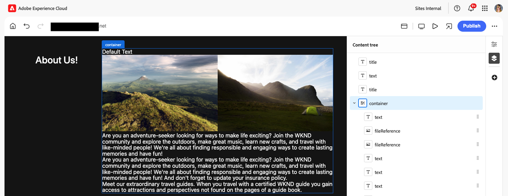
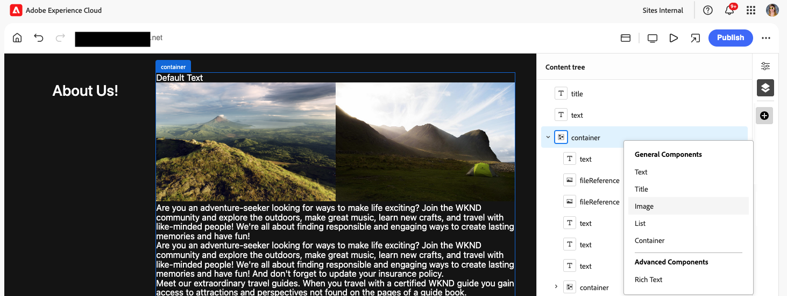

# Creación de contenido con el editor universal {#authoring}

Aprenda lo fácil e intuitivo que es para los autores crear contenido con el editor universal.

## Introducción {#introduction}

El editor universal permite editar cualquier aspecto de cualquier contenido en cualquier implementación para que pueda ofrecer experiencias excepcionales y aumentar la velocidad de contenido.

Para ello, el Editor universal proporciona a los creadores de contenido una IU intuitiva que requiere una formación mínima para comenzar a editar contenido. Este documento describe la experiencia de creación del editor universal.

>[!NOTE]
>
>En este documento se da por hecho que ya está familiarizado con el acceso al Editor universal y la navegación por él. Si no lo está, vea [Acceso y navegación por el editor universal](/help/sites-cloud/authoring/universal-editor/navigation.md).

>[!TIP]
>
>Para obtener una introducción más detallada al editor universal, consulte [Introducción al editor universal](/help/implementing/universal-editor/introduction.md).

## Edición de contenido {#editing-content}

La edición de contenido es sencilla e intuitiva. Al pasar el ratón sobre el contenido en el editor, el contenido editable se resalta con un delgado contorno azul.

>[!TIP]
>
>De forma predeterminada, al tocar o hacer clic en el contenido, se selecciona para editarlo. Si desea navegar por el contenido mediante los siguientes vínculos, cambie a [modo de vista previa](/help/sites-cloud/authoring/universal-editor/navigation.md#preview-mode).

Según el contenido que seleccione, es posible que tenga diferentes opciones de edición in situ, así como información y opciones adicionales para el contenido en el [panel de propiedades](/help/sites-cloud/authoring/universal-editor/navigation.md#properties-rail).

### Edición de texto sin formato {#edit-plain-text}

Puede editar el texto en su lugar haciendo doble clic o pulsando dos veces el componente.

El contorno azul delgado se convierte en un contorno azul grueso para indicar que se ha seleccionado y aparece un cursor. Realice los cambios y, a continuación, pulse intro/retorno o seleccione fuera del cuadro de texto para guardar los cambios.

Al seleccionar el componente de texto, sus detalles se muestran en el [panel de propiedades](/help/sites-cloud/authoring/universal-editor/navigation.md#properties-rail). También puede editar el texto en el panel.

Además, los detalles del texto están disponibles en el panel de propiedades. Los cambios se guardan automáticamente una vez que el enfoque abandona el campo editado en el panel de propiedades.

### Edición de texto enriquecido {#edit-rich-text}

Puede editar el texto en su lugar haciendo doble clic o pulsando dos veces el componente.

Para su comodidad, las opciones de formato y los detalles del texto están disponibles en dos lugares.

#### El menú contextual {#context-menu}

El menú contextual se abre encima del bloque de texto enriquecido y ofrece opciones de formato básicas en contexto. Debido a limitaciones de espacio, algunas opciones pueden estar ocultas detrás del botón de los tres puntos.

Los cambios se guardan automáticamente una vez que el enfoque abandona el campo editado.

#### El panel Propiedades {#properties-rail}

El [panel de propiedades](/help/sites-cloud/authoring/universal-editor/navigation.md#properties-rail) muestra un elemento para el texto seleccionado. Pulse la entrada para abrir un cuadro de diálogo que presente un lienzo más grande para editar el texto.

Pulse o haga clic en **Cancelar** o **Listo** para descartar o guardar los cambios, respectivamente.

#### Opciones de formato de texto enriquecido {#formatting-options}

El editor de texto enriquecido (RTE) del editor universal permite al autor aplicar formato de texto estándar. De forma predeterminada, están disponibles las siguientes opciones.

* Párrafo (h1, h2, h3, etc.)
* Negrita
* Cursiva
* Subrayado
* Superíndice
* Subíndice
* Lista con viñetas
* Lista numerada
* Vínculo

El RTE se puede configurar para ocultar opciones o mostrar opciones adicionales según las necesidades de los autores. Consulte el documento [Configuración del RTE para el editor universal](/help/implementing/universal-editor/configure-rte.md) para obtener más información.

### Edición de medios {#edit-media}

Puede ver sus detalles en el [panel de propiedades](/help/sites-cloud/authoring/universal-editor/navigation.md#properties-rail).

1. Toque o haga clic en la previsualización de la imagen seleccionada en el panel de propiedades.
1. Se abre la ventana [selector de recursos](/help/assets/overview-asset-selector.md#using-asset-selector) para que pueda seleccionar un recurso.
1. Seleccione para seleccionar un nuevo recurso.
1. Seleccione **Select** para volver al panel de propiedades donde se reemplazó el recurso.

Los cambios se guardan automáticamente en el contenido.

### Edición de fragmentos de contenido {#edit-content-fragment}

Si selecciona un [fragmento de contenido](/help/sites-cloud/administering/content-fragments/overview.md), puede editar sus detalles en el [panel de propiedades](/help/sites-cloud/authoring/universal-editor/navigation.md#properties-rail).

Los campos definidos en el modelo de contenido del fragmento de contenido seleccionado se muestran y pueden editarse en el panel de propiedades.

Si selecciona un campo relacionado con un fragmento de contenido, el fragmento de contenido se carga en el panel Componentes y el campo se desplaza automáticamente a.

Los cambios se guardan automáticamente una vez que el enfoque abandona el campo editado en el panel de propiedades.

Si en su lugar desea editar el fragmento de contenido en [editor de fragmentos de contenido](/help/sites-cloud/administering/content-fragments/authoring.md), toque o haga clic en el botón [**Abrir en editor CF**](/help/sites-cloud/authoring/universal-editor/navigation.md#edit) del panel de propiedades.

>[!TIP]
>
>Utilice la tecla de acceso directo `e` para editar el fragmento de contenido seleccionado en el editor de fragmentos de contenido.

Según las necesidades del flujo de trabajo, es posible que desee editar el fragmento de contenido en el editor universal o directamente en el editor de fragmentos de contenido.

>[!NOTE]
>
>El editor universal [valida los campos de fragmento de contenido según sus modelos](/help/assets/content-fragments/content-fragments-models.md#validation), lo que le permite aplicar reglas de integridad de datos como patrones regex y restricciones de exclusividad.
>
>Esto garantiza que el contenido cumple los requisitos de la empresa antes de su publicación.

### Adición de componentes a contenedores {#adding-components}

1. Seleccione un componente contenedor en el [árbol de contenido](/help/sites-cloud/authoring/universal-editor/navigation.md#content-tree-mode) o en el editor.

   

1. A continuación, seleccione el icono de añadir en el panel de propiedades.

   

1. Si se permite más de un componente para el contenedor, seleccione el que desee insertar en la lista desplegable. Si solo se permite un componente, se inserta automáticamente.

El componente se inserta en el contenedor y se puede editar en el editor.

>[!TIP]
>
>Utilice la tecla de acceso directo `a` para agregar un componente al contenedor seleccionado.

### Duplicación de componentes en contenedores {#duplicating-components}

1. Seleccione un componente de un contenedor mediante [el árbol de contenido](/help/sites-cloud/authoring/universal-editor/navigation.md#content-tree-mode) o el editor.
1. A continuación, seleccione el icono **Duplicate** en el panel de propiedades.

   
1. El componente se duplica y se inserta debajo del componente seleccionado.

El componente se inserta en el contenedor y se puede editar en el editor.

### Eliminación de componentes de contenedores {#deleting-components}

1. Seleccione un componente contenedor en el [árbol de contenido](/help/sites-cloud/authoring/universal-editor/navigation.md#content-tree-mode) o en el editor.
1. Seleccione el icono de cheurón del contenedor para expandir su contenido en el árbol de contenido.
1. A continuación, en el árbol de contenido, seleccione un componente dentro del contenedor.
1. Seleccione el icono Eliminar en el panel de propiedades.

   

El componente seleccionado se ha eliminado.

>[!TIP]
>
>Utilice la tecla de acceso directo `Shift+Backspace` para eliminar el componente seleccionado de su contenedor.

### Reordenación de componentes {#reordering-components}

1. Si aún no está en [modo de árbol de contenido](/help/sites-cloud/authoring/universal-editor/navigation.md#content-tree-mode), cambie a él.
1. Seleccione un componente de contenedor en el árbol de contenido o en el editor.
1. Seleccione el icono de cheurón del contenedor para expandir su contenido en el árbol de contenido.
1. Arrastre los iconos de control junto a los componentes dentro del contenedor para mostrar que puede reorganizarlos. Arrastre los componentes para reordenarlos dentro del contenedor.

   

1. El componente arrastrado aparece atenuado en el árbol de contenido, mientras que el punto de inserción se representa mediante una línea azul. Suelte el componente para colocarlo en su nueva ubicación.

Los componentes se reordenan tanto en el árbol de contenido como en el editor.

>[!NOTE]
>
>Los componentes solo se pueden mover entre contenedores si el contenedor de destino [filtro de componentes](/help/implementing/universal-editor/filtering.md) permite el componente seleccionado.

### Deshacer y rehacer {#undo-redo}

Seleccione los botones Deshacer o Rehacer para deshacer o rehacer la última edición en el editor.

* Se pueden deshacer y rehacer las ediciones realizadas en el contexto, las ediciones realizadas a través del panel Propiedades, así como añadir, duplicar, mover y eliminar bloques.
* Deshacer y rehacer está limitado a la sesión actual del explorador.

>[!TIP]
>
>Utilice la tecla de acceso directo `Command-Z` o `Shift-Command-Z` para deshacer o rehacer, respectivamente.

### Copiar y pegar {#copy-paste}

Puede copiar y pegar componentes que se encuentren dentro de [ contenedores.](/help/implementing/universal-editor/field-types.md#container) Esto solo es posible si el contenedor de destino no tiene [filtros configurados](/help/implementing/universal-editor/filtering.md) o si tiene filtros que permitan pegar el componente.

Copiar y pegar pueden estar en la misma pestaña del explorador o entre pestañas del explorador, siempre que las pestañas ya estén abiertas. No puede copiar un elemento y, a continuación, abrir una nueva pestaña del explorador para pegarlo.

1. Seleccione un componente dentro del editor o en el árbol de contenido.
1. El icono **Copiar** aparece en el panel de propiedades [propiedades.](/help/sites-cloud/authoring/universal-editor/navigation.md#properties-panel): toque o haga clic en él.
1. El icono **Pegar** aparece en el panel de propiedades.
1. Seleccione el componente _after_ en el que desea pegar el componente copiado.
1. Haga clic o pulse Pegar.
1. El componente copiado se ha pegado _después de_ el componente seleccionado.

>[!TIP]
>
>Use la tecla de acceso directo `Command-C` o `Command-V` para copiar o pegar, respectivamente.

## Vista previa del contenido {#previewing-content}

Cuando haya terminado de editar el contenido, a menudo querrá navegar por él para ver cómo queda dentro del contenido de otras páginas. En el [modo de vista previa](/help/sites-cloud/authoring/universal-editor/navigation.md#preview-mode), puede hacer clic en los vínculos para navegar por el contenido como lo haría un lector. El contenido se muestra en el editor tal y como se publicaría.

En el modo de vista previa, tocar o hacer clic en el contenido reacciona como lo haría con un lector. Si desea seleccionar el contenido para editarlo, salga de [modo de vista previa](/help/sites-cloud/authoring/universal-editor/navigation.md#preview-mode).

## Edición de herencia de componentes {#inheritance}

La herencia es el mecanismo por el que el contenido se puede vincular de modo que, al cambiar uno, se cambia automáticamente el otro.

Con el editor universal, puede cancelar la herencia del contenido con solo actualizar el contenido. El editor deshabilita automáticamente la herencia para todos los cambios realizados por los autores en esa página, lo que garantiza que el contenido modificado se conserve cuando las actualizaciones se sincronizan desde el modelo.

Si la extensión **AEM Multi-Site-Management (MSM) Extension** está habilitada para su programa, tiene [opciones adicionales de la barra de herramientas](#inheritance-extension) para ver y cambiar el estado de herencia de un componente individual en el Editor universal.

Para obtener más información sobre cómo funciona la herencia mediante el Editor universal, consulte [Herencia de contenido en el Editor universal](/help/sites-cloud/authoring/universal-editor/inheritance.md).

## Características opcionales de la barra de herramientas {#toolbar-options}

Hay funciones adicionales disponibles como extensiones para el editor universal que le ayudarán a administrar mejor sus páginas y contenido. [Un administrador debe habilitar estas extensiones en su programa](/help/implementing/universal-editor/extending.md) antes de que sean visibles para usted como autor de contenido en [la barra de herramientas del editor universal](/help/sites-cloud/authoring/universal-editor/navigation.md#universal-editor-toolbar).

### Herencia {#inheritance-extension}

La extensión **AEM Multi-Site-Management (MSM)** muestra el estado de herencia actual del componente seleccionado y le permite [interrumpir o restablecer la herencia.](/help/sites-cloud/authoring/universal-editor/inheritance.md)

El icono **Herencia instalada** de la barra de herramientas del Editor universal muestra que la herencia sigue activa para el componente seleccionado.

Toque o haga clic en el icono para interrumpir la herencia del componente seleccionado. La herencia se interrumpe automáticamente si edita el componente.

El icono **Herencia interrumpida** muestra que la herencia se ha interrumpido para el componente seleccionado.

Toque o haga clic en el icono para restablecer la herencia del componente seleccionado. Deberá volver a cargar la página para actualizar el contenido y mostrar el contenido heredado.

Para obtener información sobre cómo habilitar esta extensión, [consulte la documentación de Extension Manager.](https://developer.adobe.com/uix/docs/extension-manager/feature-highlights/#enablingdisabling-extensions)

>[!NOTE]
>
>Los iconos **Herencia instalada** y **Herencia rota** solo se muestran cuando se ha seleccionado un componente y la página está basada en un modelo.

>[!NOTE]
>
>La extensión **AEM Multi-Site-Management (MSM)** solo funciona para páginas, no para Fragmentos de contenido.

### Acceso a Propiedades de página {#page-properties}

La **extensión de propiedades de página de AEM** permite un acceso rápido a la [ventana Propiedades de página](/help/sites-cloud/authoring/sites-console/page-properties.md) para la página que se está editando en ese momento.

Pulse o haga clic en el icono **Propiedades de página** de la barra de herramientas del Editor universal para abrir las propiedades de página de la página en una nueva pestaña del explorador.

Para obtener información sobre cómo habilitar esta extensión, [consulte la documentación de Extension Manager.](https://developer.adobe.com/uix/docs/extension-manager/feature-highlights/#enablingdisabling-extensions)

>[!NOTE]
>
>La extensión de propiedades de página de **AEM** solo funciona para páginas, no para fragmentos de contenido.

### Acceder a la consola Sites {#sites-console}

La **extensión AEM Site Admin Extension** permite un acceso rápido a la página que se está editando en la [consola Sites de AEM](/help/sites-cloud/authoring/sites-console/introduction.md), lo que le permite navegar por el árbol del sitio o realizar acciones a nivel de página en la consola.

Toque o haga clic en el icono para abrir la consola Sitios en una nueva pestaña del explorador, navegando a la página que se encuentra actualmente en el editor.

Para obtener información sobre cómo habilitar esta extensión, [consulte la documentación de Extension Manager.](https://developer.adobe.com/uix/docs/extension-manager/feature-highlights/#enablingdisabling-extensions)

### Bloquear y desbloquear páginas {#locking-pages}

La extensión de bloqueo de página de **AEM** muestra el estado de bloqueo actual de la página en el editor y le permite [bloquear o desbloquear la página.](/help/sites-cloud/authoring/sites-console/managing-pages.md#locking-a-page)

El icono **Desbloqueado** de la barra de herramientas del Editor universal muestra que la página que se encuentra en el editor no está bloqueada.

Toque o haga clic en el icono para bloquear la página.

El icono **Bloqueado** de la barra de herramientas del Editor universal muestra que la página que se encuentra en el editor está bloqueada. Pase el ratón sobre el icono para ver una información sobre herramientas que indique el usuario que bloqueó la página.

Toque o haga clic en el icono para desbloquear la página si es el usuario que la ha bloqueado.

Para obtener información sobre cómo habilitar esta extensión, [consulte la documentación de Extension Manager.](https://developer.adobe.com/uix/docs/extension-manager/feature-highlights/#enablingdisabling-extensions)

>[!NOTE]
>
>La extensión **AEM Page Lock Extension** solo funciona para páginas, no para fragmentos de contenido.

### Flujos de trabajo {#workflows}

La **extensión de flujos de trabajo de AEM** le permite [iniciar un flujo de trabajo](/help/sites-cloud/authoring/workflows/overview.md) en la página que se encuentra actualmente en el editor.

Pulse o haga clic en el icono **Flujos de trabajo** de la barra de herramientas del Editor universal para abrir el modal **Iniciar un flujo de trabajo**. La ventana muestra el posible contenido al que se puede aplicar un flujo de trabajo.

1. En el menú desplegable **Modelo de flujo de trabajo**, seleccione el flujo de trabajo que desee aplicar.
1. Proporcione una descripción para el flujo de trabajo en el campo **Nombre**.
1. En la lista **Contenido que incluir en el flujo de trabajo**, utilice las casillas de verificación para definir qué contenido incluir en el flujo de trabajo.
1. Pulse o haga clic en **Iniciar flujo de trabajo** para iniciar el flujo de trabajo o en **Cerrar** para cancelar.

Para obtener información sobre cómo habilitar esta extensión, [consulte la documentación de Extension Manager.](https://developer.adobe.com/uix/docs/extension-manager/feature-highlights/#enablingdisabling-extensions)

### Inicio de sesión de desarrollador {#developer-login}

La extensión de inicio de sesión para desarrolladores **AEM Universal Editor Dev Login Extension** es útil para desarrolladores que se desarrollan localmente, lo que permite autenticarse de manera conveniente en un SDK de AEM local para realizar pruebas.

Toque o haga clic en el icono **Inicio de sesión de desarrollador** de la barra de herramientas del Editor universal para proporcionar sus credenciales de inicio de sesión local e iniciar sesión en su SDK de AEM local.

Para obtener información sobre cómo habilitar esta extensión, [consulte la documentación de Extension Manager.](https://developer.adobe.com/uix/docs/extension-manager/feature-highlights/#enablingdisabling-extensions)

## Características opcionales del panel Propiedades {#properties-panel-options}

Hay funciones adicionales disponibles como extensiones para el editor universal que le ayudarán a administrar aún más el contenido de la página. [Un administrador debe habilitar estas extensiones en su programa](/help/implementing/universal-editor/extending.md) antes de que sean visibles para usted como autor de contenido en [el panel de propiedades del Editor universal.](/help/sites-cloud/authoring/universal-editor/navigation.md#properties-rail)

### Generar variaciones {#generate-variations}

La extensión **Generar variaciones** le permite usar inteligencia artificial generativa (IA) para crear variaciones para el contenido directamente en el panel de propiedades.

Toque o haga clic en el icono **Generar variaciones** en el panel de propiedades del Editor universal para recibir recomendaciones y crear variaciones. Consulte el documento [Generar variaciones: integradas en editores de AEM](/help/generative-ai/generate-variations-integrated-editor.md) para obtener más información sobre cómo funciona la generación de variaciones.

Para obtener información sobre cómo habilitar esta extensión, [consulte la documentación de Extension Manager.](https://developer.adobe.com/uix/docs/extension-manager/feature-highlights/#enablingdisabling-extensions)

## Recursos adicionales {#additional-resources}

Para aprender a publicar contenido con el editor universal, consulte este documento.

* [Publicación de contenido con el editor universal](publishing.md): descubra cómo el editor visual universal publica contenido y cómo sus aplicaciones pueden gestionar el contenido publicado.

Para obtener más información sobre los detalles técnicos del editor universal, consulte estos documentos para desarrolladores.

* [Introducción al editor universal](/help/implementing/universal-editor/introduction.md): Descubra cómo el editor universal permite editar cualquier aspecto de cualquier contenido en cualquier implementación para que pueda ofrecer experiencias excepcionales y aumentar la velocidad de contenido.
* [Introducción al editor universal en AEM](/help/implementing/universal-editor/getting-started.md): obtenga información sobre cómo acceder al editor universal y cómo instrumentar la primera aplicación de AEM para utilizarlo.
* [Arquitectura del editor universal](/help/implementing/universal-editor/architecture.md): obtenga información acerca de la arquitectura del editor universal y cómo fluyen los datos entre sus servicios y capas.
* [Atributos y tipos](/help/implementing/universal-editor/attributes-types.md): obtenga información acerca de los atributos y tipos de datos que requiere el editor universal.
* [Autenticación del editor universal](/help/implementing/universal-editor/authentication.md): obtenga información sobre cómo se autentica el editor universal.
