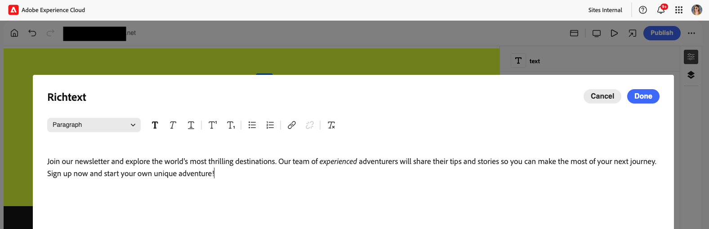

# Creación de contenido con el editor universal {#authoring}

Aprenda lo fácil e intuitivo que es para los autores crear contenido con el editor universal.

## Introducción {#introduction}

El editor universal permite editar cualquier aspecto de cualquier contenido en cualquier implementación para que pueda ofrecer experiencias excepcionales y aumentar la velocidad de contenido.

Para ello, se proporciona una IU intuitiva que requiere una formación mínima para comenzar a editar contenido. Este documento describe la experiencia de creación del editor universal.

>[!NOTE]
>
>En este documento se da por hecho que ya está familiarizado con el acceso al Editor universal y la navegación por él. Si no lo está, vea [Acceso y navegación por el editor universal](/help/sites-cloud/authoring/universal-editor/navigation.md).

>[!TIP]
>
>Para obtener una introducción más detallada al editor universal, consulte [Introducción al editor universal](/help/implementing/universal-editor/introduction.md).

## Edición de contenido {#editing-content}

La edición de contenido es sencilla e intuitiva. Al pasar el ratón sobre el contenido en el editor, el contenido editable se resalta con un delgado contorno azul.

>[!TIP]
>
>De forma predeterminada, al tocar o hacer clic en el contenido, se selecciona para editarlo. Si desea navegar por el contenido mediante los siguientes vínculos, cambie a [modo de vista previa](/help/sites-cloud/authoring/universal-editor/navigation.md#preview-mode).

Según el contenido que seleccione, es posible que tenga diferentes opciones de edición in situ, así como información y opciones adicionales para el contenido en el [panel de propiedades](/help/sites-cloud/authoring/universal-editor/navigation.md#properties-rail).

### Edición de texto sin formato {#edit-plain-text}

Puede editar el texto en su lugar haciendo doble clic o pulsando dos veces el componente.

El contorno azul delgado se convierte en un contorno azul grueso para indicar que se ha seleccionado y aparece un cursor. Realice los cambios y, a continuación, pulse intro/retorno o seleccione fuera del cuadro de texto para guardar los cambios.

Al seleccionar el componente de texto, sus detalles se muestran en el [panel de propiedades](/help/sites-cloud/authoring/universal-editor/navigation.md#properties-rail). También puede editar el texto en el panel.

Además, los detalles del texto están disponibles en el panel de propiedades. Los cambios se guardan automáticamente una vez que el enfoque abandona el campo editado en el panel de propiedades.

### Edición de texto enriquecido {#edit-rich-text}

Puede editar el texto en su lugar haciendo doble clic o pulsando dos veces el componente.

Para su comodidad, las opciones de formato y los detalles del texto están disponibles en dos lugares.

#### El menú contextual {#context-menu}

El menú contextual se abre encima del bloque de texto enriquecido y ofrece opciones de formato básicas en contexto. Debido a limitaciones de espacio, algunas opciones pueden estar ocultas detrás del botón de los tres puntos.

Los cambios se guardan automáticamente una vez que el enfoque abandona el campo editado.

#### El panel Propiedades {#properties-rail}

El [panel de propiedades](/help/sites-cloud/authoring/universal-editor/navigation.md#properties-rail) muestra un elemento para el texto seleccionado. Pulse la entrada para abrir un cuadro de diálogo que presente un lienzo más grande para editar el texto.

Pulse o haga clic en **Cancelar** o **Listo** para descartar o guardar los cambios, respectivamente.

### Edición de medios {#edit-media}

Puede ver sus detalles en el [panel de propiedades](/help/sites-cloud/authoring/universal-editor/navigation.md#properties-rail).

1. Toque o haga clic en la previsualización de la imagen seleccionada en el panel de propiedades.
1. Se abre la ventana [selector de recursos](/help/assets/overview-asset-selector.md#using-asset-selector) para que pueda seleccionar un recurso.
1. Seleccione para seleccionar un nuevo recurso.
1. Seleccione **Select** para volver al panel de propiedades donde se reemplazó el recurso.

Los cambios se guardan automáticamente en el contenido.

### Edición de fragmentos de contenido {#edit-content-fragment}

Si selecciona un [fragmento de contenido](/help/sites-cloud/administering/content-fragments/overview.md), puede editar sus detalles en el [panel de propiedades](/help/sites-cloud/authoring/universal-editor/navigation.md#properties-rail).

Los campos definidos en el modelo de contenido del fragmento de contenido seleccionado se muestran y pueden editarse en el panel de propiedades.

Si selecciona un campo relacionado con un fragmento de contenido, el fragmento de contenido se carga en el panel Componentes y el campo se desplaza automáticamente a.

Los cambios se guardan automáticamente una vez que el enfoque abandona el campo editado en el panel de propiedades.

Si en su lugar desea editar el fragmento de contenido en [editor de fragmentos de contenido](/help/sites-cloud/administering/content-fragments/authoring.md), toque o haga clic en el botón [**Abrir en editor CF**](/help/sites-cloud/authoring/universal-editor/navigation.md#edit) del panel de propiedades.

>[!TIP]
>
>Utilice la tecla de acceso directo `e` para editar el fragmento de contenido seleccionado en el editor de fragmentos de contenido.

Según las necesidades del flujo de trabajo, es posible que desee editar el fragmento de contenido en el editor universal o directamente en el editor de fragmentos de contenido.

>[!NOTE]
>
>El editor universal [valida los campos de fragmento de contenido según sus modelos](/help/assets/content-fragments/content-fragments-models.md#validation), lo que le permite aplicar reglas de integridad de datos como patrones regex y restricciones de exclusividad.
>
>Esto garantiza que el contenido cumple los requisitos de la empresa antes de su publicación.

### Adición de componentes a contenedores {#adding-components}

1. Seleccione un componente contenedor en el [árbol de contenido](/help/sites-cloud/authoring/universal-editor/navigation.md#content-tree-mode) o en el editor.

   

1. A continuación, seleccione el icono de añadir en el panel de propiedades.

   

El componente se inserta en el contenedor y se puede editar en el editor.

>[!TIP]
>
>Utilice la tecla de acceso directo `a` para agregar un componente al contenedor seleccionado.

### Duplicación de componentes en contenedores {#duplicating-components}

1. Seleccione un componente de un contenedor mediante [el árbol de contenido](/help/sites-cloud/authoring/universal-editor/navigation.md#content-tree-mode) o el editor.
1. A continuación, seleccione el icono **Duplicate** en el panel de propiedades.

   
1. El componente se duplica y se inserta debajo del componente seleccionado.

El componente se inserta en el contenedor y se puede editar en el editor.

### Eliminación de componentes de contenedores {#deleting-components}

1. Seleccione un componente contenedor en el [árbol de contenido](/help/sites-cloud/authoring/universal-editor/navigation.md#content-tree-mode) o en el editor.
1. Seleccione el icono de cheurón del contenedor para expandir su contenido en el árbol de contenido.
1. A continuación, en el árbol de contenido, seleccione un componente dentro del contenedor.
1. Seleccione el icono Eliminar en el panel de propiedades.

   

El componente seleccionado se ha eliminado.

>[!TIP]
>
>Utilice la tecla de acceso directo `Shift+Backspace` para eliminar el componente seleccionado de su contenedor.

### Reordenación de componentes {#reordering-components}

1. Si aún no está en [modo de árbol de contenido](/help/sites-cloud/authoring/universal-editor/navigation.md#content-tree-mode), cambie a él.
1. Seleccione un componente de contenedor en el árbol de contenido o en el editor.
1. Seleccione el icono de cheurón del contenedor para expandir su contenido en el árbol de contenido.
1. Arrastre los iconos de control junto a los componentes dentro del contenedor para mostrar que puede reorganizarlos. Arrastre los componentes para reordenarlos dentro del contenedor.

   

1. El componente arrastrado se vuelve gris en el árbol de contenido, mientras que el punto de inserción se representa mediante una línea azul. Suelte el componente para colocarlo en su nueva ubicación.

Los componentes se reordenan tanto en el árbol de contenido como en el editor.

>[!NOTE]
>
>Los componentes solo se pueden mover entre contenedores si el contenedor de destino [filtro de componentes](/help/implementing/universal-editor/filtering.md) permite el componente seleccionado.

### Creación de variaciones utilizando GenAI con Generar variaciones {#generate-variations-ai}

Utilice Variaciones generativas para aprovechar la IA generativa y acelerar la creación de contenido.

Abra el Editor universal para buscar el punto de entrada para Generar variaciones.

Consulte [Generar variaciones: integradas en editores de AEM](/help/generative-ai/generate-variations-integrated-editor.md) para obtener más información.

## Vista previa del contenido {#previewing-content}

Cuando haya terminado de editar el contenido, a menudo querrá navegar por él para ver cómo queda dentro del contenido de otras páginas. En el [modo de vista previa](/help/sites-cloud/authoring/universal-editor/navigation.md#preview-mode), puede hacer clic en los vínculos para navegar por el contenido como lo haría un lector. El contenido se muestra en el editor tal y como se publicaría.

En el modo de vista previa, tocar o hacer clic en el contenido reacciona como lo haría con un lector. Si desea seleccionar el contenido para editarlo, salga de [modo de vista previa](/help/sites-cloud/authoring/universal-editor/navigation.md#preview-mode).

## Recursos adicionales {#additional-resources}

Para aprender a publicar contenido con el editor universal, consulte este documento.

* [Publicación de contenido con el editor universal](publishing.md): aprenda cómo el editor universal publica contenido y cómo sus aplicaciones pueden gestionar el contenido publicado.

Para obtener más información sobre los detalles técnicos del editor universal, consulte estos documentos para desarrolladores.

* [Introducción al editor universal](/help/implementing/universal-editor/introduction.md): Descubra cómo el editor universal permite editar cualquier aspecto de cualquier contenido en cualquier implementación para que pueda ofrecer experiencias excepcionales y aumentar la velocidad de contenido.
* [Introducción al editor universal en AEM](/help/implementing/universal-editor/getting-started.md): obtenga información sobre cómo acceder al editor universal y cómo instrumentar la primera aplicación de AEM para utilizarlo.
* [Arquitectura del editor universal](/help/implementing/universal-editor/architecture.md): obtenga información acerca de la arquitectura del editor universal y cómo fluyen los datos entre sus servicios y capas.
* [Atributos y tipos](/help/implementing/universal-editor/attributes-types.md): obtenga información acerca de los atributos y tipos de datos que requiere el editor universal.
* [Autenticación del editor universal](/help/implementing/universal-editor/authentication.md): obtenga información sobre cómo se autentica el editor universal.

## Edición de herencia de componentes {#inheritance}

La herencia es el mecanismo por el que el contenido se puede vincular de modo que, al cambiar uno, se cambia automáticamente el otro.

Con el editor universal, puede cancelar la herencia del contenido con solo actualizar el contenido. El editor deshabilita automáticamente la herencia para todos los cambios realizados por los autores en esa página, lo que garantiza que el contenido modificado se conserve cuando las actualizaciones se sincronizan desde el modelo.

Para obtener más información sobre cómo funciona la herencia mediante el Editor universal, consulte [Herencia de contenido en el Editor universal](/help/sites-cloud/authoring/universal-editor/inheritance.md).
