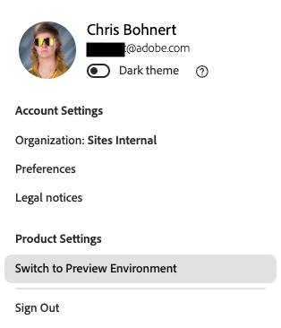

# Acceder y navegar por el editor universal {#navigating}

Conozca los conceptos básicos del acceso y la navegación por el Editor universal.

## Introducción {#introduction}

El editor universal permite editar cualquier aspecto de todo tipo de contenido en todas las implementaciones para que pueda ofrecer experiencias excepcionales, aumentar la velocidad del contenido y proporcionar una experiencia de última generación a los desarrolladores.

Para ello, el Editor universal proporciona a los creadores de contenido una IU intuitiva que requiere una formación mínima para comenzar a editar contenido. En este documento se describe cómo desplazarse por el editor universal.

>[!TIP]
>
>* Para obtener más información sobre la creación mediante el editor universal, consulte el documento [Creación de contenido con el editor universal](/help/sites-cloud/authoring/universal-editor/authoring.md).
>* Para obtener una introducción más detallada al editor universal, consulte [Introducción al editor universal](/help/implementing/universal-editor/introduction.md).

## Preparación de la aplicación {#prepare-app}

Para poder crear contenido para una aplicación con el editor universal, el desarrollador debe instrumentarla para que admita el editor.

>[!TIP]
>
>Consulte el documento [Introducción al editor universal en AEM](/help/implementing/universal-editor/getting-started.md) para ver un ejemplo de cómo configurar una aplicación de AEM para que funcione con el editor universal.

## Acceso al editor universal {#accessing}

Una vez que la aplicación está instrumentada para trabajar con el editor universal, este puede acceder tanto dentro de AEM as a Cloud Service como directamente sin acceder a AEM.

### Acceso en AEM as a Cloud Service {#accessing-aem}

1. Inicie sesión en la instancia de creación de AEM as a Cloud Service.
1. Use la consola [**Sites**](/help/sites-cloud/authoring/sites-console/introduction.md) para navegar a la página creada para usarla con el editor universal que desee editar.
1. Edite la página.
1. El editor universal se abre para editar la página seleccionada.

>[!NOTE]
>
>Al editar una página en la consola [**Sites**](/help/sites-cloud/authoring/sites-console/introduction.md), la consola abrirá el editor apropiado para la [plantilla](/help/sites-cloud/authoring/page-editor/templates.md) de la página, ya sea el editor universal descrito en este documento o el [editor de páginas](/help/sites-cloud/authoring/page-editor/introduction.md).

### Acceso directo {#accessing-directly}

1. Inicie sesión en el editor universal. Necesita un Adobe ID para iniciar sesión y [tener acceso al editor universal](/help/implementing/universal-editor/getting-started.md#request-access).

1. Una vez que haya iniciado sesión, escriba la dirección URL de la página que desea editar en la [barra de ubicación](#location-bar), para que pueda empezar a editar contenido, como contenido de texto o contenido multimedia.

## Comprensión de la IU {#ui}

La interfaz de usuario de se divide en estas áreas principales.

* [El encabezado de Experience Cloud](#experience-cloud-header)
* [Barra de herramientas del Editor universal](#universal-editor-toolbar)
* [El editor](#editor)
* [El panel Propiedades](#properties-rail)

>[!TIP]
>
>El editor universal ofrece una serie de [opciones de personalización](/help/implementing/universal-editor/customizing.md) y [puntos de extensión](/help/implementing/universal-editor/extending.md) que pueden modificar y agregar a la funcionalidad del editor. Por este motivo, es posible que vea opciones diferentes a las estándar documentadas aquí.

### El encabezado de Experience Cloud {#experience-cloud-header}

El encabezado de Experience Cloud siempre está presente en la parte superior de la pantalla. Es un anclaje que le dice dónde se encuentra dentro de Experience Cloud y le ayuda a navegar a otras aplicaciones.

#### Experience Manager {#experience-manager}

Seleccione el vínculo de Adobe Experience Cloud a la izquierda del encabezado para ir a la raíz de su solución de Experience Manager y acceder a herramientas como [Cloud Manager](/help/onboarding/cloud-manager-introduction.md), [Cloud Acceleration Manager](/help/journey-migration/cloud-acceleration-manager/introduction/overview-cam.md) y [Distribución de software](https://experienceleague.adobe.com/docs/experience-cloud/software-distribution/home.html?lang=es).

#### Organización {#organization}

Muestra la organización en la que ha iniciado sesión. Seleccione esta opción para cambiar a otra organización si su Adobe ID está asociado a varias.

#### Centro de ayuda {#help}

El icono del centro de ayuda proporciona acceso rápido a los recursos de aprendizaje y asistencia.

#### Notificaciones {#notifications}

Este icono tiene el número de [notificaciones](/help/implementing/cloud-manager/notifications.md) incompletas asignadas actualmente.

#### Aplicaciones {#solutions}

Al tocar o hacer clic en el conmutador de aplicación, puede ir rápidamente a otras soluciones de Experience Cloud.

#### Cuenta {#user-properties}

Seleccione el icono que representa al usuario para acceder a la configuración de la cuenta. Si no tiene una imagen de usuario configurada, se le asigna un icono de forma aleatoria.

Al tocar o hacer clic en el icono Cuenta, se abre un menú con la configuración del usuario. Esta configuración se aplica a Cloud Manager en general y sus características se detallan [&#x200B; en esa documentación.](/help/implementing/cloud-manager/navigation.md)

Para el editor universal, bajo el encabezado **Configuración del producto**, hay una opción para cambiar entre la versión de producción actual del editor universal y la próxima versión de vista previa.

### Barra de herramientas del editor universal {#universal-editor-toolbar}

La barra de herramientas del editor universal siempre está presente en la parte superior de la pantalla justo debajo de [el encabezado de Experience Cloud](#experience-cloud-header). Esto le permite desplazarse rápidamente a otra página para editarla y publicarla.

Según la configuración del programa, también puede presentar [características adicionales que el administrador haya habilitado como extensiones.](#additional-toolbar-buttons)

#### El botón Inicio {#home-button}

El botón Inicio le devuelve a la página de inicio del Editor universal

En la página de inicio puede introducir la dirección URL del sitio que desea editar con el editor universal.

>[!NOTE]
>
>Cualquier página que desee editar con el editor universal debe estar [instrumentada para admitir el editor universal](/help/implementing/universal-editor/getting-started.md).

La sección **Vínculos rápidos** proporciona recursos de ayuda y la sección **Recientes** proporciona vínculos a páginas que ha abierto recientemente con el Editor universal.

#### Barra de ubicación {#location-bar}

La barra de ubicación muestra la dirección de la página que está editando. Seleccione para introducir la dirección de otra página que desea editar.

>[!TIP]
>
>Utilice la tecla de acceso directo `l` (la letra l) para abrir la barra de direcciones.

>[!NOTE]
>
>Cualquier página que desee editar con el editor universal debe estar [instrumentada para admitir el editor universal](/help/implementing/universal-editor/getting-started.md).

#### Deshacer y rehacer {#undo-redo}

Seleccione los botones Deshacer o Rehacer para deshacer o rehacer la última edición en el editor. Consulte el documento [Creación de contenido con el editor universal](/help/sites-cloud/authoring/universal-editor/authoring.md#undo-redo) para obtener más información.

>[!TIP]
>
>Utilice la tecla de acceso directo `Command-Z` o `Shift-Command-Z` para deshacer o rehacer, respectivamente.

#### Encabezados de autenticación {#authentication-settings}

Seleccione el icono de encabezados de autenticación si necesita [establecer un encabezado de autenticación personalizado con fines de desarrollo local](/help/implementing/universal-editor/developer-overview.md#auth-header).

#### Modo adaptable {#emulator}

Seleccione el icono de modo interactivo para definir cómo el editor universal procesa la página.

Al tocar o hacer clic en el icono de modo interactivo, se muestran las opciones.

De forma predeterminada, el editor se abre en un diseño de escritorio en el que el explorador define automáticamente la altura y la anchura.

En el editor universal, también puede emular un dispositivo móvil, además de lo siguiente:

* Definir su orientación
* Definir la anchura y la altura
* Cambiar la orientación

#### Vista previa {#preview-mode}

En el modo de vista previa, la página se procesa en el editor tal como se vería en el servicio publicado. Esto permite al autor del contenido navegar por el contenido haciendo clic en vínculos, etc.

>[!TIP]
>
>Utilice la tecla de acceso directo `p` para alternar desde y hacia el modo de vista previa.

#### Abrir página {#open-page}

Seleccione el icono de abrir página para abrir la página que está editando en su propia pestaña del explorador, sin utilizar el editor, para previsualizar el contenido.

>[!TIP]
>
>Utilice la tecla de acceso directo `o` (la letra o) para abrir la vista previa de la aplicación.

>[!TIP]
>
>La URL de vista previa de su aplicación [se puede personalizar](/help/implementing/universal-editor/customizing.md#custom-preview-urls).

>[!NOTE]
>
>El botón Abrir página [se puede deshabilitar](/help/implementing/universal-editor/customizing.md#open-page) y, por lo tanto, es posible que no aparezca en el editor.

#### Publicación {#publish}

Seleccione el botón Publicar para poder publicar los cambios en el contenido publicado para que los lectores lo consuman o en un entorno de vista previa para su revisión.

>[!TIP]
>
>Consulte el documento [Publicación de contenido con el editor universal](publishing.md) para obtener más información sobre cómo publicar con el editor universal.

>[!NOTE]
>
>El botón de publicación [se puede deshabilitar](/help/implementing/universal-editor/customizing.md#disable-publish) y, por lo tanto, es posible que no aparezca en el editor.

#### Puntos suspensivos {#ellipsis}

Se puede acceder a las opciones adicionales y estándar mediante el botón de los tres puntos.

Por ejemplo, se puede cancelar la publicación de una página (es decir, invertir la acción del botón [**Publish**](#publish)) con el botón de los tres puntos.

#### Botones adicionales {#additional-toolbar-buttons}

El editor universal ofrece una experiencia de creación personalizable y ampliable. Si ve botones adicionales en la barra de herramientas, se ha ampliado el editor universal.

* Para obtener más información sobre cómo funciona una extensión individual, [consulte la documentación de creación del editor universal.](/help/sites-cloud/authoring/universal-editor/authoring.md#toolbar-options)
* Para obtener más información sobre las posibilidades de extensión, consulte [Ampliación del editor universal.](/help/implementing/universal-editor/extending.md)
* Para obtener más información sobre cómo instalar una extensión individual, consulte la [documentación de Extension Manager.](https://developer.adobe.com/uix/docs/extension-manager/extension-developed-by-adobe/)

### El Editor {#editor}

El editor ocupa la mayor parte de la ventana y es donde se procesa la página especificada en [la barra de ubicación](#location-bar).

Si el editor se encuentra en [modo de vista previa](#preview-mode), el contenido se podrá navegar y podrá seguir los vínculos, pero no podrá editar el contenido.

### Panel Propiedades {#properties-rail}

El panel de propiedades siempre está presente a la derecha del editor. Según su modo, puede mostrar detalles de un componente seleccionado en el contenido o la jerarquía del contenido de la página.

Según la configuración del programa, también puede presentar [características adicionales que el administrador haya habilitado como extensiones.](#additional-properties-panel-buttons)

#### Modo propiedades {#properties-mode}

En el modo de propiedades, el panel muestra las propiedades del componente seleccionado actualmente en el editor. Este es el modo predeterminado del panel de propiedades cuando se carga una página.

Según el tipo de componente que seleccione, los detalles se pueden mostrar y modificar en el panel de propiedades.

No todos los componentes tienen detalles que se puedan mostrar o editar.

>[!TIP]
>
>Utilice la tecla de acceso directo `d` para cambiar al modo de propiedades.

#### Modo de árbol de contenido {#content-tree-mode}

En el modo de árbol de contenido, el panel muestra la jerarquía del contenido de la página.

* Al seleccionar un elemento en el árbol de contenido, el editor se desplaza hasta ese contenido y lo selecciona.
* Al hacer doble clic en un elemento del árbol de contenido, el editor se desplaza hasta ese contenido, lo selecciona y también abre las propiedades asociadas en el modo de [propiedades.](#properties-mode)

>[!TIP]
>
>Utilice la tecla de acceso directo `f` para cambiar al modo de árbol de contenido.

##### Abrir en editor CF {#edit}

Al editar, las opciones del componente seleccionado aparecen en el panel de propiedades, donde puede editar el componente seleccionado. Si el componente seleccionado es un fragmento de contenido, también puede seleccionar el botón **Abrir en el editor de CF**.

Al tocar o hacer clic en el botón **Abrir en el editor de CF**, se abre el [editor de fragmentos de contenido](/help/assets/content-fragments/content-fragments-managing.md#opening-the-fragment-editor) en una nueva pestaña. Esto le permite acceder a toda la potencia del editor de fragmentos de contenido para editar el fragmento de contenido asociado.

Según las necesidades del flujo de trabajo, es posible que desee editar el fragmento de contenido en el editor universal o directamente en el editor de fragmentos de contenido.

>[!TIP]
>
>Utilice la tecla de acceso directo `e` para abrir un fragmento de contenido seleccionado en el editor de fragmentos de contenido.

##### Añadir {#add}

Si selecciona un componente contenedor en el árbol de contenido o en el editor, la opción Añadir aparecerá en el panel de propiedades.

Al tocar o hacer clic en el botón Agregar, se abre un menú desplegable de componentes disponibles para [agregar al contenedor seleccionado](/help/sites-cloud/authoring/universal-editor/authoring.md#adding-components).

>[!TIP]
>
>Utilice la tecla de acceso directo `a` para agregar un componente a un componente contenedor seleccionado.

##### Duplicado {#duplicate}

Si selecciona un componente dentro de un componente contenedor en el árbol de contenido o en el editor, la opción duplicar aparece en el panel de propiedades.

Al tocar o hacer clic en el botón duplicado [se duplica el componente seleccionado](/help/sites-cloud/authoring/universal-editor/authoring.md#duplicating-components).

##### Eliminar {#delete}

Si selecciona un componente dentro de un componente contenedor en el árbol de contenido o en el editor, la opción Eliminar aparece en el panel de propiedades.

Al tocar o hacer clic en el botón Eliminar [se elimina el componente](/help/sites-cloud/authoring/universal-editor/authoring.md#deleting-components).

>[!TIP]
>
>Utilice la tecla de acceso directo `Shift+Backspace` para eliminar un componente seleccionado de un contenedor.

##### Copiar y pegar {#copy-paste}

Puede copiar y pegar componentes que se encuentren dentro de [contenedores.](/help/implementing/universal-editor/field-types.md#container)

>[!TIP]
>
>Use la tecla de acceso directo `Command-C` o `Command-V` para copiar o pegar, respectivamente.

Consulte el documento [Creación de contenido con el editor universal](/help/sites-cloud/authoring/universal-editor/authoring.md#copy-paste) para obtener más información.

#### Botones adicionales {#additional-properties-panel-buttons}

El editor universal ofrece una experiencia de creación personalizable y ampliable. Si ve botones adicionales en el panel de propiedades, se ha ampliado el editor universal.

* Para obtener más información sobre cómo funciona una extensión individual, [consulte la documentación de creación del editor universal.](/help/sites-cloud/authoring/universal-editor/authoring.md#properties-panel-options)
* Para obtener más información sobre las posibilidades de extensión, consulte [Ampliación del editor universal.](/help/implementing/universal-editor/extending.md)
* Para obtener más información sobre cómo instalar una extensión individual, consulte la [documentación de Extension Manager.](https://developer.adobe.com/uix/docs/extension-manager/extension-developed-by-adobe/)

## Próximos pasos {#next-steps}

Ahora que sabe cómo acceder al Editor universal y navegar por él, está listo para [crear contenido con él](/help/sites-cloud/authoring/universal-editor/authoring.md).
