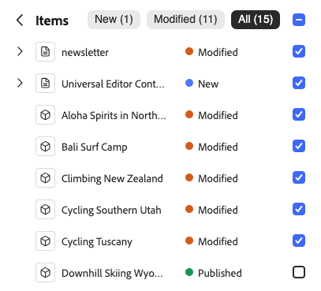

# Publicación de contenido con el editor universal {#publishing}

Descubra cómo el editor universal publica contenido y cómo sus aplicaciones pueden gestionar el contenido publicado.

>[!TIP]
>
>El proceso de publicación que se describe aquí es la función predeterminada estándar del editor universal.
>
>El editor universal también admite [extensiones y extensibilidad de la interfaz de usuario](/help/implementing/universal-editor/extending.md) para permitir que los flujos de trabajo admitan el proceso de publicación, por lo que el flujo de publicación puede variar.

## Publicación de contenido desde el editor universal {#publishing-content}

Cuando usted, como autor de contenido, esté listo para publicar su contenido, solo tiene que tocar o hacer clic en el icono **Publicar** en la barra de herramientas del Editor universal.

1. En el Editor universal, pulse o haga clic en [el icono **Publicar** de la barra de herramientas del Editor universal.](/help/sites-cloud/authoring/universal-editor/navigation.md#publish)
1. Si tienes un [servicio de vista previa](/help/sites-cloud/authoring/sites-console/previewing-content.md) disponible, puedes elegir dónde publicar el contenido, ya sea en **[Vista previa](/help/sites-cloud/authoring/sites-console/previewing-content.md)** (si está disponible) o en **Publicar**.
1. La sección **Elementos** enumera el contenido que se incluye en la publicación. Pulse o haga clic en **Ver** para mostrar los detalles, incluidos:
   * **Nuevos** elementos que aún no se han publicado.
   * **Modificado** contenido que se ha publicado, pero modificado desde la última publicación.
   * **Publicado** contenido que se ha publicado y no se ha modificado desde esa publicación.

   Pulse o haga clic en las casillas de verificación situadas junto a esos elementos para incluirlos o excluirlos de la publicación, según sea necesario. Pulse o haga clic en **Extender** para ver los elementos individuales incluidos en los totales de las tres categorías y para poder incluirlos o excluirlos individualmente.

   

   Pulse o haga clic en la flecha hacia atrás situada junto al encabezado **Elementos** para volver a la descripción general.

1. Pulse o haga clic en **Publicar** para publicar o en **Cancelar** para cancelar.

>[!NOTE]
>
>La opción de publicar para obtener una vista previa de [se puede deshabilitar](/help/implementing/universal-editor/customizing.md#publish-preview) y, por lo tanto, es posible que no aparezca en el editor.

## Cancelar la publicación de contenido desde el editor universal {#unpublishing-content}

La cancelación de la publicación de contenido funciona de manera similar a la publicación de contenido. Cuando usted, como autor de contenido, esté listo para quitar contenido de la publicación, toque o haga clic en el icono de puntos suspensivos en la barra de herramientas del Editor universal y, a continuación, **Cancelar la publicación**.

Entonces tiene las mismas opciones para cancelar la publicación de contenido que tenía al [publicar contenido.](#publishing-content) incluida la cancelación de la publicación de una instancia de vista previa si está disponible y qué elementos se incluirán en la cancelación de la publicación.

## Publicar y cancelar la publicación desde la consola Sitios {#publishing-sites-console}

También puede publicar [desde la consola Sitios,](/help/sites-cloud/authoring/sites-console/publishing-pages.md), lo que puede resultar útil cuando desea publicar varias páginas de contenido o programar la publicación o cancelación de la publicación.

## Recursos adicionales {#additional-resources}

Para aprender a crear contenido con el editor universal, consulte este documento.

* [Creación de contenido con el editor universal](authoring.md): aprenda lo fácil e intuitivo que es para los autores de contenido crearlo con el editor universal.

Para obtener más información sobre los detalles técnicos del editor universal, consulte estos documentos para desarrolladores.

* [Introducción al editor universal](/help/implementing/universal-editor/introduction.md): descubra cómo el editor universal permite editar cualquier aspecto de los contenidos en varias implementaciones para ofrecer experiencias excepcionales, aumentar la velocidad de contenido y proporcionar una experiencia de desarrollador de última generación.
* [Introducción al editor universal en AEM](/help/implementing/universal-editor/getting-started.md): obtenga información sobre cómo acceder al editor universal y cómo instrumentar la primera aplicación de AEM para utilizarlo.
* [Arquitectura del editor universal](/help/implementing/universal-editor/architecture.md): obtenga información acerca de la arquitectura del editor universal y cómo fluyen los datos entre sus servicios y capas.
* [Atributos y tipos](/help/implementing/universal-editor/attributes-types.md): obtenga información acerca de los atributos y tipos de datos que requiere el editor universal.
* [Autenticación del editor universal](/help/implementing/universal-editor/authentication.md): obtenga información sobre cómo se autentica el editor universal.
