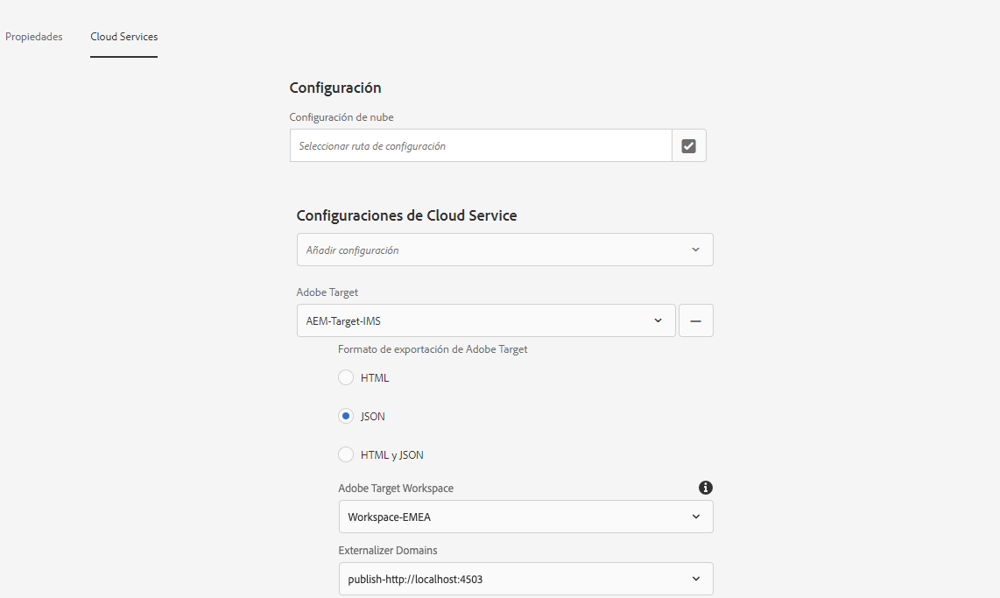
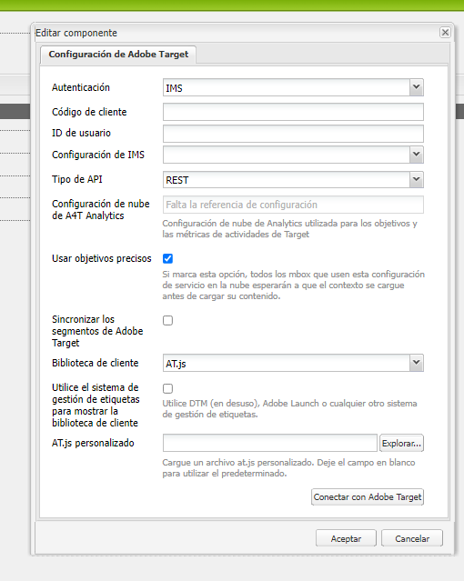

# Exportación de fragmentos de contenido a Adobe Target {#exporting-content-fragments-to-adobe-target}

>[!CAUTION]
>
>AEM debe integrarse con Adobe Target según las instrucciones de [Integración con Adobe Target](/help/sites-cloud/integrating/integrating-adobe-target.md).

Puede exportar [Fragmentos de contenido](/help/sites-cloud/authoring/fragments/content-fragments.md), creados en Adobe Experience Manager as a Cloud Service (AEM), a Adobe Target (Target). Luego pueden utilizarse como ofertas en actividades de Target para probar y personalizar experiencias a escala.

Hay una opción disponible para exportar un fragmento de contenido a Adobe Target:

* JSON: Compatibilidad con entrega de contenido sin encabezado

<!-- * GraphQL query ??? -->

Para preparar la instancia para exportar fragmentos de contenido de AEM a Adobe Target, debe hacer lo siguiente:

* [Integración con Adobe Target](/help/sites-cloud/integrating/integrating-adobe-target.md)
* [Agregar la configuración de nube](#add-the-cloud-configuration)
* [Agregar la configuración heredada](#add-the-legacy-configuration)

Después, puede:

* [Exportar un fragmento de contenido a Adobe Target](#exporting-a-content-fragment-to-adobe-target)
* [Usar los fragmentos de contenido en Adobe Target](#using-your-content-fragments-in-adobe-target)
* Y también [Eliminar un fragmento de contenido ya exportado a Adobe Target](#deleting-a-content-fragment-already-exported-to-adobe-target)

Los fragmentos de contenido se pueden exportar al espacio de trabajo predeterminado en Adobe Target o a espacios de trabajo definidos por el usuario para Adobe Target.

>[!NOTE]
>
>Los espacios de trabajo de Adobe Target no existen en Adobe Target. Se definen y administran en Adobe IMS (Sistema Identity Management) y, a continuación, se seleccionan para su uso en todas las soluciones mediante la consola de Adobe Developer.

>[!NOTE]
>
>Los espacios de trabajo de Adobe Target se pueden utilizar para permitir a los miembros de una organización (grupo) crear y administrar ofertas y actividades solo para esta organización; sin dar acceso a otros usuarios. Por ejemplo, las organizaciones específicas de los países dentro de una preocupación mundial.

## Requisitos previos {#prerequisites}

Se requiere la siguiente acción:

1. Tiene que [integrar AEM con Adobe Target](/help/sites-cloud/integrating/integrating-adobe-target.md).

<!-- link rewriter - targets in content-fragments-customizing do not exist yet

1. Content Fragments are exported from the AEM author instance, so you need to [Configure the AEM Link Externalizer](/help/implementing/developing/extending/content-fragments-customizing.md#configuring-the-aem-link-externalizer) on the author instance to ensure that any references within the Content Fragment are externalized for web delivery.

   >[!NOTE]
   >
   >For link rewriting not covered by the default, the [Content Fragment Link Rewriter Provider](/help/implementing/developing/extending/content-fragments-customizing.md#the-content-fragment-link-rewriter-provider-html) is available. With this, customized rules can be developed for your instance.
-->

## Agregar la configuración de nube {#add-the-cloud-configuration}

Antes de exportar un fragmento, debe agregar la **Configuración de nube** para **Adobe Target** al fragmento o carpeta. Esto también le permite:

* especificar las opciones de formato que se utilizarán para la exportación
* seleccionar un espacio de trabajo de Target como destino

Las opciones requeridas se pueden seleccionar en **Properties** de la carpeta requerida; la especificación se hereda según sea necesario.

1. Vaya a la consola **Recursos**.

1. Abra **Propiedades** para la carpeta correspondiente.

   >[!NOTE]
   >
   >Si agrega la configuración de nube a la carpeta principal del fragmento de contenido, la configuración la heredan todas las tareas secundarias.

1. Seleccione la pestaña **Cloud Services**.

1. En **Configuración de Cloud Service**, seleccione la configuración de destino en la lista desplegable.

1. Seleccione su espacio de trabajo de Adobe Target.

   Por ejemplo:

   

1. **Guardar y cerrar**.

## Agregar la configuración heredada {#add-the-legacy-configuration}

<!-- This is effectively the Manually Integrating with Adobe Target {#manually-integrating-with-adobe-target} section from 6.5 -->

>[!IMPORTANT]
>
>Añadir una nueva configuración heredada es un caso especial que solo se admite para la exportación de fragmentos de contenido.

Después [adición de la configuración de nube](#add-the-cloud-configuration) para utilizar Experience Platform Launch, para integrar inicialmente AEM con Adobe Target, también debe integrarlo manualmente con Adobe Target mediante una configuración heredada.

### Creación de una configuración de Target Cloud {#creating-a-target-cloud-configuration}

Para permitir que AEM interactúe con Adobe Target, cree una configuración de nube de Target. Para crear la configuración, proporcione el código de cliente de Adobe Target y las credenciales de usuario.

La configuración de la nube de Target solo se crea una vez porque se puede asociar con varias campañas de AEM. Si tiene varios códigos de cliente de Adobe Target, cree una configuración para cada código de cliente.

Puede configurar la configuración de nube para sincronizar segmentos desde Adobe Target. Si activa la sincronización, los segmentos se importan desde Target en segundo plano en cuanto se guarda la configuración de la nube.

Utilice el siguiente procedimiento para crear una configuración de nube de Target en AEM:

1. Vaya a **Cloud Services heredados** a través de la variable **Logotipo de AEM** > **Herramientas** > **Cloud Services** > **Cloud Services heredados**.
Por ejemplo: ([http://localhost:4502/libs/cq/core/content/tools/cloudservices.html](http://localhost:4502/libs/cq/core/content/tools/cloudservices.html))

   Se abre la página de información general de **Adobe Experience Cloud**.

1. En la sección **Adobe Target**, haga clic en **Configurar ahora**.
1. En el cuadro de diálogo **Crear configuración**:

   1. Asigne una configuración a **Título**.
   1. Seleccione la plantilla **Configuración de Adobe Target**.
   1. Haga clic en **Crear**.

Ahora puede seleccionar la nueva configuración para editarla.

1. Se abre el cuadro de diálogo de edición.

   

   <!-- Can this still occur?

   >[!NOTE]
   >
   >When configuring A4T with AEM, you may see a Configuration reference missing entry. To be able to select the analytics framework, do the following:
   >
   >1. Navigate to **Tools** &gt; **General** &gt; **CRXDE Lite**.
   >1. Navigate to **/libs/cq/analytics/components/testandtargetpage/dialog/items/tabs/items/tab1_general/items/a4tAnalyticsConfig**
   >1. Set the property **disable** to **false**.
   >1. Select **Save All**.

   -->

1. En el cuadro de diálogo **Configuración de Adobe Target**, proporcione valores para estas propiedades.

   * **Autenticación**: de forma predeterminada, se usa IMS (las credenciales de usuario están obsoletas)

   * **Código de cliente**: el código de cliente de la cuenta de Target

   * **ID del inquilino**: el ID del inquilino

   * **Configuración de IMS**: seleccione la configuración necesaria en la lista desplegable

   * **Tipo de API**: el valor predeterminado es REST (XML está obsoleto)

   * **Configuración de A4T Analytics Cloud**: Seleccione la configuración de Analytics Cloud que se utiliza para las métricas y los objetivos de las actividades de Target. Lo necesita si utiliza Adobe Analytics como fuente de informes al segmentar contenido.

     <!-- Is this needed?
     If you do not see your cloud configuration, see note in [Configuring A4T Analytics Cloud Configuration](#configuring-a-t-analytics-cloud-configuration).
     -->

   * **Use objetivos precisos:** De forma predeterminada, esta casilla de verificación está seleccionada. Si se selecciona, la configuración del servicio en la nube esperará a que el contexto se cargue antes de cargar el contenido. Véase la nota siguiente.

   * **Sincronizar segmentos desde Adobe Target:** Seleccione esta opción para descargar los segmentos definidos en Target y utilizarlos en AEM. Seleccione esta opción cuando la propiedad Tipo de API sea REST, ya que los segmentos en línea no son compatibles y siempre necesita utilizar segmentos de Target. (El término de AEM de &quot;segmento&quot; equivale a la &quot;audiencia&quot; de Target).

   * **Biblioteca de cliente:** de forma predeterminada, AT.js (mbox.js está obsoleto).

     >[!NOTE]
     >
     >El archivo de la biblioteca de Target, [AT.JS](https://experienceleague.adobe.com/docs/target-dev/developer/client-side/at-js-implementation/at-js/how-atjs-works.html?lang=es), es una nueva biblioteca de implementación para Adobe Target que está diseñada tanto para implementaciones web típicas como para aplicaciones de una sola página.
     >
     >mbox.js se ha desaprobado y se eliminará en una etapa posterior.
     >
     >Adobe recomienda usar AT.js en lugar de mbox.js como biblioteca de cliente.
     >
     >AT.js ofrece varias mejoras con respecto a la biblioteca mbox.js:
     >
     >* Se han mejorado los tiempos de carga de las páginas en implementaciones web
     >* Seguridad mejorada
     >* Mejores opciones de implementación para aplicaciones de una sola página
     >* AT.js contiene los componentes que se incluían en target.js, de modo que ya no se llama a target.js
     >
     >Puede seleccionar AT.js o mbox.js en el menú desplegable **Biblioteca de cliente**.

   * **Usar el sistema de administración de etiquetas para ofrecer la biblioteca de cliente** - Seleccione esta opción para utilizar la biblioteca de cliente desde Adobe Launch u otro sistema de administración de etiquetas (o DTM, que está en desuso).

   * **AT.js personalizado**: Examine para cargar su AT.js personalizado. Deje en blanco para utilizar la biblioteca predeterminada.

     >[!NOTE]
     >
     >De forma predeterminada, al entrar en el asistente de configuración de Adobe Target, el direccionamiento preciso está habilitado.
     >
     >El direccionamiento preciso significa que la configuración del servicio en la nube espera a que el contexto se cargue antes de cargar el contenido. Como resultado, en términos de rendimiento, un direccionamiento preciso puede provocar un retraso de unos milisegundos antes de cargar el contenido.
     >
     >El direccionamiento preciso siempre está habilitado en la instancia de autor. Sin embargo, en la instancia de publicación puede optar por desactivar el direccionamiento preciso globalmente, desactivando la marca de verificación junto al direccionamiento preciso en la configuración del servicio en la nube (**http://localhost:4502/etc/cloudservices.html**). También puede activar y desactivar el direccionamiento preciso para componentes individuales independientemente de la configuración del servicio en la nube.
     >
     >Si ***ya*** ha creado componentes de destino y cambia esta configuración, los cambios no afectan a esos componentes. Debe realizar cualquier cambio en esos componentes directamente.

1. Haga clic en **Conectarse a Adobe Target** para inicializar la conexión con Target. Si la conexión se realiza correctamente, aparecerá el mensaje **Conexión correcta**. Haga clic en **OK** en el mensaje y, a continuación, **OK** en el cuadro de diálogo.

### Adición de un marco de trabajo de destino {#adding-a-target-framework}

<!-- Is this section needed? -->

Después de configurar la nube de Target, agregue un marco de trabajo de Target. El marco de trabajo identifica los parámetros predeterminados que se envían a Adobe Target desde los componentes [ContextHub](/help/implementing/developing/personalization/configuring-contexthub.md). Target usa los parámetros para determinar los segmentos que se aplican al contexto actual.

Puede crear varios marcos de trabajo para una sola configuración de Target. Los marcos de trabajo múltiples son útiles cuando necesita enviar un conjunto diferente de parámetros a Target para diferentes secciones del sitio web. Cree un marco de trabajo para cada conjunto de parámetros que necesite enviar. Asocie cada sección del sitio web con el marco de trabajo adecuado. Tenga en cuenta que una página web solo puede utilizar un marco de trabajo a la vez.

1. En la página de configuración de Target, haga clic en el botón **+** (signo más) junto a Configuraciones disponibles.

1. En el cuadro de diálogo Crear marco de trabajo, especifique un **Título**, seleccione **Adobe Target Framework** y haga clic en **Crear**.

   <!--  -->

   Se abre la página marco de trabajo. La barra de tareas proporciona componentes que representan información de [ContextHub](/help/implementing/developing/personalization/configuring-contexthub.md) que puede asignar.

   <!--  -->

1. Arrastre el componente Client Context que representa los datos que desea utilizar para la asignación al destino de colocación. También puede arrastrar el componente **Almacenamiento de ContextHub** al marco de trabajo.

   >[!NOTE]
   >
   >Al asignar, los parámetros se pasan a un mbox mediante cadenas simples. No se pueden asignar matrices desde ContextHub.

   Por ejemplo, para usar **Datos de perfil** acerca de los visitantes del sitio para controlar la campaña de Target, arrastre el componente **Datos de perfil** a la página. Aparecen las variables de datos de perfil disponibles para su asignación a parámetros de Target.

   <!--  -->

1. Seleccione las variables que desea que sean visibles para el sistema de Adobe Target seleccionando la casilla de verificación **Compartir** en las columnas correspondientes.

   <!--  -->

   >[!NOTE]
   >
   >La sincronización de parámetros es solo de una manera, de AEM a Adobe Target.

Se crea el marco de trabajo. Para replicar el marco de trabajo en la instancia de publicación, utilice la opción **Activar marco de trabajo** de la barra de tareas.

<!--
### Associating Activities With the Target Cloud Configuration  {#associating-activities-with-the-target-cloud-configuration}

Associate your [AEM activities](/help/sites-cloud/authoring/personalization/activities.md) with your Target cloud configuration so that you can mirror the activities in [Adobe Target](https://experienceleague.adobe.com/docs/target/using/experiences/offers/manage-content.html).

>[!NOTE]
>
>What types of activities are available is determined by the following:
>
>* If the **xt_only** option is enabled on the Adobe Target tenant (clientcode) used on the AEM side to connect to Adobe Target, then you can create **only** XT activities in AEM.
>
>* If the **xt_only** options is **not** enabled on the Adobe Target tenant (clientcode), then you can create **both** XT and A/B activities in AEM.
>
>**Additional note:** **xt_only** options is a setting applied on a certain Target tenant (clientcode) and can only be modified directly in Adobe Target. You cannot enable or disable this option in AEM.
-->

<!--
### Associating the Target Framework With Your Site {#associating-the-target-framework-with-your-site}

After you create a Target framework in AEM, associate your web pages with the framework. The targeted components on the pages send the framework-defined data to Adobe Target for tracking. (See [Content Targeting](/help/sites-cloud/authoring/personalization/targeted-content.md).)

When you associate a page with the framework, the child pages inherit the association.

1. In the **Sites** console, navigate to the site that you want to configure.
1. Using either [quick actions](/help/sites-cloud/authoring/basic-handling.md#quick-actions) or [selection mode](/help/sites-cloud/authoring/basic-handling.md#selecting-resources), select **View Properties.**
1. Select the **Cloud Services** tab.
1. Select **Edit**.
1. Select **Add Configuration** under **Cloud Service Configurations** and select **Adobe Target**.

  

1. Select the framework you want under **Configuration Reference**.

   >[!NOTE]
   >
   >Make sure that you select the specific **framework** that you created and not the Target cloud configuration under which it was created.

1. Select **Done**.
1. Activate the root page of the website to replicate it to the publish server. (See [How To Publish Pages](/help/sites-cloud/authoring/sites-console/publishing-pages.md).)

   >[!NOTE]
   >
   >If the framework you attached to the page was not activated yet, a wizard opens which lets you publish it as well.
-->

## Exportación de un fragmento de contenido a Adobe Target {#exporting-a-content-fragment-to-adobe-target}

>[!CAUTION]
>
>Para los activos de medios, como las imágenes, solo se exporta una referencia a Target. El recurso en sí permanece almacenado en AEM Assets y se entrega desde la instancia de publicación de AEM.
>
>Debido a esto, el fragmento de contenido, con todos los recursos relacionados, debe publicarse antes de exportarse a Target.

Para exportar un fragmento de contenido de AEM a Target (después de especificar la configuración de nube):

1. Vaya al fragmento de contenido en la consola **Recursos**.
1. Seleccione el fragmento de contenido que desea exportar a Target.

1. Seleccione **Exportar a ofertas de Adobe Target**.

   

   <!-- this note does not seem to be accurate for CFs -->

   <!--
   
   >[!NOTE]
   >
   >If the Content Fragment has already been exported, select **Update in Adobe Target**.
   
   -->

1. Seleccione **Exportar sin publicar** o **Publicar** según sea necesario.

   >[!NOTE]
   >
   >Las acciones reales mostradas dependen del estado del fragmento y de los recursos relacionados.
   >
   >Si ya se ha publicado todo y no se ha modificado nada desde entonces, se omite este paso.

   >[!NOTE]
   >
   >Si selecciona **Publicar**, el fragmento de contenido se publicará de inmediato y se enviará a Target.

1. Seleccione **Aceptar** en el cuadro de diálogo de confirmación.

   El fragmento de contenido debería estar ahora en Target.

   >[!NOTE]
   >
   >[Varios detalles](/help/sites-cloud/authoring/fragments/content-fragments.md#details-of-your-content-fragment) de la exportación se pueden ver en **Vista de lista** de la consola y **Propiedades**.

   >[!NOTE]
   >
   >Al ver un fragmento de contenido en Adobe Target, la fecha de *última modificación* que se ve es la fecha en la que se modificó por última vez el fragmento en AEM, no la fecha en la que se exportó por última vez a Adobe Target.

>[!NOTE]
>
>También puede realizar la exportación desde el editor de páginas utilizando comandos comparables en el menú [Información de la página](/help/sites-cloud/authoring/page-editor/introduction.md#page-information).

## Uso de los fragmentos de contenido en Adobe Target {#using-your-content-fragments-in-adobe-target}

Después de realizar las tareas anteriores, el fragmento de contenido se muestra en la página Ofertas de Target. Consulte [documentación específica de Target](https://experienceleague.adobe.com/docs/target/using/integrate/aem/fragments/content-fragments-aem.html?lang=es) para aprender lo que se puede lograr allí.

>[!NOTE]
>
>Al ver un fragmento de contenido en Adobe Target, la fecha de *última modificación* que se ve es la fecha en la que se modificó por última vez el fragmento en AEM, no en la que se exportó por última vez a Adobe Target.

## Eliminación de un fragmento de contenido ya exportado a Adobe Target {#deleting-a-content-fragment-already-exported-to-adobe-target}

Al igual que con la exportación, la eliminación de un fragmento de contenido de Adobe Target también se puede efectuar desde la barra de herramientas superior de la consola **Recursos** una vez seleccionado:

La eliminación de un fragmento de contenido que ya se ha exportado a Target puede causar problemas si ya se está utilizando en una oferta de Target. Si se elimina el fragmento, la oferta quedaría inutilizable, ya que AEM está entregando el contenido del fragmento.

<!-- if the information about deleting-if-used correct, or is it not allowed at all? -->

Para evitar estas situaciones, haga lo siguiente:

* Si el fragmento de contenido no se está utilizando en una actividad, AEM permite al usuario eliminarlo sin ningún mensaje de advertencia.
* Si una actividad de Target está utilizando actualmente el fragmento de contenido, un mensaje de error advierte al usuario de AEM de las posibles consecuencias que tendrá la eliminación del fragmento en la actividad.

  El mensaje de error de AEM no impide que el usuario elimine (a la fuerza) el fragmento de contenido. Si se elimina el fragmento de contenido:

   * La oferta de Target con el fragmento de contenido de AEM puede mostrar un comportamiento no deseado

      * Es probable que la oferta se siga procesando, ya que el del fragmento de contenido se insertó en Target
      * Puede que cualquier referencia en el fragmento de contenido no funcione correctamente si también se eliminaron activos a los que se hace referencia en AEM.

   * Por supuesto, cualquier modificación adicional en el fragmento de contenido es imposible, ya que ya no existe en AEM.

## Otros recursos {#further-resources}

Para obtener más información, consulte lo siguiente:

<!--
* [Creating a Target Cloud Configuration](/help/sites-cloud/integrating/integrating-adobe-target.md#create-configuration)
-->

* [Componentes principales: fragmentos de contenido](https://experienceleague.adobe.com/docs/experience-manager-core-components/using/wcm-components/content-fragment-component.html?lang=es)

* [Desarrollo de Adobe Target](https://developers.adobetarget.com/)

* [Adobe Target: uso de fragmentos de contenido de AEM en actividades de Target para ayudar en la optimización o personalización](https://experienceleague.adobe.com/docs/target/using/integrate/aem/fragments/content-fragments-aem.html?lang=es)

* [Adobe Target: información general sobre los fragmentos de experiencias y los fragmentos de contenido de AEM](https://experienceleague.adobe.com/docs/target/using/integrate/aem/fragments/aem-experience-and-content-fragments.html?lang=es)
