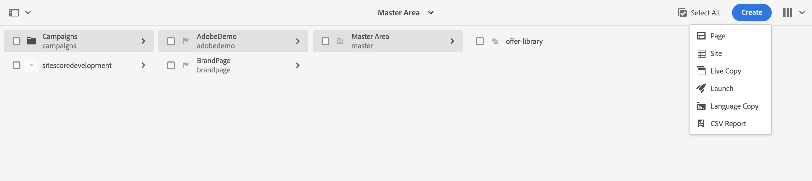

# Creación de una newsletter de Adobe Experience Manager {#creating-newsletter}

Antes de realizar los pasos que se presentan a continuación, primero debe [integrar](/help/sites-cloud/integrating/integrating-campaign-classic.md) Adobe Campaign Classic y AEM as a Cloud Service. Después de configurar Adobe Campaign Classic y AEM as a Cloud Service, ahora aprenderá a crear un boletín de Adobe Experience Manager.

1. En la instancia de autor de AEM, haga clic en el logotipo de Adobe Experience Manager en la parte superior izquierda de la página y seleccione **Sitios**.
1. Seleccione Campaña, haga clic en **Crear → Página**.
   
1. Seleccione Marca y haga clic en **Siguiente**.
1. Introduzca un título y haga clic en **Crear** y **Listo**.
1. Para crear una página de Campaign, vaya a **Campañas → AdobeDemo → Maestro** y haga clic en **Crear → Página**.
   
1. Seleccione la plantilla Campaña y haga clic en **Siguiente** y **Listo**.
1. Introduzca un título y haga clic en **Crear** y **Listo**.
1. Vaya a **Campaign → AdobeDemo → Master** y seleccione la casilla de verificación CampaignPage . Haga clic en **Propiedades** en la parte superior izquierda.
   
1. Vaya a la **Cloud Service** pestaña:
   * Seleccione Adobe Campaign en la lista desplegable Configuraciones del Cloud Service .
   * Seleccione el nombre que desee para la configuración de Adobe Campaign.
   * **Guardar** y **Cerrar**.
1. Para crear una página de correo electrónico de Adobe Campaign Classic, vaya a **Campaign → AdobeDemo → Master → CampaignPage** y haga clic en **Crear → Página**.
1. Seleccione la plantilla Correo electrónico de Adobe Campaign (por ejemplo, AC 6.1) y haga clic en **Siguiente**.
1. En la página Crear , introduzca el título de la newsletter y haga clic en **Crear** y **Listo**.
1. Vaya a **Campaign → AdobeDemo → Master → CampaignPage**, seleccione la casilla de verificación Campaign Classic y haga clic en **Editar** en la parte superior izquierda para abrir la página de correo electrónico.
1. Edite la página del boletín por correo electrónico de Adobe Campaign Classic según sus necesidades.
1. Haga clic en el **Información de la página** en la parte superior izquierda y haga clic en **Publicar página**.
1. Seleccione la configuración en la que se debe publicar la página. Haga clic en **Publicar**.
   
1. La página del boletín se ha publicado en la instancia de publicación y también en la configuración AEM de Adobe Campaign Classic.
   * Ahora la página del boletín estará visible en Adobe Campaign Classic
1. Haga clic en el botón Información de página y haga clic en **Iniciar flujo de trabajo**.
1. Select **Aprobar para Adobe Campaign** como modelo de flujo de trabajo y haga clic en el botón **Iniciar flujo de trabajo** botón.
1. Aparece una renuncia de responsabilidad en la parte superior de la página. Haga clic en **Completar** para confirmar la revisión y volver a hacer clic en **OK**.
1. Haga clic en **Completar** y seleccione **Aprobación del boletín** en la lista desplegable Paso siguiente y haga clic en el **OK** botón.

## Creación de destinatarios {#creating-recipient}

1. Abra el servidor de Adobe Campaign Classic utilizando la consola de cliente de Adobe Campaign Classic.
1. Vaya a la vista Explorer .
1. En la vista de árbol de la izquierda, vaya a Profiles and Targets y seleccione **Destinatarios**.
   
1. Rellene los Detalles del destinatario.
   * Escriba el Nombre.
   * Introduzca el Apellido.
   * Introduzca el correo electrónico.
   * Haga clic en **Guardar**.

## Creación de una entrega de correo electrónico en Adobe Campaign Classic {#create-delivery}

1. Abra el servidor de Adobe Campaign Classic utilizando la consola de cliente de Adobe Campaign Classic.
1. Vaya a la vista Explorer .
1. En la vista de árbol de la izquierda, seleccione **Campaign Management** y seleccione **Entregas**.
1. En la esquina superior derecha, haga clic en **Nuevo**.
1. Select **Envío de correo electrónico con contenido AEM** en la lista desplegable Delivery template y haga clic en **Continuar**.
1. Haga clic en el vínculo Desde en Parámetros de correo electrónico.
   * Introduzca la dirección del remitente.
   * Introduzca el campo From .
   * Haga clic en **Aceptar**.
1. Haga clic en **Hasta** vínculo y haga clic en **Agregar** en la pantalla seleccionar destino .
1. Select **Un destinatario** y haga clic en **Siguiente**.
   
1. Seleccione el destinatario creado [previous](#creating-recipient) y haga clic en **Finalizar**.
1. Se ha seleccionado el destinatario. Haga clic en **Aceptar**.
1. Haga clic en **Sincronizar**.
1. Seleccione la página de correo electrónico de la lista y haga clic en **OK**.
1. La plantilla de correo electrónico está sincronizada. Haga clic en **Actualizar contenido** si no está cargado.
1. Haga clic en **Enviar** para enviar el correo electrónico.
1. En la pantalla siguiente, seleccione **Envío lo antes posible** y haga clic en **Analizar**.
   
1. Ahora que se ha creado la entrega, haga clic en **Confirmar entrega** para empezar a enviar el correo electrónico. Haga clic en **Sí** para confirmar.
   
1. Se ha iniciado la entrega. Haga clic en **Cerrar**.
1. Haga clic en **Guardar** para guardar la entrega.
