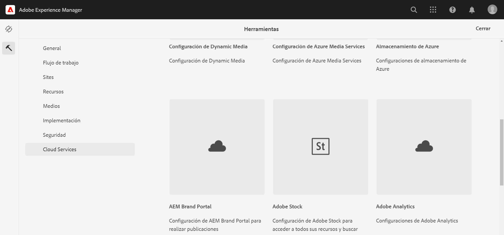
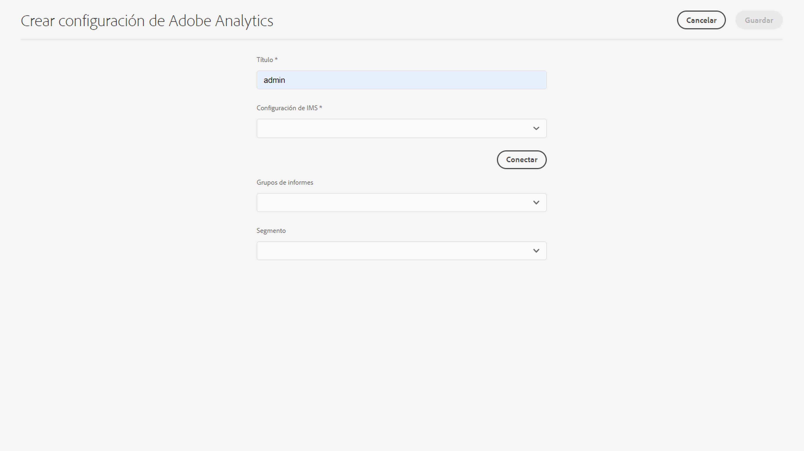

# Integración con Adobe Analytics{#integrating-with-adobe-analytics}

La integración de Adobe Analytics y AEM as a Cloud Service permite rastrear la actividad de la página web. La integración requiere lo siguiente:

* El uso de la interfaz de usuario táctil para crear una configuración de Analytics en AEM as a Cloud Service. Se requiere autenticación IMS para integrar Adobe Analytics AEM con el as a Cloud Service de la.
* adición y configuración de Adobe Analytics como extensión en [Adobe Launch](#analytics-launch). Para obtener más información sobre Adobe Launch, consulte [esta página](https://experienceleague.adobe.com/docs/experience-platform/tags/get-started/quick-start.html?lang=es).

En comparación con las versiones anteriores de AEM, la configuración de Analytics en AEM as a Cloud Service no ofrece compatibilidad con el marco de trabajo. Ahora se realiza a través de Adobe Launch, que es la herramienta de facto para instrumentar un sitio AEM con capacidades de Analytics (bibliotecas JS). En Adobe Launch, se crea una propiedad donde se puede configurar la extensión de Adobe Analytics y se crean reglas para enviar datos a Adobe Analytics. Adobe Launch ha reemplazado la tarea de análisis proporcionada por SiteCatalyst.

>[!NOTE]
>
>Los clientes de Adobe Experience Manager as a Cloud Service que no tengan una cuenta de Analytics existente, pueden solicitar acceso a Analytics Foundation Pack para Experience Cloud. Este paquete Foundation proporciona un volumen de uso limitado de Analytics.

## Creación de la configuración de Adobe Analytics {#analytics-configuration}

1. Vaya a **Herramientas** → **Cloud Services**.
2. Seleccione **Adobe Analytics**.
   
3. Seleccione el botón **Crear**.
4. Complete los detalles (consulte a continuación) y haga clic en **Connect**.

### Parámetros de configuración {#configuration-parameters}

Los campos presentes en la ventana de configuración son los siguientes:

| Propiedad | Descripción |
|---|---|
| Título | El nombre de la configuración |
| Configuración de IMS | Seleccione la configuración de IMS (consulte la sección siguiente) |
| Segmento | Opción para usar un segmento de Analytics definido en el grupo de informes actual. Los informes de Analytics se filtran según el segmento. Consulte [esta página](https://experienceleague.adobe.com/docs/analytics/components/segmentation/seg-overview.html?lang=es) para obtener más información. |
| Grupos de informes | Repositorio en el que se envían datos y se extraen informes. Los grupos de informes definen los informes completos e independientes de un sitio web concreto, de un conjunto de sitios web o de un subconjunto de páginas de sitios web. Puede ver los informes recuperados de un único grupo de informes y puede editar este campo en una configuración en cualquier momento según sus necesidades. |

### Adobe Analytics con autenticación IMS {#configuration-parameters-ims}

Se requiere una configuración de IMS para integrar correctamente Adobe Analytics AEM con el as a Cloud Service de la. Esta configuración debe crearse para poder consultar [página](/help/sites-cloud/integrating/integration-adobe-analytics-ims.md) para aprender a crear la configuración de IMS de Analytics.

### Adición de una configuración a un sitio {#add-configuration}

Para aplicar una configuración de IU táctil a un sitio, vaya a: **Sitios** → **Seleccionar cualquier página del sitio** → **Propiedades** → **Avanzadas** → **Configuración** → seleccione el inquilino de configuración.

## Integración de Adobe Analytics en AEM Sites mediante Adobe Launch {#analytics-launch}

Adobe Analytics se puede añadir como extensión en la propiedad Launch. Se pueden definir reglas para realizar la asignación y realizar una llamada posterior a Adobe Analytics:

* Vea [este vídeo](https://experienceleague.adobe.com/docs/analytics-learn/tutorials/implementation/via-adobe-launch/basic-configuration-of-the-analytics-launch-extension.html?lang=es) para aprender a configurar la extensión de Analytics en Launch para un sitio básico.

* Consulte [esta página](https://experienceleague.adobe.com/docs/core-services-learn/implementing-in-websites-with-launch/implement-solutions/analytics.html?lang=es) para obtener más información sobre cómo crear reglas y enviar datos a Adobe Analytics.

>[!NOTE]
>
>La configuración de IMS (cuentas técnicas) para Launch está preconfigurada en AEM as a Cloud Service. No tiene que crear esta configuración.

>[!NOTE]
>
>Los marcos existentes (heredados) siguen funcionando, pero no pueden configurarse en la interfaz de usuario táctil. Se recomienda reconstruir las configuraciones de asignación de variables en Launch.
