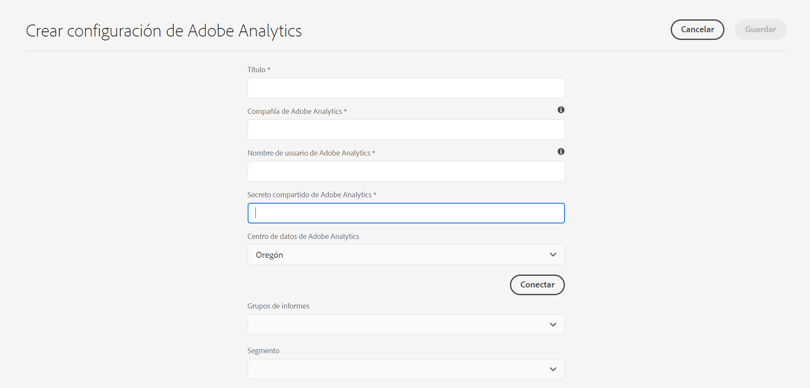

# Integración con Adobe Analytics{#integrating-with-adobe-analytics}

La integración de Adobe Analytics y AEM as a Cloud Service permite rastrear la actividad de la página web. La integración requiere:

* uso de la interfaz de usuario táctil para crear una configuración de Analytics en AEM as a Cloud Service.
* agregar y configurar Adobe Analytics como extensión en [Adobe Launch](#analytics-launch). Para obtener más información sobre Launch de Adobe, consulte [esta página](https://experienceleague.adobe.com/docs/experience-platform/tags/get-started/quick-start.html).

En comparación con las versiones anteriores de AEM, la configuración de Analytics en AEM as a Cloud Service no ofrece compatibilidad con framework. Ahora se realiza a través de Launch de Adobe, que es la herramienta de facto para instrumentar un sitio AEM con capacidades de Analytics (bibliotecas JS). En Adobe Launch, se crea una propiedad donde se puede configurar la extensión de Adobe Analytics y se crean reglas para enviar datos a Adobe Analytics. Adobe Launch ha reemplazado la tarea de análisis proporcionada por sitecatalyst.

>[!NOTE]
>
>Los clientes de Adobe Experience Manager as a Cloud Service que no tengan una cuenta de Analytics existente, pueden solicitar acceso a Analytics Foundation Pack para Experience Cloud. Este Foundation Pack proporciona un uso limitado del volumen de Analytics.

## Creación de la configuración de Adobe Analytics {#analytics-configuration}

1. Vaya a **Tools** → **Cloud Services**.
2. Seleccione **Adobe Analytics**.
   
3. Seleccione el botón **Create**.
4. Complete los detalles (ver abajo) y haga clic en **Connect**.

### Parámetros de configuración {#configuration-parameters}

Los campos de configuración presentes en la ventana Configuración de Adobe Analytics son:

| Propiedad | Descripción |
|---|---|
| Empresa | Empresa de inicio de sesión de Adobe Analytics |
| Nombre de usuario | Usuario de API de Adobe Analytics |
| Contraseña | Contraseña de Adobe Analytics utilizada para la autenticación |
| Centro de datos | Centro de datos de Adobe Analytics con el que está asociada su cuenta (servidor, por ejemplo, San José, Londres) |
| Segmento | Opción para usar un segmento de Analytics definido en el grupo de informes actual. Los informes de Analytics se filtrarán según el segmento. Consulte [esta página](https://experienceleague.adobe.com/docs/analytics/components/segmentation/seg-overview.html) para obtener más información. |
| Grupos de informes | Repositorio en el que se envían datos y se extraen informes. Los grupos de informes definen los informes completos e independientes de un sitio web concreto, de un conjunto de sitios web o de un subconjunto de páginas de sitios web. Puede ver los informes recuperados de un único grupo de informes y puede editar este campo en una configuración en cualquier momento según sus necesidades. |

### Adición de una configuración a un sitio {#add-configuration}

Para aplicar una configuración de IU táctil a un sitio, vaya a: **Sitios** → **Seleccione cualquier página del sitio** → **Propiedades** → **Avanzadas** → **Configuración** → seleccione el inquilino de configuración.

## Integración de Adobe Analytics en sitios AEM mediante Adobe Launch {#analytics-launch}

Adobe Analytics se puede añadir como extensión en la propiedad Launch. Se pueden definir reglas para realizar la asignación y realizar una llamada posterior a Adobe Analytics:

* Vea [este vídeo](https://experienceleague.adobe.com/docs/analytics-learn/tutorials/implementation/via-adobe-launch/basic-configuration-of-the-analytics-launch-extension.html) para aprender a configurar la extensión de Analytics en Launch para un sitio básico.

* Consulte [esta página](https://experienceleague.adobe.com/docs/core-services-learn/implementing-in-websites-with-launch/implement-solutions/analytics.html) para obtener más información sobre cómo crear reglas y enviar datos a Adobe Analytics.

>[!NOTE]
>
>Los marcos existentes (heredados) siguen funcionando, pero no pueden configurarse en la interfaz de usuario táctil. Se recomienda reconstruir las configuraciones de asignación de variables en Launch.

>[!NOTE]
>
>La configuración de IMS (cuentas técnicas) para Launch está preconfigurada en AEM as a Cloud Service. Los usuarios no tienen que crear esta configuración.
