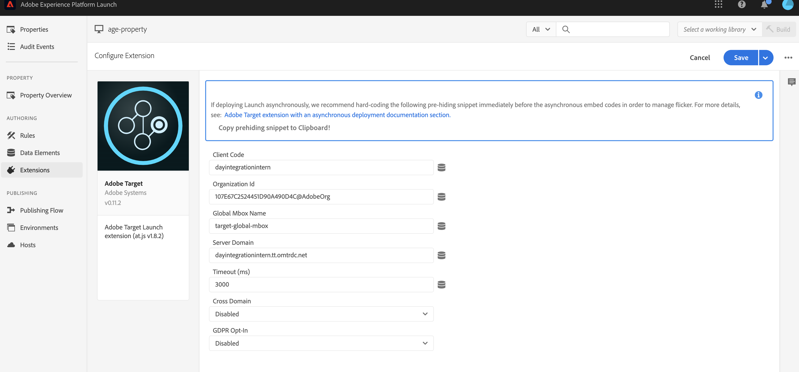

# Integración con Adobe Target{#integrating-with-adobe-target}

Como parte de Adobe Marketing Cloud, Adobe Target le permite aumentar la relevancia del contenido mediante la determinación de objetivos y efectuando mediciones en todos los canales. La integración de Adobe Target y AEM as a Cloud Service requiere:

* uso de la interfaz de usuario táctil para crear una configuración de Target en AEM as a Cloud Service (se requiere la configuración de IMS).
* agregar y configurar Adobe Target como extensión en [Adobe Launch](https://experienceleague.adobe.com/docs/experience-platform/tags/get-started/quick-start.html).

Adobe Launch es necesario para administrar las propiedades del lado del cliente tanto para Analytics como para Target en páginas AEM (bibliotecas/etiquetas JS). Dicho esto, la integración con Launch es necesaria para la &quot;segmentación de experiencias&quot;. Para la exportación de fragmentos de experiencias a Target, solo necesita la configuración de Adobe Target y el IMS.

>[!NOTE]
>
>Los clientes de Adobe Experience Manager as a Cloud Service que no tengan una cuenta de Target existente, pueden solicitar acceso a Target Foundation Pack para Experience Cloud. Foundation Pack proporciona un uso limitado del volumen de Target.

## Creación de la configuración de Adobe Target {#create-configuration}

1. Vaya a **Tools** → **Cloud Services**.
   
2. Seleccione **Adobe Target**.
3. Seleccione el botón **Create**.
   
4. Complete los detalles (ver abajo) y seleccione **Connect**.
   

### Configuración de IMS {#ims-configuration}

Se necesita una configuración IMS tanto para Launch como para Target para integrar correctamente Target con AEM y Launch. Aunque la configuración de IMS para Launch está preconfigurada en AEM as a Cloud Service, se debe crear la configuración de IMS de Target (una vez aprovisionado Target). Consulte [este vídeo](https://helpx.adobe.com/experience-manager/kt/sites/using/aem-sites-target-standard-technical-video-understand.html) y [esta página](https://experienceleague.adobe.com/docs/experience-manager-65/administering/integration/integration-ims-adobe-io.html) para aprender a crear la configuración de IMS de Target.

### ID del inquilino de Adobe Target y código de cliente de Adobe Target {#tenant-client}

Al configurar los campos ID de inquilino de Adobe Target y Código de cliente de Adobe Target , tenga en cuenta lo siguiente:

1. Para la mayoría de los clientes, el ID del inquilino y el código de cliente son los mismos. Esto significa que ambos campos contienen la misma información y son idénticos. Asegúrese de introducir el ID del inquilino en ambos campos.
2. Para fines heredados, también puede introducir valores diferentes en los campos ID de inquilino y Código de cliente .

En ambos casos, tenga en cuenta que:

* De forma predeterminada, el código de cliente (si se agrega primero) también se copia automáticamente en el campo ID de inquilino .
* Tiene la opción de cambiar el conjunto de ID de inquilino predeterminado.
* En consecuencia, las llamadas de servidor a Target se basarán en el ID del inquilino y las llamadas del lado del cliente a Target se basarán en el código del cliente.

Como se ha dicho anteriormente, el primer caso es el más común para AEM as a Cloud Service. En cualquier caso, asegúrese de que **ambos campos** contienen la información correcta según sus necesidades.

>[!NOTE]
>
> Si desea cambiar una configuración de Target existente:
>
> 1. Vuelva a introducir el ID del inquilino.
> 2. Vuelva a conectarse a Target.
> 3. Guarde la configuración.

### Edición de la configuración de Target {#edit-target-configuration}

Para editar la configuración de Target, siga estos pasos:

1. Seleccione una configuración existente y haga clic en **Properties**.
2. Edite las propiedades.
3. Seleccione **Volver a conectar con Adobe Target**.
4. Seleccione **Guardar y cerrar**.

### Adición de una configuración a un sitio {#add-configuration}

Para aplicar una configuración de IU táctil a un sitio, vaya a: **Sitios** → **Seleccione cualquier página del sitio** → **Propiedades** → **Avanzadas** → **Configuración** → Seleccione el inquilino de configuración.

## Integración de Adobe Target en sitios AEM mediante Adobe Launch {#integrate-target-launch}

AEM ofrece una integración predeterminada con Experience Platform Launch. Al agregar la extensión de Adobe Target al Experience Platform Launch, puede utilizar las funciones de Adobe Target en AEM páginas web. Las bibliotecas de Target solo se procesarán mediante Launch.

>[!NOTE]
>
>Los marcos existentes (heredados) siguen funcionando, pero no pueden configurarse en la interfaz de usuario táctil. Se recomienda reconstruir las configuraciones de asignación de variables en Launch.

Como descripción general, los pasos de integración son:

1. Crear una propiedad de Launch
2. Añadir las extensiones requeridas
3. Crear un elemento de datos (para capturar los parámetros de Context Hub)
4. Crear una regla de página
5. Generar y publicar

### Creación de una propiedad de Launch {#create-property}

Una propiedad es un contenedor que se rellena con extensiones, reglas y elementos de datos.

1. Seleccione el botón **New Property**.
2. Asigne un nombre a la propiedad.
3. Como dominio, introduzca la IP/host en la que desea cargar la biblioteca de launch.
4. Seleccione el botón **Save**.
   

### Añadir las extensiones necesarias {#add-extension}

**** Extensión es el contenedor que administra la configuración de la biblioteca principal. La extensión de Adobe Target es compatible con implementaciones del lado del cliente mediante el uso del SDK de JavaScript de Target para la web moderna, at.js. Debe añadir las extensiones **Adobe Target** y **Adobe ContextHub**.

1. Seleccione la opción Catálogo de extensiones y busque Target en el filtro .
2. Seleccione **Adobe Target** at.js y haga clic en la opción Instalar .
   
3. Seleccione el botón **Configure**. Observe la ventana de configuración con las credenciales de la cuenta de Target importadas y la versión de at.js para esta extensión.
4. Seleccione **Save** para añadir la extensión de Target a la propiedad de Launch. Debería poder ver la extensión de Target en la lista **Installed Extensions**.
   
5. Repita los pasos anteriores para buscar la extensión **Adobe ContextHub** e instalarla (esto es necesario para la integración con parámetros contexthub, en función de los cuales se realizará la segmentación).

### Creación de un elemento de datos {#data-element}

**Los** elementos de datos son marcadores de posición a los que se pueden asignar parámetros de Context Hub.

1. Seleccione **Elementos de datos**.
2. Seleccione **Agregar elemento de datos**.
3. Proporcione el nombre del elemento de datos y asígnelo a un parámetro de Context Hub.
4. Seleccione **Guardar**.
   

### Creación de una regla de página {#page-rule}

En **Rule** definimos y ordenamos una secuencia de acciones, que se ejecutan en el sitio, para lograr el objetivo.

1. Añada un conjunto de acciones como se muestra en la captura de pantalla.
   
2. En Añadir parámetros a todos los mboxes , agregue el elemento de datos configurado anteriormente (consulte el elemento de datos anterior) al parámetro que se enviará en la llamada de mbox.
   

### Generar y publicar {#build-publish}

Para aprender a crear y publicar, consulte esta [página](https://experienceleague.adobe.com/docs/experience-manager-learn/aem-target-tutorial/aem-target-implementation/using-launch-adobe-io.html).

## Cambios en la estructura de contenido entre las configuraciones Classic y Touch UI {#changes-content-structure}

| **Cambiar** | **Configuración de IU clásica** | **Configuración de IU táctil** | **Consecuencias** |
|---|---|---|---|
| Ubicación de la configuración de Target. | /etc/cloudservices/testandtarget/ | /conf/tenant/settings/cloudservices/target | Anteriormente, había varias configuraciones presentes en /etc/cloudservices/testandtarget, pero ahora hay una sola configuración en un inquilino. |

>[!NOTE]
>
>Las configuraciones heredadas siguen siendo compatibles con los clientes existentes (sin la opción de editar o crear nuevas). Las configuraciones heredadas formarán parte de paquetes de contenido cargados por clientes que utilicen VSTS.
