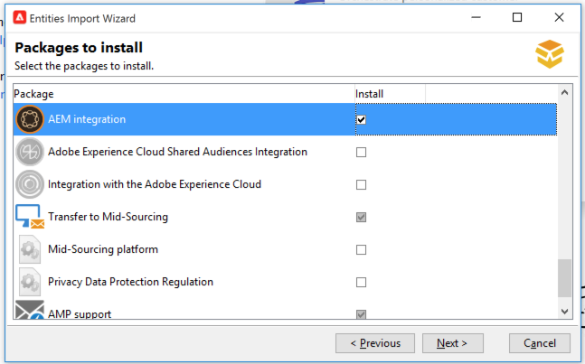
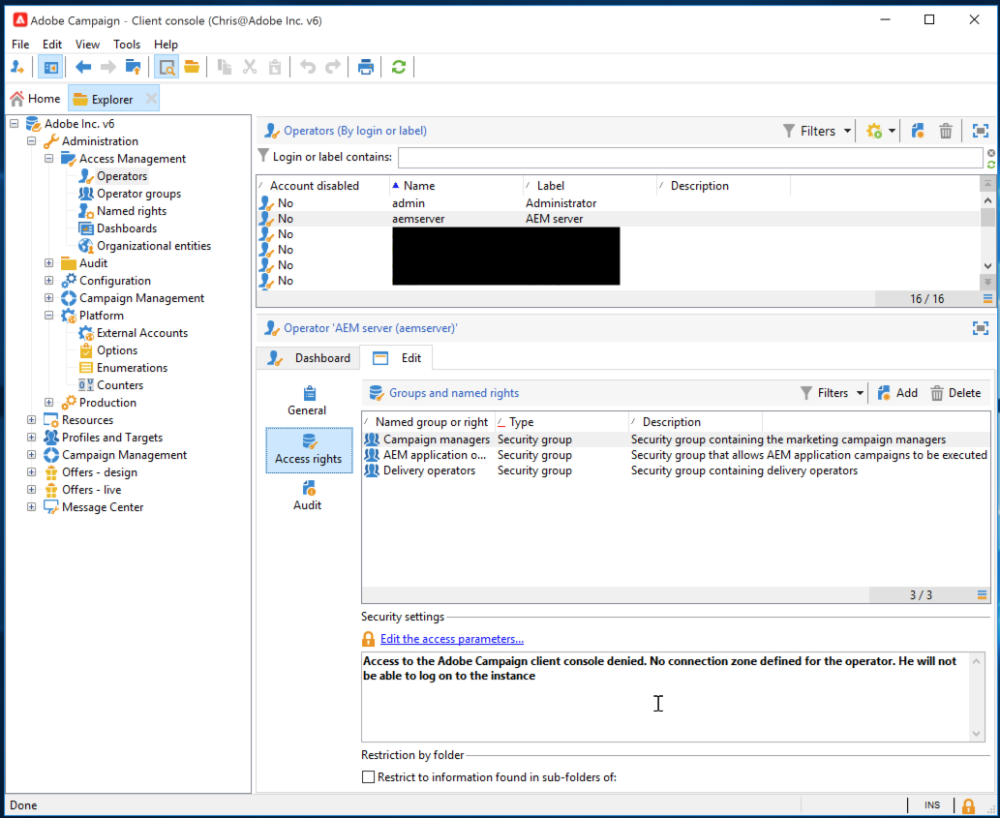
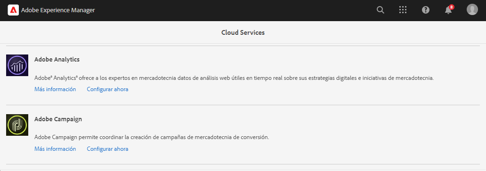
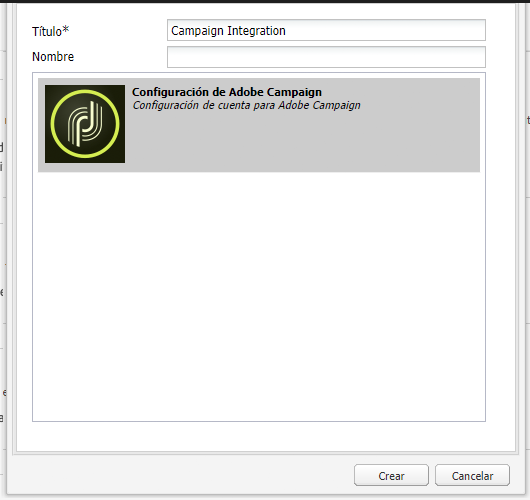
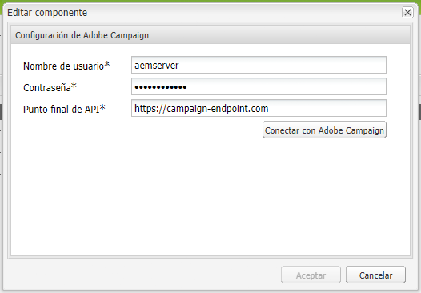

# Integración con Adobe Campaign Classic {#integrating-campaign-classic}

Al integrar AEM as a Cloud Service con Adobe Campaign, puede administrar la entrega de correo electrónico, el contenido y los formularios directamente en AEM as a Cloud Service. Se necesitan pasos de configuración tanto en Adobe Campaign Classic como AEM as a Cloud Service para habilitar la comunicación bidireccional entre soluciones.

Esta integración permite utilizar AEM as a Cloud Service y Adobe Campaign Classic de forma independiente. Los especialistas en marketing pueden crear campañas y utilizar la segmentación en Adobe Campaign, mientras que los creadores de contenido en paralelo pueden trabajar en el diseño de contenido en AEM as a Cloud Service. La integración permite que el contenido y el diseño de la campaña en AEM sean dirigidos y entregados por Campaign.

## Pasos de la integración {#integration-steps}

La integración entre AEM y Campaign requiere una serie de pasos en ambas soluciones.

1. [Instale el paquete de integración de AEM en Campaign.](#install-package)
1. [Creación de un operador para AEM en Campaign](#create-operator)
1. [Configuración de la integración de Campaign en AEM](#campaign-integration)
1. [Configuración del AEM externalizador](#externalizer)
1. [Configure el usuario remoto de la campaña en AEM](#configure-user)
1. [Configuración de la cuenta externa AEM en Campaign](#acc-setup)

Este documento le guía en cada uno de estos pasos en detalle

## Requisitos previos {#prerequisites}

* Acceso de administrador a Adobe Campaign Classic
   * Para realizar la integración, necesita una instancia de Adobe Campaign Classic en funcionamiento, incluida una base de datos configurada.
   * Si necesita más información sobre cómo configurar y configurar Adobe Campaign Classic, consulte la [documentación de Adobe Campaign Classic,](https://experienceleague.adobe.com/docs/campaign-classic/using/campaign-classic-home.html) especialmente la guía de instalación y configuración.

* Acceso de administrador a AEM as a Cloud Service

## Instalación del paquete de integración de AEM en Campaign {#install-package}

La variable **Integración AEM** en Adobe Campaign incluye una serie de configuraciones estándar necesarias para conectarse a AEM.

1. Como administrador, inicie sesión en la instancia de Adobe Campaign mediante la consola del cliente.

1. Select **Herramientas** > **Avanzadas** > **Importar paquete...**.

   

1. Haga clic en **Instalación de un paquete estándar** y haga clic en **Siguiente**.

1. Marque la **Integración AEM** paquete.

   

1. Haga clic en **Siguiente** y luego **Inicio** para iniciar la instalación.

   

1. Haga clic en **Cerrar** cuando se complete la instalación.

El paquete de integración ya está instalado.

## Creación del operador para AEM en Campaign {#create-operator}

El paquete de integración crea automáticamente el `aemserver` operador que AEM utiliza para conectarse a Adobe Campaign. Debe definir una zona de seguridad para este operador y establecer su contraseña.

1. Inicie sesión en Adobe Campaign como administrador mediante la consola del cliente.

1. Select **Herramientas** -> **Explorer** en la barra de menús.

1. En el explorador, vaya a la **Administración** > **Gestión de acceso** > **Operadores** nodo .

1. Seleccione el `aemserver` operador.

1. En el **Editar** del operador, seleccione **Derechos de acceso** y, a continuación, haga clic en la pestaña **Editar los parámetros de acceso...** vínculo.

   

1. Seleccione la zona de seguridad adecuada y defina la máscara IP de confianza según sea necesario.

1. Haga clic en **Guardar**.

1. Cierre la sesión del cliente de Adobe Campaign.

1. En el sistema de archivos del servidor de Adobe Campaign, vaya a la ubicación de instalación de Campaign y edite el `serverConf.xml` como administrador. Este archivo generalmente se encuentra en:
   * `C:\Program Files\Adobe\Adobe Campaign Classic v7\conf` en Windows.
   * `/usr/local/neolane/nl6/conf/eng` en Linux.

1. Buscar `securityZone` y asegúrese de que los siguientes parámetros están establecidos para la zona de seguridad del operador AEM.

   * `allowHTTP="true"`
   * `sessionTokenOnly="true"`
   * `allowUserPassword="true"`.

1. Guarde el archivo.

1. Asegúrese de que la zona de seguridad no se sobrescriba con la configuración correspondiente en la variable `config-<server name>.xml` archivo.

   * Si el archivo de configuración contiene una configuración de zona de seguridad independiente, cambie la variable `allowUserPassword` atributo a `true`.

1. Si desea cambiar el puerto del servidor de Adobe Campaign Classic, sustituya `8080` con el puerto deseado.

>[!CAUTION]
>
>De forma predeterminada, no hay ninguna zona de seguridad configurada para el operador. Para que AEM se conecte a Adobe Campaign, debe seleccionar una zona como se detalla en los pasos anteriores.
>
>Adobe recomienda encarecidamente crear una zona de seguridad dedicada a AEM para evitar problemas de seguridad. Para obtener más información, consulte la [Documentación de Adobe Campaign Classic.](https://experienceleague.adobe.com/docs/campaign-classic/using/installing-campaign-classic/additional-configurations/security-zones.html)

1. En el cliente de Campaign, vuelva a la `aemserver` y seleccione **General** pestaña .

1. Haga clic en el **Restablecer contraseña...** vínculo.

1. Especifique una contraseña y guárdela en una ubicación segura para uso futuro.

1. Haga clic en **OK** para guardar la contraseña de `aemserver` operador.

## Configuración de la integración de Campaign en AEM {#campaign-integration}

AEM usa [el operador que ya ha configurado en Campaign](#create-operator) para comunicarse con Campaign

1. Inicie sesión en la instancia de creación de AEM como administrador.

1. En el carril lateral de navegación global, seleccione **Herramientas** > **Cloud Services** > **Cloud Services heredados** > **Adobe Campaign** y haga clic en **Configurar ahora**.

   

1. En el cuadro de diálogo, cree una configuración de servicio de Campaign introduciendo una **Título** y haga clic en **Crear**.

   

1. Se abre una nueva ventana y un cuadro de diálogo para editar la configuración. Proporcione la información necesaria.

   * **Nombre de usuario** - Esto es [el operador de paquete Adobe Campaign AEM Integration creado en el paso anterior.](#create-operator) De forma predeterminada, es `aemserver`.
   * **Contraseña** - Esta es la contraseña de [el operador de paquete Adobe Campaign AEM Integration creado en el paso anterior.](#create-operator)
   * **Punto final de API** : Esta es la URL de instancia de Adobe Campaign.

   

1. Select **Conectarse a Adobe Campaign** para verificar la conexión y, a continuación, haga clic en **OK**.

AEM ahora puede comunicarse con Adobe Campaign.

>[!NOTE]
>
>Asegúrese de que el servidor de Adobe Campaign esté disponible a través de Internet. AEM as a Cloud Service no puede acceder a redes privadas.

## Configuración del AEM externalizador {#externalizer}

El externalizador es un servicio OSGi en AEM que transforma una ruta de recurso en una URL externa y absoluta, que es necesario para que AEM el contenido que Campaign puede utilizar.

1. Inicie sesión en la instancia de creación de AEM como administrador.
1. Confirme la instancia de publicación en la configuración del externalizador comprobando el volcado de estado de los servicios OSGi en la [consola para desarrolladores.](https://experienceleague.adobe.com/docs/experience-manager-learn/cloud-service/debugging/debugging-aem-as-a-cloud-service/developer-console.html#osgi-services)
1. Si no es correcto, realice los cambios necesarios en el repositorio de Git de la instancia correspondiente y [implemente la configuración mediante cloud manager.](/help/implementing/cloud-manager/deploy-code.md)

```text
Service 3310 - [com.day.cq.commons.externalizer] (pid: com.day.cq.commons.impl.externalizerImpl)",
"  from Bundle 420 - Day Communique 5 Commons Library (com.day.cq.cq-commons), version 5.12.16",
"    component.id: 2149",
"    component.name: com.day.cq.commons.impl.externalizerImpl",
"    externalizer.contextpath: ",
"    externalizer.domains: [local https://author-p17558-e33255-cmstg.adobeaemcloud.com, author https://author-p17558-e33255-cmstg.adobeaemcloud.com,
     publish https://publish-p17558-e33255-cmstg.adobeaemcloud.com]",
"    externalizer.encodedpath: false",
"    externalizer.host: ",
"    feature-origins: [com.day.cq:cq-quickstart:slingosgifeature:cq-platform-model_quickstart_author:6.6.0-V23085]",
"    service.bundleid: 420",
"    service.description: Creates absolute URLs",
"    service.scope: bundle",
"    service.vendor: Adobe Systems Incorporated",
```

>[!NOTE]
>
>Se debe poder acceder a la instancia de publicación desde el servidor de Adobe Campaign.

## Configuración del usuario remoto de la campaña en AEM {#configure-user}

Para que Campaign se comunique con AEM, debe establecer una contraseña para la variable `campaign-remote` usuario en AEM.

1. Inicie sesión en AEM como administrador.
1. En la consola de navegación principal, haga clic en **Herramientas** en el carril izquierdo.
1. A continuación, haga clic en **Seguridad** -> **Usuarios** para abrir la consola de administración de usuarios.
1. Busque la variable `campaign-remote` usuario.
1. Seleccione el `campaign-remote` usuario y haga clic en **Propiedades** para editar el usuario.
1. En el **Editar configuración de usuario** ventana, haga clic en **Cambiar contraseña**.
1. Proporcione una nueva contraseña para el usuario y anote la contraseña en una ubicación segura para uso futuro.
1. Haga clic en **Guardar** para guardar el cambio de contraseña.
1. Haga clic en **Guardar y cerrar** para guardar los cambios en la variable `campaign-remote` usuario.

## Configuración de la cuenta externa de AEM en Campaign {#acc-setup}

When [instalación del **Integración AEM** paquete en Campaign,](#install-package) se crea una cuenta externa para AEM. Al configurar esta cuenta externa, Adobe Campaign puede conectarse a AEM as a Cloud Service, lo que permite una comunicación bidireccional entre las soluciones.

1. Inicie sesión en Adobe Campaign como administrador mediante la consola del cliente.

1. Select **Herramientas** -> **Explorer** en la barra de menús.

1. En el explorador, vaya a la **Administración** > **Plataforma** > **Cuentas externas** nodo .

   

1. Busque la cuenta de AEM externa. De forma predeterminada, tiene los valores siguientes:

   * **Tipo** - AEM
   * **Etiqueta** - Instancia AEM
   * **Nombre interno** - aemInstance

1. En el **General** de esta cuenta, introduzca la información de usuario que definió en la [Establecer la contraseña de usuario remota de la campaña](#set-campaign-remote-password) paso a paso.

   * **Servidor** - La dirección del servidor de autor de AEM
      * Se debe poder acceder al servidor de creación de AEM desde la instancia de servidor de Adobe Campaign Classic.
      * Asegúrese de que la dirección del servidor **not** termine con una barra diagonal.
   * **Cuenta** - De forma predeterminada, esta es la variable `campaign-remote` que haya establecido en AEM en la [Establecer la contraseña de usuario remota de la campaña](#set-campaign-remote-password) paso a paso.
   * **Contraseña** - Esta contraseña es la misma que la `campaign-remote` que haya establecido en AEM en la [Establecer la contraseña de usuario remota de la campaña](#set-campaign-remote-password) paso a paso.

1. Seleccione el **Habilitado** casilla de verificación.

1. Haga clic en **Guardar**.

Adobe Campaign ahora puede comunicarse con AEM.

## Siguientes pasos {#next-steps}

Con tanto Adobe Campaign Classic como AEM as a Cloud Service configurados, la integración ya se ha completado.

Ahora puede aprender a crear una newsletter en Adobe Experience Manager continuando con [este documento.](/help/sites-cloud/integrating/creating-newsletter.md)
