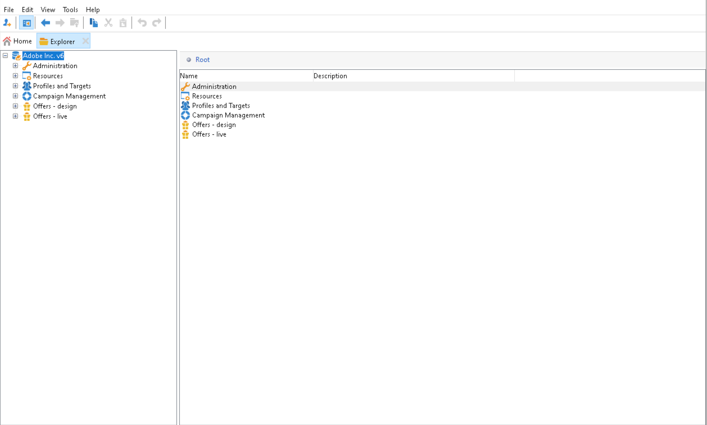
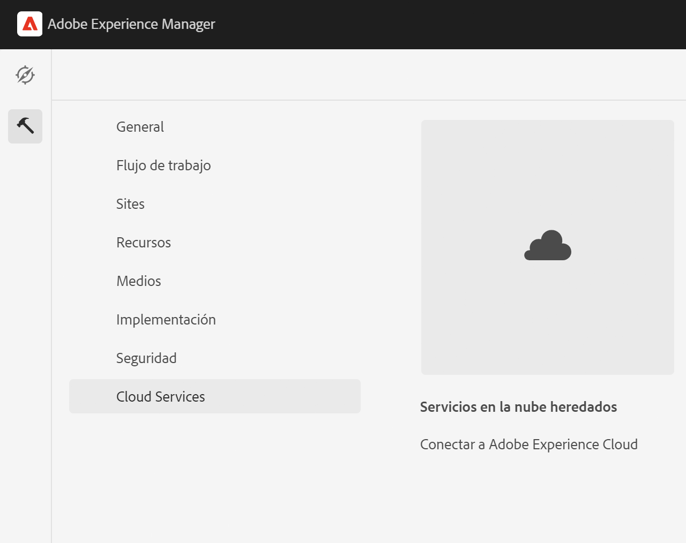
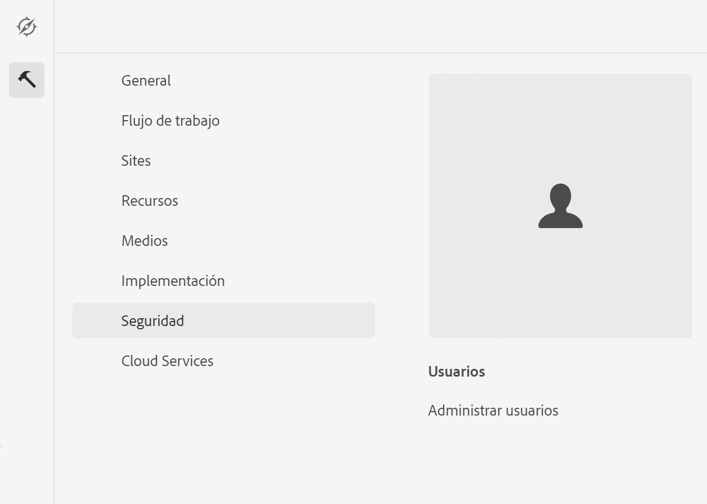

# Integración con Adobe Campaign Classic {#integrating-campaign-classic}

Al integrarse con Adobe Campaign, puede administrar la entrega de correo electrónico, el contenido y los formularios directamente en AEM as a Cloud Service. Se necesitan pasos de configuración tanto en Adobe Campaign Classic como AEM as a Cloud Service para habilitar la comunicación bidireccional entre soluciones.

Tenga en cuenta que AEM as a Cloud Service y Adobe Campaign Classic también pueden utilizarse de forma independiente. Por ejemplo, los especialistas en marketing pueden crear campañas y utilizar la segmentación en Adobe Campaign, mientras que los creadores de contenido pueden trabajar en el diseño en AEM as a Cloud Service.

## Flujo de trabajo de integración {#integration-workflow}

Los siguientes capítulos detallan cómo integrar las soluciones. Esto requiere pasos de configuración tanto en Adobe Campaign Classic como AEM as a Cloud Service. Como tal, aprenderá a:

* [Crear el usuario del operador](#create-operator)
* [Configuración de AEM as a Cloud Service para la integración](#aem-configuration)
* [Configuración del usuario remoto de Campaign](#configure-user)
* [Configuración de la cuenta externa de Adobe Campaign Classic](#acc-setup)

### Requisitos previos {#prerequisites}

**Adobe Campaign Classic**

Para realizar la integración necesita una instancia de Adobe Campaign Classic en funcionamiento, incluida una base de datos. Si necesita más información sobre cómo configurar y configurar Adobe Campaign Classic, lea la [Documentación de Adobe Campaign Classic](https://experienceleague.adobe.com/docs/campaign-classic/using/campaign-classic-home.html) especialmente la guía Instalación y configuración. Tenga en cuenta que para realizar las operaciones que se presentan a continuación también debe tener la función de administrador.

**AEM as a Cloud Service**

Necesita el [AEM as a Cloud Service](https://experienceleague.adobe.com/docs/experience-manager-cloud-service/content/overview/introduction.html) solución.

### Creación del usuario del operador en Adobe Campaign Classic {#create-operator}

Abra la consola del cliente de Adobe Campaign Classic desde el menú de inicio e inicie sesión. Debería aparecer la página principal.

1. Haga clic en **Explorer** para abrir la vista del explorador.
   
1. En la vista de árbol de la izquierda, vaya a **Administración->Administración de acceso->Operadores**.
1. Haga doble clic en el `aemserver` en la lista Operadores de la derecha.
1. Cambie a la **Editar** pestaña . Establezca la contraseña para aemserver.
   
1. Haga clic en el **Derechos de acceso** y haga clic en **Edición de los parámetros de acceso** en la configuración de seguridad.
1. En Cifrado, seleccione Red pública como zona de conexión autorizada. Haga clic en **Aceptar**.
   
1. Haga clic en **Guardar**.
1. Cierre la sesión.
1. Vaya a la ubicación de instalación de Adobe Campaign Classic v7, por ejemplo `C:\Program Files\Adobe\Adobe Campaign Classic v7\conf` y abra el `serverConf.xml` como administrador.
   * Buscar **zona de seguridad**.
   * Establezca los siguientes parámetros `allowHTTP="true"` `sessionTokenOnly="true"` `allowUserPassword="true"`.
   * Guarde el archivo.
1. Asegúrese de que la zona de seguridad no se sobrescriba con la configuración correspondiente en `config-<server name>.xml` (C:\Program Files\Adobe\Adobe Campaign Classic v7\conf\config_acc-test.xml).
   * Si el archivo de configuración contiene una configuración de zona de seguridad independiente, cambie la variable `allowUserPassword` como true.
1. Si desea cambiar el puerto del servidor de Adobe Campaign Classic, sustituya 8080 por el puerto deseado (por ejemplo: 80).

>[!NOTE]
>
>De forma predeterminada, no hay ninguna zona de seguridad configurada para el operador. Para conectarse a Adobe Campaign con AEM as a Cloud Service, debe seleccionar una (consulte los pasos anteriores). Recomendamos encarecidamente que cree una zona de seguridad dedicada a AEM para evitar problemas de seguridad.

### Configuración de AEM as a Cloud Service {#aem-configuration}

1. Inicie sesión en cloud manager e inicie la instancia de autor as a Cloud Service AEM.
1. Vaya a **Herramientas → Cloud Service → Cloud Service heredado**.
   
1. Desplácese hacia abajo hasta Adobe Campaign y haga clic en el **Configurar ahora** vínculo.
   * Introduzca un título.
   * Introduzca un nombre.
   * Haga clic en **Crear**.
1. En la pantalla Editar componente
   * Escriba el nombre de usuario; consulte [Crear el usuario del operador](#create-operator).
   * Introduzca la Contraseña.
   * Introduzca el punto final de la API del servidor de Adobe Campaign Classic (por ejemplo, `http://3.22625.51:80`).
   * Haga clic en **Conectarse a Adobe Campaign**.
   * Haga clic en **Aceptar**.

   >[!NOTE]
   >
   >Asegúrese de que el servidor de Adobe Campaign esté disponible en Internet porque AEM as a Cloud Service no puede acceder a redes privadas.
1. Compruebe la instancia de publicación en la configuración del externalizador de vínculos.
Puede ver esta configuración comprobando el volcado de estado de los servicios OSGi en el [consola de desarrollador](https://experienceleague.adobe.com/docs/experience-manager-learn/cloud-service/debugging/debugging-aem-as-a-cloud-service/developer-console.html#osgi-services).
Si no es correcto, realice cambios en el repositorio de Git de la instancia correspondiente y luego implemente la configuración utilizando [administrador de nube](https://experienceleague.adobe.com/docs/experience-manager-cloud-service/content/implementing/using-cloud-manager/deploy-code.html).

```
Service 3310 - [com.day.cq.commons.Externalizer] (pid: com.day.cq.commons.impl.ExternalizerImpl)",
"  from Bundle 420 - Day Communique 5 Commons Library (com.day.cq.cq-commons), version 5.12.16",
"    component.id: 2149",
"    component.name: com.day.cq.commons.impl.ExternalizerImpl",
"    externalizer.contextpath: ",
"    externalizer.domains: [local https://author-p17558-e33255-cmstg.adobeaemcloud.com, author https://author-p17558-e33255-cmstg.adobeaemcloud.com,
     publish https://publish-p17558-e33255-cmstg.adobeaemcloud.com]",
"    externalizer.encodedpath: false",
"    externalizer.host: ",
"    feature-origins: [com.day.cq:cq-quickstart:slingosgifeature:cq-platform-model_quickstart_author:6.6.0-V23085]",
"    service.bundleid: 420",
"    service.description: Creates absolute URLs",
"    service.scope: bundle",
"    service.vendor: Adobe Systems Incorporated",
```

>[!NOTE]
>
>También se debe poder acceder a la instancia de publicación desde el servidor de Adobe Campaign.

### Configuración del usuario remoto de Adobe Campaign {#configure-user}

Debe establecer una contraseña para el usuario remoto de la campaña. Es necesario para conectar Adobe Campaign Classic con AEM as a Cloud Service.

1. Vaya a **AEM → Herramientas → Seguridad → Usuarios**.
   
1. Busque la variable `campaign-remote` y haga clic en él.
1. Haga clic en Cambiar contraseña
   * Escriba la nueva contraseña dos veces.
   * Escriba la contraseña de AEM.
   * Haga clic en **Guardar**.

### Configuración de la cuenta externa de Adobe Campaign Classic {#acc-setup}

También debe configurar una cuenta externa para conectar Adobe Campaign Classic con la instancia as a Cloud Service AEM.

1. Inicie sesión en el servidor de Adobe Campaign Classic mediante la consola del cliente.
1. Vaya a la vista del explorador.
1. En la vista de árbol de la izquierda, vaya a **Administración → Plataforma → Cuentas Externas**.
1. En la vista de lista de la parte superior derecha, haga clic en AEM instancia.
1. En la configuración de la instancia de AEM
   * Introducir AEM IP/FQDN de autor as a Cloud Service, por ejemplo `https://author-p17558-e33255-cmstg.adobeaemcloud.com`.
   * Introduzca el usuario y la cuenta.
   * Introduzca la contraseña del usuario remoto de la campaña que configuró en la instancia as a Cloud Service de AEM (consulte el procedimiento anterior).
   * Seleccione el **Habilitado** casilla de verificación.
   * Haga clic en **Guardar**.

   >[!NOTE]
   >
   >La IP/FQDN del servidor de AEM Author debe ser accesible desde la instancia del servidor de Adobe Campaign Classic. Además, no agregue el carácter de barra invertida en la IP/FQDN del servidor de AEM Author.

Después de configurar Adobe Campaign Classic y AEM as a Cloud Service, la integración ya se ha completado. Además, también puede aprender a crear un boletín de Adobe Experience Manager leyendo [esta página](/help/sites-cloud/integrating/creating-newsletter.md).
