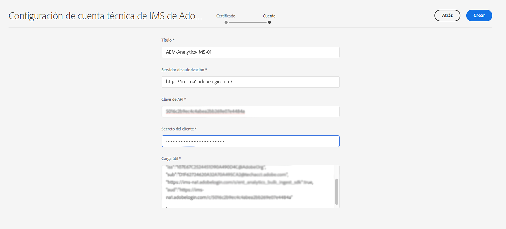

# Configuración de IMS que usar al integrar con Adobe Analytics {#ims-configuration-for-integration-with-adobe-analytics}

La integración de Adobe Experience Manager as a Cloud Service (AEMaaCS) con Adobe Analytics a través de la API de Analytics Standard requiere la configuración de Adobe IMS (Identity Management System). La configuración se ejecuta con Adobe Developer Console.

>[!NOTE]
>
>La compatibilidad con la API de Adobe Analytics Standard 2.0 es nueva en AEMaaCS 2022.2.0. Esta versión de la API admite la autenticación IMS.
>
>La selección de la API se basa en el método de autenticación utilizado para la integración de AEM/Analytics.
>
>También puede obtenerse más información en [Migración a las API 2.0](https://developer.adobe.com/analytics-apis/docs/2.0/guides/migration/).

## Requisitos previos {#prerequisites}

Antes de iniciar este procedimiento:

* El [Soporte de Adobe](https://helpx.adobe.com/es/contact/enterprise-support.ec.html) debe aprovisionar su cuenta para lo siguiente:

   * Adobe Console
   * Adobe Developer Console
   * Adobe Analytics y
   * Adobe IMS (Identity Management System)

* El administrador del sistema de su organización debe utilizar Admin Console para añadir los desarrolladores necesarios de su organización a los perfiles de producto relevantes.

   * Esto proporciona a los desarrolladores específicos permisos para habilitar integraciones mediante Adobe Developer Console.
   * Consulte [Administrar desarrolladores](https://helpx.adobe.com/es/enterprise/admin-guide.html/enterprise/using/manage-developers.ug.html).

## Configuración de IMS: generación de una clave pública {#configuring-ims-generating-a-public-key}

El primer paso de la configuración es crear una configuración de IMS en AEM y generar la clave pública.

1. En AEM, abra el menú **Herramientas**.
1. En la sección **Seguridad**, seleccione **Configuraciones de IMS de Adobe**.
1. Seleccione **Crear** para abrir la **Configuración de cuenta técnica de Adobe IMS**.
1. En la lista desplegable debajo de **Configuración de nube**, seleccione **Adobe Analytics**.
1. Active **Crear nuevo certificado** e introduzca un nuevo alias.
1. Confirme con **Crear certificado**.

   

1. Seleccione **Descargar** (o **Descargar clave pública**) para descargar el archivo en la unidad local, de modo que esté listo para usarse cuando [configure IMS para la integración de Adobe Analytics con AEM](#configuring-ims-adobe-analytics-integration-with-aem).

   >[!CAUTION]
   >
   >Mantenga esta configuración abierta, será necesaria de nuevo cuando [complete la configuración de IMS en AEM](#completing-the-ims-configuration-in-aem).

   

## Configuración de IMS para la integración de Adobe Analytics con AEM {#configuring-ims-adobe-analytics-integration-with-aem}

Con Adobe Developer Console, debe crear un proyecto (integración) con Adobe Analytics (para que lo use AEM) y, a continuación, asignar los privilegios necesarios.

### Creación del proyecto {#creating-the-project}

Abra Adobe Developer Console para crear un proyecto con Adobe Analytics que usará AEM:

>[!CAUTION]
>
>Actualmente, solo admitimos el de Adobe Developer Console **Cuenta de servicio (JWT)** tipo de credencial.
>
>No use el **Servidor a servidor OAuth** tipo de credencial, que se admitirá en el futuro.

1. Abra Adobe Developer Console para proyectos:

   [https://developer.adobe.com/console/projects](https://developer.adobe.com/console/projects)

1. Se muestran todos los proyectos que tenga. Seleccione **Crear nuevo proyecto**. La ubicación y el uso dependerán de lo siguiente:

   * Si todavía no tiene ningún proyecto, **Crear nuevo proyecto** está en el centro, abajo.

     
   * Si ya tiene proyectos, estos se enumeran y **Crear nuevo proyecto** está en la parte superior derecha.

     

1. Seleccione **Añadir a proyecto** seguido de **API**:

   

1. Seleccione **Adobe Analytics** y, luego, **Siguiente**:

   >[!NOTE]
   >
   >Si está suscrito a Adobe Analytics, pero no lo ve en la lista, debe comprobar los [Requisitos previos](#prerequisites).

   

1. Seleccione **Cuenta de servicio (JWT)** como tipo de autenticación y continúe con **Siguiente**:

   

1. **Cargue la clave pública** y, cuando se complete, continúe con **Siguiente**:

   

1. Revise las credenciales y continúe con **Siguiente**:

   

1. Seleccione los perfiles de producto necesarios y continúe con **Guardar la API configurada**:

   

1. La configuración se ha confirmado.

### Asignación de privilegios a la integración {#assigning-privileges-to-the-integration}

Ahora debe asignar los privilegios necesarios a la integración:

1. Abra la Adobe **Admin Console**:

   * [https://adminconsole.adobe.com](https://adminconsole.adobe.com/)

1. Vaya a **Productos** (barra de herramientas superior) y, a continuación, seleccione **Adobe Analytics: &lt;*your-tenant-id*>** (del panel izquierdo).
1. Seleccione **Perfiles de producto** y, a continuación, el espacio de trabajo necesario de la lista presentada. Por ejemplo, Espacio de trabajo predeterminado.
1. Seleccione **Credenciales de API** y la configuración de integración requerida.
1. Seleccione **Editor** como la **Función del producto**, en lugar de **Observador**.

## Detalles almacenados para el proyecto de integración de Adobe Developer Console {#details-stored-for-the-ims-integration-project}

Desde Adobe Developer Console y Proyectos, puede ver una lista de todos sus proyectos de integración:

* [https://developer.adobe.com/console/projects](https://developer.adobe.com/console/projects)

Seleccione una entrada de proyecto específica para mostrar más detalles acerca de la configuración. Entre estas características se incluyen:

* Información general del proyecto
* Perspectivas
* Credenciales
   * Cuenta de servicio (JWT)
      * Detalles de la credencial
      * Generar JWT
* API
   * Por ejemplo, Adobe Analytics

En algunos de estos casos, debe completar la integración de Adobe Analytics AEM en basado en IMS y en el código de tiempo de la aplicación de la plataforma de datos de.

## Finalización de la configuración de IMS en AEM {#completing-the-ims-configuration-in-aem}

Al volver a AEM puede completar la configuración de IMS añadiendo los valores necesarios desde la integración de IMS para Analytics:

1. Vuelva a la [Configuración de IMS abierta en AEM](#configuring-ims-generating-a-public-key).
1. Seleccione **Siguiente**.

1. Aquí puede usar los [detalles de la configuración del proyecto en Adobe Developer Console](#details-stored-for-the-ims-integration-project):

   * **Título**: el texto.
   * **Servidor de autorización**: copie/pegue esto desde la línea `aud` de la sección **Carga útil** a continuación, por ejemplo, `https://ims-na1.adobelogin.com` en el ejemplo siguiente
   * **Clave de API**: copie esto desde la sección **Credenciales** de la [Información general del proyecto](#details-stored-for-the-ims-integration-project)
   * **Secreto del cliente**: genere esto en la [pestaña Secreto del cliente de la sección Cuenta de servicio (JWT)](#details-stored-for-the-ims-integration-project) y copie
   * **Carga útil**: copie esto desde la [pestaña Generar JWT de la sección Cuenta de servicio (JWT)](#details-stored-for-the-ims-integration-project)

   

1. Confirme con **Crear**.

1. La configuración de Adobe Analytics se muestra en la consola de AEM.

   

## Confirmación de la configuración de IMS {#confirming-the-ims-configuration}

Para confirmar que la configuración funciona según lo esperado:

1. Abra:

   * `https://localhost<port>/libs/cq/adobeims-configuration/content/configurations.html`

   Por ejemplo:

   * `https://localhost:4502/libs/cq/adobeims-configuration/content/configurations.html`

1. Seleccione la configuración.
1. Seleccione **Comprobar estado** en la barra de herramientas, seguido de **Comprobar**.

   

1. Si se ejecuta correctamente, verá un mensaje de confirmación.

## Finalización de la integración con Adobe Analytics {#complete-the-integration-with-adobe-analytics}

Ahora puede utilizar esta configuración de IMS para completar la [integración con Adobe Analytics](/help/sites-cloud/integrating/integrating-adobe-analytics.md).

<!--
## Configuring the Adobe Analytics Cloud Service {#configuring-the-adobe-analytics-cloud-service}

The configuration can now be referenced for a Cloud Service to use the Analytics Standard API:

1. Open the **Tools** menu. Then, within the **Cloud Services** section, select **Legacy Cloud Services**.
1. Scroll down to **Adobe Analytics** and select **Configure now**.

   The **Create Configuration** dialog opens.

1. Enter a **Title** and, if you want, a **Name** (if left blank, it is generated from the title).

   You can also select the required template (if more than one is available).

1. Confirm with **Create**.

   The **Edit Component** dialog opens.

1. Enter the details in the **Analytics Settings** tab:

    * **Authentication**: IMS

    * **IMS Configuration**: select the name of the IMS Configuration

1. Click **Connect to Analytics** to initialize the connection with Adobe Analytics.

   If the connection is successful, the message **Connection successful** is displayed.

1. Select **OK** on the message.

1. Complete other parameters as required, followed by **OK** on the dialog to confirm the configuration.

1. You can now proceed to [Adding an Analytics Framework](/help/sites-administering/adobeanalytics-connect.md) to configure parameters that are sent to Adobe Analytics. 
-->
