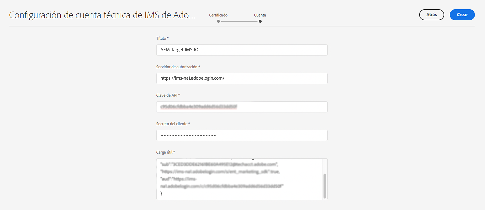

# Configuración de IMS que usar al integrar con Adobe Target{#ims-configuration-for-integration-with-adobe-target}

La integración de AEM con Adobe Target mediante la API de Target Standard requiere la configuración de Adobe IMS (Identity Management System). La configuración se ejecuta con Adobe Developer Console.

>[!NOTE]
>
>La compatibilidad con la API de Adobe Target Standard es nueva en AEMaaCS. La API de Target Standard utiliza la autenticación IMS.
>
>La selección de la API se basa en el método de autenticación utilizado para la integración de AEM/Target.

## Requisitos previos {#prerequisites}

Antes de iniciar este procedimiento:

* El [Soporte de Adobe](https://helpx.adobe.com/es/contact/enterprise-support.ec.html) debe aprovisionar su cuenta para lo siguiente:

   * Adobe Console
   * Adobe Developer Console
   * Adobe Target y
   * Adobe IMS (Identity Management System)

* El administrador del sistema de su organización debe utilizar Admin Console para añadir los desarrolladores necesarios de su organización a los perfiles de producto relevantes.

   * Esto proporciona a los desarrolladores específicos permisos para habilitar integraciones mediante Adobe Developer Console.
   * Para obtener más información, consulte [Administración de desarrolladores](https://helpx.adobe.com/es/enterprise/admin-guide.html/enterprise/using/manage-developers.ug.html).

## Configuración de IMS: generación de una clave pública {#configuring-an-ims-configuration-generating-a-public-key}

El primer paso de la configuración es crear una configuración de IMS en AEM y generar la clave pública.

1. En AEM, abra el menú **Herramientas**.
1. En la sección **Seguridad**, seleccione **Configuraciones de IMS de Adobe**.
1. Seleccione **Crear** para abrir la **Configuración de cuenta técnica de Adobe IMS**.
1. En la lista desplegable debajo de **Configuración de nube**, seleccione **Adobe Target**.
1. Active **Crear nuevo certificado** e introduzca un nuevo alias.
1. Confirme con **Crear certificado**.

   

1. Seleccione **Descargar** (o **Descargar clave pública**) para descargar el archivo en la unidad local, de modo que esté listo para usarse cuando [configure IMS para la integración de Adobe Target con AEM](#configuring-ims-adobe-target-integration-with-aem).

   >[!CAUTION]
   >
   >Mantenga esta configuración abierta, será necesaria de nuevo cuando [complete la configuración de IMS en AEM](#completing-the-ims-configuration-in-aem).

   

## Configuración de IMS para la integración de Adobe Target con AEM {#configuring-ims-adobe-target-integration-with-aem}

AEM utilizará el Proyecto de Adobe Developer Console (integración) con Adobe Target. A continuación, asigne los privilegios necesarios.

### Creación del proyecto {#creating-the-project}

Abra Adobe Developer Console para crear un proyecto con Adobe Target que utilizará AEM:

1. Abra Adobe Developer Console para proyectos:

   [https://developer.adobe.com/console/projects](https://developer.adobe.com/console/projects)

1. Se mostrarán todos los proyectos que tenga. Seleccione **Crear nuevo proyecto**. La ubicación y el uso dependerán de lo siguiente:

   * Si todavía no tiene ningún proyecto, **Crear nuevo proyecto** estará en el centro, abajo.
      
   * Si ya tiene proyectos, estos se enumerarán y **Crear nuevo proyecto** estará en la parte superior derecha.
      

1. Seleccione **Añadir a proyecto** seguido de **API**:

   

1. Seleccione **Adobe Target** y, luego, **Siguiente**:

   >[!NOTE]
   >
   >Si se ha suscrito a Adobe Target, pero no lo ve en la lista, debe comprobar los [Requisitos previos](#prerequisites).

   

1. **Cargue la clave pública** y, cuando se complete, continúe con **Siguiente**:

   

1. Revise las credenciales y continúe con **Siguiente**:

   

1. Seleccione los perfiles de producto necesarios y continúe con **Guardar la API configurada**:

   >[!NOTE]
   >
   >Los perfiles de producto mostrados dependen de si tiene lo siguiente:
   >
   >* Adobe Target Standard: solo está disponible el **Espacio de trabajo predeterminado**
   >* Adobe Target Premium: se enumeran todos los espacios de trabajo disponibles, como se muestra a continuación

   

1. La creación se confirmará.

<!--
1. The creation will be confirmed, you can now **Continue to integration details**; these are needed for [Completing the IMS Configuration in AEM](#completing-the-ims-configuration-in-aem).

   
-->

<!-- could not verify - only saw Adobe Target Classic -->

### Asignación de privilegios a la integración {#assigning-privileges-to-the-integration}

Ahora debe asignar los privilegios necesarios a la integración:

1. Abra la Adobe **Admin Console**:

   * [https://adminconsole.adobe.com](https://adminconsole.adobe.com/)

1. Vaya a **Productos** (barra de herramientas superior) y, a continuación, seleccione **Adobe Target - &lt;*your-tenant-id*>** (del panel izquierdo).
1. Seleccione **Perfiles de producto** y, a continuación, el espacio de trabajo necesario de la lista presentada. Por ejemplo, Espacio de trabajo predeterminado.
1. Seleccione **Credenciales de API** y la configuración de integración requerida.
1. Seleccione **Editor** como la **Función del producto**, en lugar de **Observador**.

## Detalles almacenados para el proyecto de integración de Adobe Developer Console {#details-stored-for-the-ims-integration-project}

Desde la consola Proyectos de Adobe Developer Console puede ver una lista de todos sus proyectos de integración:

* [https://developer.adobe.com/console/projects](https://developer.adobe.com/console/projects)

Seleccione **Ver** (a la derecha de una entrada de proyecto específica) para mostrar más detalles acerca de la configuración. Entre estas características se incluyen:

* Información general del proyecto
* Perspectivas
* Credenciales
   * Cuenta de servicio (JWT)
      * Detalles de la credencial
      * Generar JWT
* API
   * Por ejemplo, Adobe Target

En algunos de estos casos, deberá completar la integración de Adobe Target en AEM según IMS.

## Finalización de la configuración de IMS en AEM {#completing-the-ims-configuration-in-aem}

Al volver a AEM, puede completar la configuración de IMS añadiendo los valores necesarios desde la integración de IMS para Target:

1. Vuelva a la [Configuración de IMS abierta en AEM](#configuring-an-ims-configuration-generating-a-public-key).
1. Seleccione **Siguiente**.

1. Aquí puede usar los [detalles de la configuración del proyecto de la Adobe Developer Console](#details-stored-for-the-ims-integration-project):

   * **Título**: el texto.
   * **Servidor de autorización**: copie/pegue esto de la línea `aud` de la sección **Carga útil** a continuación, por ejemplo, `https://ims-na1.adobelogin.com` en la instancia siguiente
   * **Clave de API**: copie esto de la sección [Información general del proyecto](#details-stored-for-the-ims-integration-project)
   * **Secreto del cliente**: genere esto en la sección [Información general del proyecto](#details-stored-for-the-ims-integration-project) y copie
   * **Carga útil**: copie esto desde la sección [Generar JWT](#details-stored-for-the-ims-integration-project)

   

1. Confirme con **Crear**.

1. La configuración de Adobe Target se mostrará en la consola de AEM.

   

## Confirmación de la configuración de IMS {#confirming-the-ims-configuration}

Para confirmar que la configuración funciona según lo esperado:

1. Abra:

   * `https://localhost<port>/libs/cq/adobeims-configuration/content/configurations.html`

   Por ejemplo:

   * `https://localhost:4502/libs/cq/adobeims-configuration/content/configurations.html`

1. Seleccione la configuración.
1. Seleccione **Comprobar estado** en la barra de herramientas, seguido de **Comprobar**.

   

1. Si se ejecuta correctamente, verá un mensaje de confirmación.

## Finalización de la integración con Adobe Target {#complete-the-integration-with-adobe-target}

Ahora puede utilizar esta configuración de IMS para completar la [integración con Adobe Target](/help/sites-cloud/integrating/integrating-adobe-target.md).

<!--

## Configuring the Adobe Target Cloud Service {#configuring-the-adobe-target-cloud-service}

The configuration can now be referenced for a Cloud Service to use the Target Standard API:

1. Open the **Tools** menu. Then, within the **Cloud Services** section, select **Legacy Cloud Services**.
1. Scroll down to **Adobe Target** and select **Configure now**.

   The **Create Configuration** dialog will open.

1. Enter a **Title** and, if you want, a **Name** (if left blank this will be generated from the title).

   You can also select the required template (if more than one is available).

1. Confirm with **Create**.

   The **Edit Component** dialog will open.

1. Enter the details in the **Adobe Target Settings** tab:

    * **Authentication**: IMS

    * **Client Code**: See the [Tenant ID and Client Code](#tenant-client) section.

    * **Tenant ID**: the Adobe IMS Tenant ID. See also the [Tenant ID and Client Code](#tenant-client) section.

      >[!NOTE]
      >
      >For IMS this value needs to be taken from Target itself. You can log into Target and extract the Tenant ID from the URL.
      >
      >For example, if the URL is:
      >
      >`https://experience.adobe.com/#/@yourtenantid/target/activities`
      >
      >Then you would use `yourtenantid`.

    * **IMS Configuration**: select the name of the IMS Configuration

    * **API Type**: REST

    * **A4T Analytics Cloud Configuration**: Select the Analytics cloud configuration that is used for target activity goals and metrics. You need this if you are using Adobe Analytics as the reporting source when targeting content.   

      <!--
      If you do not see your cloud configuration, see note in [Configuring A4T Analytics Cloud Configuration](/help/sites-administering/target-configuring.md#configuring-a-t-analytics-cloud-configuration).
      -- >

    * **Use accurate targeting**: By default this check box is selected. If selected, the cloud service configuration will wait for the context to load before loading content. See note that follows.

    * **Synchronize segments from Adobe Target**: Select this option to download segments that are defined in Target to use them in AEM. You must select this option when the API Type property is REST, because inline segments are not supported and you always need to use segments from Target. (Note that the AEM term of 'segment' is equivalent to the Target 'audience'.)

    * **Client library**: Select whether you want the AT.js client library, or mbox.js (deprecated).

    * **Use Tag Management System to deliver client library**: Use DTM (deprecated), Adobe Launch or any other tag management system.

    * **Custom AT.js**: Leave blank if you checked the Tag Management box or to use the default AT.js. Alternatively upload your custom AT.js. Only appears if you have selected AT.js.

   <!--
   >[!NOTE]
   >
   >[Configuration of a Cloud Service to use the Target Classic API](/help/sites-administering/target-configuring.md#manually-integrating-with-adobe-target) has been deprecated (uses the Adobe Recommendations Settings tab).
   -- >

1. Click **Connect to Adobe Target** to initialize the connection with Adobe Target.

   If the connection is successful, the message **Connection successful** is displayed.

1. Select **OK** on the message, followed by **OK** on the dialog to confirm the configuration.

1. You can now proceed to [Adding a Target Framework](/help/sites-administering/target-configuring.md#adding-a-target-framework) to configure ContextHub or ClientContext parameters that will be sent to Target. Note this may not be required for exporting AEM Experience Fragments to Target.

### Tenant ID and Client Code {#tenant-client}

With [Adobe Experience Manager as a Cloud Service](/help/release-notes/release-notes-cloud/release-notes-current.md), the Client Code field had been added to the Target configuration window.

When configuring the Tenant ID and Client Code fields, please be aware of that for most customers, the **Tenant ID** and the **Client Code** are the same. This means that both fields contain the same information and are identical. Make sure you enter the Tenant ID in both fields.

>[!NOTE]
>
>For legacy purposes, you can also enter different values in the Tenant ID and the Client Code fields.

In both cases, be aware that:

* By default, the Client Code (if added first) will also be automatically copied into the Tenant ID field.
* You have the option to change the default Tenant ID set.
* Accordingly, the backend calls to Target will be based on the **Tenant ID** and the client side calls to Target will be based on the **Client Code**.

As stated previously, the default case is the most common for AEM as a Cloud Service. Either way, make sure **both** fields contain the correct information depending on your requirements.

>[!NOTE]
>
> If you want to change an existing Target Configuration:
>
> 1. Re-enter the Tenant ID.
> 2. Re-connect to Target.
> 3. Save the configuration.
-->
