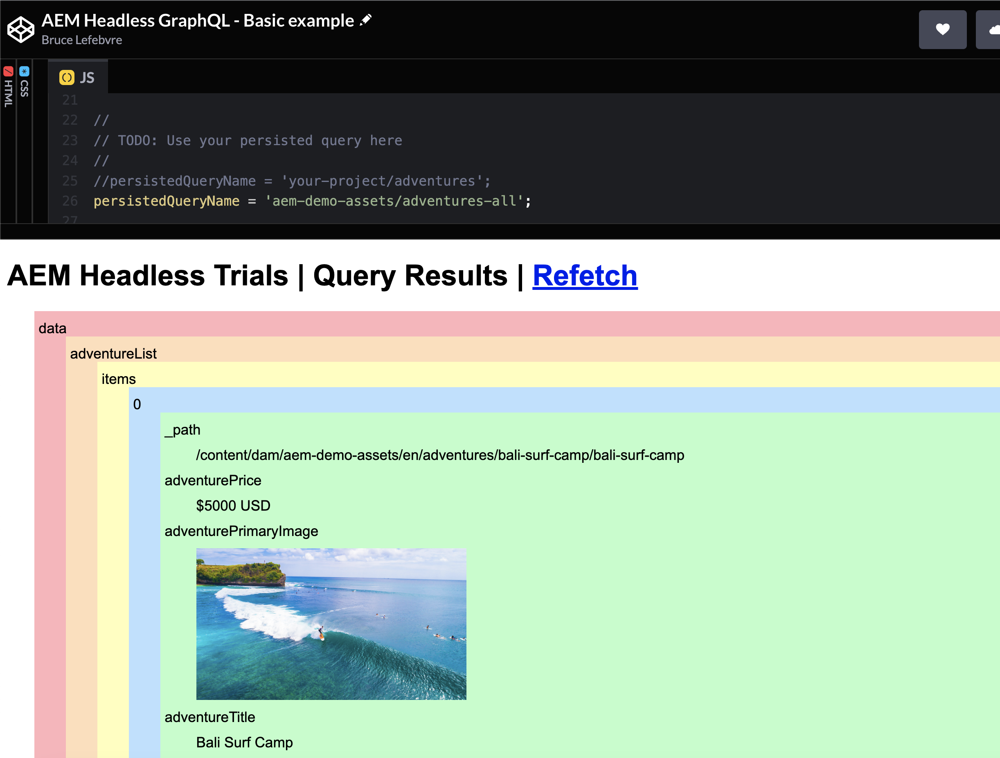

# Representar el contenido en una aplicación simple {#render-content-simple-app}

>[!CONTEXTUALHELP]
>id="aemcloud_sites_trial_fetch_json_with_javascript"
>title="Procesamiento del contenido en una aplicación sencilla"
>abstract="Explore la recuperación de contenido JSON desde su entorno de prueba con una aplicación de ejemplo CodePen y el cliente sin encabezado de AEM para JavaScript."

>[!CONTEXTUALHELP]
>id="aemcloud_sites_trial_fetch_json_with_javascript_guide"
>title="Lanzamiento de la aplicación CodePen de muestra"
>abstract="Esta guía explica cómo consultar los datos JSON de su entorno de prueba en una aplicación web básica de JavaScript. Utilizaremos los fragmentos de contenido que ha modelado y creado en los módulos de aprendizaje anteriores, así que consulte estas guías primero antes de empezar esta."

>[!CONTEXTUALHELP]
>id="aemcloud_sites_trial_fetch_json_with_javascript_guide_footer"
>title="En este módulo, ha aprendido a utilizar el cliente sin encabezado de AEM para JavaScript con el propósito de recuperar datos JSON de su entorno de prueba mediante consultas persistentes de GraphQL.<br><br>Ahora comprende cómo puede aprovechar este cliente para consumir datos desde su propia aplicación web."
>abstract=""

## CodePen {#codepen}

CodePen es un editor de código en línea y un área de reproducción para el desarrollo web front-end. Le permite escribir código HTML, CSS y JavaScript en su navegador y ver los resultados de su trabajo casi al instante. También puede guardar su trabajo y compartirlo con otros. Hemos creado una aplicación en CodePen que puede usar para recuperar datos JSON de su entorno de prueba con el [AEM cliente sin encabezado para JavaScript](https://github.com/adobe/aem-headless-client-js). Puede usar esta aplicación tal cual, o ramificarla en su cuenta de CodePen para personalizarla aún más.

Al hacer clic en **Inicie la aplicación CodePen de ejemplo** de la versión de prueba le llevará a la aplicación en CodePen. La aplicación es un ejemplo mínimo de recuperación de datos JSON con JavaScript. La aplicación de ejemplo está diseñada para procesar cualquier contenido JSON que se devuelva, independientemente de la estructura del modelo de fragmento de contenido subyacente. De serie, la aplicación recuperará datos de un `aem-demo-assets` consulta persistente que se incluye en el entorno de prueba. Debería ver una respuesta JSON similar a la siguiente:

```json
{
  "data": {
    "adventureList": {
      "items": [
        {
          "_path": "/content/dam/aem-demo-assets/en/adventures/bali-surf-camp/bali-surf-camp",
          "title": "Bali Surf Camp",
          "price": "$5000 USD",
          ...
```

Si ve un error en su lugar, consulte la consola del explorador para obtener más información o póngase en contacto con [en Slack](https://adobe-dx-support.slack.com).

Ahora que conoce un poco sobre CodePen, a continuación configurará la aplicación para recuperar datos de la consulta persistente que creó en un módulo anterior.

## Tutorial de código JavaScript {#code-walkthrough}

La variable **JS** a la derecha de CodePen contiene el JavaScript de la aplicación de ejemplo. A partir de la línea 2, importamos el cliente sin encabezado AEM para JavaScript desde la CDN Skypack. Skypack se utiliza para facilitar el desarrollo sin un paso de compilación, pero también puede utilizar el cliente sin encabezado AEM con NPM o Yarn en sus propios proyectos. Consulte las instrucciones de uso en la [README](https://github.com/adobe/aem-headless-client-js#aem-headless-client-for-javascript) para obtener más información.

```javascript
import AdobeAemHeadlessClientJs from 'https://cdn.skypack.dev/@adobe/aem-headless-client-js@v3.2.0';
```

En la línea 6 leemos los detalles de su host de publicación desde la `publishHost` parámetro de consulta. Este es el host desde el que el cliente sin encabezado de AEM recuperará datos. Normalmente, esto se codificaría en la aplicación, pero se utiliza un parámetro de consulta para facilitar el trabajo de la aplicación CodePen con distintos entornos.

Configuramos el cliente sin AEM en la línea 12:

```javascript
const aemHeadlessClient = new AdobeAemHeadlessClientJs({
  // Use a proxy to avoid CORS issues
  serviceURL: 'https://102588-505tanocelot.adobeioruntime.net/api/v1/web/aem/proxy',
  headers: {
    'aem-url': publishHost
  }
});
```

>[!NOTE]
>
>La variable **serviceURL** está configurado para utilizar una función de tiempo de ejecución de IO de Adobe proxy para evitar problemas con CORS. Esto no es necesario para sus propios proyectos, pero es necesario para que la aplicación CodePen funcione con su entorno de prueba. La función proxy está configurada para usar la variable **publishHost** que se proporcionó en el parámetro de consulta.

Finalmente, la función `fetchJsonFromGraphQL()` se utiliza para realizar la solicitud de recuperación mediante el cliente sin encabezado AEM. Se llama cada vez que se cambia el código o se puede activar haciendo clic en el botón **Recuperación** vínculo. El `aemHeadlessClient.runPersistedQuery(..)` se produce en la línea 34. Un poco más tarde haremos un cambio en la forma en que se procesan los datos JSON, pero por ahora solo lo imprimiremos en la variable `#output` div usando la variable `resultToPreTag(queryResult)` función.

## Buscar datos de la consulta persistente {#use-persisted-query}

En la línea 25 indicamos de qué consulta de GraphQL persistió la aplicación y desde qué la aplicación debería recuperar datos. El nombre de consulta persistente es una combinación del nombre del extremo (por ejemplo, `your-project` o `aem-demo-assets`), seguido de una barra diagonal y, a continuación, el nombre de la consulta. Si ha seguido exactamente las instrucciones del módulo anterior, la consulta persistente que ha creado estará en la variable `your-project` punto final.

1. Actualice el `persistedQueryName` para utilizar la consulta persistente que creó en el módulo anterior. Si hubiera seguido la sugerencia de asignación de nombres, habría creado una consulta persistente denominada `adventure-list` en el `your-project` y establecería la variable `persistedQueryName` a `your-project/adventure-list`:

   ```javascript
   //
   // TODO: Use your persisted query here
   //
   persistedQueryName = 'your-project/adventure-list';
   ```

1. Una vez realizado este cambio, la aplicación debe actualizarse automáticamente e imprimir la respuesta JSON sin procesar de la consulta persistente en la variable `#output` div. Si ve un mensaje de error, consulte la consola para obtener más información. Alcance [en Slack](https://adobe-dx-support.slack.com) si sigue teniendo problemas con este paso.

1. ¿Contiene este JSON las propiedades exactas que necesita su aplicación? Si no es así, vuelva a la sección [Extraer contenido mediante la API de GraphQL](https://experience.adobe.com/experiencemanager/learn/extract_content_using_graphql) guía de aprendizaje para realizar cambios. No olvide guardar y publicar la consulta una vez que haya terminado.

## Cambiar la renderización JSON {#change-rendering}

El JSON se procesa tal cual en un `pre` , que no es muy creativa. Podemos cambiar nuestro CodePen para usar el `resultToDom()` para ilustrar cómo se puede iterar la respuesta JSON para crear un resultado más interesante.

1. Para realizar este cambio, comente la línea 37 y elimine el comentario de la línea 40:

   ```javascript
   // Output the results to a pre tag
   //resultToPreTag(queryResult);
   
   // Alternatively, build a colorful div structure with the JSON results and render images inline
   resultToDom(queryResult);
   ```

1. Esta función también procesará todas las imágenes incluidas en la respuesta JSON como una `img` etiqueta. Si la variable **Aventura** los fragmentos de contenido que ha creado no incluyen imágenes, puede intentar cambiar para usar la variable `aem-demo-assets/adventures-all` consulta persistente mediante la modificación de la línea 25:

   ```javascript
   persistedQueryName = 'aem-demo-assets/adventures-all';
   ```

Esta consulta generará una respuesta JSON que incluye imágenes y la variable `resultToDom()` los procesará en línea.



Ahora que ha hecho el trabajo para crear los modelos y las consultas, su equipo de contenido puede asumir el control con facilidad. Se mostrará el flujo de creación de contenido en el siguiente módulo.
