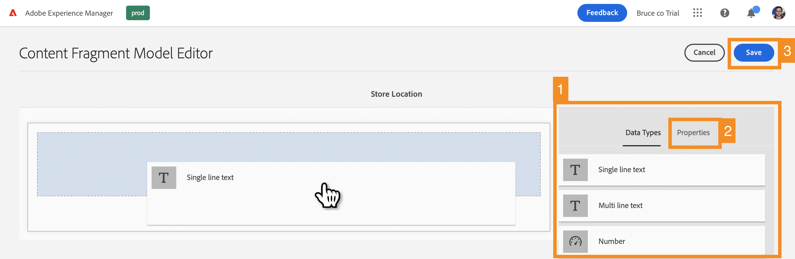

# Crear la estructura de contenido para la aplicación {#content-structure}

>[!CONTEXTUALHELP]
>id="aemcloud_sites_trial_admin_content_fragments_overview"
>title="Cree la estructura de contenido para la aplicación"
>abstract="A medida que sigue esta serie de guías interactivas, aprenderá a crear una estructura (conocida como el modelo de fragmento de contenido) que sirva de base para su contenido sin encabezado."

>[!CONTEXTUALHELP]
>id="aemcloud_sites_trial_admin_content_fragments_overview_guide"
>title="Iniciar la consola del modelo"
>abstract="Vamos a explorar cómo crear un esquema reutilizable, llamado modelo de fragmento de contenido, para su contenido en Adobe Experience Manager as a Cloud Service. Vea el vídeo para comprender por qué este es un paso importante.   Inicie este módulo en una nueva pestaña haciendo clic en el botón de abajo y siga esta guía."
>additional-url="https://video.tv.adobe.com/v/3413261/?captions=spa" text="Vídeo introductorio de la estructura de contenido"

>[!CONTEXTUALHELP]
>id="aemcloud_sites_trial_admin_content_fragments_overview_guide_footer"
>title="¡Enhorabuena! Ha aprendido a crear un modelo de fragmento de contenido para representar la estructura de sus datos sin encabezado y ha dado el primer paso para ofrecer contenido omnicanal de forma escalada y estándar."
>abstract=""

## Crear un modelo {#create-model}

La consola de modelos de fragmento de contenido se abre en una nueva pestaña. Considere la consola del modelo de fragmento de contenido como su biblioteca de modelos, donde crea nuevos modelos y gestiona los modelos existentes.

1. Haga clic en el **Crear** en la parte superior derecha de la pantalla para comenzar a crear un modelo de fragmento de contenido.

1. Se inicia el asistente Crear modelo, que le guía. Proporcione la información obligatoria.

   * **Título de modelo** - Esta es una breve descripción del modelo y normalmente indica el propósito del modelo.
   * **Habilitar modelo** - Esta opción está activada de forma predeterminada y debe estar activada para poder crear fragmentos de contenido basados en este modelo.

1. Una vez rellenados los campos obligatorios, haga clic en **Crear** en la parte superior izquierda para crear el modelo.

1. La variable **Correcto** confirma que se creó el modelo. Haga clic en **Apertura** en el cuadro de diálogo para abrir el nuevo modelo de fragmento de contenido en el editor en una nueva ficha. A continuación, continúe con el siguiente paso para añadir campos de datos al modelo.

## Agregar campos al modelo {#configure-model}

Para poder utilizar el modelo, debe definir la estructura de sus datos. El editor del modelo de fragmento de contenido es donde se configuran los tipos de datos y las propiedades que definen el contenido del modelo.

1. Arrastre un campo desde la **Tipos de datos** a la derecha del editor y suéltelo en el modelo de fragmento de contenido.

1. Una vez colocado el tipo de datos, la variable **Tipos de datos** se ha cambiado automáticamente a **Propiedades** , donde puede definir los detalles del tipo de datos que acaba de colocar.

1. Una vez añadidos todos los campos necesarios para el modelo de fragmento de contenido, haga clic en **Guardar** en la parte superior derecha de la ventana.

1. El modelo se guarda y se vuelve a la consola del modelo de fragmento de contenido.

