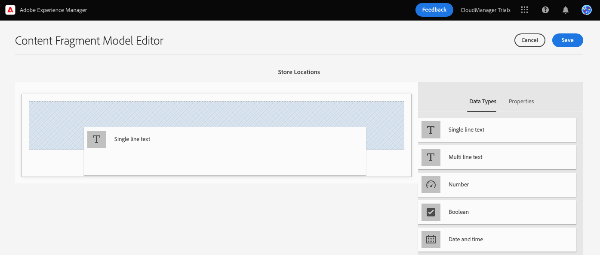

# Crear la estructura de contenido para la aplicación {#content-structure}

Los fragmentos de contenido permiten diseñar, crear, depurar y publicar contenido independiente de cualquier página. Con ellos, puede preparar contenido que esté listo para usar en varias ubicaciones y en varios canales, lo que resulta ideal para una entrega sin periféricos. Los modelos de fragmento de contenido se utilizan para definir la estructura de este contenido y son lo primero que debe crear para administrar el contenido sin encabezado.

Para ayudarle a comprender cómo se hace esto, este módulo de AEM Trials le lleva a través del proceso con un recorrido rápido e interactivo primero creando el modelo y luego agregando su estructura. Este documento sirve como complemento de la visita al producto, abarcando los mismos pasos y vinculando recursos adicionales cuando corresponde.

## La consola Modelo de fragmento de contenido {#content-fragment-model-console}

Se inicia en la consola de modelos de fragmento de contenido. La consola de modelos de fragmento de contenido se puede considerar como su biblioteca de modelos. La consola se utiliza para crear nuevos modelos y administrar los modelos existentes. La consola empieza vacía, así que vamos a crear un nuevo modelo.

Si desea navegar a la consola del modelo de fragmento de contenido por su cuenta fuera de la guía en la aplicación, se encuentra con el icono de Adobe en la parte superior izquierda de la página. Esto abre la navegación global de AEM. Desde aquí puede elegir el **Herramientas** pestaña y luego **General** -> **Modelos de fragmento de contenido**.

>[!TIP]
>
>Si desea obtener más información sobre la navegación en AEM, consulte la [Sección Recursos adicionales](#additional-resources) de este documento para obtener más información sobre AEM gestión básica.

## Crear un modelo {#create-model}

Una vez que esté en la consola del modelo de fragmento de contenido, puede crear un nuevo modelo para representar su propio contenido sin encabezado.

1. En la consola del modelo de fragmento de contenido, haga clic en el botón **Crear** en la parte superior derecha de la pantalla para comenzar a crear un modelo de fragmento de contenido.

1. Se inicia el asistente Crear modelo , que le guía a través de la creación de un modelo de fragmento de contenido.

   

   Proporcione la información obligatoria.

   * **Título de modelo** - Esta es una breve descripción del modelo y normalmente indica su propósito.
   * **Habilitar modelo** - Esta opción está activada de forma predeterminada y debe estar marcada para poder crear fragmentos de contenido más adelante basados en este modelo.

   También puede elegir añadir un **Descripción** al modelo, así como **Etiquetas** para clasificarlo y diferenciarlo para los usuarios más adelante dentro de la consola del modelo de fragmento de contenido.

   >[!TIP]
   >
   >Si le interesa cómo las etiquetas pueden organizar su contenido, consulte la [Sección Recursos adicionales](#additional-resources) de este documento para obtener más información sobre el etiquetado en AEM.

1. Una vez rellenados los campos obligatorios, haga clic en **Crear** en la parte superior izquierda para crear el modelo.

1. La variable **Correcto** confirma que se creó el modelo.

   

1. Para poder utilizar el modelo, también debe definir la estructura de sus datos. Haga clic en **Apertura** en el cuadro de diálogo para abrirlo y continuar definiendo el modelo.

## Agregar campos al modelo {#configure-model}

El modelo de fragmento de contenido es esencialmente un esquema para los fragmentos de contenido. Es decir, define qué campos/tipos de datos contiene el modelo.

Con el editor del modelo de fragmento de contenido, puede definir campos para el modelo de fragmento de contenido mediante una interfaz de arrastrar y soltar.

1. Arrastre un campo desde la **Tipos de datos** a la derecha de la pantalla y suéltela en el modelo de fragmento de contenido. Existen varios tipos de datos para elegir, como un texto de una sola línea, texto multilínea, número y referencias a otros fragmentos.

   

   >[!TIP]
   >
   >Si desea obtener más información sobre los tipos de datos disponibles, consulte la [Sección Recursos adicionales](#additional-resources) de este documento para obtener la documentación detallada de los modelos de fragmento de contenido.

1. Una vez colocado el tipo de datos, la variable **Tipos de datos** se ha cambiado automáticamente a **Propiedades** , donde puede definir los detalles del tipo de datos que acaba de colocar.

   

   Las propiedades del modelo pueden incluir el nombre del campo, el tipo de campo, la longitud del campo, si es obligatorio, etc.

1. Utilice la variable **Propiedades** del tipo de datos seleccionado para definir propiedades como valor predeterminado, longitud máxima, si es un campo obligatorio, etc.

   >[!TIP]
   >
   >Si desea obtener más información sobre las propiedades disponibles, consulte la [Sección Recursos adicionales](#additional-resources) de este documento para obtener la documentación detallada de los modelos de fragmento de contenido.

1. Una vez añadidos todos los campos necesarios para el modelo de fragmento de contenido, haga clic en **Guardar** en la parte superior derecha de la ventana.

1. Esto guarda el modelo y lo devuelve a la consola del modelo de fragmento de contenido, donde puede añadir más modelos si es necesario.

## Ha aprendido a crear un modelo de fragmento de contenido {#conclusion}

En este módulo, ha aprendido a crear un modelo de fragmento de contenido para representar la estructura de sus datos sin encabezado. Primero creó el modelo y después lo rellenó con tipos de datos y sus propiedades relacionadas, definiendo así un esquema para el contenido sin encabezado.

Ahora que tiene su propio modelo de fragmento de contenido, puede utilizarlo para crear fragmentos de contenido. El módulo [Crear nuevo contenido](create-content.md) detalles para usar el nuevo modelo de fragmento de contenido para crear contenido sin encabezado.

Para volver a la pantalla de inicio de la versión de prueba, haga clic en **Soluciones** en la parte superior derecha de la barra de navegación y seleccione **Experience Manager**.

## Recursos adicionales {#additional-resources}

Para obtener más información sobre los fragmentos de contenido y AEM, considere la posibilidad de revisar esta documentación adicional.

* [Gestión básica](/help/sites-cloud/authoring/getting-started/basic-handling.md) : Documentación sobre cómo navegar y utilizar AEM para nuevos usuarios
* [Uso de etiquetas](/help/sites-cloud/authoring/features/tags.md) : Documentación sobre cómo utilizar las etiquetas en AEM para organizar el contenido
* [Fragmentos de contenido](/help/assets/content-fragments/content-fragments.md) : Información general sobre los fragmentos de contenido y vínculos a documentación completa sobre los fragmentos de contenido
* [Modelos de fragmento de contenido](/help/assets/content-fragments/content-fragments-models.md) : Documentación completa sobre los modelos de fragmentos de contenido
* [Modelos de fragmento de contenido: tipos de datos](/help/assets/content-fragments/content-fragments-models.md#data-types) : Detalles sobre los distintos tipos de datos disponibles para los modelos de fragmento de contenido
* [Modelos de fragmento de contenido: propiedades](/help/assets/content-fragments/content-fragments-models.md#data-types) : Detalles sobre las distintas propiedades disponibles para los tipos de datos de los modelos de fragmento de contenido
