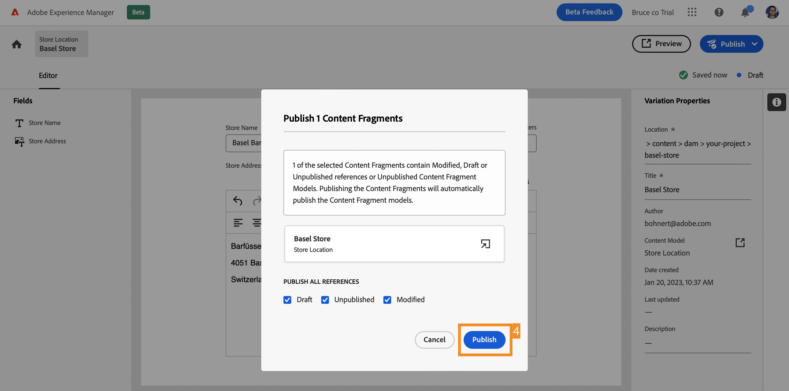

# Crear contenido sin encabezado {#create-content}

>[!CONTEXTUALHELP]
>id="aemcloud_sites_trial_admin_content_fragments_create_content"
>title="Crear contenido nuevo"
>abstract="Utilizando el modelo que ha creado en el módulo anterior, aprenderá a crear contenido que se pueda utilizar para la creación de páginas o como base del contenido sin encabezado."

>[!CONTEXTUALHELP]
>id="aemcloud_sites_trial_admin_content_fragments_create_content_guide"
>title="Iniciar la consola Fragmento de contenido"
>abstract="La creación de contenido coherente y de alta calidad que funcione sin problemas en todas las aplicaciones y sitios web lleva a buenas experiencias de los clientes. Este módulo le guía a través de la creación de su primer fragmento de contenido para ilustrar cómo hacerlo realidad.  Inicie este módulo en una nueva pestaña haciendo clic en el botón de abajo y, a continuación, siga esta guía."

>[!CONTEXTUALHELP]
>id="aemcloud_sites_trial_admin_content_fragments_create_content_guide_footer"
>title="¡bueno trabajo! En este módulo, ha aprendido a crear un fragmento de contenido basado en el modelo que ha creado anteriormente. Ahora comprende cómo los equipos de contenido pueden crear y administrar contenido para aplicaciones y sitios web independientes de los ciclos de desarrollo."
>abstract=""

## Crear un fragmento de contenido {#create-fragment}

Los fragmentos de contenido representan su contenido sin encabezado y se basan en estructuras predefinidas, denominadas modelos de fragmento de contenido. Considere la consola Fragmento de contenido como una biblioteca de contenido sin encabezado. Utilícelo para crear nuevos fragmentos de contenido y administrar los fragmentos existentes.

1. Toque o haga clic en el botón **Crear** en la parte superior derecha de la consola.

1. La variable **Nuevo fragmento de contenido** se abre el cuadro de diálogo donde puede empezar a crear un nuevo fragmento de contenido. **Ubicación** se rellena automáticamente con el lugar donde se guardará el nuevo contenido.

1. En el **Modelo de fragmento de contenido** , seleccione el modelo de fragmento de contenido que creó anteriormente.

1. Agregue un **Título** para el fragmento de contenido.

1. Toque o haga clic **Crear y abrir**.

## Añadir contenido al fragmento de contenido {#add-content}

Una vez guardado y abierto el nuevo fragmento de contenido, el editor de fragmentos de contenido se abre en una nueva ficha. Aquí puede añadir el contenido del nuevo fragmento.

1. El editor de fragmentos de contenido muestra los campos definidos en el modelo seleccionado. Aquí puede añadir contenido a cada campo para completar el fragmento de contenido. El progreso se guarda automáticamente.

1. Una vez que haya terminado de añadir contenido, toque o haga clic en el botón **Publicación** en la parte superior derecha del editor. Esto hace que el fragmento de contenido esté disponible para su consumo en aplicaciones externas.

1. Select **Ahora** en la lista desplegable . También puede programarlo para publicarlo más adelante.

   

1. La variable **Publicar fragmentos de contenido** se abre. AEM realiza automáticamente una comprobación de referencia para asegurarse de que se publican todos los recursos necesarios para el fragmento de contenido. En este caso, también deberá publicar el modelo que ha creado. Haga clic o pulse **Publicar**.

   

1. La publicación se confirma en un banner.

El contenido se publica y está listo para enviarse a su aplicación o sitio web como fragmento de contenido.
