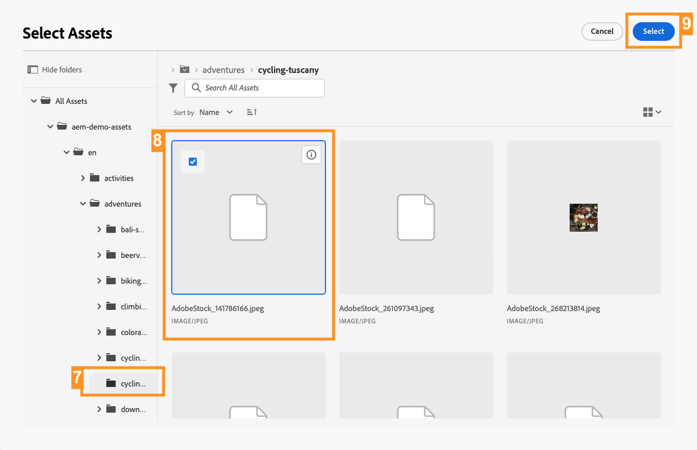

# Creación de contenido sin encabezado {#create-content}

>[!CONTEXTUALHELP]
>id="aemcloud_sites_trial_admin_content_fragments_create_content"
>title="Crear contenido nuevo"
>abstract="A partir del modelo creado en el módulo anterior, aprenderá a crear contenido que puede utilizar para la confección de páginas o como base de su contenido sin encabezado."

>[!CONTEXTUALHELP]
>id="aemcloud_sites_trial_admin_content_fragments_create_content_guide"
>title="Lanzamiento de la consola de fragmentos de contenido"
>abstract="La creación de contenido coherente y de alta calidad que funcione sin problemas en todas las aplicaciones y sitios web lleva a buenas experiencias de cliente. Este módulo le guía a través de la creación de su primer fragmento de contenido para ilustrar cómo hacerlo realidad.<br><br>Inicie este módulo en una nueva pestaña haciendo clic en el botón de abajo y, a continuación, siga esta guía."

>[!CONTEXTUALHELP]
>id="aemcloud_sites_trial_admin_content_fragments_create_content_guide_footer"
>title="¡Buen trabajo! En este módulo, ha aprendido a elaborar un fragmento de contenido basado en el modelo que ha creado anteriormente. Ahora comprende cómo los equipos de contenido pueden crear y administrar contenido para aplicaciones y sitios web independientes de los ciclos de desarrollo."
>abstract=""

## Creación de un fragmento de contenido {#create-fragment}

Los fragmentos de contenido representan su contenido sin encabezado y se basan en estructuras predefinidas, denominadas modelos de fragmento de contenido. Ya ha creado un modelo en un módulo anterior.

En este módulo, creará un nuevo fragmento de contenido basado en ese modelo mediante la consola Fragmento de contenido. Considere la consola fragmento de contenido como una biblioteca de contenido sin encabezado. Utilícela para crear nuevos fragmentos de contenido y administrar los existentes.

1. Toque o haga clic en el botón **Crear** en la parte superior derecha de la consola.

1. El **Fragmento de contenido nuevo** se abrirá un cuadro de diálogo en el que puede empezar a crear un nuevo fragmento de contenido. **Ubicación** se rellena automáticamente con la ubicación en la que se guarda el nuevo contenido.

1. En el desplegable **modelo de Fragmento de contenido**, seleccione el modelo de Fragmento de contenido **Aventura** que creó anteriormente.

1. Agregue `Tuscany` como **Título** descriptivo para el Fragmento de contenido. Esto es para identificar el fragmento en la consola.

1. Toque o haga clic en **Crear y abrir**.


>[!TIP]
>
>Según la configuración del explorador, la nueva pestaña del explorador puede ser suprimida por un bloqueador de ventanas emergentes. Si el nuevo fragmento no se abre después de hacer clic en **Crear y abrir**, compruebe la configuración de su explorador.

## Adición de contenido a su Fragmento de contenido {#add-content}

Después de guardar y abrir el nuevo fragmento de contenido, el editor de fragmentos de contenido se abre en una nueva pestaña. Aquí puede añadir el contenido del nuevo fragmento.

1. El editor de fragmentos de contenido muestra los campos definidos en el modelo seleccionado. Aquí puede añadir contenido a cada campo para completar el fragmento de contenido. El progreso se guarda automáticamente.

1. Proporcione un **Título** para el fragmento introduciendo `Tuscan Adventure`.

1. Proporcione una **Descripción** para el fragmento pegando en el siguiente texto.

   ```text
   Visiting Tuscany on a bicycle is about experiencing the old world charm of Italy on your own terms. Your efforts on the climbs of Italy's rolling hills during this tour are rewarded with sunny Mediterranean landscapes and unmatched Italian hospitality. Tuscany's natural wonders have always been a well of inspiration for arts and culture. Find out why as you explore the Italian countryside and coastline on bicycle.
   ```

1. Proporcione un **Precio** para el fragmento introduciendo en `$700`.

1. Proporcione una **Imagen** que sea representativa del viaje pulsando o haciendo clic en **Agregar recurso** en el  campo de **Imagen**.

1. En la ventana emergente del recurso, pulse o haga clic en **Examinar recursos** para seleccionar un recurso existente en la biblioteca de recursos.

   

1. Se abre el cuadro de diálogo de **Seleccionar recurso**. Con el navegador de árbol en el panel izquierdo, vaya a **Todos los recursos** > **aem-demo-assets** > **en** > **aventuras** > **ciclismo-toscana**.

1. El contenido de la carpeta **ciclismo-toscana** se muestra a la derecha. Seleccionar la imagen `ADOBESTOCK_141786166.JPEG`.

1. Pulse o haga clic en **Seleccionar**.

   

1. La imagen seleccionada se muestra en el fragmento de contenido. El editor guarda automáticamente los cambios.

1. Una vez que haya terminado de añadir contenido, toque o haga clic en el botón **Publicar** en la parte superior derecha del editor. Esto hace que el fragmento de contenido esté disponible para su consumo en aplicaciones externas. Después, seleccione **Ahora** de la lista desplegable. También puede programarlo para publicarlo más adelante.

   

1. Aparece el cuadro de diálogo **Publicar fragmentos de contenido**. AEM realiza automáticamente una comprobación de referencia para asegurarse de que se publican todos los recursos necesarios para el fragmento de contenido. En este caso, también deberá publicar el modelo que ha creado. Haga clic o pulse **Publicar**.

   

1. La publicación se confirma en un titular.

El contenido se publica y está listo para enviarse a su aplicación o sitio web como fragmento de contenido.
