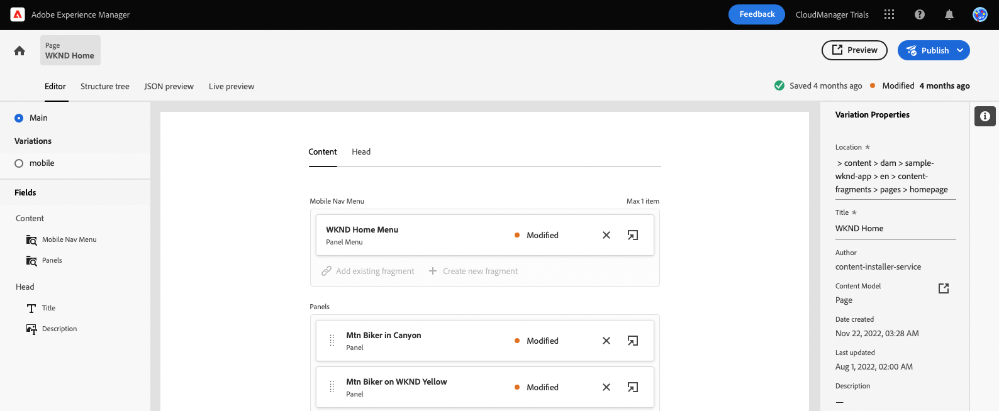
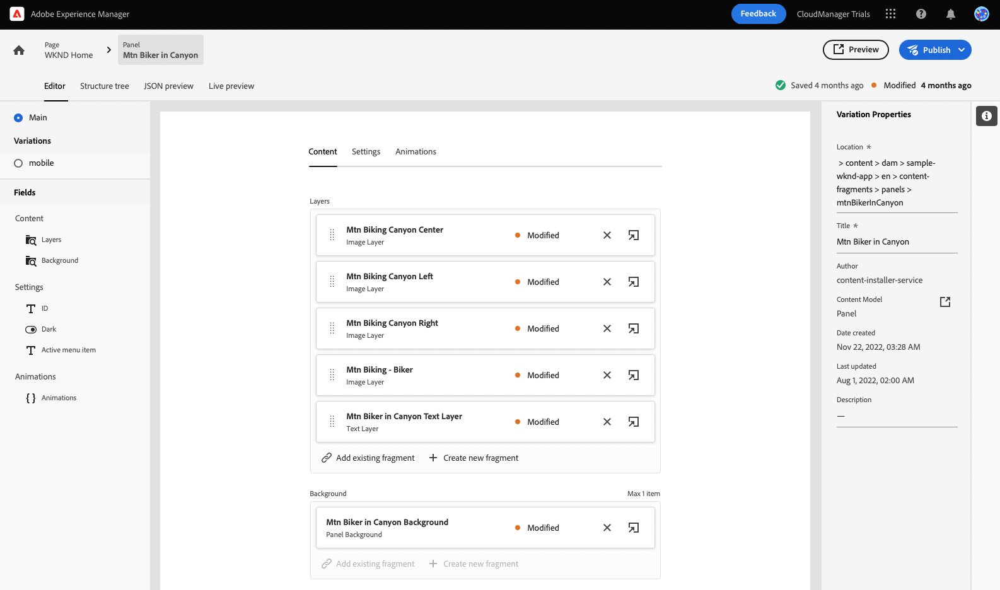
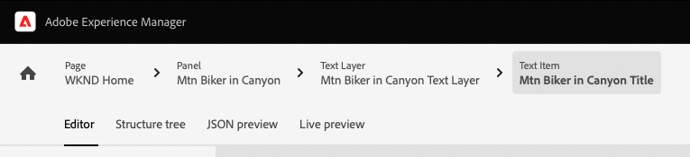
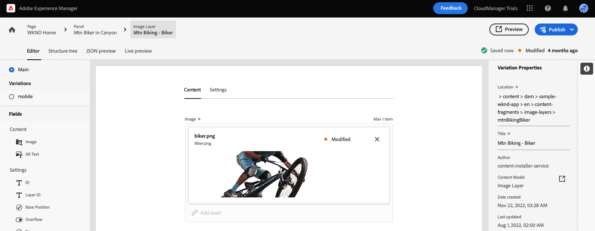

# Personalizar contenido en una aplicación de ejemplo React {#customize-app}

>[!CONTEXTUALHELP]
>id="aemcloud_sites_trial_admin_content_fragments_react_app"
>title="Personalización del contenido en una aplicación React de ejemplo"
>abstract="La prueba sin AEM se integra con una aplicación React de ejemplo, que puede personalizar."

>[!CONTEXTUALHELP]
>id="aemcloud_sites_trial_admin_content_fragments_react_app_guide"
>title="Inicio del editor de fragmentos de contenido"
>abstract="La prueba sin AEM se integra con una aplicación React de muestra, por lo que puede ver lo fácil que es para cualquiera administrar el contenido de forma independiente sin tiempo de desarrollo.  Inicie este módulo en una nueva pestaña haciendo clic en a continuación y siga esta guía."
>additional-url="https://video.tv.adobe.com/v/328618" text="Vídeo introductorio de la aplicación"

>[!CONTEXTUALHELP]
>id="aemcloud_sites_trial_admin_content_fragments_react_app_guide_footer"
>title="En este módulo, ha aprendido a personalizar una aplicación React de ejemplo.  Tiempo de comercialización: ¡Acelerado! Ciclos de desarrollo: ¡Reducido!  Ahora comprende lo fácil que es administrar contenido sin encabezado para sitios web y aplicaciones que cuentan con AEM capacidades sin objetivos."
>abstract=""

## Vista previa de la aplicación {#preview}

Al hacer clic en **Inicio del editor de fragmentos de contenido** arriba abre el editor de fragmentos de contenido en una nueva ficha.

La aplicación de ejemplo que se proporciona con la prueba sin AEM cuenta está basada en los fragmentos de contenido entregados mediante GraphQL. Utilice el editor de fragmentos de contenido para familiarizarse con el contenido mediante la vista previa del ejemplo.

1. Toque o haga clic en el botón **Vista previa** en la parte superior derecha de la pantalla del editor.

1. La aplicación de demostración se abre en una nueva pestaña. La aplicación es para la marca ficticia de estilo de vida al aire libre WKND. Haga clic alrededor para navegar por el contenido de muestra.

   

1. Vuelva a la pestaña del navegador del editor de fragmentos de contenido para continuar.

## Editar un encabezado en la aplicación {#edit-app}

El editor de fragmentos de contenido muestra el diseño básico de la aplicación como un fragmento de contenido de página. La variable **Paneles** representan diferentes páginas de la aplicación, cada una de las cuales es su propio fragmento de contenido. Al modificar estos fragmentos, puede cambiar el contenido de la aplicación.

1. Toque o haga clic **Mtn Biker en Canyon** en el **Paneles** para obtener más información.

   

1. El editor abre el panel de encabezado de la aplicación para el ciclista de montaña. Cada panel está formado por capas que representan diferentes imágenes y texto que componen la experiencia.

   

1. Seleccionar la capa de texto **Mtn Biker en la capa de texto del cañón**. Esto abre el detalle de la capa en el editor. La capa está formada por varios fragmentos de contenido que controlan el texto que se muestra en este panel de la aplicación.

   

1. Seleccione el **Mtn Biker en el título del cañón** elemento de texto. Se abre el editor de fragmentos de contenido.

   

1. Cambiar el texto de `Your next great adventure is calling` a `Choose your own adventure`. El editor guarda automáticamente el cambio.

1. Toque o haga clic **Vista previa** en la parte superior derecha de la ventana para ver los cambios. La vista previa de la aplicación de demostración se abre en una nueva pestaña.

   

Así de fácil es actualizar contenido dentro de una aplicación React cuando se integra en AEM CMS sin encabezado.

## Intercambiar una imagen en la aplicación {#change-image}

Ahora que ha modificado un titular en la aplicación, intente cambiar una imagen.

1. Vuelva a la pestaña del navegador del editor de fragmentos de contenido.

1. Debe volver al lugar correcto en el editor de fragmentos de contenido. Las rutas de exploración en la parte superior izquierda del editor muestran dónde se encuentra en la jerarquía de contenido. Toque o haga clic **Mtn Biker en Canyon** en las rutas de exploración para volver a esa página.

   

1. Seleccione el **Mtn Biking - Biker** capa de imagen. Se abre el editor de fragmentos de contenido

   

1. Toque o haga clic en el botón **X** para eliminar la imagen del ciclista. La imagen desaparece y el editor muestra un error, ya que la imagen es datos necesarios para este modelo de fragmento de contenido.

   

1. Toque o haga clic **Agregar recurso**.

1. La variable **Seleccionar recurso** se abre el cuadro de diálogo y la ruta **sample-wknd-app** > **en** > **archivos de imagen** se selecciona automáticamente.

1. Seleccionar la imagen `biker-yellow.png` y, a continuación, toque o haga clic en **Select**.

   

1. La imagen del motociclista se reemplaza por la imagen seleccionada. El editor guarda automáticamente los cambios.

   

1. Toque o haga clic **Vista previa** en la parte superior derecha de la ventana para ver los cambios. La vista previa de la aplicación de demostración se abre en una nueva pestaña. Haga clic en actualizar en el explorador y debería ver la nueva imagen del motociclista con pantalones cortos amarillos en la aplicación.

Es tan fácil actualizar imágenes y recursos en sus aplicaciones con AEM CMS sin periféricos.

## Agregue una referencia a un nuevo fragmento de contenido en la aplicación {#create-moment}

Ahora que ha actualizado la imagen del motociclista, vamos a ver cómo añadir contenido nuevo a una aplicación creando y haciendo referencia a un nuevo fragmento de contenido. Agregue una llamada de producto administrada por un fragmento de contenido de &quot;momento de ventas&quot; al segundo panel de la aplicación.

1. Vuelva a la pestaña del navegador del editor de fragmentos de contenido.

1. Debe volver al lugar correcto en el editor de fragmentos de contenido. Las rutas de exploración en la parte superior izquierda del editor muestran dónde se encuentra en la jerarquía de contenido. Toque o haga clic **Página principal de WKND** en las rutas de exploración para volver a esa página.

   

1. Seleccione el **Mtn Biker en amarillo WKND** panel.

   

1. Seleccione el **Mtn Biking - Venta** capa.

   

1. Para crear una nueva llamada en este panel, debe crear un nuevo fragmento de contenido en el momento de la compra. Toque o haga clic en el botón **+ Crear nuevo fragmento** botón.

   

1. Primero debe elegir un modelo en el que basar el nuevo fragmento de contenido. Seleccione el **Elemento de momento de ventas** modelo de **Modelo de fragmento de contenido** lista desplegable.

1. Asigne un nombre al fragmento de contenido. Por ejemplo, introduzca `Shorts` en el **Nombre** campo .

   

1. Toque o haga clic **Crear y abrir**.

1. El editor se abre para el nuevo fragmento de contenido.

1. Póngale un nombre al momento del comprador en la variable **Texto** campo como `Yellow shorts`.

1. Definir valores para **X** y **Y**. Aquí es donde esta llamada debe superponerse en el panel. El editor guarda automáticamente los cambios en el fragmento
   * **X**: `-18`
   * **Y**: `-28`

   

1. Toque o haga clic **Vista previa** en la parte superior derecha de la ventana para ver los cambios. La vista previa de la aplicación de demostración se abre en una nueva pestaña. Haga clic en actualizar en el explorador para probar la posición y realizar los ajustes necesarios en el editor.

Ahora, ya sabe cómo crear contenido nuevo y hacer referencia a él como fragmento de contenido en la aplicación se pueden completar sin ciclos de desarrollo.
