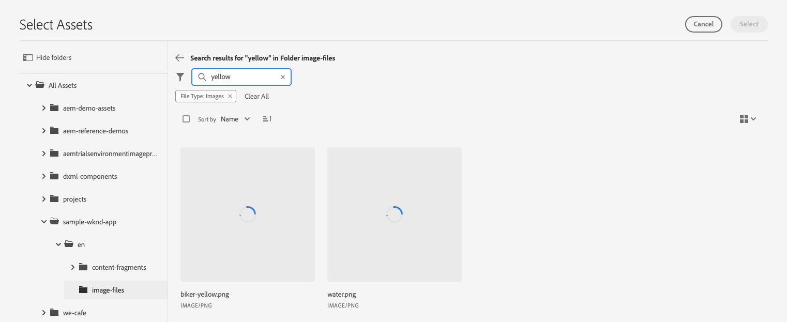
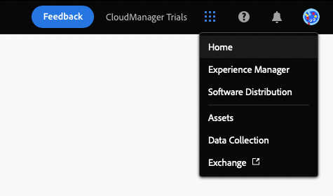

# Personalizar contenido en una aplicación de ejemplo React {#customize-app}

AEM Trials for headless viene precargado con una aplicación React simple para mostrar contenido sin encabezado. En este módulo, aprenderá a obtener una vista previa de la aplicación y modificar su contenido intercambiando una imagen y creando un momento de ventas para ella.

La propia aplicación se basa en la estructura de los fragmentos de contenido. Con el editor de fragmentos de contenido en AEM, puede modificar el contenido de sus aplicaciones. Para ayudarle a comprender cómo se hace esto, este módulo de AEM pruebas le lleva a través del proceso con un recorrido rápido e interactivo. Este documento sirve como complemento de la gira interactiva, abarcando los mismos pasos y vinculando con recursos adicionales cuando corresponde.

>[!CONTEXTUALHELP]
>id="aemcloud_sites_trial_admin_content_fragments_react_app"
>title="Personalización del contenido en una aplicación React de ejemplo"
>abstract="Hemos configurado una aplicación React moderna que puede utilizar para aprender a personalizar el contenido mediante el conjunto de funciones sin encabezado."

>[!CONTEXTUALHELP]
>id="aemcloud_sites_trial_admin_content_fragments_react_app_guide"
>title="Inicio del editor de fragmentos de contenido"
>abstract="AEM Trials for headless viene precargado con una aplicación React simple para mostrar contenido sin encabezado. La aplicación se basa en la estructura de los fragmentos de contenido. Con el editor de fragmentos de contenido en AEM, puede modificar el contenido de su aplicación.  Inicie la función en una nueva pestaña haciendo clic en , a continuación, siga esta guía."
>additional-url="https://video.tv.adobe.com/v/328618" text="Marcador de posición para el vídeo de introducción"

## Editor de fragmentos de contenido {#fragment-editor}

Empiece en el editor de fragmentos de contenido de la aplicación de ejemplo.

Si desea navegar al editor de fragmentos de contenido por su cuenta fuera de la guía en la aplicación, se encuentra con el icono de Adobe en la parte superior izquierda de la página. Esto abre la navegación global de AEM. Desde aquí puede elegir el **Navegación** pestaña y luego **Fragmentos de contenido**.

Se abrirá la consola Fragmento de contenido . Desde allí, utilice el árbol de contenido del panel izquierdo para desplazarse a la ubicación del contenido de la aplicación. En este caso, en **Fragmentos de contenido** -> **Ejemplo de aplicación WKND** -> **Inglés** -> **Fragmentos de contenido** -> **páginas**.

Toque o haga clic en la **Página principal de WKND** fragmento de página que se muestra en la consola a la derecha del árbol de contenido para iniciar el editor del contenido de la aplicación.

>[!TIP]
>
>Si desea obtener más información sobre la navegación en AEM, consulte la [Sección Recursos adicionales](#additional-resources) de este documento para obtener más información sobre AEM gestión básica.

## Vista previa de la aplicación {#preview}

Antes de comenzar a modificar la aplicación, familiarícese con ella previsualizando su estado actual. Toque o haga clic en el botón **Vista previa** en la parte superior derecha de la pantalla del editor.

La aplicación de demostración se abre en una nueva pestaña.

La aplicación en sí es una simple aplicación de comercio electrónico para la marca ficticia de estilo de vida al aire libre WKND implementada en React. Haga clic alrededor para navegar por el contenido de muestra.

Vuelva a la pestaña del editor de fragmentos de contenido para continuar.

## Editar texto en la aplicación {#edit-app}

Como se ha mencionado anteriormente, la aplicación en sí está formada por fragmentos de contenido. Estos fragmentos están vinculados en una estructura para crear la aplicación.

El editor de fragmentos de contenido muestra el diseño básico de la aplicación como página. Esta página es un fragmento de contenido, que a su vez es una colección de otros fragmentos. La variable **Paneles** representan diferentes páginas de la aplicación, cada una de las cuales es su propio fragmento de contenido. Al modificar estos fragmentos, puede cambiar el contenido de la aplicación.

1. Toque o haga clic **Mtn Biker en Canyon** en el **Paneles** para obtener más información.

   

1. El editor abre el panel de encabezado para el ciclista de montaña. Cada panel está formado por capas que representan contenido diferente dentro de una página de la aplicación.

   

1. Seleccionar la capa de texto **Mtn Biker en la capa de texto del cañón**. Esto abre el detalle de la capa en el editor. La capa está formada por varios fragmentos de contenido.

   

1. Seleccione el **Mtn Biker en el título del cañón** elemento de texto. Se abre el editor de fragmentos de contenido, que muestra el contenido de este fragmento y le permite modificarlo.

   

1. Cambiar el texto de `Your next great adventure is calling` a `Choose your own adventure`. El editor guarda automáticamente el cambio.

1. Haga clic en Vista previa para ver los cambios. La aplicación de demostración se abre en una nueva pestaña.

   

Vuelva a la pestaña del editor de fragmentos de contenido para continuar con el módulo.

## Cambiar la imagen principal de la aplicación {#change-image}

Ahora que ha modificado texto en la aplicación, intente cambiar la imagen principal de la aplicación. Primero, tendrá que localizar ese contenido.

Las rutas de exploración en la parte superior izquierda del editor muestran dónde se encuentra en la jerarquía de contenido.

1. Toque o haga clic **Mtn Biker en Canyon** en las rutas de exploración para volver a esa página.

   

1. Vuelva al panel con las distintas capas de la aplicación. Las capas no solo representan contenido de texto. Representan todo el contenido de la aplicación. Por lo tanto, también puede intercambiar imágenes mediante el editor de fragmentos de contenido.

   

1. Seleccione el **Mtn Biking - Biker** capa de imagen. Se abre el editor de fragmentos de contenido, que muestra el contenido de este fragmento y le permite modificarlo.

   

1. Toque o haga clic en el botón **X** para eliminar la imagen del ciclista. La imagen desaparece y el editor muestra un error, ya que la imagen es datos necesarios para este modelo de fragmento de contenido.

   

1. Toque o haga clic **Agregar recurso** y busque la imagen del ciclista amarillo en **sample-wknd-app** > **en** > **archivos de imagen**. Utilice la vista de árbol en el lado izquierdo del **Seleccionar recursos** para desplazarse por la jerarquía de contenido.

   

1. Filtro para el texto `yellow`. Utilice la variable **Buscar todos los recursos** en la parte superior del **Seleccionar recursos** para buscar la imagen. Introduzca el texto de búsqueda y pulse Intro o vuelva para buscar.

   

1. Toque o haga clic para seleccionar el `biker-yellow.png` imagen y, a continuación, toque o haga clic en **Select**.

   

1. La imagen del motociclista se reemplazó por la imagen seleccionada. El editor guarda automáticamente los cambios.

   

## Crear un momento de ventas {#create-moment}

Ahora que ha actualizado la imagen del motociclista, puede añadir un momento de ventas para los pantalones cortos amarillos del motociclista.

1. Comience por volver al editor de fragmentos de contenido para el fragmento de página. Las rutas de exploración en la parte superior izquierda del editor muestran dónde se encuentra en la jerarquía de contenido. Toque o haga clic **Página principal de WKND** en las rutas de exploración para volver a esa página.

   

1. Seleccione el **Mtn Biker en amarillo WKND** panel.

   

1. Ahora puede ver las capas que componen la imagen del motociclista. Agregue un momento de ventas a los pantalones cortos amarillos del motociclista seleccionando la opción **Mtn Biking - Venta** capa.

   

1. Para crear un momento de ventas, debe crear un nuevo fragmento de contenido que represente ese momento. Toque o haga clic en el botón **+ Crear nuevo fragmento** para añadir el momento de compra para los pantalones cortos del ciclista.

   

1. Dado que los fragmentos de contenido representan datos estructurados sin encabezado, cada vez que cree un fragmento de contenido, debe elegir primero un modelo en el que basarlo. Seleccione el **Elemento de momento de ventas** modelo de **Modelo de fragmento de contenido** lista desplegable.

   

1. Asigne un nombre al fragmento de contenido que representará este nuevo momento de ventas. Por ejemplo, introduzca `Shorts` en el **Nombre** campo .

   

1. Toque o haga clic **Crear y abrir**.

1. El editor se abre para el nuevo fragmento de contenido.
   * Póngale un nombre al momento del comprador en la variable **Texto** campo como `Yellow shorts`.
   * Establezca una X e Y, ubicación en la que se debe superponer este momento de ventas.
      * **X**: `-18`
      * **Y**: `-28`
   * El editor guarda automáticamente los cambios en el fragmento

   

1. Toque o haga clic **Vista previa** para probar este posicionamiento y realizar los ajustes necesarios.

   

## ¡Ha aprendido a personalizar una aplicación React de ejemplo! {#conclusion}

En este módulo, ha aprendido a personalizar una aplicación React de ejemplo. Primero aprendió a editar texto existente. Luego, una imagen fue intercambiada con otra instancia de esa imagen. Por último, ha visto cómo se crea y posiciona un elemento en el momento de la compra.

Asegúrese de consultar la [Sección Recursos adicionales](#additional-resources) para obtener recursos adicionales sobre el uso de AEM y sus fragmentos de contenido.

Si desea saber cómo se crean los fragmentos de contenido y el contenido sin encabezado para su consumo mediante aplicaciones personalizadas, puede empezar por revisar el módulo [Cree la estructura de contenido para su aplicación.](content-structure.md)

Para volver a la pantalla de inicio de la versión de prueba, haga clic en **Soluciones** en la parte superior derecha de la barra de navegación y seleccione **Experience Manager**.

## Recursos adicionales {#additional-resources}

Para obtener más información sobre los fragmentos de contenido y AEM, considere la posibilidad de revisar esta documentación adicional.

* [Modelos de fragmento de contenido](/help/assets/content-fragments/content-fragments-models.md) : Documentación completa sobre los modelos de fragmentos de contenido
* [Fragmentos de contenido](/help/assets/content-fragments/content-fragments.md) : Información general sobre los fragmentos de contenido y vínculos a documentación completa sobre los fragmentos de contenido
* [Gestión básica](/help/sites-cloud/authoring/getting-started/basic-handling.md) : Documentación sobre cómo navegar y utilizar AEM para nuevos usuarios
