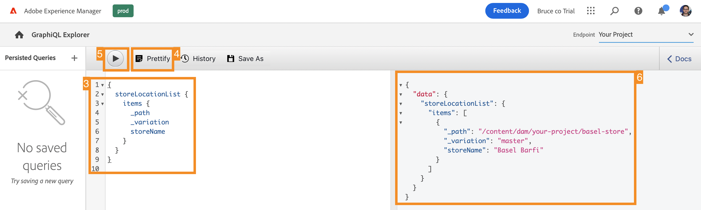

# Extraer contenido a través de la API de GraphQL {#extract-content}

>[!CONTEXTUALHELP]
>id="aemcloud_sites_trial_admin_content_fragments_graphql"
>title="Extraer contenido mediante la API de GraphQL"
>abstract="En este módulo aprenderá a utilizar los fragmentos de contenido y la API de GraphQL como un sistema de administración de contenido remoto."

>[!CONTEXTUALHELP]
>id="aemcloud_sites_trial_admin_content_fragments_graphql_guide"
>title="Iniciar el Explorador de GraphQL"
>abstract="GraphQL proporciona una API basada en consultas que permite a las aplicaciones de cliente externas realizar consultas AEM solo para el contenido que necesita, mediante una sola llamada de API. Siga este módulo para aprender a ejecutar dos tipos diferentes de consultas. A continuación, aprenda a recuperar el contenido del fragmento de contenido creado en el módulo anterior.<br><br>Inicie este módulo en una nueva pestaña haciendo clic en a continuación."

>[!CONTEXTUALHELP]
>id="aemcloud_sites_trial_admin_content_fragments_graphql_guide_footer"
>title="¡Buen trabajo! Ha aprendido sobre los dos tipos básicos de consultas y cómo consultar su propio contenido. Ya sabe cómo usar la API de GraphQL de AEM para crear consultas eficientes que entreguen contenido en un formato que la aplicación espera."
>abstract=""

## Consulta de una lista de contenido de muestra {#list-query}

Se inicia en el Explorador de GraphQL en una nueva pestaña. Aquí puede crear y validar consultas sobre su contenido sin encabezado antes de utilizarlas para impulsar el contenido en su aplicación o sitio web.

1. La prueba sin AEM incluye un punto final precargado con fragmentos de contenido desde el que se puede extraer contenido para realizar pruebas. Asegúrese de que la variable **Recursos de demostración de AEM** El punto final está seleccionado en la variable **Punto final** menú desplegable en la esquina superior derecha del editor.

1. Copie el siguiente fragmento de código para una consulta de lista del **Recursos de demostración de AEM** punto final. Una consulta de lista devuelve una lista de todo el contenido que utiliza un modelo de fragmento de contenido específico. Las páginas de inventario y categoría suelen utilizar este formato de consulta.

   ```text
   {
       adventureList {
         items {
            _path
            adventureTitle
            adventurePrice
            adventureTripLength
            adventurePrimaryImage {
              ... on ImageRef {
               _path
               mimeType
               width
               height
             }
           }
         }
      }
    }
   ```

1. Reemplace el contenido existente en el editor de consultas pegando el código copiado.

1. Una vez pegado, haga clic en el botón **Play** en la parte superior izquierda del editor de consultas para ejecutar la consulta.

1. Los resultados se muestran en el panel derecho, junto al editor de consultas. Si la consulta fuera incorrecta, aparecería un error en el panel derecho.

   

Acaba de validar una consulta de lista para obtener una lista completa de todos los fragmentos de contenido. Este proceso ayuda a garantizar que la respuesta sea lo que espera su aplicación, con resultados que ilustran cómo sus aplicaciones y sitios web recuperarán el contenido creado en AEM.

## Consulta de un fragmento específico de contenido de muestra {#bypath-query}

La ejecución de una consulta byPath permite recuperar contenido para un fragmento de contenido específico. Las páginas de detalles del producto y las páginas que se centran en un conjunto específico de contenido generalmente requieren este tipo de consulta.

1. Copie el siguiente fragmento de código para una consulta byPath de la precarga **Recursos de demostración de AEM** punto final.

   ```text
    {
     adventureByPath(
       _path: "/content/dam/aem-demo-assets/en/adventures/bali-surf-camp/bali-surf-camp"
     ) {
       item {
         _path
         title
         description {
           json
         }
         primaryImage {
           ... on ImageRef {
             _path
             width
             height
           }
         }
       }
     }
   }
   ```

1. Reemplace el contenido existente en el editor de consultas pegando el código copiado.

1. Una vez pegado, haga clic en el botón **Play** en la parte superior izquierda del editor de consultas para ejecutar la consulta.

1. Los resultados se muestran en el panel derecho, junto al editor de consultas. Si la consulta fuera incorrecta, aparecería un error en el panel derecho.

   

Acaba de validar una consulta byPath para recuperar un fragmento de contenido específico identificado por la ruta de ese fragmento.

## Consultar su propio contenido {#own-queries}

Ahora que ha ejecutado los dos tipos principales de consultas, está listo para consultar su propio contenido.

1. Para ejecutar consultas con sus propios fragmentos de contenido, cambie el punto final desde el **Recursos de demostración de AEM** a la **Su proyecto** carpeta.

1. Elimine todo el contenido existente en el editor de consultas. A continuación, escriba el soporte abierto `{` y pulse Ctrl+Espacio u Opción+Espacio para obtener una lista de autocompletar de los modelos definidos en el punto final. Seleccione el modelo que ha creado y que termina en `List` en las opciones de .

   

1. Defina los elementos que la consulta debe contener para el modelo de fragmento de contenido que ha seleccionado. De nuevo, escriba el soporte de apertura `{`y, a continuación, pulse Ctrl+Espacio u Opción+Espacio para obtener una lista de autocompletado. Select `items` en las opciones de .

1. Toque o haga clic en el botón **Certificar** para dar formato automáticamente al código y facilitar su lectura.

1. Una vez finalizada, toque o haga clic en el botón **Play** en la parte superior izquierda del editor para ejecutar la consulta. El editor completa automáticamente el `items` y se ejecuta la consulta.

1. Los resultados se muestran en el panel derecho, junto al editor de consultas.

   

Así es como el contenido se puede entregar en experiencias digitales omnicanal.
