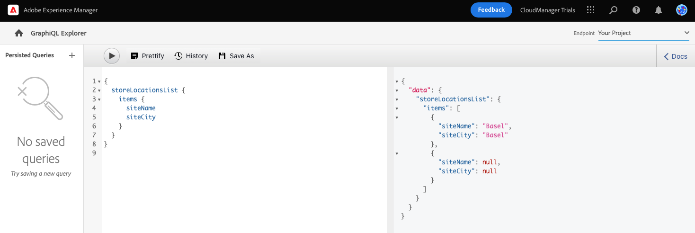

# Extraer contenido a través de la API de GraphQL {#extract-content}

Hasta ahora, en AEM juicios por no tener cabeza, ha [creó sus propios modelos de fragmento de contenido](content-structure.md) también ha creado su propio contenido sin encabezado como [Fragmentos de contenido.](create-content.md) Ahora puede aprender a utilizar los fragmentos de contenido y la API de GraphQL como un sistema de administración de contenido remoto para ofrecer su contenido.

GraphQL proporciona una API basada en consultas que permite a las aplicaciones cliente externas realizar consultas AEM solo del contenido que necesita mediante una sola llamada de API.

Primero, aprenderá a ejecutar dos tipos diferentes de consultas: **list** y **byPath** consultas. A continuación, aprenderá a recuperar contenido del fragmento de contenido creado anteriormente. Este documento sirve como complemento de la gira interactiva, abarcando los mismos pasos y vinculando con recursos adicionales cuando corresponde.

>[!TIP]
>
>Si desea obtener más información sobre la API de GraphQL, consulte la [Sección Recursos adicionales](#additional-resources) al final de este módulo para la guía de la API de GraphQL.

>[!CONTEXTUALHELP]
>id="aemcloud_sites_trial_admin_content_fragments_graphql"
>title="Extraer contenido mediante la API de GraphQL"
>abstract="En este módulo aprenderá a utilizar los fragmentos de contenido y la API de GraphQL como sistema de gestión de contenido sin objetivos."

>[!CONTEXTUALHELP]
>id="aemcloud_sites_trial_admin_content_fragments_graphql_guide"
>title="Iniciar el Explorador de GraphQL"
>abstract="GraphQL proporciona una API basada en consultas que permite a las aplicaciones de cliente externas realizar consultas AEM solo para el contenido que necesita, mediante una sola llamada de API. Siga esta guía para aprender a ejecutar dos tipos diferentes de consultas y, a continuación, recuperar contenido del fragmento de contenido que ha creado en un módulo anterior.<br><br>Inicie la función en una nueva pestaña haciendo clic en , a continuación."
>additional-url="https://video.tv.adobe.com/v/328618" text="Marcador de posición para el vídeo de introducción"

## Explorador de GraphQL {#graphql-explorer}

Se inicia en el Explorador de GraphQL. Aquí puede crear y ejecutar consultas con su contenido sin encabezado.


Si desea navegar usted mismo al Explorador de GraphQL fuera de la guía en la aplicación, se encuentra con el icono de Adobe en la parte superior izquierda de la página. Esto abre la navegación global de AEM. Desde aquí puede elegir el **Herramientas** pestaña y luego **General** -> **Editor de consultas de GraphQL**.

>[!TIP]
>
>Si desea obtener más información sobre la navegación en AEM, consulte la [Sección Recursos adicionales](#additional-resources) de este documento para obtener más información sobre AEM gestión básica.

AEM las pruebas incluyen un punto final precargado con contenido desde el que se puede extraer contenido para realizar pruebas.


Seleccione el **AEM recursos de demostración** del **Punto final** menú desplegable en la esquina superior derecha del editor, si aún no lo está.

## Copiar y ejecutar una consulta de lista {#list-query}

Comience con una consulta de lista sencilla para orientarse sobre cómo funcionan las API de GraphQL de AEM as a Cloud Service. Este ejemplo de consulta de lista devolverá una lista de todo el contenido que utiliza un modelo de fragmento de contenido específico. Las páginas de inventario y categoría suelen utilizar este formato de consulta.

1. Copie el siguiente fragmento de código.

   ```text
   {
       adventureList {
         items {
            _path
            adventureTitle
            adventurePrice
            adventureTripLength
            adventurePrimaryImage {
              ... on ImageRef {
               _path
               mimeType
               width
               height
             }
           }
         }
      }
    }
   ```

1. A continuación, reemplace el contenido existente en el editor de consultas pegando el código copiado.

   

1. Una vez pegado, haga clic en el botón **Play** en la parte superior izquierda del editor de consultas para ejecutar la consulta.

1. Una vez que la consulta se ejecuta correctamente, los resultados se muestran en el panel derecho, junto al editor de consultas. Si la consulta fuera incorrecta, aparecería un error en el panel derecho.

   

Acaba de validar una consulta de lista para obtener una lista completa de todos los fragmentos de contenido. Este proceso ayuda a garantizar que la respuesta sea lo que espera su aplicación, con resultados que ilustran cómo sus aplicaciones y sitios web recuperarán el contenido creado en AEM.

Los diferentes canales y plataformas donde debe aparecer el contenido ahora pueden utilizar esta consulta o similar para recuperar el contenido sin encabezado.

## Copiar y ejecutar una consulta byPath {#bypath-query}

La ejecución de una consulta byPath permite recuperar recursos para un fragmento de contenido específico. Las páginas de detalles del producto y las páginas que se centran en un conjunto específico de contenido generalmente requieren este tipo de consulta.

1. Copie el siguiente fragmento de código.

   ```text
    {
     adventureByPath(
       _path: "/content/dam/aem-demo-assets/en/adventures/bali-surf-camp/bali-surf-camp"
     ) {
       item {
         _path
         adventureTitle
         adventureDescription {
           json
         }
         adventurePrimaryImage {
           ... on ImageRef {
             _path
             width
             height
           }
         }
       }
     }
   }
   ```

1. A continuación, reemplace el contenido existente en el editor de consultas pegando el código copiado.

   

1. Una vez pegado, haga clic en el botón **Play** en la parte superior izquierda del editor de consultas para ejecutar la consulta.

1. Una vez que la consulta se ejecuta correctamente, los resultados se muestran en el panel derecho, junto al editor de consultas. Si la consulta fuera incorrecta, aparecería un error en el panel derecho.

1. Una vez que la consulta se ejecuta correctamente, los resultados se muestran en el panel derecho, junto al editor de consultas. Si la consulta fuera incorrecta, aparecería un error en el panel derecho.

   

Acaba de validar una consulta de lista para obtener una lista completa de todos los fragmentos de contenido. Este proceso ayuda a garantizar que la respuesta sea lo que espera su aplicación, con resultados que ilustran cómo sus aplicaciones y sitios web recuperarán el contenido creado en AEM.

Los diferentes canales y plataformas donde debe aparecer el contenido ahora pueden utilizar esta consulta o similar para recuperar el contenido sin encabezado.

## Ejecutar consultas en su propio contenido {#own-queries}

Ahora que ha ejecutado los dos tipos principales de consultas, está listo para configurar y ejecutar consultas para el contenido que ha creado usted mismo.

1. Para ejecutar consultas con sus propios fragmentos de contenido, cambie el punto final desde el **Recursos de demostración de AEM** a la **Su proyecto** carpeta.

   

1. Comience por seleccionar y eliminar todo el contenido existente en el editor de consultas. A continuación, escriba el soporte abierto `{` y pulse Ctrl+Espacio u Opción+Espacio para obtener una lista autocompleta de los modelos definidos en el modelo de fragmento de contenido. Seleccione el modelo que ha creado y que termina en `List` de la lista.

   

1. Defina los elementos que debe contener la consulta para el modelo de fragmento de contenido que ha seleccionado. De nuevo, escriba el soporte de apertura `{`y, a continuación, pulse Ctrl+Espacio u Opción+Espacio para obtener una lista de autocompletado. Select `items` de la lista.

   

1. Defina los campos que la consulta debe contener para el modelo de fragmento de contenido que ha seleccionado. De nuevo, escriba el soporte de apertura `{`y, a continuación, pulse Ctrl+Espacio u Opción+Espacio para obtener una lista autocompleta de los campos disponibles en el modelo de fragmento de contenido. Seleccione los campos que desee del modelo en la lista.

   

1. Delimite varios campos con una coma (`,`) o espacio y pulse Ctrl+Espacio u Opción+Espacio de nuevo para seleccionar campos adicionales.

1. Mientras trabaja, puede tocar o hacer clic en el botón **Certificar** para dar formato automáticamente al código y facilitar su lectura.

   

1. Una vez finalizada, toque o haga clic en el botón **Play** en la parte superior izquierda del editor para ejecutar la consulta.

   

Así es como el contenido se puede entregar en experiencias digitales omnicanal. Consulte la [Sección Recursos adicionales](#additional-resources) para obtener consultas de muestra adicionales y conocer cuánto más puede hacer con la API de GraphQL.

## ¡Ha aprendido a consultar el contenido! {#conclusion}

¡bueno trabajo! Ha aprendido sobre los dos tipos básicos de consultas y cómo consultar su propio contenido. Asegúrese de consultar la [Sección Recursos adicionales](#additional-resources) para obtener consultas de muestra adicionales y conocer cuánto más puede hacer con la API de GraphQL.

Si desea conocer cómo se utiliza el contenido extraído en una aplicación React personalizada, asegúrese de revisar el módulo [Personalizar contenido en una aplicación React de ejemplo.](customize-app.md)

Para volver a la pantalla de inicio de la versión de prueba, haga clic en **Soluciones** en la parte superior derecha de la barra de navegación y seleccione **Experience Manager**.


## Recursos adicionales {#additional-resources}

Para obtener más información sobre los fragmentos de contenido y AEM, considere la posibilidad de revisar esta documentación adicional.

* [Guía de la API de GraphQL](https://experienceleague.adobe.com/docs/experience-manager-learn/getting-started-with-aem-headless/graphql/multi-step/explore-graphql-api.html)
* [Gestión básica](/help/sites-cloud/authoring/getting-started/basic-handling.md) : Documentación sobre cómo navegar y utilizar AEM para nuevos usuarios
* [Formación para utilizar GraphQL con AEM: contenido y consultas de muestra](https://experienceleague.adobe.com/docs/experience-manager-cloud-service/content/headless/graphql-api/sample-queries.html)
