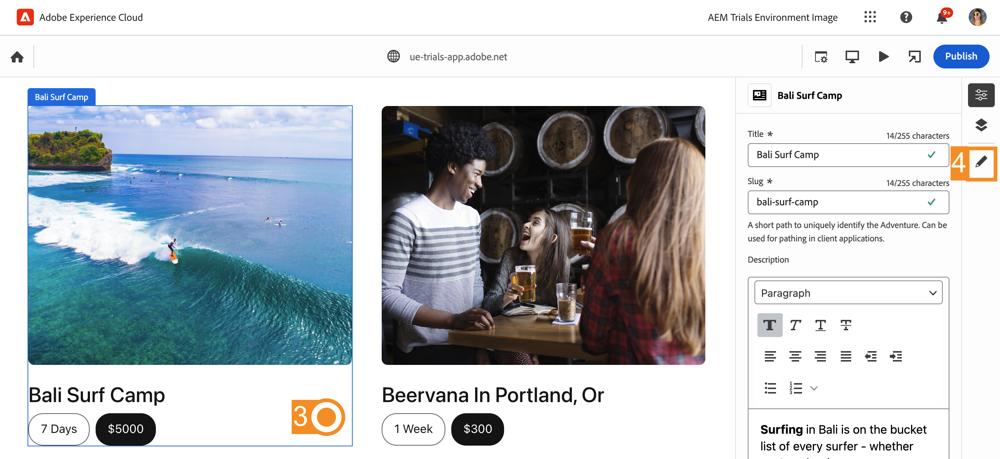

# Edición en contexto con el editor universal {#editing-in-context}

>[!CONTEXTUALHELP]
>id="aemcloud_sites_trial_edit_inline_universal_editor"
>title="Edición en contexto con el editor universal"
>abstract="Vea cómo sus aplicaciones sin encabezado pueden incorporar el Editor universal para poner al alcance de sus autores la edición en contexto y sin complicaciones."

>[!CONTEXTUALHELP]
>id="aemcloud_sites_trial_edit_inline_universal_editor_guide"
>title="Inicio del editor universal"
>abstract="En esta guía exploraremos el Editor universal y cómo permite a todo el mundo editar todos los aspectos del contenido en cualquier implementación, lo que permite mejorar la velocidad del contenido.  Inicie este módulo en una nueva pestaña haciendo clic abajo y, a continuación, siga esta guía."

>[!CONTEXTUALHELP]
>id="aemcloud_sites_trial_edit_inline_universal_editor_guide_footer"
>title="En este módulo, ha aprendido a personalizar el contenido en contexto y en su lugar mediante el Editor universal."
>abstract=""

## Editar texto en contexto {#edit-text}

Editar en contexto y en contexto suele ser mejor que editar contenido estructurado sin encabezado, como en el editor de fragmentos de contenido, que se vio en módulos anteriores.

>[!NOTE]
>
>Para usar el editor universal en esta versión de prueba, debe usar Chrome como explorador y no en modo incógnito. Se trata de una limitación de la experiencia de la versión de prueba, no del editor universal.

El editor universal es una forma ágil de editar el texto en contexto y en contexto, lo que permite crear contenido de forma sencilla e intuitiva.

1. Haga doble clic para seleccionar el título del artículo más reciente y editarlo.

   

1. El componente se selecciona tal como indica un borde azul con una pestaña que indica que es un componente de texto. Un cursor se encuentra en el borde a la espera de una entrada de texto. Cambia el texto a `Aloha Spirit in Lofoten`.

   

1. Seleccione fuera del componente de texto y los cambios se guardarán automáticamente.

El editor universal guarda los cambios automáticamente en el entorno de creación. Aún debe publicarlos para que los lectores puedan verlos, lo que haremos en un paso posterior.

## Editar medios en contexto {#edit-media}

También puede intercambiar imágenes mientras permanece en el contexto del contenido mediante el Editor universal.

1. Seleccione la imagen del internauta para seleccionarla.

1. En el carril del componente, se pueden ver los detalles del recurso. Seleccione la miniatura de **Imagen destacada**.

   

1. En **Seleccionar recursos**, desplácese hacia abajo y elija la `surfer-wave-02.JPG` imagen para seleccionarla.

1. Elija **Seleccionar** en la ventana **Seleccionar recursos**.

   

La imagen se reemplazará por la que haya seleccionado.

## Experimente su contenido como lo hacen sus lectores {#emulators}

El editor universal permite interactuar con el contenido dentro de su contexto y verlo tal y como se entrega a los dispositivos de los usuarios.

1. De forma predeterminada, el editor procesa la versión de escritorio del contenido. Seleccione el botón emulador en la parte superior derecha de la barra de herramientas del Editor universal para cambiar el dispositivo de destino.

   

1. Los lectores pueden estar en diversos dispositivos con diferentes proporciones de aspecto, por lo que el editor ofrece modos de emulación para ver cómo se presentará la página a los usuarios. Por ejemplo, seleccione la opción de dispositivo móvil en modo vertical.

   

1. Consulte el cambio de contenido en el editor. El icono del emulador también cambia para reflejar el modo en el que se encuentra. Seleccione cualquier lugar fuera del menú del emulador para cerrarlo e interactuar con el contenido.

1. Vuelva a poner el emulador en modo escritorio.

También puede especificar dimensiones exactas para el emulador y rotar el dispositivo emulado para ver el contenido en cualquier dispositivo de destino potencial.

## Previsualización y publicación {#preview}

Como es necesario seleccionar el contenido para modificarlo en el editor, el editor no permite seguir vínculos o interactuar con el contenido tocando o haciendo clic en él. Con el modo de vista previa, puede seguir los vínculos del contenido y experimentarlo como lo harían los usuarios antes de publicar.

1. En la barra de herramientas del Editor universal, seleccione **Previsualizar**.

1. Ahora seleccione el vínculo **Leer más** para el artículo principal.

   

1. Examine el artículo y, a continuación, utilice el vínculo **Atrás** para volver a la página principal.

   

1. Ahora seleccione el botón **Publicar** en la parte superior derecha del editor para publicar el contenido.

   

Su contenido se ha publicado.

## Edición de fragmentos de contenido {#editing-fragments}

Para acelerar su experiencia de creación de contenido, cuando la edición estructurada de contenido sin encabezado es más ventajosa que la edición in situ, el editor universal le permite acceder rápidamente al editor de fragmentos de contenido.

1. Desactive el modo de vista previa tocando el botón **Previsualizar** de la barra de herramientas del Editor universal.

   

1. Desplácese hacia abajo en la página hasta la sección **Aventuras**.

1. Seleccione una de las aventuras, como **Bali Surf Camp** para elegirla.

   * Observe el contorno azul del componente seleccionado. La pestaña debe mostrar el nombre del fragmento de contenido cuando se selecciona uno. En este caso, **Bali Surf Camp**.
   * Dado que el editor universal permite seleccionar cualquier objeto de la página, los componentes que forman parte de un fragmento de contenido también se pueden seleccionar individualmente. Seleccione la ubicación indicada en la ilustración para seleccionar todo el componente Fragmento de contenido.

1. El icono **Editar** aparece en el carril del componente. Seleccione el icono **Editar** para abrir el editor de fragmentos de contenido en una nueva pestaña.

En la nueva pestaña, ahora puede editar el fragmento de contenido que seleccionó en el Editor universal.
